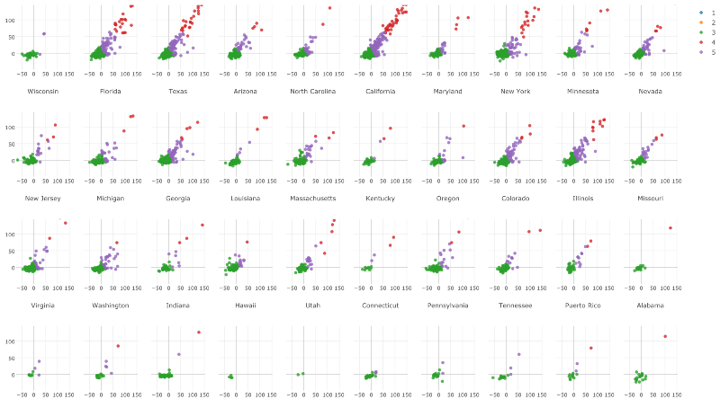

#Exploratory v2.2新機能

このリリースでは、Small Multiple(小さい多数の)チャート機能などを実装しました。だから、紹介を兼ねてこの記事を書くことにしました。

##Small Multiple(小さい多数の)チャート

 読んで字のごとく、Small Multipleとは、小さい多数のチャートを作ることができる機能のことを指します。Small Multipleは、下のような図の感じで、データを比較して傾向やパターンを見つけるときに便利です。Small Multipleは、データを探索していくときに、たくさんのデータサイエンティストやアナリストに使われています。

###チャートタイプのサポート

Small Multipleは、現時点では、Bar、Line、Area、Histogram、Scatterplotチャートに対応しています。ここでは、[フライトの遅れのデータ](https://www.dropbox.com/s/vi530bac7836ch9/airline_delay_2014_1.csv?dl=0)を使っています。そして、相関関係があるかを見るために、X軸にArrival Delay Time列を指定して、Y軸に、Departure Delay Time列を指定しました。また、フライトを5つのグループにクラスタリングするために、K-Meansも使っています。この、5つのグループは、2つの変数に基いて、色で分類されています。

Repeat Byに、CARRIER列を指定すると、それぞれのキャリアごとのScatterplotを複数作ることができます。

###列の数を変える

スクロールしないで、チャートを比較したいと思いませんか？　Small Multipleのデフォルトの数は、3になっていますが、変更することで、複数のチャートを同じ画面で表示させることでこの問題を解決することができます。

###画面を拡大できるように

下のチャートを見ると分かるように、チャートが凝縮されていて、データを見るのが困難ですよね。そういうときは、右側にあるExpandアイコンをクリックすると、チャートをフルスクリーンで見ることができます。

xボタンを押すと、closeすることができます。

ちなみに、これはSmall Multipleであるかどうかに関わらず、1つのチャートだけやどんなチャートタイプに対しても、画面を拡大させることができます。

###ズームを同期させる

Exploratoryでは、常に、マウスを使って、特定のエリアを選ぶことで、チャートをズームすることができます。Small Multipleでは、1つのチャートをズームすると、自動的に他のチャートにも同期されます。

ズームしたいチャートのエリアを選びます。

一度、選んだ箇所を話すと、すべてのチャートの同じ箇所がズームされるのが確認できます。

ズームするだけじゃなくて、他のチャートと一緒に、チャートを右や左や上や下にpanすることもできます。静的な画像で説明することが難しいので、10秒ほどの簡単な動画を作りました。よかったら、[こちら](https://vimeo.com/185888353)からご確認ください。

###Y軸に複数の変数を入れる

Exploraotoryでは、バージョン2.0からY軸に複数の列を加えることができるようになりました。これは、Small Multipleでも同様にサポートされています。今回は、2016年1月の30日間のフライトの到着時間と出発時間の平均の遅れを比較しています。

###Colorを使う

Colorを使うと、データのカテゴリー間の傾向や違いを見つけることが簡単になります。例えば、下のチャートは、アメリカ大統領選の過去1年間のTVコマーシャルの放送を示したBarチャートです。Color列に、Sponsor Typeを指定することによって、他の候補者に比べて、どの候補者がSuper PACスポンサーによってサポートされているのかを比較することができます。

###Window関数

Window関数は、チャートが1つのときと同様に、Small Multipleでも、使うことができます。このチャートは、Apple, Amazon, Facebook, Google, Microsoft,Twitterごとの過去10年間の株価の傾向を表しています。

問題なのは、それぞれの会社の株価が異なっているので、どの会社の株価が同じ規模で他の会社に比べて成長しているのかがわかりにくいことです。成長率をもっと正確に分析するひとつのやり方は、Window関数の中の、% Difference From関数を使うことです。この関数は、データの範囲か最後のfirstかlastの値に対しての成長率を計算します。このチャートは、それぞれの会社ごとに、過去10年間で株価がどれくらい成長したかを示しています。

このチャートでは、過去10年では、GoogleがAppleやAmazonに比べてそれほど株価が成長していないことがわかります。

###Share and Embedding Small Multiple

最後に、他のチャートタイプと同様に、Small Multipleを公開して、シェアすることができます。もちろん、URLを入力するだけでMediumやWordpressに埋め込むこともできます。[こちら](https://exploratory.io/viz/kanaugust/6671727394823968?cb=1476067303385)をクリックすると、シェアされた画面を見ることができます。

これで、Small Multipleの簡単な説明については以上です。しかし、できることはまだまだたくさんあります。自分でデータを使って、分析するのをオススメします。他のツールで分析していただけでは、気づかなかった視点に気づくことができるのは間違いないでしょう。

バージョン2.2では、他にもいくつかの機能を実装したので、これからその紹介をしていきたいと思います。

###Neo4jデータベースサポート

Neo4jは、最も人気なグラフデータベースです。これで、Neo4JのグラフデータベースからCypherクエリを書いてデータを抽出することができるようになりました。以下のクエリは、トム・ハンクスと同じ映画で共演したことはないが、トム・ハンクスと一緒に共演したことのある俳優のリストを抽出しています。

###データフレームをコピーする

最後に、今回のリリースでデータフレームをコピーすることができるようになりました。これで、同じデータで新しい分析をしたり、データ・ソースを変えたいけど、おなじデータ分析のステップをしたいときに、データフレームをインポートし直したり、データステップをもう一度作る必要もありません。

この機能が素晴らしいのは、現在のデータフレームだけではなく、データフレーム内のブランチなどもいっしょにコピーできることなのです。また、データフレーム内のどのビジュアライゼーションをコピーするかやどのブランチをコピーするかも自分で選ぶことができます。これは、デフォルトではオフになっています。

##興味を持っていただいた方、実際に触ってみたい方へ

Exploratory Desktopは[こちら](https://exploratory.io/
)から登録した後にダウンロードしてすぐに使ってもらうことができます。もちろん、無料で始めることができます！

ExploratoryのTwitterアカウントは、[こちら](https://twitter.com/ExploratoryData
)です。

Exploratoryの日本ユーザー向けの[Facebookグループ](https://www.facebook.com/groups/1087437647994959/members/
)を作ったのでよろしかったらどうぞ

分析してほしいデータがある方や、データ分析のご依頼はhidetaka.koh@gmail.comまでどうぞ