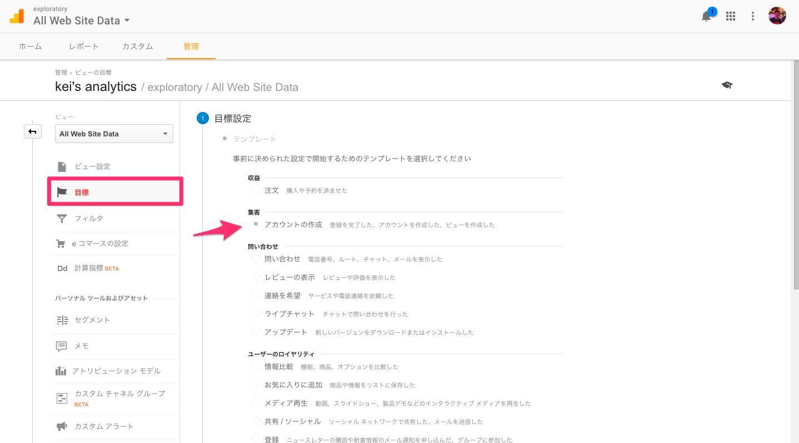
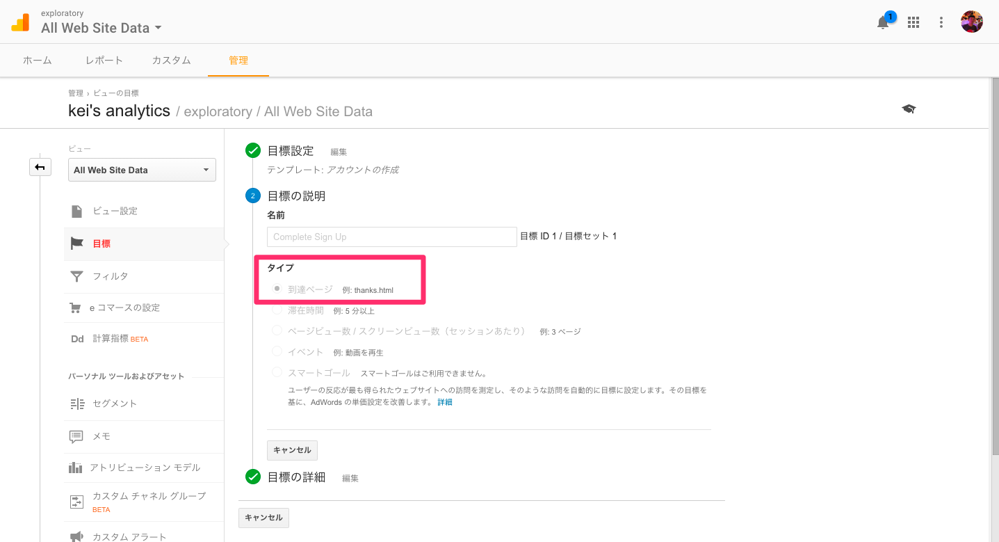
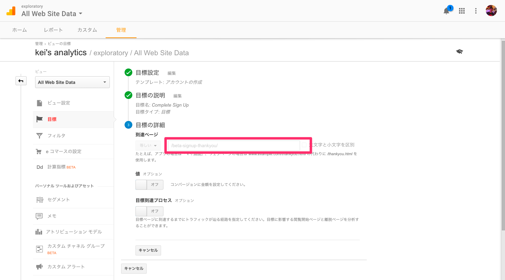
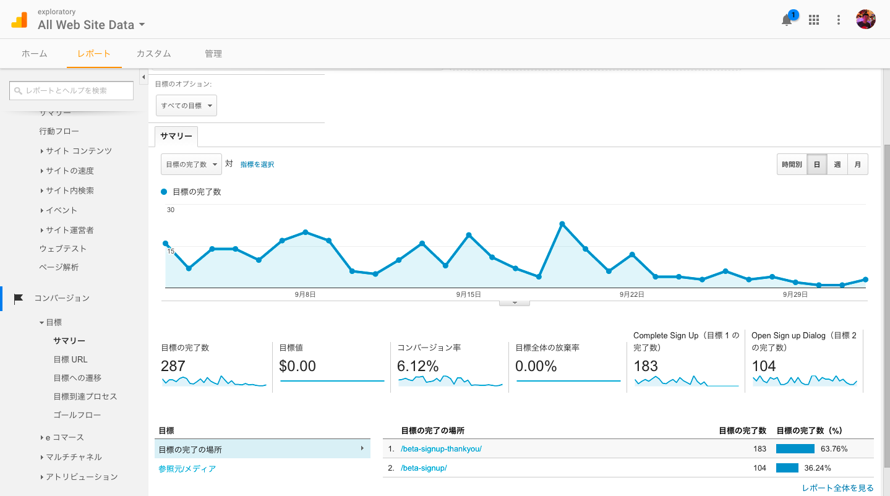
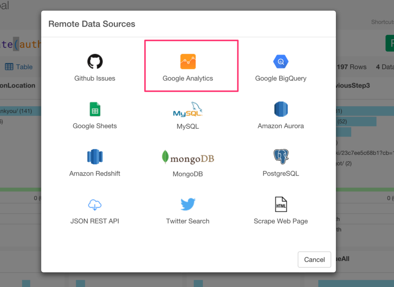
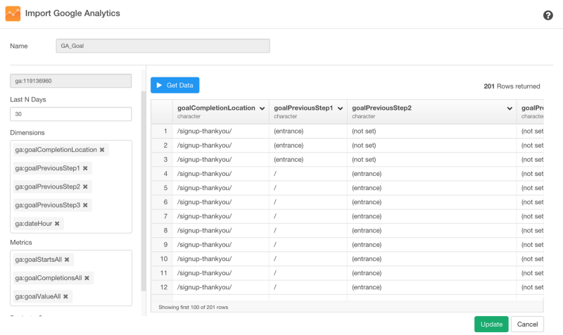
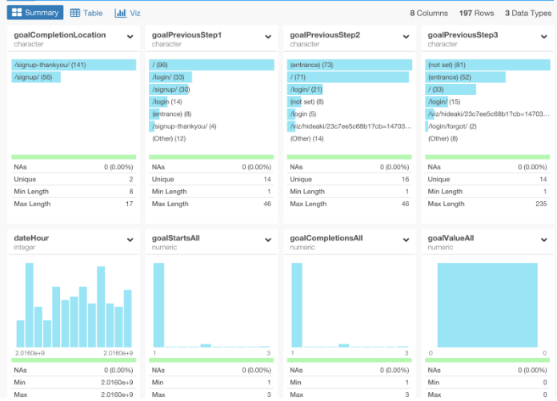

#Analyzing User Conversion Funnel Data from Google Analytics with dplyr

Emailサブスクリプションの購読数や、アカウントのアクティベート数など、自分のWebサイトから何人のユーザーがどのような行動をとったのか気になったことはありませんか？Google Analyticsを使えば、行動をとる以前のページのパスをとってくることができます。これらの情報があれば、「どのページパスがユーザーに目的の行動をとらせるのに効率的か」を見極めることができるので、Webマーケティングを最適化することができます。これは、コンバージョン分析という言い方をしたりします。

[Google Analytics](https://www.google.com/intl/ja/analytics/)では、サイトの目的に沿って、「目標設定」をすることができます。この目標設定では、特定のURLへのアクセスや訪問の滞在時間や訪問のページビューなど様々な値をGoogle Analytics上で指定し、施策と改善を繰り返すことで、サイトの目的に近づくことができます。このGoogle Analyticsの「目標設定」を使った分析は、Google AnalyticsのUI上だけでもある程度は行うことができますが、柔軟性が足りません。しかし、Exploratory Desktopを使ってRを使いながら分析すると、より柔軟に、素早く分析していくことができます。

だから、今日は、Google Analytics上の「目標」の設定の方法とExploratory Desktopを使ったGoogle Analyticsのコンバージョン分析の方法を説明していきたいと思います。こちらが具体的なステップです。

1.Google Analyticsで、「目標設定」をする 
2.「目標設定」データをExploratoryにインポートする 
3.「目標設定」データを整形する 
4.コンバージョンを理解する 
5.コンバージョン率を分析する 

##1.Google Analyticsで、「目標設定」をする

Google Analyticsで、「目標設定」をすることはとても簡単です。まず、管理画面に行って、目標設定ページを開いてください。そして、テンプレートのオプションから「アカウントの作成」を選んでください。

次のページで、「目標設定」のタイプを選ぶ項目で、「到達ページ」を選んでください。

最後のステップで、「到達ページ」の項目に、「到達ページ」へsuccesssしたとカウントしてほしいページのURLを指定してください。

セットアップが完了すると、「レポート」のコンバージョンの項目から、簡単なデータレポートを見ることができます。

##2.「目標設定」データをExploratoryにインポートする

次に、Google Analyticsの「目標設定」データを簡単にインポートします。「Import Remote Data」メニューからGoogle Analyticsを選んでください。

ダイアログのドロップダウンリストから以下のDimensionsとMetricsを選んでください。

Dimensions

- ga:goalCompletionLocation
- ga:goalPreviousStep1
- ga:goalPreviousStep2
- ga:goalPreviousStep3
- ga:dateHour

Metrics
- ga:goalStartsAll
- ga:goalCompletionsAll
- ga:goalValueAll

データのプレビューを見るために、Get Dataをクリックしてください。

データフレーム名を入力して、データをRにインポートするために、Saveボタンを押してください。すると、データの概要が、Summary viewに現れます。

##3.「目標設定」データを整形する

##最後に

ふつうにGoogle Analyticsだけを使うよりExploratoryでRを使ってGoogle　Analyticsの分析を行うことがどれだけ簡単で効率的かおわかりいただけたでしょうか？　データはどこにでもあるものですが、ほとんどの人は分析の仕方を知らないものですよね。それは、データが整形されていない状態のときが多いからです。データを分析するには、データ分析についてあれこれ考える前に、データを分析可能な状態まで整形する必要があるのです。例えば、今回の歩数のデータは、Iphoneさえ持っていれば誰もが持っているデータです。しかし、今までなら、このようなデータを分析しようとすると、サードパーティのアプリにお金を払って、データを渡して、返ってきた作られたレポートを見るというのが一般的ではなかったでしょうか？　しかし、Exploratoryがあれば、サードパーティのアプリなどを使う必要は一切ありません。Exploratoryでは、複雑で冗長なコードを書くことなしに、文法を中心としたデータ分析とビジュアライゼーションによってこんなに簡単に、自分でデータをよりよく理解していくことができます。

##興味を持っていただいた方、実際に触ってみたい方へ

Exploratory Desktopは[こちら](https://exploratory.io/
)から登録した後にダウンロードしてすぐに使ってもらうことができます。もちろん、無料で始めることができます！

ExploratoryのTwitterアカウントは、[こちら](https://twitter.com/ExploratoryData
)です。

Exploratoryの日本ユーザー向けの[Facebookグループ](https://www.facebook.com/groups/1087437647994959/members/
)を作ったのでよろしかったらどうぞ

分析してほしいデータがある方や、データ分析のご依頼はhidetaka.koh@gmail.comまでどうぞ