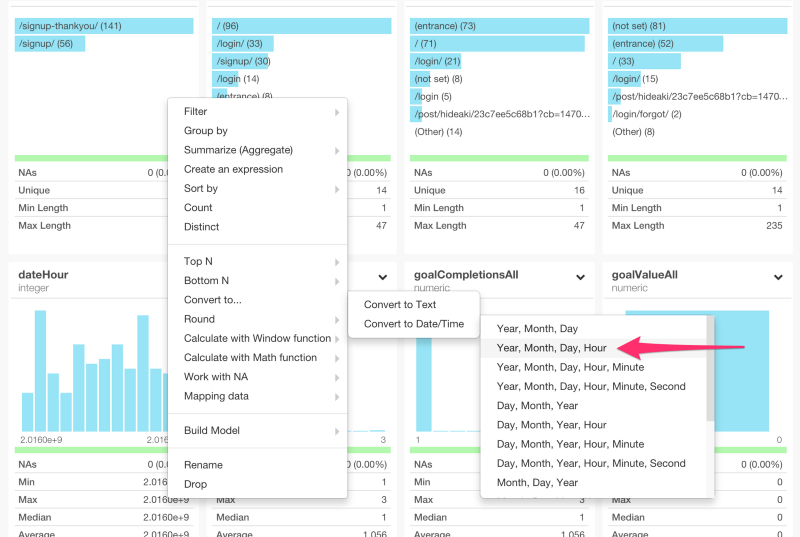
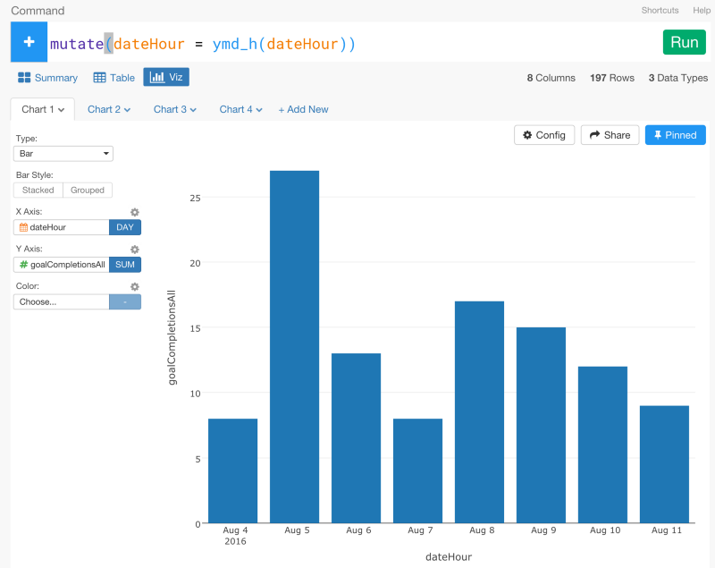
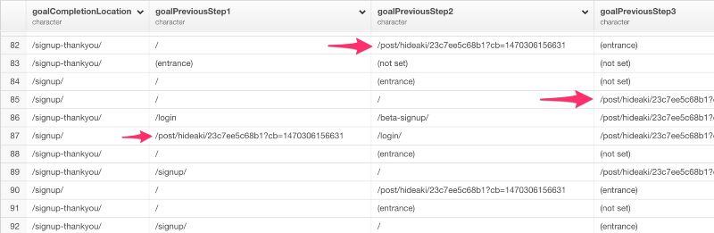
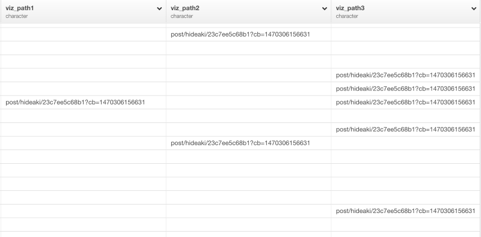
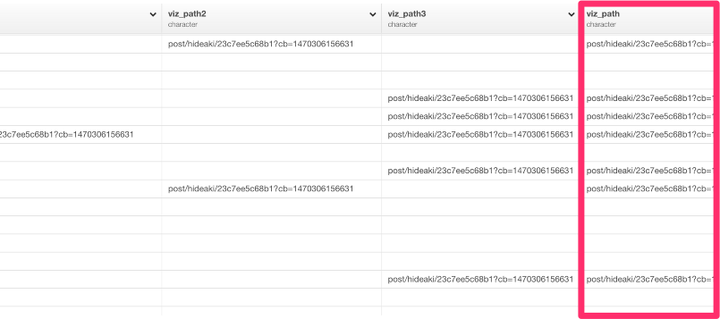

#Analyzing User Conversion Funnel Data from Google Analytics with dplyr


Emailサブスクリプションの購読数や、アカウントのアクティベート数など、自分のWebサイトから何人のユーザーがどのような行動をとったのか気になったことはありませんか？Google Analyticsを使えば、行動をとる以前のページのパスをとってくることができます。これらの情報があれば、「どのページパスがユーザーに目的の行動をとらせるのに効率的か」を見極めることができるので、Webマーケティングを最適化することができます。これは、コンバージョン分析という言い方をしたりします。

[Google Analytics](https://www.google.com/intl/ja/analytics/)では、サイトの目的に沿って、「目標設定」をすることができます。この目標設定では、特定のURLへのアクセスや訪問の滞在時間や訪問のページビューなど様々な値をGoogle Analytics上で指定し、施策と改善を繰り返すことで、サイトの目的に近づくことができます。このGoogle Analyticsの「目標設定」を使った分析は、Google AnalyticsのUI上だけでもある程度は行うことができますが、柔軟性が足りません。しかし、Exploratory Desktopを使ってRを使いながら分析すると、より柔軟に、素早く分析していくことができます。

だから、今日は、Google Analytics上の「目標」の設定の方法とExploratory Desktopを使ったGoogle Analyticsのコンバージョン分析の方法を説明していきたいと思います。こちらが具体的なステップです。

1.Google Analyticsで、「目標設定」をする<br>
2.「目標設定」データをExploratoryにインポートする<br>
3.「目標設定」データを整形する<br>
4.コンバージョンを理解する<br>
5.コンバージョン率を分析する<br>


##1.Google Analyticsで、「目標設定」をする

Google Analyticsで、「目標設定」をすることはとても簡単です。まず、管理画面に行って、目標設定ページを開いてください。そして、テンプレートのオプションから「アカウントの作成」を選んでください。


次のページで、「目標設定」のタイプを選ぶ項目で、「到達ページ」を選んでください。


最後のステップで、「到達ページ」の項目に、「到達ページ」のURLを指定してください。


セットアップが完了すると、「レポート」のコンバージョンの項目から、簡単なデータレポートを見ることができます。


##2.「目標設定」データをExploratoryにインポートする

次に、Google Analyticsの「目標設定」データを簡単にインポートします。「Import Remote Data」メニューからGoogle Analyticsを選んでください。


ダイアログのドロップダウンリストから以下のDimensionsとMetricsを選んでください。

Dimensions

- ga:goalCompletionLocation
- ga:goalPreviousStep1
- ga:goalPreviousStep2
- ga:goalPreviousStep3
- ga:dateHour

Metrics
- ga:goalStartsAll
- ga:goalCompletionsAll
- ga:goalValueAll


データのプレビューを見るために、Get Dataをクリックしてください。


データフレーム名を入力して、データをRにインポートするために、Saveボタンを押してください。すると、データの概要が、Summary viewに現れます。


##3.「目標設定」データを整形する

dateHour列のデータタイプがintegerになっています。しかし、これは、日付と時刻のデータなので、dateHour列のヘッダーメニューからYear, Month, Day, Hourを選んで、データ・タイプを変換しましょう。



すると、以下のコマンドを自動生成します。

```
mutate(dateHour = ymd_h(dateHour))
```
dateHour列のデータタイプをPOSIXct (Date / Time)に変換したあとは、Viz viewから簡単にデータをビジュアライズすることができます。



###Work with URL Text Data

テーブルViewを見ると、goalPreviousStep1列、goalPreviousStep2列、goalPreviousStep3列の3つの列にいくつかのブログページのURLがあるのがわかりますね。



これらのURLは、ExploratoryのWebサイトのブログ記事のURLです。Google Analyticsは、サイトに訪問した人が「目標設定」で指定した到達ページに到達する以前の3つのURLをトラッキングすることができます。問題なのは、ユーザーのうち何人かは、ブログページに最初に訪れた後に、他のページに飛んで、その後にサインアップしていたり、他のページに訪れてから、サインアップの直前に、ブログページを訪れているかもしれないということです。だから、これらの3つのPreviousPage列の値は、Spreadされています。

ユーザーがsign upしたごとのユーザーパスのURLを分析をできるように、列が3つになっているのを1つにまとめたいと思います。
まず、次のように、正規表現を使ってURLを抽出してきたいと思います。

```
mutate(
viz_path1 = str_extract(goalPreviousStep1,"post[:print:]+"),
viz_path2 = str_extract(goalPreviousStep2,"post[:print:]+"),
viz_path3 = str_extract(goalPreviousStep3,"post[:print:]+")
)
```
簡単に説明すると、“[:print:]”は、Rの正規表現の1つです。アルファベットや数字や特殊な文字列などを抽出することができます。postや+と組み合わせることで、postで始まる文字列だけを抽出してくることができます。

コマンドを走らせると、次のような感じになります。



見るとわかるように、ブログに関係していないURLはこれでなくなりました。しかし、これらのURLの列は、3つになっています。なので、それぞれのサインアップのパスを表すブログのURLを持つカラムを1つだけにしたいと思います。そういうときは、dplyrのcoalesce関数が便利です。

```
mutate(viz_path = coalesce(viz_path1, viz_path2, viz_path3))
```
coalesce関数は、SQLのcoalesce関数に似ています。coalesce関数は、ベクトルを順番に見ていって、はじめに見つかったNAでない要素を返します。このケースでは、viz_path1列にNA値があるときは、viz_path2列の、NA値でない値を探そうとします。そして、それがNA値だったときは、viz_path3列では、NA値でない値を探そうとします。コマンドを走らせると、次のような感じになります。



最後のviz_path列は、3つのviz_path列のどれか1つでも値を持っていると、値が入るようになっています。

##4.コンバージョンを理解する

With this data, we can quickly visualize the data under Chart view.
Assign dateHour to X-Axis and set the aggregation level to ‘DAY’, then assign ‘goalCompletionsAll’ to Y-Axis, ‘viz_path’ to Color.


If we are interested in knowing how many sign ups each of the blog posts is brining, this is good enough.
But, as you can see in the chart, some of the authors have posted multiple blog posts with different URLs. Now, what if we want to understand who is bringing more sign ups rather than which blog posts? In that case, we want to strip out the author names from the URLs and aggregate the data by authors. There are many ways to do this, and using another regular expression is one of them. But if you are like me who is not a big fun of the regular expression then there is a good news.
There is, I think, a much simpler way to break out the URL text and extract the part we want.

###Extract a text from URL

First, we can split the URL text by ‘/’ (slash) symbol with ‘str_split’ function from ‘stringr’ package like below.

```
mutate(author = str_split(viz_path, "\\/"))
```
The double back slashes are to escape the special character of ‘/’ (slash). This will generate a result like below.


As you can see, each text separated by ‘/’ is now in a list as an independent item. Once we get a list data then we can use ‘list_extract’ function from ‘exploratory’ package to extract a value by specifying the position like below.

```
mutate(author = str_split(viz_path, "\\/"))
```

You can see the authors of the blog posts are now extracted in a new column ‘author_extract’.


With this, we can go back to Chart view and assign this newly created column ‘author_extract’ to Color, and see whose blog posts are helping the conversion.


##5.コンバージョン率を分析する

Now, just because some pages bring a lot of page views doesn’t mean those pages are helping the conversion. Some pages might be attracting many people but if they are not taking the desired action you like then you might want to spend less time on investing those pages.
To find the effectiveness of the conversion funnels, we can divide the number of the sign ups brought by each of the funnel by either ‘unique page views’ or ‘new users’ on those funnels. We can quickly extract these extra data from Google Analytics like below and join it to the conversion funnel data to do the calculation.


I’m simply selecting ‘pagePath’, ‘uniquePageViews’, and ‘newUsers’ here, but you can bring any metrics based on your needs.
Once I get the data, then I can join this data to the Goals data we were previously working on. But before joining the data, we want to summarize the Goals data at the funnel level (sign up path) first by using ‘group_by’ and ‘summarize’ commands like below.


```
group_by(viz_path)
summarize(counts = sum(goalCompletionsAll))
```


Now we can join this with the new data.

```
left_join(GA_PageViews, by=c("viz_path" = "pagePath"))
```


Lastly, we can calculate the efficiency by dividing the ‘counts’ by ‘newUsers’ as Conversion Rate like below.

```
mutate(conversion_rate = counts / newUsers)
```


I’m using ‘newUsers’ to divide the counts, but this could be ‘uniquePageViews’ as well.
Now when we go back to Chart view and visualize the conversion rate you can see Lisa’s blog posts have higher conversion rate than the others.


If you just compare to a chart like below that is simply based on the unique page views, you can say that although Hidetaka and Hideaki’s blog posts are bringing a lot more visitors their conversion performances are not as great as Lisa’s.


This is why it is important to not only understand the user page paths or conversion funnels, but also analyze the efficiency of the funnels.
These are somewhat simplified scenario and the data I’m using here is fictional. But by being able to quickly bring Google Analytics data into R, transform the data, and join with other data set, you can flexibly dig deep down in the data and find your own useful insights that will impact your business in a tangible way.


##最後に

ふつうにGoogle Analyticsだけを使うよりExploratoryでRを使ってGoogle　Analyticsの分析を行うことがどれだけ簡単で効率的かおわかりいただけたでしょうか？　データはどこにでもあるものですが、ほとんどの人は分析の仕方を知らないものですよね。それは、データが整形されていない状態のときが多いからです。データを分析するには、データ分析についてあれこれ考える前に、データを分析可能な状態まで整形する必要があるのです。例えば、今回の歩数のデータは、Iphoneさえ持っていれば誰もが持っているデータです。しかし、今までなら、このようなデータを分析しようとすると、サードパーティのアプリにお金を払って、データを渡して、返ってきた作られたレポートを見るというのが一般的ではなかったでしょうか？　しかし、Exploratoryがあれば、サードパーティのアプリなどを使う必要は一切ありません。Exploratoryでは、複雑で冗長なコードを書くことなしに、文法を中心としたデータ分析とビジュアライゼーションによってこんなに簡単に、自分でデータをよりよく理解していくことができます。

##興味を持っていただいた方、実際に触ってみたい方へ

Exploratory Desktopは[こちら](https://exploratory.io/
)から登録した後にダウンロードしてすぐに使ってもらうことができます。もちろん、無料で始めることができます！


ExploratoryのTwitterアカウントは、[こちら](https://twitter.com/ExploratoryData
)です。

Exploratoryの日本ユーザー向けの[Facebookグループ](https://www.facebook.com/groups/1087437647994959/members/
)を作ったのでよろしかったらどうぞ

分析してほしいデータがある方や、データ分析のご依頼はhidetaka.koh@gmail.comまでどうぞ