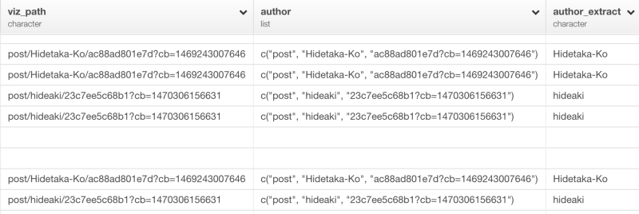
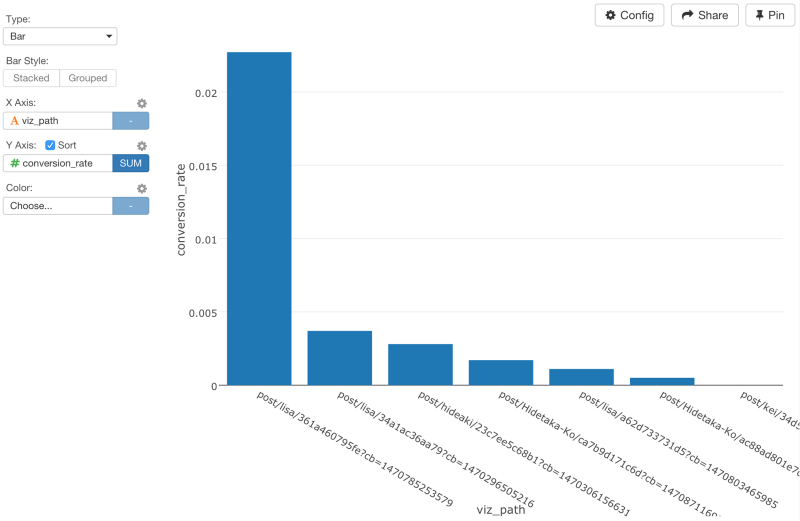

#Exploratoryを使って、Rで、Google Analyticsのコンバージョン分析を深くまでしてみた


Emailサブスクリプションの購読数や、アカウントのアクティベート数など、自分のWebサイトから何人のユーザーがどのような行動をとったのか気になったことはありませんか？Google Analyticsを使えば、行動をとる以前のページのパスをとってくることができます。これらの情報があれば、「どのページパスがユーザーに目的の行動をとらせるのに効率的か」を見極めることができるので、Webマーケティングを最適化することができます。これは、コンバージョン分析という言い方をしたりします。

[Google Analytics](https://www.google.com/intl/ja/analytics/)では、サイトの目的に沿って、「目標設定」をすることができます。この目標設定では、特定のURLへのアクセスや訪問の滞在時間や訪問のページビューなど様々な値をGoogle Analytics上で指定し、施策と改善を繰り返すことで、サイトの目的に近づくことができます。このGoogle Analyticsの「目標設定」を使った分析は、Google AnalyticsのUI上だけでもある程度は行うことができますが、柔軟性が足りません。しかし、Exploratory Desktopを使ってRを使いながら分析すると、より柔軟に、素早く分析していくことができます。

だから、今日は、Google Analytics上の「目標」の設定の方法とExploratory Desktopを使ったGoogle Analyticsのコンバージョン分析の方法を説明していきたいと思います。こちらが具体的なステップです。

1.Google Analyticsで、「目標設定」をする<br>
2.「目標設定」データをExploratoryにインポートする<br>
3.「目標設定」データを整形する<br>
4.コンバージョンを理解する<br>
5.コンバージョン率を分析する<br>


##1.Google Analyticsで、「目標設定」をする

Google Analyticsで、「目標設定」をすることはとても簡単です。まず、管理画面に行って、目標設定ページを開いてください。そして、テンプレートのオプションから「アカウントの作成」を選んでください。


次のページで、「目標設定」のタイプを選ぶ項目で、「到達ページ」を選んでください。


最後のステップで、「到達ページ」の項目に、「到達ページ」のURLを指定してください。


セットアップが完了すると、「レポート」のコンバージョンの項目から、簡単なデータレポートを見ることができます。


##2.「目標設定」データをExploratoryにインポートする

次に、Google Analyticsの「目標設定」データを簡単にインポートします。「Import Remote Data」メニューからGoogle Analyticsを選んでください。


ダイアログのドロップダウンリストから以下のDimensionsとMetricsを選んでください。

Dimensions

- ga:goalCompletionLocation
- ga:goalPreviousStep1
- ga:goalPreviousStep2
- ga:goalPreviousStep3
- ga:dateHour

Metrics
- ga:goalStartsAll
- ga:goalCompletionsAll
- ga:goalValueAll


データのプレビューを見るために、Get Dataをクリックしてください。


データフレーム名を入力して、データをRにインポートするために、Saveボタンを押してください。すると、データの概要が、Summary viewに現れます。


##3.「目標設定」データを整形する

dateHour列のデータタイプがintegerになっています。しかし、これは、日付と時刻のデータなので、dateHour列のヘッダーメニューからYear, Month, Day, Hourを選んで、データ・タイプを変換しましょう。


すると、以下のコマンドを自動生成します。

```
mutate(dateHour = ymd_h(dateHour))
```
dateHour列のデータタイプをPOSIXct (Date / Time)に変換したあとは、Viz viewから簡単にデータをビジュアライズすることができます。


###URLテキストデータを分析する

テーブルViewを見ると、goalPreviousStep1列、goalPreviousStep2列、goalPreviousStep3列の3つの列にいくつかのブログページのURLがあるのがわかりますね。


これらのURLは、ExploratoryのWebサイトのブログ記事のURLです。Google Analyticsは、サイトに訪問した人が「目標設定」で指定した到達ページに到達する以前の3つのURLをトラッキングすることができます。問題なのは、ユーザーのうち何人かは、ブログページに最初に訪れた後に、他のページに飛んで、その後にサインアップしていたり、他のページに訪れてから、サインアップの直前に、ブログページを訪れているかもしれないということです。だから、これらの3つのPreviousPage列の値は、Spreadされています。

ユーザーがsign upしたごとのユーザーパスのURLを分析をできるように、列が3つになっているのを1つにまとめたいと思います。
まず、次のように、正規表現を使ってURLを抽出してきたいと思います。

```
mutate(
viz_path1 = str_extract(goalPreviousStep1,"post[:print:]+"),
viz_path2 = str_extract(goalPreviousStep2,"post[:print:]+"),
viz_path3 = str_extract(goalPreviousStep3,"post[:print:]+")
)
```
簡単に説明すると、“[:print:]”は、Rの正規表現の1つです。アルファベットや数字や特殊な文字列などを抽出することができます。postや+と組み合わせることで、postで始まる文字列だけを抽出してくることができます。

コマンドを走らせると、次のような感じになります。


見るとわかるように、ブログに関係していないURLはこれでなくなりました。しかし、これらのURLの列は、3つになっています。なので、それぞれのサインアップのパスを表すブログのURLを持つカラムを1つだけにしたいと思います。そういうときは、dplyrのcoalesce関数が便利です。

```
mutate(viz_path = coalesce(viz_path1, viz_path2, viz_path3))
```
coalesce関数は、SQLのcoalesce関数に似ています。coalesce関数は、ベクトルを順番に見ていって、はじめに見つかったNAでない要素を返します。このケースでは、viz_path1列にNA値があるときは、viz_path2列の、NA値でない値を探そうとします。そして、それがNA値だったときは、viz_path3列では、NA値でない値を探そうとします。コマンドを走らせると、次のような感じになります。


最後のviz_path列は、3つのviz_path列のどれか1つでも値を持っていると、値が入るようになっています。

##4.コンバージョンを理解する

このデータがあれば、Viz viewでデータをビジュアライズすることができます。X軸に、dataHourを指定して、レベルをDAYに設定してください。そして、Y軸に、goalCompletionsAllを、Color軸に、viz_pathを指定してください。


もし、それぞれのブログポストが何人のサインアップをもたらしたのかだけを知りたいなら、これだけで十分です。しかし、チャートを見るとわかるように、記事を書いた人には、異なるURLを持った複数のブログのURLがあるのがわかるはずです。でも、もし、ブログポストよりむしろサインアップのほうを知りたいならURLから記事の著者の名前を引き剥がして、データをaggregateすることもできます。これをするときは、正規表現を使うのが便利です。しかし、この記事を読んでいる読者のみなさんが、私のように、正規表現がとりわけ得意でないなら、いいお知らせがあります。

URLのテキストデータを抽出してきて、ほしい部分だけを引き出すもっと簡単なやり方をこれから説明していきたいと思います。

###URLから文字列だけを抜き出す

str_split関数で、/（スラッシュ）を使うと、URLのテキストだけを抜き出すことができます。

```
mutate(author = str_split(viz_path, "\\/"))
```

結果は以下のようになります。


見るとわかるように、‘/’で区切られたそれぞれのテキストは独立した文字としてlistになっています。いったんリストデータを取得すると、exploratoryパッケージのlist_extract関数を使って、指定した位置の値を取得することができます。

```
mutate(author = str_split(viz_path, "\\/"))
```

これで、ブログ記事の著者がauthor_extractという新しい列に抽出されているのがわかりますね。



これで、Viz画面に行って、Color軸にauthor_extract列を指定すると、だれのブログ記事がコンバージョンが良いのかを見ることができます。


##5.コンバージョン率を分析する

確かに、何本かのブログ記事は、たくさんのページView数をもたらしていますが、コンバージョン率という観点で見ればそれほど良くはありません。たとえ、多くの人をブログにひきつけても、サインアップのような、こちらが望むような行動をとってくれなかったら、そのページに投資しすぎる価値はそれほどないと言えるでしょう。

コンバージョン率の効率を追求するためには、we can divide the number of the sign ups brought by each of the funnel by either ‘unique page views’ or ‘new users’ on those funnels. We can quickly extract these extra data from Google Analytics like below and join it to the conversion funnel data to do the calculation.


ここでは、pagePathやuniquePageViewsやnewUsersを選んでいますが、自分のニーズに基いて他のメトリクスを使うこともできます。

いったんデータをインポートすると、次は、このデータを、さきほど説明していたGoalデータにジョインすることができます。しかし、データをジョインする前に、group_byとsummarizeコマンドを使って、サインアップのパスのGoalデータをサマライズしましょう。


```
group_by(viz_path)
summarize(counts = sum(goalCompletionsAll))
```


これで、新しいデータをジョインすることができます。

```
left_join(GA_PageViews, by=c("viz_path" = "pagePath"))
```


最後に、countsをnewUsersで割って、コンバージョン率を計算しましょう。

```
mutate(conversion_rate = counts / nelwUsers)
```


Now when we go back to Chart view and visualize the conversion rate you can see Lisa’s blog posts have higher conversion rate than the others.

ここでは、countsを割るときに、newUsersを使いましたが、uniquePageViewsにすることもできます。Viz画面に行って、コンバージョン率をビジュアライズすると、LiSAのブログが高いコンバージョン率を誇っていることがわかります。



もし、単にユニークページ数だけに基いてチャートを比較するなら、HidetakaさんとHideakiさんのブログ記事はたくさんのユーザ数を呼びますが、コンバージョン率は、りささんほど良くはないと言えます。


これでユーザのページパスとコンバージョンを理解するだけでなく、efficiency of the funnelsを分析することの重要性を理解していただけたかと思います。この記事のために、データを少し、いじったりしたので、このデータは作りものです。しかし、Google AnalyticsのデータをExploratoryにインポートしてきて、データを整形したり、他のデータ・セットをジョインしたりすることで、データを深く分析できて、自分のビジネスに大きく役立つような貴重なインサイトを得ることができます。

##最後に

ふつうにGoogle Analyticsだけを使うよりExploratoryでRを使ってGoogle　Analyticsの分析を行うことがどれだけ簡単で効率的かおわかりいただけたでしょうか？　データはどこにでもあるものですが、ほとんどの人は分析の仕方を知らないものですよね。それは、データが整形されていない状態のときが多いからです。データを分析するには、データ分析についてあれこれ考える前に、データを分析可能な状態まで整形する必要があるのです。例えば、今回の歩数のデータは、Iphoneさえ持っていれば誰もが持っているデータです。しかし、今までなら、このようなデータを分析しようとすると、サードパーティのアプリにお金を払って、データを渡して、返ってきた作られたレポートを見るというのが一般的ではなかったでしょうか？　しかし、Exploratoryがあれば、サードパーティのアプリなどを使う必要は一切ありません。Exploratoryでは、複雑で冗長なコードを書くことなしに、文法を中心としたデータ分析とビジュアライゼーションによってこんなに簡単に、自分でデータをよりよく理解していくことができます。

##興味を持っていただいた方、実際に触ってみたい方へ

Exploratory Desktopは[こちら](https://exploratory.io/
)から登録した後にダウンロードしてすぐに使ってもらうことができます。もちろん、無料で始めることができます！


ExploratoryのTwitterアカウントは、[こちら](https://twitter.com/ExploratoryData
)です。

Exploratoryの日本ユーザー向けの[Facebookグループ](https://www.facebook.com/groups/1087437647994959/members/
)を作ったのでよろしかったらどうぞ

分析してほしいデータがある方や、データ分析のご依頼はhidetaka.koh@gmail.comまでどうぞ