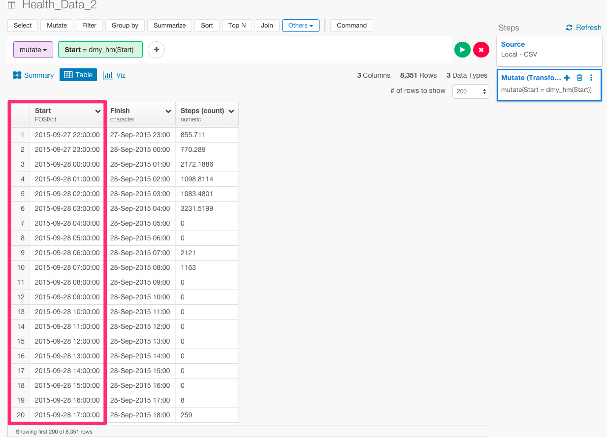

#Analyzing iPhone Step Data

Iphoneのアプリを使うと、簡単に歩数のデータを見れるのをご存知ですか？　実は、今歩数を数えて分析することにハマっています。ぼくは、2015年の9月ごろから、京都から東京にProgate株式会社でのソフトウェアエンジニアとしてのインターンシップで、上京しました。また、2016年の2月から、東京からアメリカのシリコンバレーのほうに留学でやってきました。上京前や留学前と後で歩数の変化に違いは見られたりするのでしょうか？　機械学習やデータサイエンスで有名なYhat社が、[ブログ](http://blog.yhat.com/posts/phone-steps-timeseries.html)で、歩数のデータをRとPythonを使って分析しています。だから、これから、Yhat社のRとPythonを使った分析と、ぼくのExploratoryを使った分析を比較して、いかにExploratoryを使ったデータ分析が、ブログの分析方法に比べて、いかに、直感的で簡単かを説明していきたいと思います。データはこちらからダウンロードすることができます。アプリは[こちら](https://itunes.apple.com/us/app/qs-access/id920297614?mt=8)からダウンロードできます。

##データをエクスポートする

時間ごとの歩数のデータが見たいので、1 Hourを選ぶ。


歩数のデータが欲しいので、Stepを選んで、Create Tableを押します。


テーブルができました。これをエクスポートして準備完了です。


##データを準備するのがどれだけ簡単か

Yhat社は、データをインポートするために、Pythonを使って、このように書いています。


```
df_hour = pd.read_csv('health_data_hour.csv', parse_dates=[0,1], names=['start_time', 'steps'], usecols=[0, 2], skiprows=1, index_col=0)
```

Exploratoryだと、ボタン1つでインポートすることができます。


そして、簡単なサマリー画面も見ることができます。


次に、Yhat社は、データタイプをcharacterからDateに変えるために、Pythonを使って、このように分析しています。

```
df_hour.steps = df_hour.steps.apply(lambda x: int(float(x)))
df_hour.head()
type(df_hour.index)
type(df_hour.steps[1])
```

一方、Exploratoryの場合は、dmy_hm関数を使うと、たった1行で、データ・タイプをcharacterからDateに変えることができます。

まず、Start列のヘッダーをクリックして、Convert toからDay,Month,Year,Hour,Minuteを選びます。


下のようにコマンドが自動生成されます。そして、Runボタンを押します。

```
mutate(Start = dmy_hm(Start))
```


データ・タイプをcharacterからDateに変えることができました。たった1行です。



##タイムシリーズごとの歩数を計算する

さらに、Yhat社は、Pythonを使って、スパゲッティーのようなコードを書いて、このように分析しています。

```
df_daily = pd.DataFrame()
df_daily['step_count'] = df_hour.steps.resample('D').sum()
df_daily.head()
p = ggplot(df_daily, aes(x='__index__', y='step_count')) + \
    geom_step() + \
    stat_smooth() + \
    scale_x_date(labels="%m/%Y") + \
    ggtitle("Daily Step Count") + \
    xlab("Date") + \
    ylab("Steps")
print p
```
```
df_weekly['step_mean'] = df_daily.step_count.resample('W').mean()
df_monthly['step_mean'] = df_daily.step_count.resample('M').mean()
```


これは、ビジュアライズしようとすると、1時間ごとの歩数数が計算されてしまったので、ビジュアライズをもっときれいにするために、時間ごとではなく、日付ごとのデータを計算しようしたり、合計数ではなく、月ごとの平均歩数を計算しようとしているからなんです。しかし、Exploratoryのチャートでは、タイムシリーズやAggregate関数をケアできているので、そもそもこのような冗長なコードを一切書かずに、一瞬で同じことをすることができます。

X軸で自由にタイムシリーズを選ぶことができます。


また、関数も自由に選ぶことができます。


##平日と週末で歩数を比較する

そして、Yhat社は、平日と週末で歩数を比較するために、Pythonを使って、このように分析しています。


```
def weekendBool(day):
    if day not in ['Saturday', 'Sunday']:
        return False
    else:
        return True

df_daily['weekday'] = df_daily.index.weekday
df_daily['weekday_name'] = df_daily.index.weekday_name
df_daily['weekend'] = df_daily.weekday_name.apply(weekendBool)
df_daily.head()
```

```
ggplot(aes(x='step_count', color='weekend'), data=df_daily) + \
    stat_density() + \
    ggtitle("Comparing Weekend vs. Weekday Daily Step Count") + \
    xlab("Step Count")
```

Exploratoryでは、同じことをもっと簡潔にすることができます。

まず、Start列のヘッダーをクリックして、ExtractからDay of Weekを選びます。


下のようにコマンドが自動生成されます。そして、Runボタンを押します。

```
mutate(weekday = wday(Start, label = TRUE))
```


次に、if_else関数を使って、平日と週末で条件を分岐させましょう。

```
mutate(Weekend = if_else(weekday %in% c("Sun","Sat"),"Weekend","Weekday"))
```


##上京前と後で変化はあるか？


##留学前と後で変化はあるか？


##興味を持っていただいた方、実際に触ってみたい方へ

Exploratoryは[こちら](https://exploratory.io/
)からβ版の登録ができます。こちらがinviteを完了すると、ダウンロードできるようになります。


ExploratoryのTwitterアカウントは、[こちら](https://twitter.com/ExploratoryData
)です。

Exploratoryの日本ユーザー向けの[Facebookグループ](https://www.facebook.com/groups/1087437647994959/members/
)を作ったのでよろしかったらどうぞ

分析してほしいデータがある方や、データ分析のご依頼はhidetaka.koh@gmail.comまでどうぞ