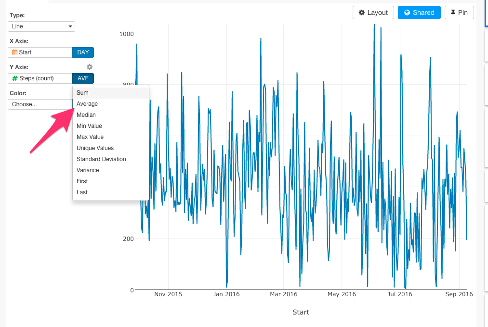
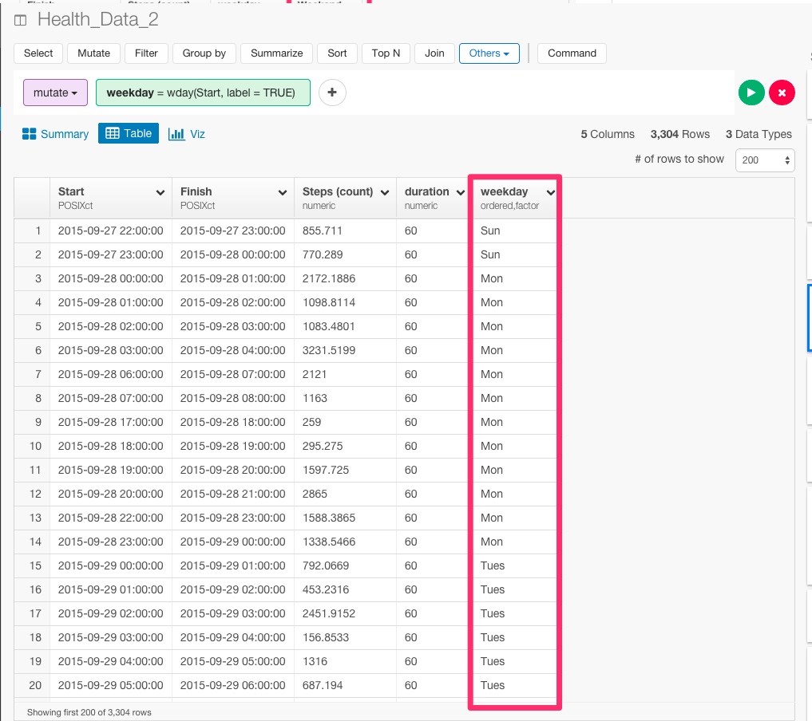
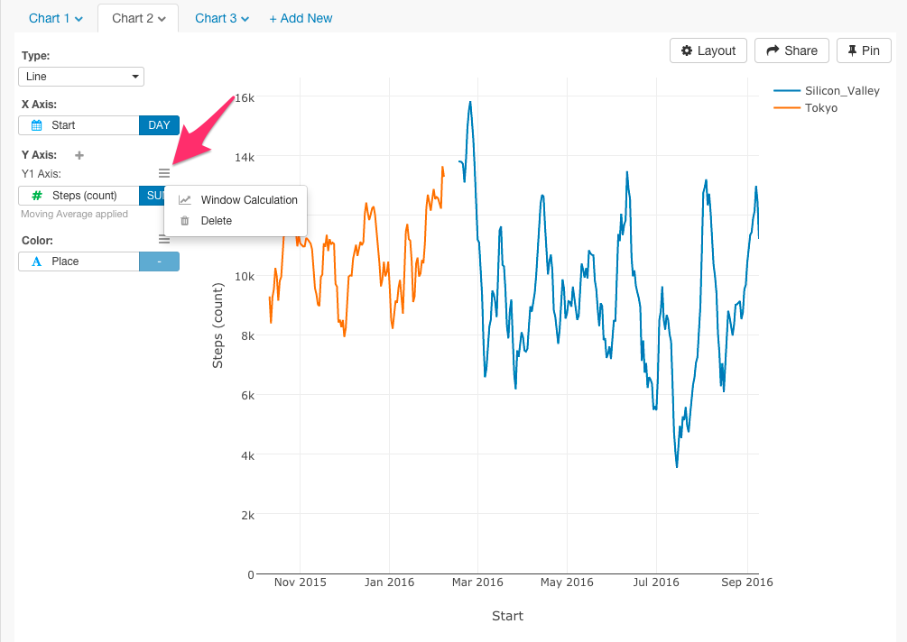
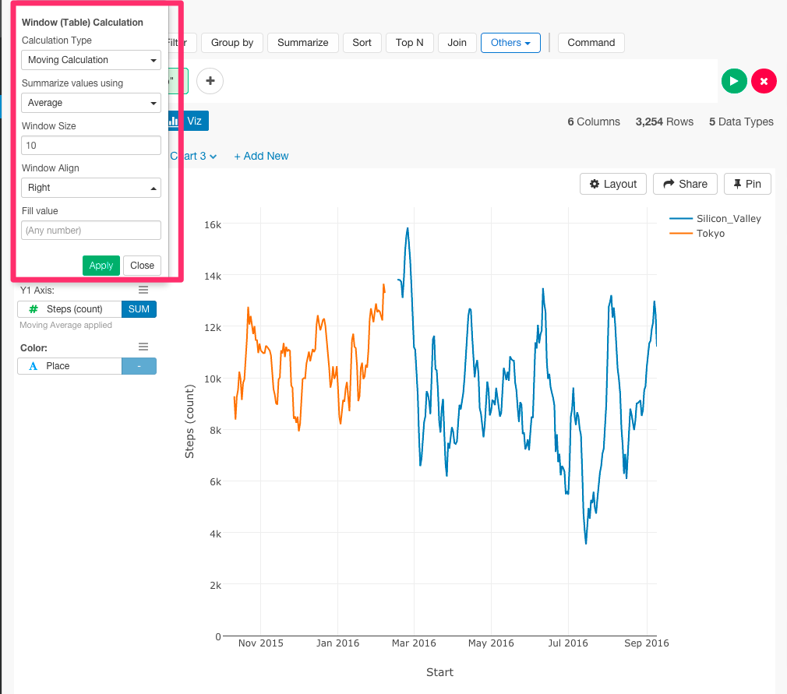

#ExploratoryとRを使って、Pythonよりもっと早く、歩数データを分析して、京都、東京、シリコンバレーで比較してみた

Iphoneのアプリを使うと、簡単に歩数のデータを見れるのをご存知ですか？　実は、今歩数を数えて分析することにハマっています。私は、2015年の10月ごろから、京都から東京にProgate株式会社でのソフトウェアエンジニアとしてのインターンシップで、上京しました。また、2016年の2月から、東京からアメリカのシリコンバレーのほうに留学でやってきました。上京前や留学前と後で歩数の変化に違いは見られたりするのでしょうか？　機械学習やデータサイエンスで有名なYhat社が、[ブログ](http://blog.yhat.com/posts/phone-steps-timeseries.html)で、歩数のデータをPythonを使って分析しています。これから、これをもとに、今度は私の方で、私のiPhoneからダウンロードした私の歩数のデータをもとに、RとExploratoryを使って、もっとシンプルにサクッと直感的に分析をしてみたいと思います。データはこちらからダウンロードすることができます。アプリは[こちら](https://itunes.apple.com/us/app/qs-access/id920297614?mt=8)からダウンロードできます。

##データをエクスポートする

時間ごとの歩数のデータが見たいので、1 Hourを選ぶ。


歩数のデータが欲しいので、Stepを選んで、Create Tableを押します。


テーブルができました。これをエクスポートして準備完了です。


##データを準備するのがどれだけ簡単か

Pythonではデータをインポートするのにこのようになります


```
df_hour = pd.read_csv('health_data_hour.csv', parse_dates=[0,1], names=['start_time', 'steps'], usecols=[0, 2], skiprows=1, index_col=0)
```

Exploratoryだと、ボタン1つでインポートすることができます。


そして、簡単なサマリー画面も見ることができます。


次に、Pythonは、データタイプをcharacterからDateに変えるために、Pythonの`pandas.tseries.index.DatetimeIndex`を使っていますが、詳細については詳しく書かれていません。

一方、Rの場合は、dmy_hm関数を使うと、たった1行で、データ・タイプをcharacterからDateに変えることができます。

まず、Start列のヘッダーをクリックして、Convert toからDay,Month,Year,Hour,Minuteを選びます。


下のようにコマンドが自動生成されます。

```
mutate(Start = dmy_hm(Start))
```


さらに、Finish列のデータタイプも変えておきましょう。

```
mutate(Start = dmy_hm(Start), Finish = dmy_hm(Finish))
```


データ・タイプをcharacterからDateに変えることができ歩数あたりの時間も出すことができました。たった1行です。


##タイムシリーズごとの歩数を計算する

さらに、Pythonを使って、このように分析しています。


```
df_hour.steps = df_hour.steps.apply(lambda x: int(float(x)))
df_hour.head()
type(df_hour.index)
type(df_hour.steps[1])
```

```
df_daily = pd.DataFrame()
df_daily['step_count'] = df_hour.steps.resample('D').sum()
df_daily.head()
p = ggplot(df_daily, aes(x='__index__', y='step_count')) + \
    geom_step() + \
    stat_smooth() + \
    scale_x_date(labels="%m/%Y") + \
    ggtitle("Daily Step Count") + \
    xlab("Date") + \
    ylab("Steps")
print p
```
```
df_weekly['step_mean'] = df_daily.step_count.resample('W').mean()
df_monthly['step_mean'] = df_daily.step_count.resample('M').mean()
```


これは、ビジュアライズしようとすると、1時間ごとの歩数数が計算されてしまったので、ビジュアライズをもっときれいにするために、時間ごとではなく、日付ごとのデータを計算しようしたり、合計数ではなく、月ごとの平均歩数を計算しようとしているからなんです。しかし、Exploratoryのチャートでは、タイムシリーズやAggregate関数をケアできているので、そもそもこのような冗長なコードを一切書かずに、一瞬で同じことをすることができます。

X軸で自由にタイムシリーズを選ぶことができます。


また、関数も自由に選ぶことができます。



##平日と週末で歩数を比較する

さらに、Pythonを使うと、このような長いコードを書きながら、平日と週末を比較するためのデータをビジュアライズしていくことになります。


```
def weekendBool(day):
    if day not in ['Saturday', 'Sunday']:
        return False
    else:
        return True

df_daily['weekday'] = df_daily.index.weekday
df_daily['weekday_name'] = df_daily.index.weekday_name
df_daily['weekend'] = df_daily.weekday_name.apply(weekendBool)
df_daily.head()
```

```
ggplot(aes(x='step_count', color='weekend'), data=df_daily) + \
    stat_density() + \
    ggtitle("Comparing Weekend vs. Weekday Daily Step Count") + \
    xlab("Step Count")
```

Exploratoryでは、同じことをもっと簡潔にすることができます。

Step列を見てみると、歩数が0のときがよくあります。


意味のあるデータに絞るために、歩数が30以上のときにフィルタリングしましょう。

```
filter(`Steps (count)` > 30)
```


そして、Start列のヘッダーをクリックして、ExtractからDay of Weekを選びます。


下のようにコマンドが自動生成されます。そして、Runボタンを押します。

```
mutate(weekday = wday(Start, label = TRUE))
```




次に、if_else関数を使って、平日と週末で条件を分岐させましょう。

```
mutate(Weekend = if_else(weekday %in% c("Sun","Sat"),"Weekend","Weekday"))
```


そして、ビジュアライズしてみます。


##京都、東京、シリコンバレーで比較する

最後に、せっかくなので、10月までいた京都とそれから2月までいた東京と現在滞在しているシリコンバレーで歩数に変化はあったのか比較してみたいと思います。
日付で京都と東京とシリコンバレーで条件分岐をするために、まずas.Date関数を使ってデータタイプをDate(日付)に変えます。

```
mutate(Start = as.Date(Start))
```


次に、if_else関数を使って条件分岐をします。


Runボタンを押します。

```
mutate(Place = if_else(between(Start,as.Date("2015-09-27"),as.Date("2015-10-01")),"Kyoto",if_else(between(Start,as.Date("2015-10-02"),as.Date("2016-02-07")),"Tokyo","Silicon_Valley")))
```


これで、京都と東京とシリコンバレーを表すPlace列を作ることができました。これを使って、ビジュアライズしてみましょう。


東京が多くなっていますね。これは、毎日、新大塚や浅草から渋谷まで徒歩と電車で通っていたからだと思います。そして、シリコンバレーは、車社会だから、やはり歩数が少なくなっていますね。あれ、でも京都が極端に少ないですね。それぞれの日数を見てみましょう。


京都がほとんどないので、フィルタリングをかけて東京とシリコンバレーだけで比較しましょう。


##移動平均を計算してトレンドを見る

最後に１日当たりの歩数平均のトレンドを私の住んでた場所ごとに色で区分けしてビジュアライズしてみたいと思います。

移動平均はY軸のギアアイコンから設定することができます。



次に、ダイアログから移動平均の設定をすることができます。設定が終了すると、Applyボタンを押しましょう。



これで移動平均を出すことができました。


##最後に

Pythonと比較して、ExploratoryでRを使うことがどれだけ簡単かおわかりいただけたでしょうか？　データはどこにでもあるものですが、ほとんどの人は分析の仕方を知らないものですよね。それは、データが整形されていない状態のときが多いからです。データを分析するには、データ分析についてあれこれ考える前に、データを分析可能な状態まで整形する必要があるのです。例えば、今回の歩数のデータは、Iphoneさえ持っていれば誰もが持っているデータです。しかし、今までなら、このようなデータを分析しようとすると、サードパーティのアプリにお金を払って、データを渡して、返ってきた作られたレポートを見るというのが一般的ではなかったでしょうか？　しかし、Exploratoryがあれば、サードパーティのアプリなどを使う必要は一切ありません。Exploratoryでは、複雑で冗長なコードを書くことなしに、文法を中心としたデータ分析とビジュアライゼーションによってこんなに簡単に、自分でデータをよりよく理解していくことができます。

##興味を持っていただいた方、実際に触ってみたい方へ

Exploratoryは[こちら](https://exploratory.io/
)からβ版の登録ができます。こちらがinviteを完了すると、ダウンロードできるようになります。


ExploratoryのTwitterアカウントは、[こちら](https://twitter.com/ExploratoryData
)です。

Exploratoryの日本ユーザー向けの[Facebookグループ](https://www.facebook.com/groups/1087437647994959/members/
)を作ったのでよろしかったらどうぞ

分析してほしいデータがある方や、データ分析のご依頼はhidetaka.koh@gmail.comまでどうぞ