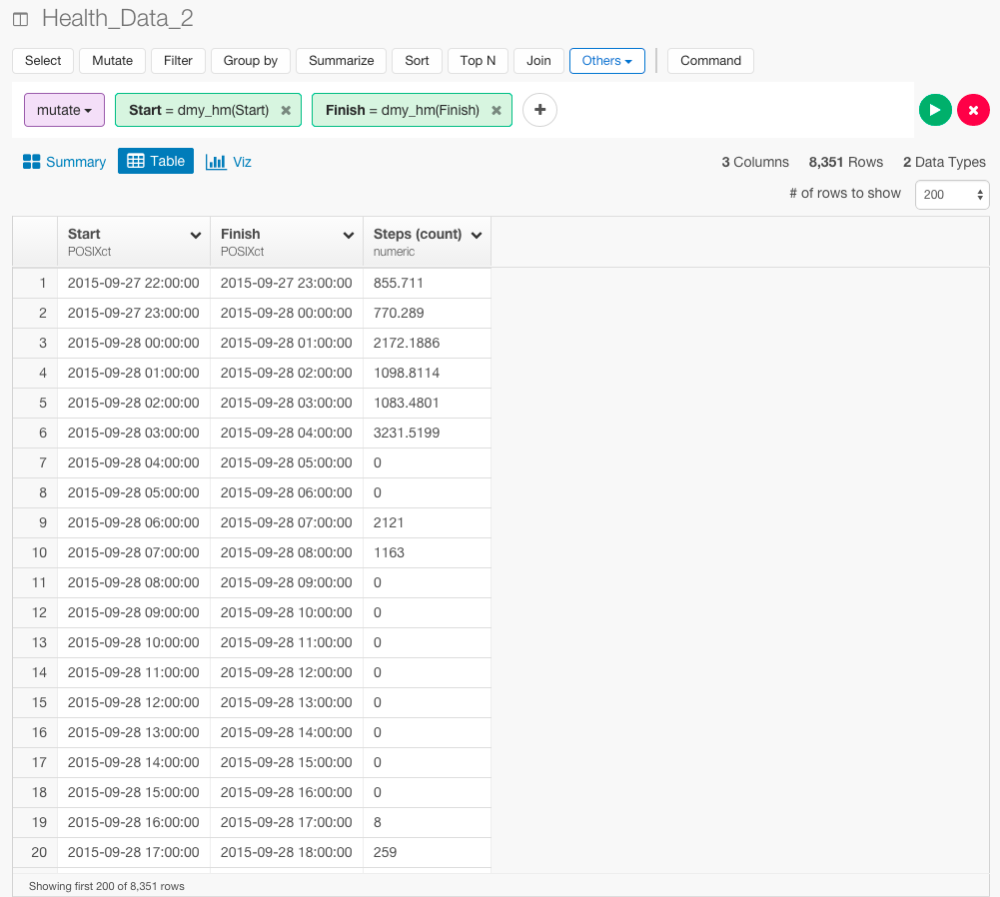

#Analyzing iPhone Step Data

Iphoneのアプリを使うと、簡単に歩数のデータを見れるのをご存知ですか？　実は、今歩数を数えて分析することにハマっています。ぼくは、2016年の2月から、東京からアメリカのシリコンバレーのほうに留学でやってきました。留学前と後で歩数の変化に違いは見られたりするのでしょうか？　機械学習やデータサイエンスで有名なYhat社が、[ブログ](http://blog.yhat.com/posts/phone-steps-timeseries.html)で、歩数のデータをRとPythonを使って分析しています。だから、これから、Yhat社のRとPythonを使った分析と、ぼくのExploratoryを使った分析を比較して、いかにExploratoryを使ったブログの分析方法に比べて、いかに、直感的で簡単かを説明していきたいと思います。データはこちらからダウンロードすることができます。アプリは[こちら](https://itunes.apple.com/us/app/qs-access/id920297614?mt=8)からダウンロードできます。

##データをエクスポートする

時間ごとの歩数のデータが見たいので、1 Hourを選ぶ。


歩数のデータが欲しいので、Stepを選んで、Create Tableを押します。


テーブルができました。これをエクスポートして準備完了です。


##データを準備するのがどれだけ簡単か

Yhat社は、データをインポートするために、Pythonを使って、このように書いています。


```
df_hour = pd.read_csv('health_data_hour.csv', parse_dates=[0,1], names=['start_time', 'steps'], usecols=[0, 2], skiprows=1, index_col=0)

```

Exploratoryだと、ボタン1つでインポートすることができます。


そして、簡単なサマリー画面も見ることができます。


次に、Yhat社は、データタイプをcharacterからDateに変えるために、Pythonを使って、このように分析しています。

```
df_hour.steps = df_hour.steps.apply(lambda x: int(float(x)))
df_hour.head()
type(df_hour.index)
type(df_hour.steps[1])
```

一方、Exploratoryの場合は、dmy_hm関数を使うと、たった1行で、データ・タイプをcharacterからDateに変えることができます。

Start列のヘッダーをクリックして、Convert toからDay,Month,Year,Hour,Minuteを選びます。


下のようにコマンドが自動生成されます。そして、Runボタンを押します。

```
mutate(Start = dmy_hm(Start))
```




データ・タイプをcharacterからDateに変えることができました。たった1行です。


##タイムシリーズ

〜してますが、Window calcだけで〜

##平日、週末


##興味を持っていただいた方、実際に触ってみたい方へ

Exploratoryは[こちら](https://exploratory.io/
)からβ版の登録ができます。こちらがinviteを完了すると、ダウンロードできるようになります。


ExploratoryのTwitterアカウントは、[こちら](https://twitter.com/ExploratoryData
)です。

Exploratoryの日本ユーザー向けの[Facebookグループ](https://www.facebook.com/groups/1087437647994959/members/
)を作ったのでよろしかったらどうぞ

分析してほしいデータがある方や、データ分析のご依頼はhidetaka.koh@gmail.comまでどうぞ