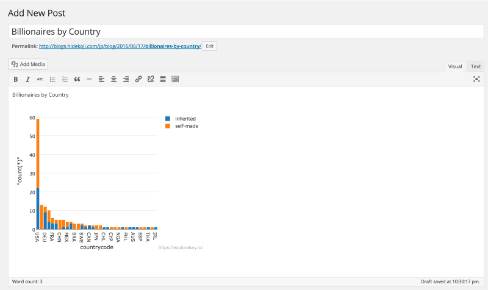

#RのフロントエンドExploratoryを使って、チャートをSlackやSNSやブログに埋め込んでみた

どうやって、チャートを自分のウェブサイトやブログのページに組み込んでますか？

ぼくたちは、Exploratoryのユーザからこの質問をよくされます。Exploratoryには、自分のアナリシスを書くことができるNote機能があります。そこでは、チャートを埋め込んだり、Webで公開することもできます。しかし、このNoteは、Exploratoryのヘッダーなどが付いたままの、Exploratoryのウェブサイトにホストされているのです。

ユーザが本当にしたいことは、チャートをNoteを通してではなく、直接、ユーザ自身のWebページに組み込むことですよね。こういうわけで、Exploratoryは、チャート埋め込み機能を実装することに至りました。

##チャートをシェアする

チャートをシェアするには、チャートの右側の‘Share’ボタンを押すだけです。かなり簡単ですよね？

シェアする前に、シェアされたチャートがディスカッションされやすいように適切なチャート名、タイトル、X軸、Y軸に設定することをオススメします。

チャートシェアのダイアログでは、‘Share’ボタンを押してください。このボタンを押すと、ユニークなURLを持ったチャートがexploratory.ioに公開されます。それが終わると、チャートのURLやチャートが埋め込まれたコードスニペットを見ることができます。

##チャートの変更を更新する

例えば、公開しているチャートのデータやチャートの形に、変更があった場合、変更を反映させたいですよね。その場合は、公開された、チャートを更新するために、‘Update’ボタンを押してください。

##チャートの公開をやめる

チャートの公開をやめたいときは、いつも‘Stop Sharing’ボタンを押してをください。

##チャートのサイズを変更する

チャートを埋め込むときは、サイズは、デフォルトである、‘Responsive’のまま使うことをおすすめします。これは、スマホやタブレットなど複数のウインドウにも対応してます。それでも、特定のサイズにチャートを指定したいときは、ドロップダウンメニューからSmallやMediumやLargeサイズを選んでください。

##Sharing on Slack

もし、あなたが、Exploratoryのように、チームメンバーとのコミュニケーションにSlackを使っているなら、チャートのURLをSlackにコピペして、チャートをSlackでシェアすることができます。チームメンバーはリンクをクリックして、ブラウザで開くこともできます。

##チャートをTwitterにシェアする

チャートURLをコピーして、ツイートに貼り付けてください。投稿を見た人は、チャートをクリックして見ることもできます。

##チャートをFacebookにシェアする

Facebookにチャートをシェアすることは、Twitterでシェアするのに似ています。チャートURLをコピーして、Facebookフィードに貼り付けてください。投稿を見た人は、チャートをクリックして見ることもできます。

##チャートをTumblrでシェアする

Tumblrでも同様にできます。

##チャートをWordpressでシェアする

世の中の6000万以上のウェブサイトは、Wordpressで作られています。そんなWordpressでも同様にすることができます。

ぼくは、よくこの機能をSlackでのチームコミュニケーションで使っています。わざわざチャートのスクリーンショットを撮って、貼り付けなくていいので、かなり便利です。他のメンバーは、定期的に、チャートの最新版を確認できるように、よくチャートのURLをPinして、特定のチャンネルに流したり、ブックマークしたりもしています。

##興味を持っていただいた方、実際に触ってみたい方へ

Exploratoryは[こちら](https://exploratory.io/
)からβ版の登録ができます。こちらがinviteを完了すると、ダウンロードできるようになります。

チュートリアルは[こちら](http://docs.exploratory.io/tutorials/intro.html
)から見ることができます。

Exploratoryの日本ユーザー向けの[Facebookグループ](https://www.facebook.com/groups/1087437647994959/members/
)を作ったのでよろしかったらどうぞ
