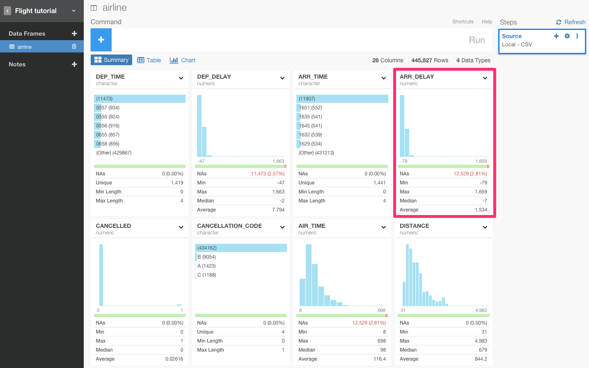
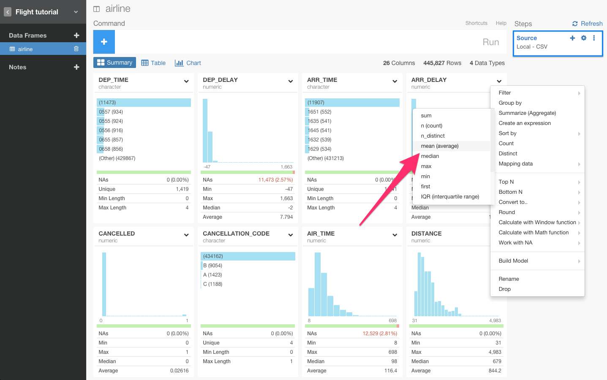
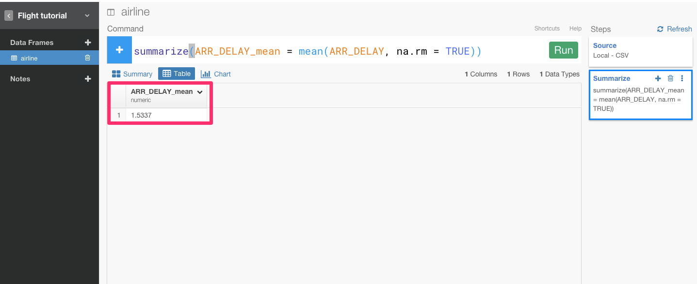
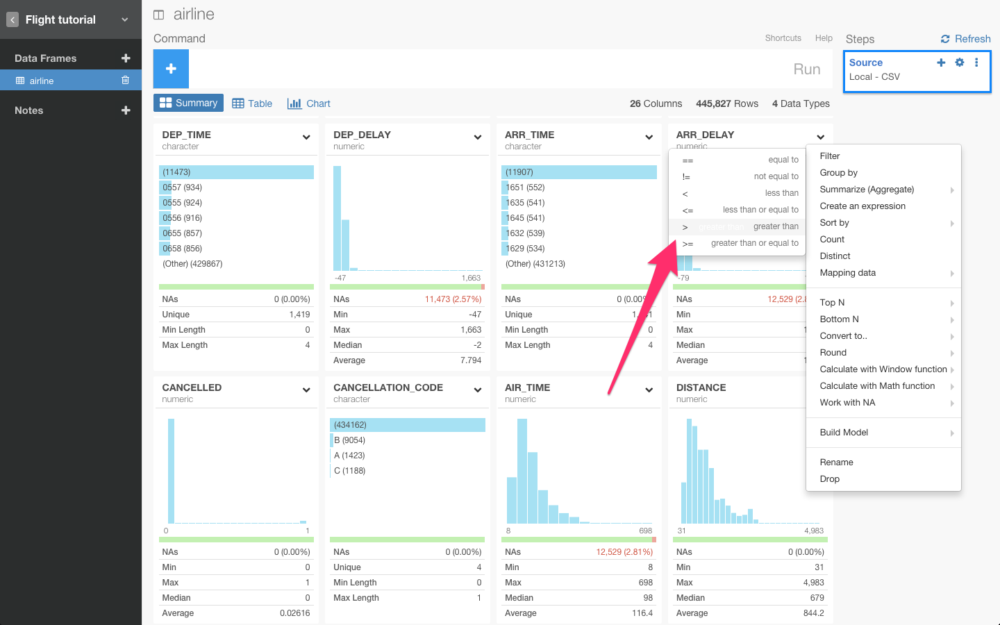
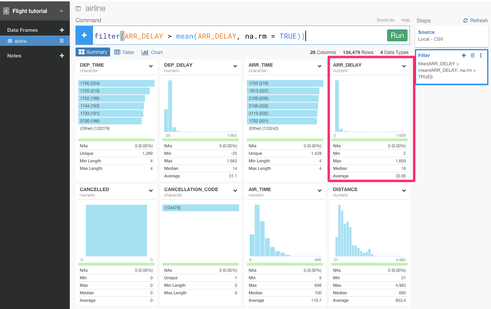
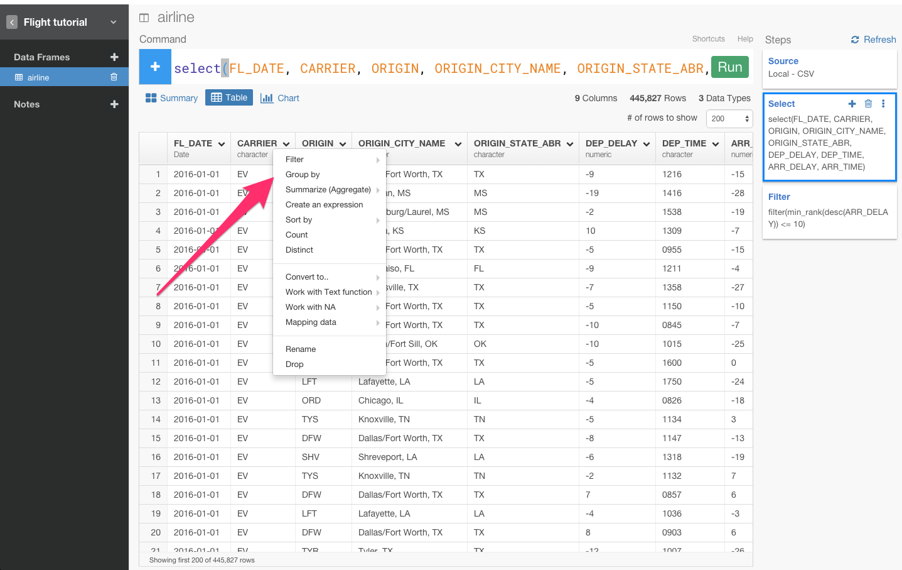
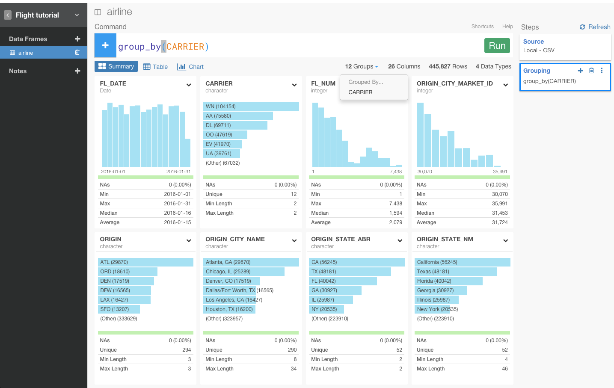
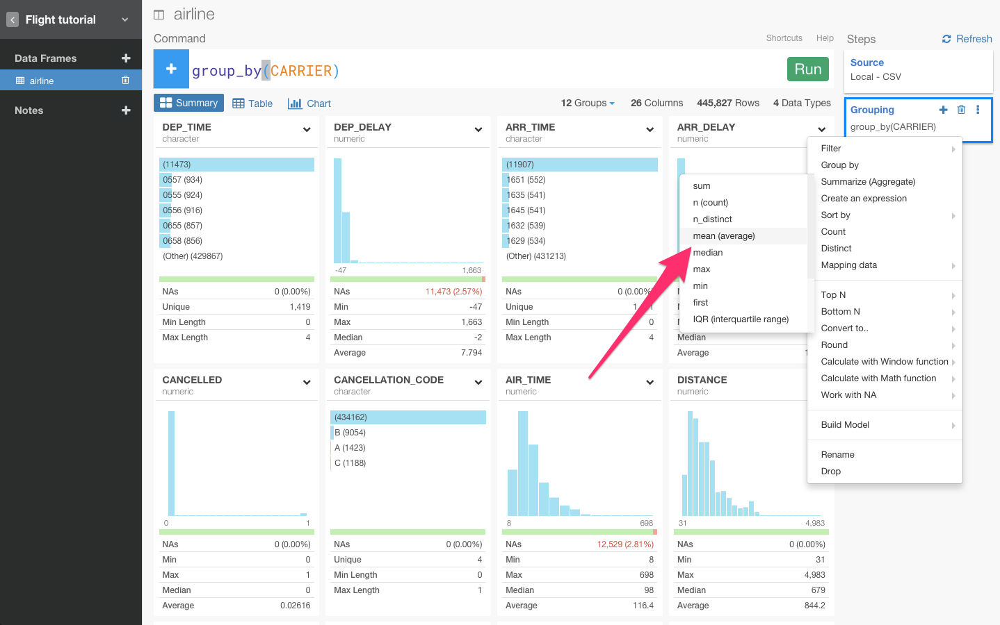
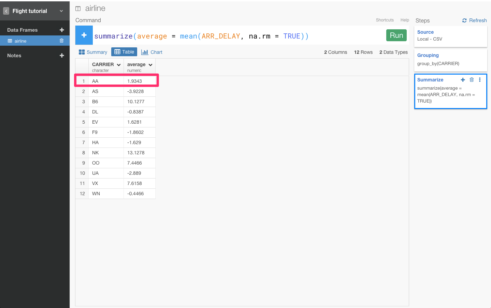

##まだSQLで消耗してるの？　データ分析ツールExploratoryを使って、dplyrを使いこなす第2弾　データ集計編

##はじめに

この記事は、Rは知らないけど、SQLとか他のプログラミング言語はある程度やったことあるみたいな人向けです。

興味がなかったり、意味のないデータを取り除きたいと思ったことはありませんか？　データをフィルタリングすることは、データ分析をする上での基本的な操作です。dplyrには、filter()関数というのが備わっています。dplyrはデータをただ単にフィルタリングできるだけではありません。dplyrがあれば、SQLや他のBIツールのようにデータを直感的に分析していくことができます。

##dplyrとは

データフレームの操作に特化したRのパッケージです。
Rの一般的な関数に比べて、dplyrはC++で書かれているのでかなり高速に動作します。

SQLと比較するとわかりやすいです。主要なdplyrの機能とSQLの対比は、下図となります。

| SQL        | dplyr       |説明　　　　　　　　　　　　　　　　　　　|
|:-----------|------------:|:---------------------------------:|　　　　　　　　　　　　　
| where      |    filter   |行の絞り込み　　　　　　　　　　　　　　　|
| group by   |    group_by |グルーピングする　　　　　　　　　　　　　|
| select     |      select |データフレームから指定した列のみ抽出する　|
| order by   |     arrange |行を並べ替える　　　　　　　　　　　　　　|
| count,max  |   summarise |集計する　　　　　　　　　　　　　　　　　|

これから、Rのフロントエンドと呼ばれているデータ分析ツールExploratoryを使いながら、dplyrについて簡単に説明していきます。第1弾は[こちら](http://qiita.com/21-Hidetaka-Ko/items/117caea621562f05ffe1)から見ることができます。データは[こちら](https://www.dropbox.com/s/x2g3qgo28syxhcl/airline_delay_2016_01.csv?dl=0
)からダウンロードできます。

##データをインポートする

まず、ここからプロジェクトを作ることができます。

次に、ここからデータをインポートできます。

データをインポートすると、データのサマリー画面を見ることができます。

##Aggregate関数を使う

フライト全体の平均遅延到着時間を見たくありませんか？　そういうときは、Aggregate関数の、summarizeコマンドを使うと見ることができます。

ARR_DELAY列のヘッダーをクリックしてfilterコマンドを選びます。

すると、自動的にsummarize(ARR_DELAY_mean = mean(ARR_DELAY, na.rm = TRUE))が入力されます。Runボタンを押します。

引数の‘na.rm = TRUE’は、‘mean()’関数が計算の前にNA値を除去するかどうかを設定します。もし、TRUEではなくFALSEだったら、データにNA値があるときは、NA値を返します。Rは統計学者がよく使うプログラミング言語なので、とても強力で正確です。

1.5337分だとわかりましたね。すると、次は、到着遅延時間が1.5337分以上のフライトだけをfilter()関数を使って見てみましょう。

ARR_DELAY列のヘッダーをクリックしてfilterコマンドを選びます。

1.5337分以上なので、>を使います。

そして、先ほどのmean(ARR_DELAY, na.rm = TRUE))を加え、filter(ARR_DELAY > mean(ARR_DELAY, na.rm = TRUE))の状態で、Runボタンを押します。

ぼくは、Progate株式会社にインターンしていた当時、データ分析をするときは、SQLをよく使っていました。SQLは、とても便利でしたし、SQLを使ってデータ分析をしている会社は日本には多いと思います。SQL芸ができるエンジニアは、イケメン、すごいという風潮さえありますよね。

しかし、シリコンバレーに来てdplyrを使う機会が増えると、dplyrがとても便利で、SQLで分析することがアホらしく思えました。dplyrだと、SQLに比べて、直感的に関数を書いていくことができるんです。

例えば、「平均到着遅延時間以上のフライトだけを見る」と言った質問に対して、ぼくは、filter(ARR_DELAY > mean(ARR_DELAY, na.rm = TRUE))と書きました。これをSQLで書くと

'SELECT *: 
 FROM flight 　　
WHERE ARR_DELAY > (SELECT AVG(ARR_DELAY) 　　
                FROM flight　 　
             )'

のような感じになるはずです。ご覧のとおり、1行で収めるのは難しく、直感的ではないですよね。

SQLとdplyrには、データ分析の流れが、入れ子になるか、フローになるかという違いがあります。

もっと噛み砕いて、説明すると、dplyrは一連の関数のフローによって、tableを変形していくことが出来ます。それに対し、SQLはfunctionをかくごとにtableが変形しない。5回関数を書いたとき、dplyrなら1回ごとにtableが変形していくが、SQLは５回分を一気に一回で変形するイメージと言えば通じるでしょうか。

だから、dplyrのほうがSQLに比べ、後から見たときに、分析の流れがフローになっているためわかりやすく、再現性が高いのです。

だから、ぼくはよくQiitaでdplyrのコマンドがいかに直感的かについて説明しているんです。

##GroupでAggregate関数を使う

全体の平均遅延到着時間ではなく、フライトそれぞれの平均遅延到着時間を見てみたくありませんか？この質問に答えるためには、以下のように、filterをする以前に、CARRIERに対して、group_by()関数を加える必要があります。

CARRIER列のヘッダーをクリックしてgroup_byコマンドを選びます。

すると、自動的にgroup_by(CARRIER)が入力されます。Runボタンを押します。

とてもシンプルですよね。このgroup_by()関数は、mean()のようなデータを集計する関数がそれぞれのグループに対して集計できるように、指定した列をグルーピングするんです。

次に、summarizeコマンドを使って、データを集計します。

ARR_DERAY列のヘッダーをクリックしてsummarizeコマンドを選びます。平均を出したいので、meanを選びます。

すると、自動的にsummarize(ARR_DELAY_mean = mean(ARR_DELAY, na.rm = TRUE))が入力されます。Runボタンを押します。

これで、それぞれのフライト会社における遅延時間を計算して出すことができました。これを見ると、AA会社の平均遅延時間は、1.9343分だとわかりますね。

以上が、dplyrでの基本的なフィルタリングに関する操作第2弾です。dplyrでは、他にもwindow関数を使ったり、文字列を整形したり、date関数を使ったり、まだまだいろんなことができます。そちらの方はこれから書いていく予定ですので、お楽しみに！

##興味を持っていただいた方、実際に触ってみたい方へ

Exploratoryは[こちら](https://exploratory.io/
)からβ版の登録ができます。こちらがinviteを完了すると、ダウンロードできるようになります。

Exploratoryの日本ユーザー向けの[Facebookグループ](https://www.facebook.com/groups/1087437647994959/members/
)を作ったのでよろしかったらどうぞ

ExploratoryのTwitterアカウントは、[こちら](https://twitter.com/ExploratoryData
)です。

分析してほしいデータがある方や、データ分析のご依頼はhidetaka.koh@gmail.comまでどうぞ