#まだSQLで消耗してるの？ データ分析ツールExploratoryを使って、dplyrを使いこなす第4弾　date関数編

##はじめに

もし、最近3ヶ月のアクティブユーザー数やあるイベント後のデータや、週末のユーザー数など、特定の期間内だけのデータだけを取り出したいと思ったことはありませんか？ そのために、dplyrには、date関数というのが備わっています。dplyrは、こういう操作をするのに長けています。

##データをインポートする

データは[こちら](https://www.dropbox.com/s/x2g3qgo28syxhcl/airline_delay_2016_01.csv?dl=0
)からダウンロードできます。

まず、ここからプロジェクトを作ることができます。

次に、ここからデータをインポートできます。

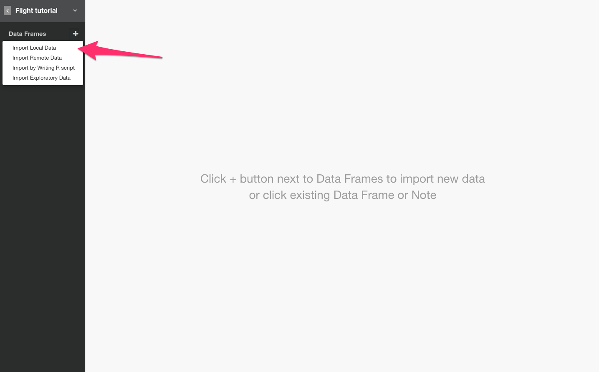

データをインポートすると、データのサマリー画面を見ることができます。

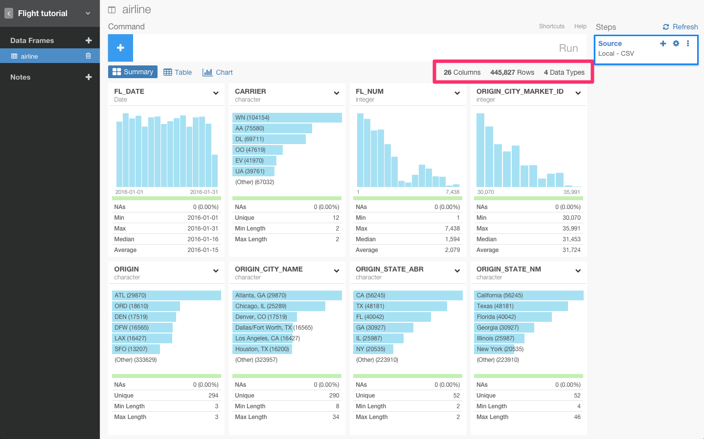

##date関数を使ってフィルタリングする

2016年1月15日以降のフライトのデータだけ見たいとしましょう。

データを見てみると、フライトの日付を表すFL_DATE列がDateデータタイプになっていることに気が付きますね。

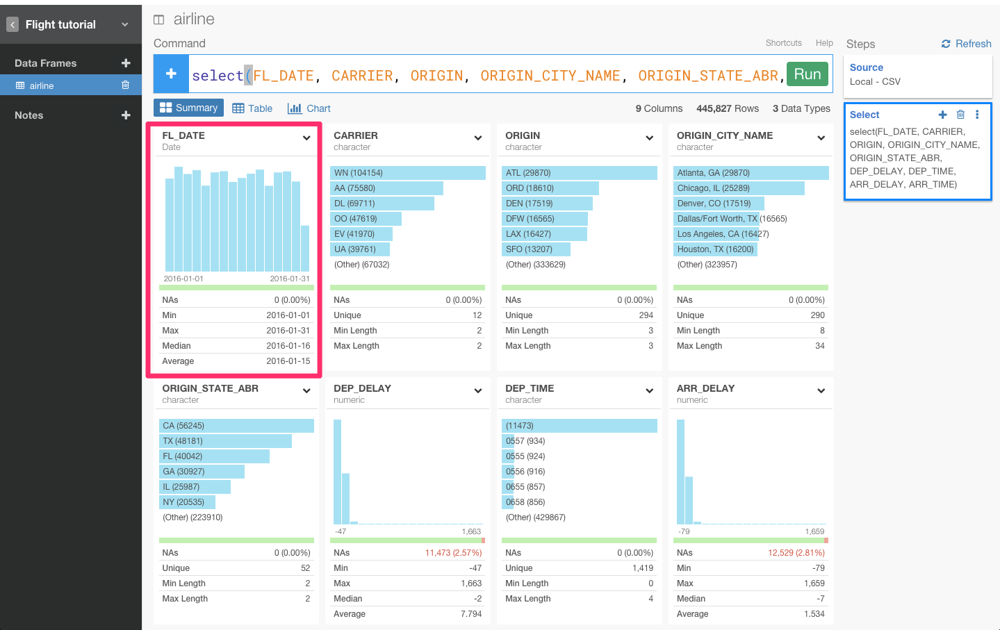

FL_DATE列のヘッダーをクリックしてFilterコマンドを選び、>=を選びます。2016年の1月15日なので、Specific Dateを選びます。

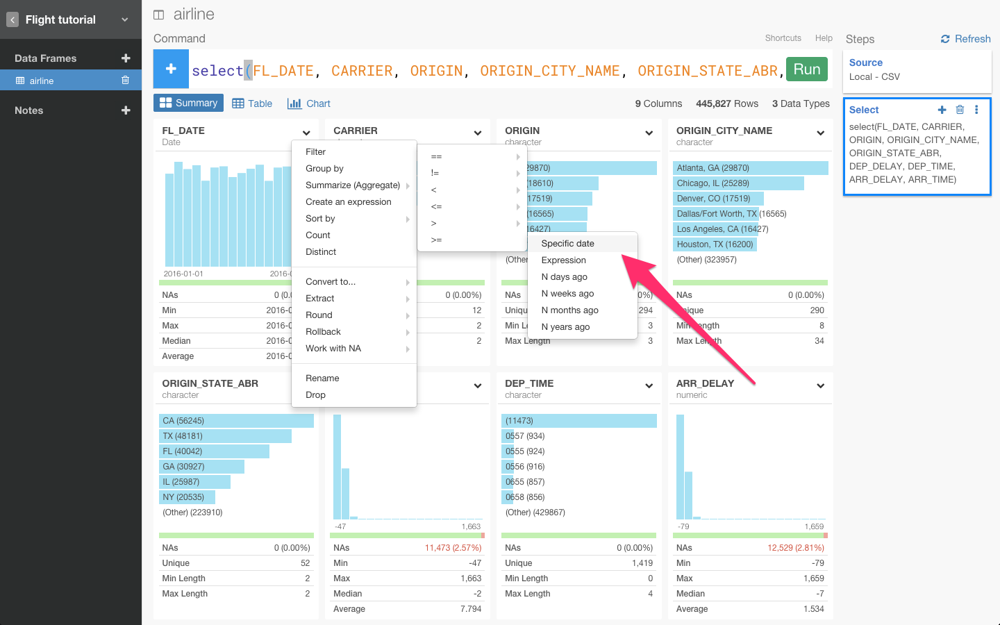

すると、自動的にfilter(FL_DATE >= "2016-01-15")が入力されます。そして、Runボタンを押します。

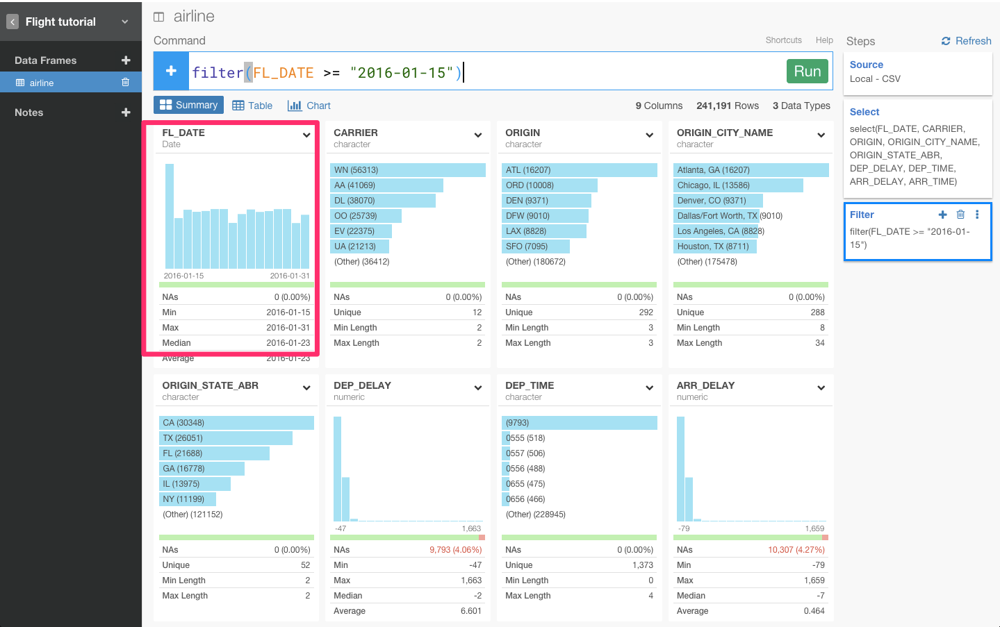

##日付の範囲を指定する

次に、2016年1月15日から、2016年1月20日までのフライトのデータのような指定した2つの日付の間の期間のフライトのデータを見てみたかったりしませんか？　そういうときの、最も簡単なやり方は、以下のように、&の後にを、条件を加えることです。

スペースをクリックすると、&がレコメンドされます。

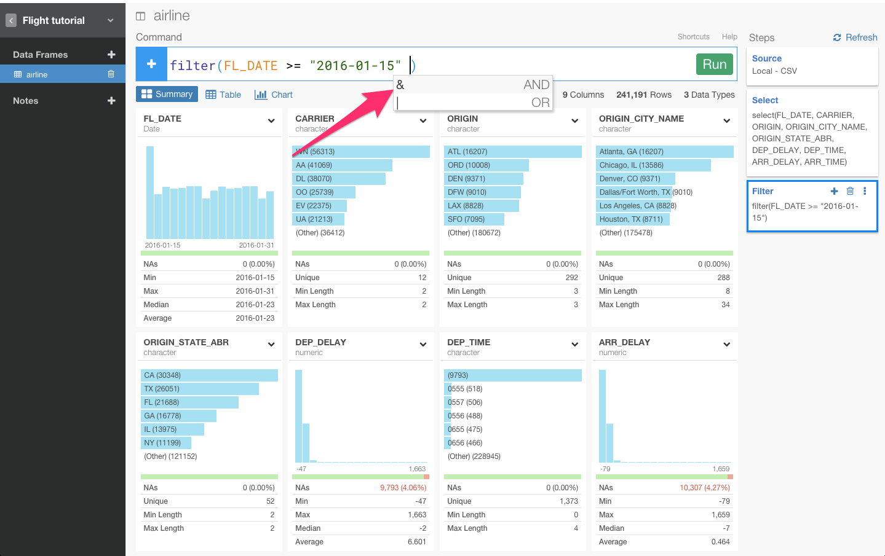

&をクリックして、FL_DATE <= "2016-01-20"を加えます。そして、Runボタンを押します。

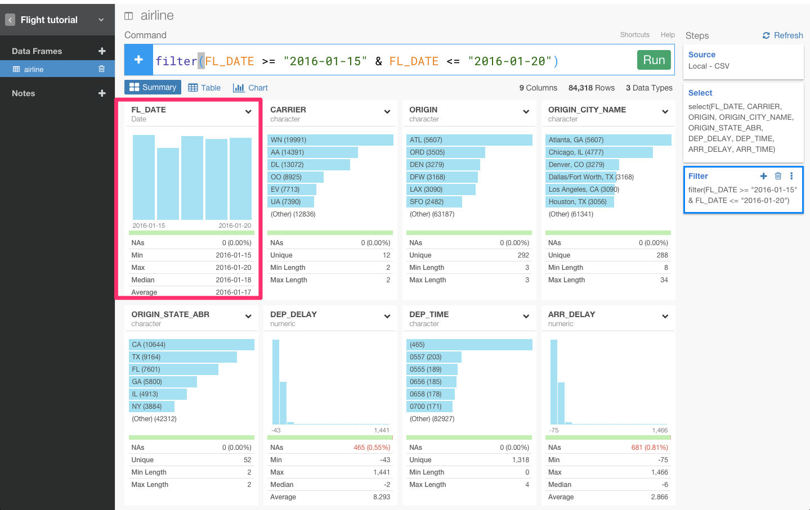

##直近のN日間だけのデータを取り出す

直近のN日間などの特定の期間を指定してデータを見てみたいときってよくありませんか？　例えば、あなたのプロダクトのアクティブユーザー数や会社の歳入を見たいとき、直近の3時間や7日前や3ヶ月前でフィルタリングしてデータをそれぞれ見ていく必要があります。

しかし、このフライトのデータには、2016年の1月のデータしかないため2016年7月である今日のデータがありません。なので、このデータの日付を足しましょう。FL_DATE列をアップデートしたいので、mutateコマンドを使います。今日は、7月17日なので、mutate()の中に、+ months(6), - days(14)と書いて6ヶ月を加え、14日を引きます。

.png)

データが、今日の2016年7月17日までのデータになっているのがわかりますね。これで、今日から、7日間のデータを見てみましょう。

FL_DATE列のヘッダーをクリックしてFilterコマンドを選び、>=を選びます。今日から1週間なので、N weeks agoを選びます。

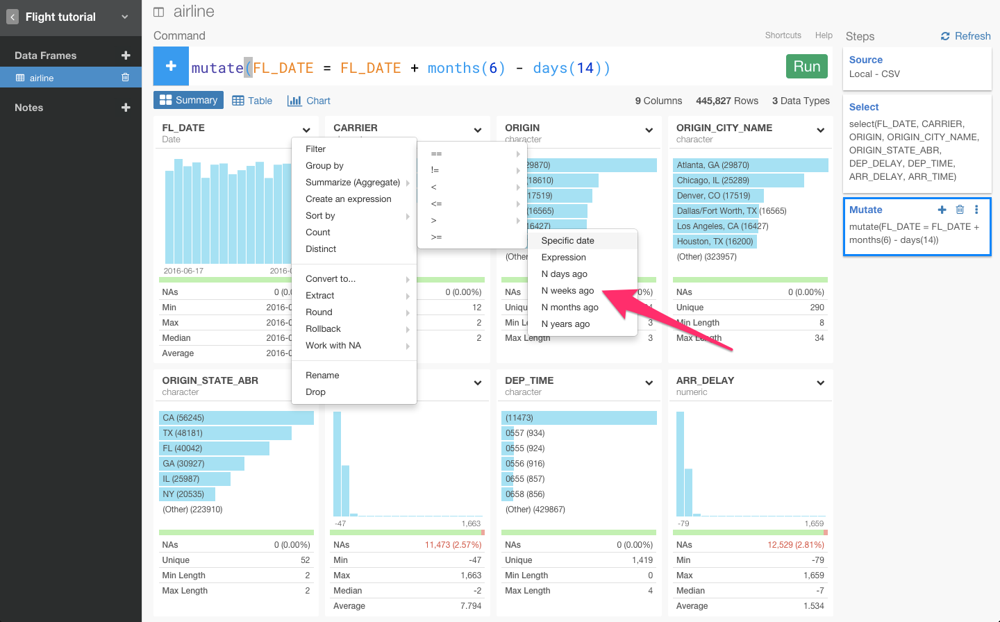

すると、自動的にfilter(FL_DATE >= today() - weeks(1))が入力されます。そして、Runボタンを押します。

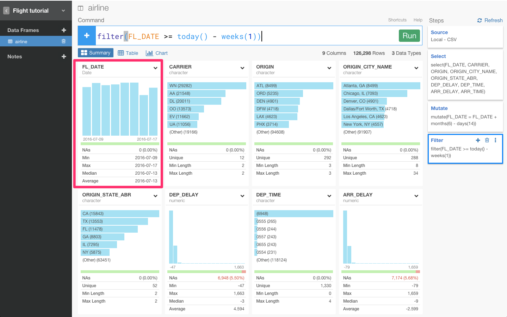

このtoday()関数は便利なことに、今日の日付を返してくれます。

今回は、今日の日付を計算するのに、today()関数を使いました。これは、FL_DATE列のデータ・タイプがDateタイプだったからです。しかし、もしデータ・タイプがPOSIXctのときは、now()関数を使うと今日の日付を取得することができます。

##日付から曜日を取り出す

これから説明する関数は、dplyrの中でも、特にぼくが気に入っている関数です。

週末を除いた平日（月〜金）のデータだけを見てみたいと思ったことはありませんか？

そうするためには、まず第一に曜日のデータが必要ですね。wday()関数を使うと、日付から曜日を計算して出してくれます。直感的に理解してもらうために、曜日を表すweekdayという新しい列を作ってみましょう。

FL_DATE列のヘッダーをクリックしてCreate expressionを選びます。

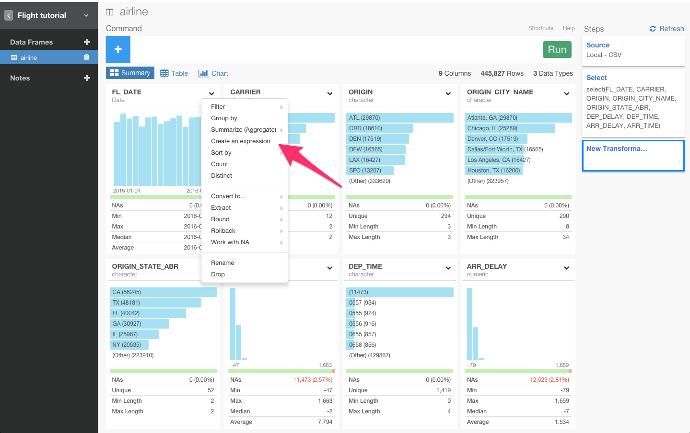

すると、mutate(new_column = )が自動的に入力されます。new_columnをweekdayにして、= wday(FL_DATE)を加えてRunボタンを押しましょう。

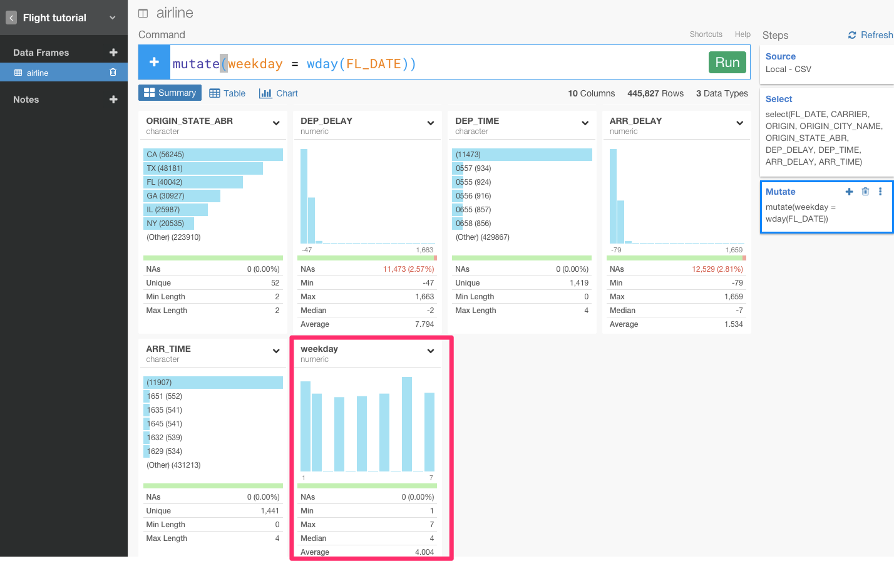

すると、weekday列が最後に作られているのがわかりますね。1は、日曜日を表し、7は、土曜日を表しているんですが、これだと直感的にわかりにくいですよね。なので、1や7のような数字ではなく、MonやTueなどのような曜日を返すように、以下のように、wday関数の引数にlabel=TRUEを加えてみましょう。

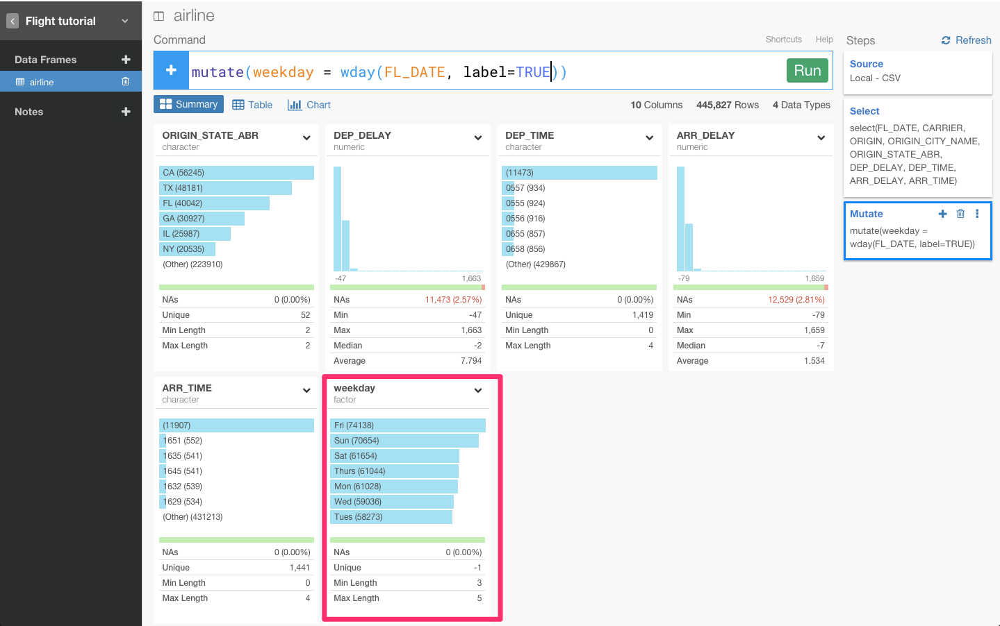

これでだいぶわかりやすくなりましたね。

このように、SundayやSaturdayと表示されていると平日や週末でフィルタリングするときにとても便利です。

weekday列のヘッダーをクリックしてFilterを選びます。土曜日と日曜日という複数のデータを指定する必要があるので、%in%を選びます。

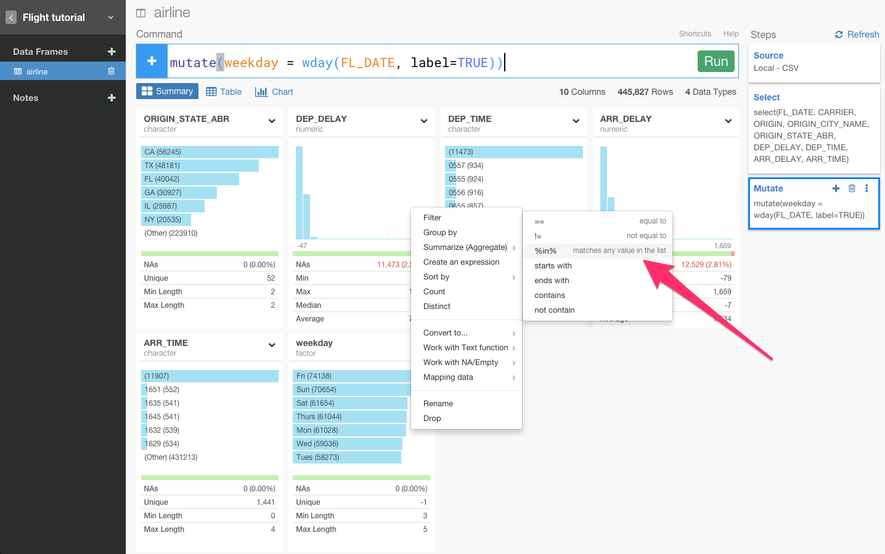

すると、filter(weekday %in% c())が自動的に入力されます。週末を除きたいので、"Sat"と"Sun"を加えて、filter(weekday %in% c("Sat","Sun"))にして、Runボタンを押しましょう。

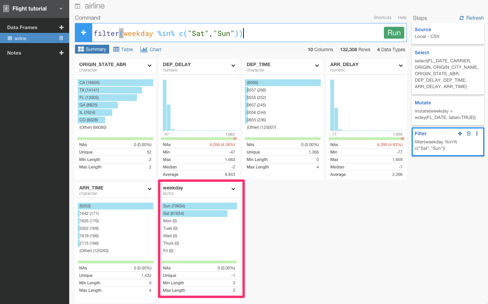

あれ？　週末を除いた平日だけのデータを見ようと思ったら、逆に週末だけのデータになってしまっていますね。条件を逆転するために、!を加えましょう。

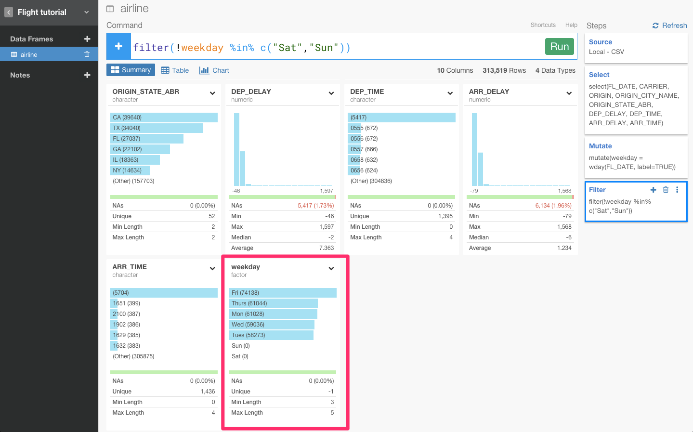

これで今回こそ、平日だけのデータを見ることができましたね。

念の為に、count関数を使って本当に平日だけのデータかを確認してみましょう。

weekday列のヘッダーをクリックしてcountを選びます。

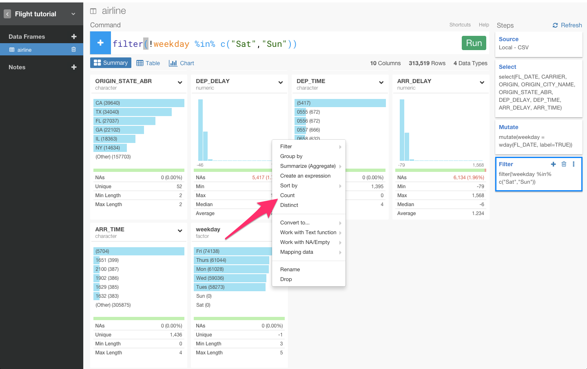

すると、count(weekday)が自動的に入力されます。Runボタンを押しましょう。

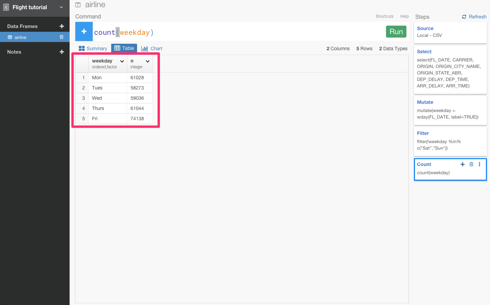

やっぱり平日だけのデータを取得できていましたね。
今回のシリーズで使ったような関数のことをdate関数と呼びます。以上が、dplyrでの基本的なdate関数に関する操作です。

##興味を持っていただいた方、実際に触ってみたい方へ

Exploratoryは[こちら](https://exploratory.io/
)からβ版の登録ができます。こちらがinviteを完了すると、ダウンロードできるようになります。

Exploratoryの日本ユーザー向けの[Facebookグループ](https://www.facebook.com/groups/1087437647994959/members/
)を作ったのでよろしかったらどうぞ

ExploratoryのTwitterアカウントは、[こちら](https://twitter.com/ExploratoryData
)です。

分析してほしいデータがある方や、データ分析のご依頼はhidetaka.koh@gmail.comまでどうぞ
