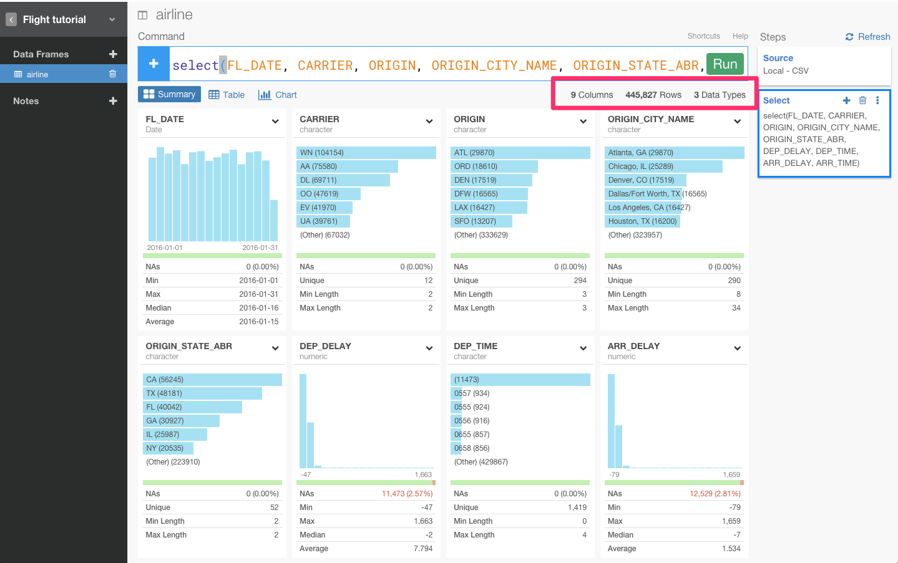
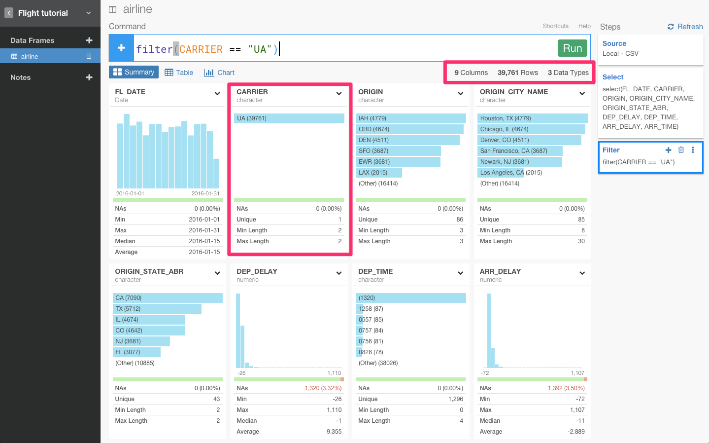
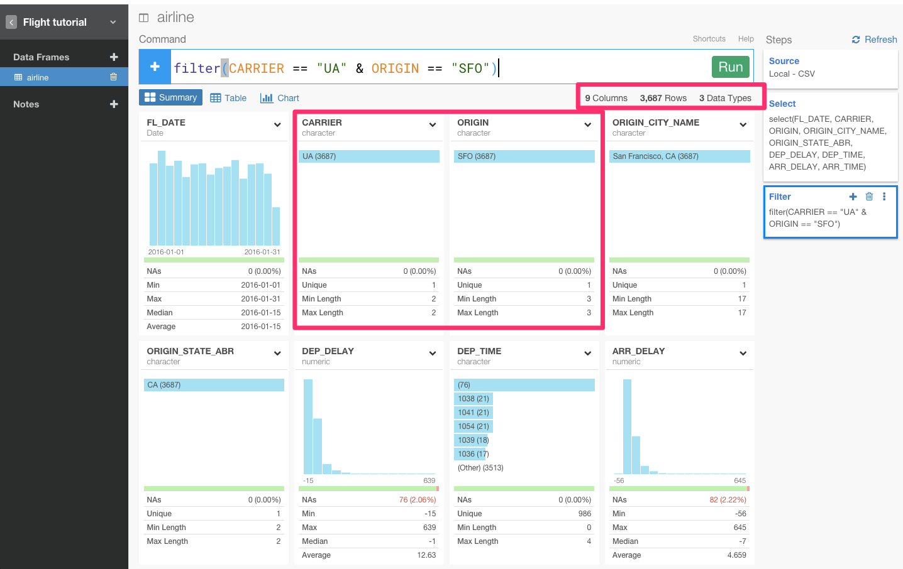
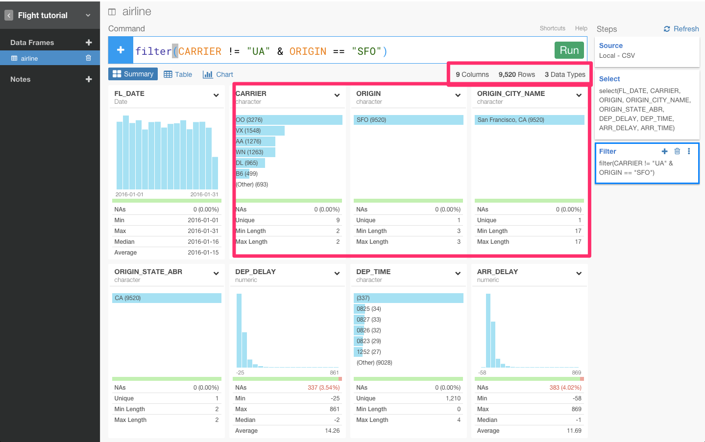
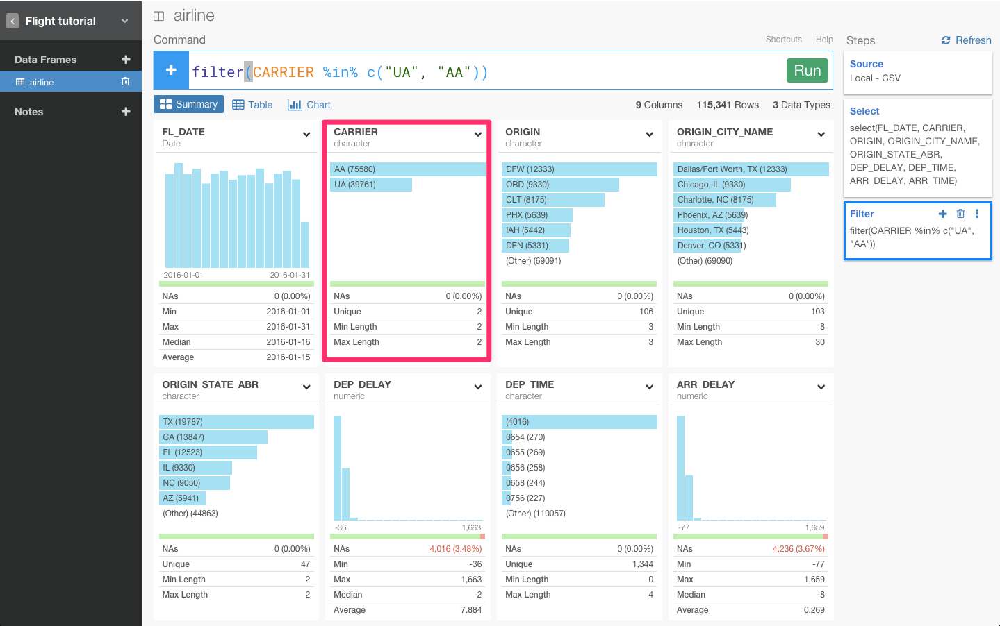
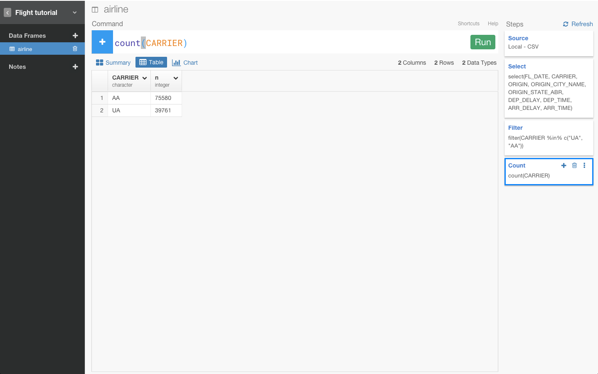
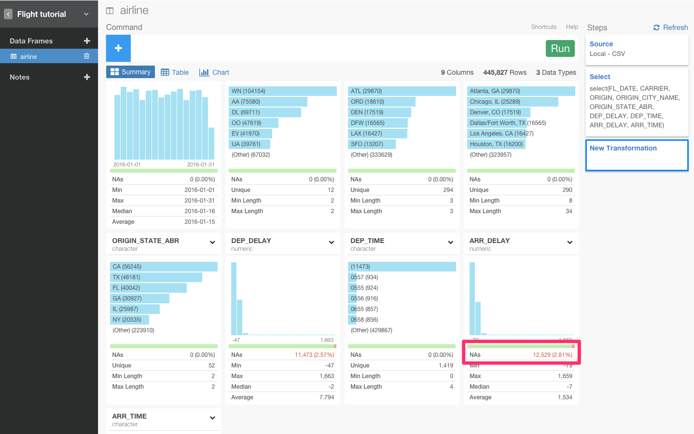
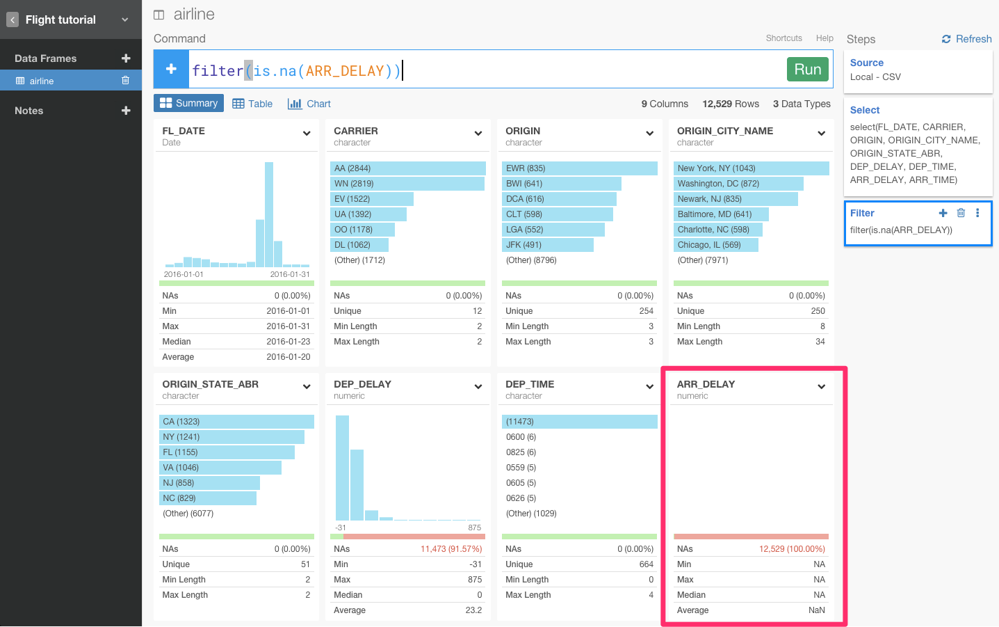
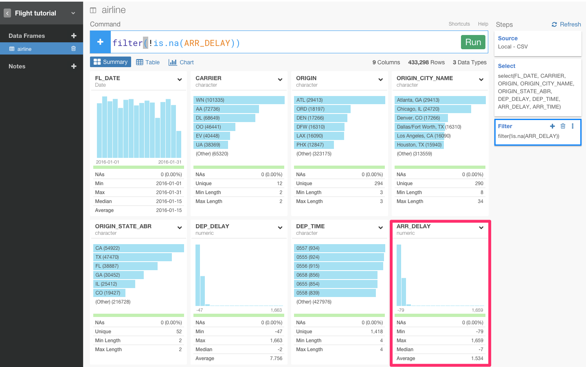

# データ分析ツールExploratoryを使って、dplyrを使いこなす！

##はじめに

この記事は、Rは知らないけど、SQLとか他のプログラミング言語はある程度やったことあるみたいな人向けです。
興味がなかったり、意味のないデータを取り除きたいと思ったことはありませんか？　データをフィルタリングすることは、データ分析をする上での基本的な操作です。dplyrには、filter()関数というのが備わっています。dplyrはデータをただ単にフィルタリングできるだけではありません。dplyrがあれば、SQLや他のBIツールのようにデータを直感的に分析していくことができます。

##dplyrとは

データフレームの操作に特化したRのパッケージです。
Rは基本的に処理速度はあまり早くないですが、dplyrはC++で書かれているのでかなり高速に動作します。

SQLと比較するとわかりやすいです。主要なdplyrの機能とSQLの対比は、下図となります。

| SQL        | dplyr       |説明　　　　　　　　　　　　　　　　　　　|
|:-----------|------------:|:---------------------------------:|　　　　　　　　　　　　　
| where      |    filter   |行の絞り込み　　　　　　　　　　　　　　　|
| group by   |    group_by |グルーピングする　　　　　　　　　　　　　|
| select     |      select |データフレームから指定した列のみ抽出する　|
| order by   |     arrange |行を並べ替える　　　　　　　　　　　　　　|
| count,max  |   summarise |集計する　　　　　　　　　　　　　　　　　|

これから、Rのフロントエンドと呼ばれているデータ分析ツールExploratoryを使いながら、dplyrについて簡単に説明していきます。データは[こちら](
)からダウンロードできます。

##Selectコマンドを使って、列を選択する

Selectコマンドを使うことで、分析したい列だけを選ぶことができます。

##知りたいデータだけをフィルタリングする

例えば、United Airline (UA)会社のフライトのデータだけを見たい場合は、下図のようにするとみることができます。

また、andを意味する&演算子を使うと、条件を加えることができます。&を使って、United Airline (UA)会社のフライトに加え、出発地点がSan Francisco airport (SFO)のフライトのデータも見てみましょう。

もしくは、!=演算子を使って、条件を反対にすることもできます。!=を使って、出発地点は、San Francisco airport (SFO)のままだけれど、United Airline (UA)会社ではないフライトのデータを見ることもできます。

##複数の値をフィルタリングする

United Airline (UA)とAmerican Airline (AA)の両方のフライトのデータだけを見たい場合は、SQLにおけるINにあたる%in%を使うと見ることができます。

本当にうまくいってるのかを確認するために、count()関数を使って、簡単にデータを集計してみましょう。

思ったとおり、AAとUAだけでしたね。ご覧のとおりcount関数は、とても直感的で便利です。この関数は、指定したグループの行の数を返します。この場合なら、CARRIERですね。

##NA値をフィルタリングする

データを見ていくと、ARR_DELAY列にいくつかNA値があることが確認できますね。

値が、NA値だったら、TRUEを返して、そうでなければFALSEを返すis.na()関数を使うと、それらを簡単に取り除くことができます。

おっと、ARR_DELAYの値がすべてNA値になってしまいましたね。ぼくたちが知りたいデータは全く逆のことなので、条件文に!を足しましょう。

これが、dplyrの基本的な文法です。しかし、これはほんの一例で、dplyrでは、データをaggregateしたり、window関数を使ったり、文字列を整形したり、date関数を使ったり、まだまだいろんなことができます。

##興味を持っていただいた方、実際に触ってみたい方へ

Exploratoryは[こちら](https://exploratory.io/
)からβ版の登録ができます。こちらがinviteを完了すると、ダウンロードできるようになります。

Exploratoryの日本ユーザー向けの[Facebookグループ](https://www.facebook.com/groups/1087437647994959/members/
)を作ったのでよろしかったらどうぞ

ExploratoryのTwitterアカウントは、[こちら](https://twitter.com/ExploratoryData
)です。

