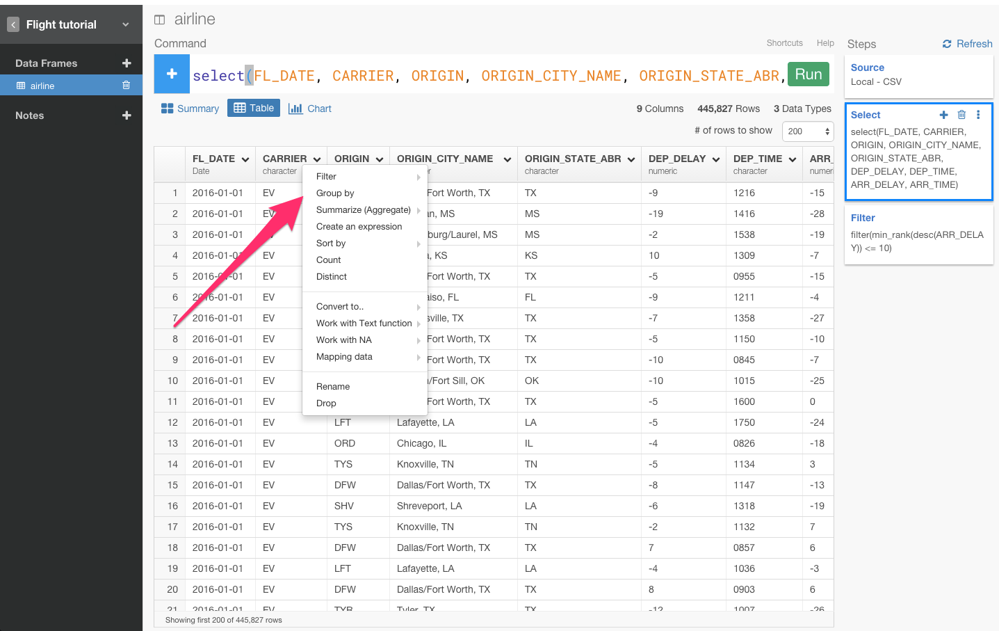

##まだSQLで消耗してるの？ データ分析ツールExploratoryを使って、dplyrを使いこなす第3弾　Window関数編

##はじめに

この記事は、Rは知らないけど、SQLとか他のプログラミング言語はある程度やったことあるみたいな人向けです。

データを簡単に集計したいと思ったことはありませんか？　データを集計することは、データ分析をする上での基本的な操作です。そのために、dplyrには、Window関数というのが備わっています。しかし本当にdplyrがすごい理由は、実はデータの加工、分析のための文法なのです。そのため、データを抽出するために元々作られたSQLや他のBIツールと違って、もっと、データを直感的に分析し、さらには分析している最中に必要であればデータの加工もしていくことが簡単にステップを重ねていくようにできます。

##dplyrとは

データフレームの操作に特化したRのパッケージです。
Rの一般的な関数に比べて、dplyrはC++で書かれているのでかなり高速に動作します。

SQLと比較するとわかりやすいです。主要なdplyrの機能とSQLの対比は、下図となります。

|dplyr       |SQL          |説明　　　　　　　　　　　　　　　　　|
|:-----------|:------------|:---------------------------------|　　　　　　　　　　　　　
|filter      |where        |行の絞り込み　　　　　　　　　　　　　 |
|group by    |group_by     |グルーピングする　　　　　　　　　　　  |
|select      |select       |データフレームから指定した列のみ抽出する　|
|arrange     |order by     |行を並べ替える　　　　　　　　　　　　  |
|summarise   |count,max    |集計する　　　　　　　　　　　　　　　 |

ぼくは、Progate株式会社にインターンしていた当時、データ分析をするときは、SQLをよく使っていました。SQLは、とても便利でしたし、SQLを使ってデータ分析をしている会社は日本には多いと思います。SQL芸ができるエンジニアは、イケメン、すごいという風潮さえありますよね。

しかし、シリコンバレーに来てdplyrに出会って以来、dplyrの直感的で便利な文法のおかげで、全くSQLを使うことがなくなってしまいました。

例えば、「平均到着遅延時間以上のフライトだけを見る」と言った質問に対して、dplyrだと、filter(ARR_DELAY > mean(ARR_DELAY, na.rm = TRUE))と書きました。これをSQLで書くと

'SELECT *: 
 FROM flight 　　
WHERE ARR_DELAY > (SELECT AVG(ARR_DELAY) 　　
                FROM flight　 　
             )'

のような感じになるはずです。ご覧のとおり、1行で収めるのは難しく、直感的ではないですよね。

SQLとdplyrには、データ分析の流れが、入れ子になるか、フローになるかという違いがあります。

もっと噛み砕いて、説明すると、dplyrは一連の関数のフローによって、tableを変形していくことが出来ます。それに対し、SQLはfunctionをかくごとにtableが変形しない。5回関数を書いたとき、dplyrなら1回ごとにtableが変形していくが、SQLは５回分を一気に一回で変形するイメージと言えば通じるでしょうか。（ただし、SQLにおけるfunctionってRの概念におけるfunctionは少し違いますが、ここでは割愛）

だから、dplyrのほうがSQLに比べ、後から見たときに、分析の流れがフローになっているためわかりやすく、再現性が高いのです。

だから、ぼくはよくQiitaでdplyrのコマンドがいかに直感的かについて説明しているんです。

これから、Rのフロントエンドと呼ばれているデータ分析ツールExploratoryを使いながら、dplyrについて簡単に説明していきます。第1弾は[こちら](http://qiita.com/21-Hidetaka-Ko/items/117caea621562f05ffe1)から見ることができます。第2弾は[こちら](http://qiita.com/21-Hidetaka-Ko/items/bc7766e730a60ebf4561)です。

データは[こちら](https://www.dropbox.com/s/x2g3qgo28syxhcl/airline_delay_2016_01.csv?dl=0
)からダウンロードできます。

##データをインポートする

まず、ここからプロジェクトを作ることができます。

次に、ここからデータをインポートできます。

データをインポートすると、データのサマリー画面を見ることができます。

##Window関数を使ってフィルタリングする

[こちら](http://qiita.com/21-Hidetaka-Ko/items/bc7766e730a60ebf4561)で説明したように、summarize関数を使ってデータを集計することは、とても強力で便利でした。しかし、まだ問題があります。例えば、「到着遅延時間が最も遅い10フライトはどこか？」という質問があったとしましょう。この質問に答えるためには、min_rank()というランキングを計算して出すための関数を使う必要があります。以下のように、filter()の中に書いていきましょう。

ARR_DERAY列のヘッダーをクリックしてCalculate with Windowコマンドを選び、min_rankを選びます。

すると、自動的にmutate(min_rank = min_rank(ARR_DELAY))が入力されます。

ここで、ぼくは、 min_rank()関数を使いましたが、同じように dense_rank()という関数も存在します。どちらの関数も、指定した列のランキングを返します。違いは、 以下の図を見るとわかりやすいです。

まあいずれにせよ、質問が「到着遅延時間が最も遅い10フライトはどこか？」なので、mutateをfilterに、<= 10を加え、filter(min_rank(ARR_DELAY) <= 10)とします。そして、Runボタンを押します。

あれ、でもARR_DELAYを注意して見てみると、ワースト10ではなくトップ10を出してしまっていますね。遅延時間が低ければ低いほど、フライトが早く到着したということを意味するからです。だから、条件を逆転させる必要があります。そういうときは、SQLのように、desc()関数が使えます。

これで、2016年1月の到着遅延時間がワースト10のデータを得ることができました。American Airlinesがたくさんありますね。面白いですね。今回は、トータルのワースト10のデータを出しましたが、会社ごとのワースト10を見てみたくありませんか？そういうときは、filterの前に、group_by()関数を加えると見ることができます。

CARRIER列のヘッダーをクリックしてgroup_byを選びます。

すると、自動的にgroup_by(CARRIER)が入力されます。Runボタンを押します。

意図していたことが、結果に本当に反映させられているかを、わかりやすくするために、フィルタリングの条件を<=10から<=1に変えてワースト１だけ見てみましょう。

これで、12会社それぞれの到着時間ワースト１のフライトのデータを見ることができました。

今回のシリーズで使ったような関数のことをWindow関数と呼びます。
以上が、dplyrでの基本的なWindow関数に関する操作です。dplyrでは、次はdate関数について書きたいと思います。お楽しみに！

##興味を持っていただいた方、実際に触ってみたい方へ

Exploratoryは[こちら](https://exploratory.io/
)からβ版の登録ができます。こちらがinviteを完了すると、ダウンロードできるようになります。

Exploratoryの日本ユーザー向けの[Facebookグループ](https://www.facebook.com/groups/1087437647994959/members/
)を作ったのでよろしかったらどうぞ

ExploratoryのTwitterアカウントは、[こちら](https://twitter.com/ExploratoryData
)です。

分析してほしいデータがある方や、データ分析のご依頼はhidetaka.koh@gmail.comまでどうぞ