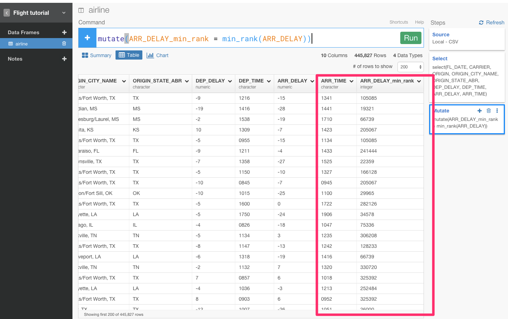
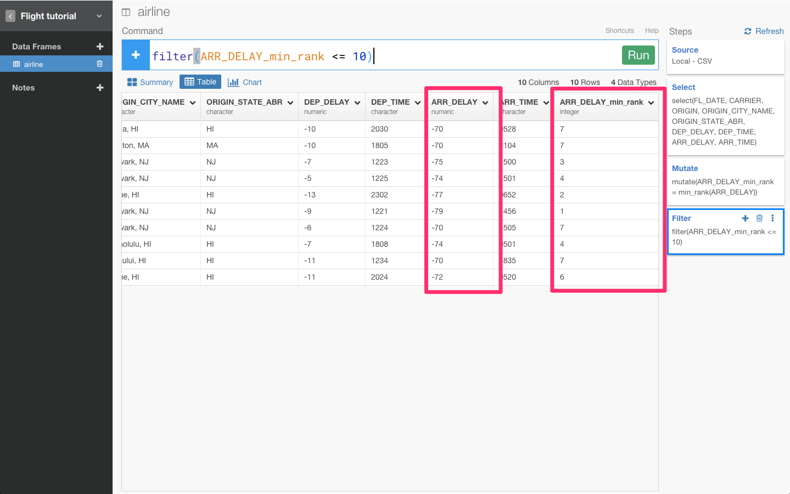

##まだSQLで消耗してるの？ データ分析ツールExploratoryを使って、dplyrを使いこなす第3弾　Window関数編

##はじめに

この記事は、Rは知らないけど、SQLとか他のプログラミング言語はある程度やったことあるみたいな人向けです。

データ簡単のランキングなどを簡単に計算したいと思ったことはありませんか？　そのために、dplyrには、Window関数というのが備わっています。しかし本当にdplyrがすごい理由は、実はデータの加工、分析のための文法なのです。そのため、データを抽出するために元々作られたSQLや他のBIツールと違って、もっと、データを直感的に分析し、さらには分析している最中に必要であればデータの加工もしていくことが簡単にステップを重ねていくようにできます。

これから、Rのフロントエンドと呼ばれているデータ分析ツールExploratoryを使いながら、dplyrの文法について簡単に説明していきます。第1弾は[こちら](http://qiita.com/21-Hidetaka-Ko/items/117caea621562f05ffe1)から見ることができます。第2弾は[こちら](http://qiita.com/21-Hidetaka-Ko/items/bc7766e730a60ebf4561)です。よかったらさきにこちらから見て下さい

##データをインポートする

データは[こちら](https://www.dropbox.com/s/x2g3qgo28syxhcl/airline_delay_2016_01.csv?dl=0
)からダウンロードできます。

まず、ここからプロジェクトを作ることができます。

次に、ここからデータをインポートできます。

データをインポートすると、データのサマリー画面を見ることができます。

##Window関数を使ってフィルタリングする

「到着遅延時間が最も遅い10フライトはどこか？」という質問があったとしましょう。この質問に答えるためには、min_rank()というランキングを計算して出すための関数を使う必要があります。

ARR_DERAY列のヘッダーをクリックしてCalculate with Windowコマンドを選び、min_rankを選びます。

すると、自動的にmutate(ARR_DELAY_min_rank = min_rank(ARR_DELAY))が入力されます。そして、Runボタンを押します。

これで、到着時間が遅いフライトのランキングを出すことができました。質問は、「到着遅延時間が最も遅い10フライトはどこか？」なので、Filterコマンドを使い、10以下にフィルタリングします。

ARR_DELAY_min_rank列のヘッダーをクリックしてFilterコマンドを選び、<=を選びます。

すると、自動的に filter(ARR_DELAY_min_rank  <= )が入力されます。そして10を入力してRunボタンを押します。

あれ、でもARR_DELAYを注意して見てみると、ワースト10ではなくトップ10を出してしまっていますね。値が低ければ低いほど、フライトが早く到着したということを意味するからです。だから、条件を逆転させる必要があります。そういうときは、-コマンドが使えます。

これで、2016年1月の到着遅延時間がワースト10のデータを得ることができました。今回は、トータルのワースト10のデータを出しましたが、会社ごとのワースト10を見てみたくありませんか？そういうときは、filterの前に、group_by()関数を加えると見ることができます。

CARRIER列のヘッダーをクリックしてgroup_byを選びます。

すると、自動的にgroup_by(CARRIER)が入力されます。Runボタンを押します。

結果をわかりやすくするために、チャート画面に行って、ビジュアライズしてみましょう。グラフタイプを、Boxplotに、X軸をCARRIER、Y軸をARR_DERAYに指定します。

これで、会社ごとの到着遅延時間ワースト10が一目瞭然になりましたね。

ちなみに、ここで、ぼくは、 min_rank()関数を使いましたが、同じように dense_rank()という関数も存在します。どちらの関数も、指定した列のランキングを返します。違いは、 以下の図を見るとわかりやすいです。

今回のシリーズで使ったような関数のことをWindow関数と呼びます。
以上が、dplyrでの基本的なWindow関数に関する操作です。dplyrでは、次はdate関数について書きたいと思います。お楽しみに！

##興味を持っていただいた方、実際に触ってみたい方へ

Exploratoryは[こちら](https://exploratory.io/
)からβ版の登録ができます。こちらがinviteを完了すると、ダウンロードできるようになります。

Exploratoryの日本ユーザー向けの[Facebookグループ](https://www.facebook.com/groups/1087437647994959/members/
)を作ったのでよろしかったらどうぞ

ExploratoryのTwitterアカウントは、[こちら](https://twitter.com/ExploratoryData
)です。

分析してほしいデータがある方や、データ分析のご依頼はhidetaka.koh@gmail.comまでどうぞ