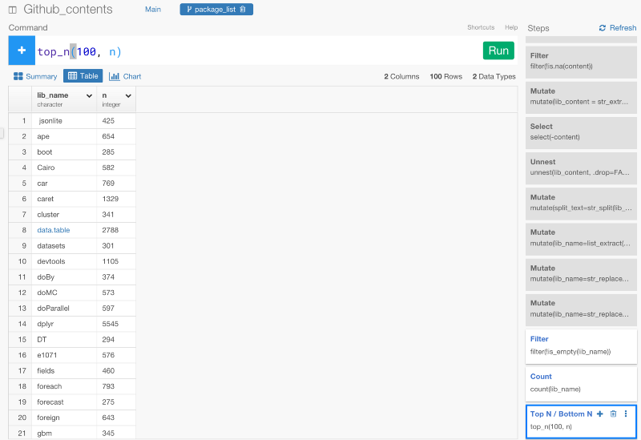

#なぜデータ分析においては、SQLではなくRを使うべきか？ Google公式のGoogle BigQueryのGitHubデータを使って、Rのパッケージを爆速でクラスタリングする

２，３週間前に、Googleは、280万のオープンソースGitHubリポジトリを公開しました。リンクは[こちら](https://cloud.google.com/bigquery/public-data/github)からどうぞ。これは、2億個の異なったファイルパスが入っていたり、163万ソースファイルも含まれています。合計にして3TB+以上です。これを使って、すでにいくつかのデータが分析されています。例えば、[Francesc](https://twitter.com/francesc)は、最も人気なGo言語のパッケージはなにかを見つけるために、Go言語のコードデータを分析しました。

Exploratoryは、Google BigQueryのデータインポート機能を実装しました。だから、今回は、Exploratoryを使って、GitHubオープンソースリポジトリのデータを使い、R言語について分析してみることにしました。


###データ分析の戦略

データ分析していく上で、R、dplyr、SQLのそれぞれが、なにが得意かをもう一度考えてみましょう。私は、データを引き出す際に、データベースと接続している、SQLを書き、データ分析に向いている、dplyrを使って、データの整形や分析をしていき、発展的なアルゴリズムを使って複雑な分析をしたいときに、数学系のライブラリが多く、統計学者がよく使っているRを使うのがベストな戦略だと考えます。この戦略なら、SQLを書くだけでは考えられなかったより高度なことや効果的な方法でデータを分析していくことができます。


ところで、dplyrについて詳しくない方は、こちらの方で、dplyrの文法であるFilter関数、Date関数、について詳しく解説しているので、よかったらご覧ください。

- [なぜデータ分析においては、SQLではなくRを使うべきか？　 データ分析ツールExploratoryを使って、dplyrを使いこなす第1弾 Filter関数編](http://qiita.com/21-Hidetaka-Ko/items/117caea621562f05ffe1)

- [なぜデータ分析においては、SQLではなくRを使うべきか？　データ分析ツールExploratoryを使って、dplyrを使いこなす第2弾　データ集計編](http://qiita.com/21-Hidetaka-Ko/items/bc7766e730a60ebf4561)

- [なぜデータ分析においては、SQLではなくRを使うべきか？　 データ分析ツールExploratoryを使って、dplyrを使いこなす第3弾　Window関数編](http://qiita.com/21-Hidetaka-Ko/items/fb9fe00ce982f240829a)

- [なぜデータ分析においては、SQLではなくRを使うべきか？　 データ分析ツールExploratoryを使って、dplyrを使いこなす第4弾　date関数編](http://qiita.com/21-Hidetaka-Ko/items/1645d89683e312f4d65c)


###ゴール

知りたいのは、すべてのパッケージ名を引き出して、Rパッケージの類似性を明らかにすることです。もし、2つのパッケージが同じファイルの中で一緒に使われているなら類似性があると言えるでしょう。少なくとも、同じようなタスクに対して使われているはずです。

結果は、とても面白いもので、ある程度予想のできるものでした。もし今、結果を知りたいなら、[こちら](https://exploratory.io/viz/kanaugust/9ae918f23b3f?cb=1470006301029)からインテラクティブなチャートを見ることができます。人気トップ100のRパッケージの階層があるのが確認できます。ドラッグすることで、拡大したり
することもできます。

これから、どうやってこのようなRパッケージの類似性を明らかにすることができたかを詳しく解説していきたいと思います。


##Google BigQueryのセットアップ

Google BigQueryを使って取り組み始めるまえに、まず、プロジェクトとデータセットを作る必要があります。Google BigQueryの設定について詳しくない方は、[こちら]()の方で詳しく解説しているので、よかったらご覧ください。

また、GitHubのデータに対してクエリを書く際に、注意しないといけないことがあります。それは、下でぼくが使っているデータは、1.5 TBもあります。Google BigQueryは、クエリの結果ではなく、加工したデータ量に対して課金をします。もし、様々なクエリを走らせてみたいなら、Google BigQueryチームが作った以下のサンプルデータを使ってみることをオススメします。

github_repos.sample_files
github_repos.sample_contents

これらのデータは、これからデモをする元のデータに比べてずっと小さいです。23GB以下です。だから、月に使用できるデータの容量の限度を超えるまで、課金されません。

##Rのファイルからデータを引き出す

ExploratoryからGoogle BigQueryにアクセスするには、Import Remote DataメニューからGoogle BigQueryを選びData Importダイアログを開かないといけません。WebブラウザがExploratoryにアクセスを許可していいか訪ねてきますが、いったん許可するとデータインポートダイアログメニューに戻って下さい。

以下の2つのデータテーブルを見てみましょう。

- github_repos.files
- github_repos.contents

このデータは、bigquery-public-dataプロジェクト下にあります。なので、左側のツリーにこれらのテーブルはありません。

‘github_repos.files’ はファイルについての情報を含んでいます。だから、ここでは、ファイルのパスやID、レポジトリ名を見つけることができます。

‘github_repos.contents’はすべてのファイルの中身を含んでいます。これらのテーブルのサイズは巨大で、特に、github_repos.contentsは1.57TBです。もう一度言っておきますが、注意する必要があります。Google BigQueryは、データの結果ではなく、プロセスに対して課金します。これは、もし1.57TBものデータに対して、クエリをかけると、1ヶ月の利用限度容量を超えることを意味します。だから、Google BigQueryのデータ・セットの下にテーブルを作り、何度も何度も同じデータに対してクエリをかける必要がないように、データのスナップショットを保存する必要があります。

では、クエリを走らせてみましょう。

```
SELECT *
FROM [bigquery-public-data:github_repos.files]
WHERE lower(RIGHT(path, 2)) = '.r'
```

このクエリは、.rか.Rという名のついたファイル名だけにフィルターをかけています。

RunボタンかCmd+Enterを押すと、プレビューテーブルで結果を見ることができます。また、データ量も確認できます。この例では、291.56GBのようですね。でも、Rに関連するファイルだけでフィルターをかけてみると49.53MBだけになりましたね。


Save As Tableボタンを押すと、Google BigQueryのテーブルで結果を保存することもできます。


もし、新しいデータが自動的に表示されていなかったら、左側のリフレッシュアイコンをクリックすると、新しく作られたデータを手に入れることができます。


次のステップは、Rフィルタのすべての中身を取得することです。だから、次のクエリを走らせましょう。

```
select *
from [bigquery-public-data:github_repos.contents]
where id IN (select id from [bigquery-github-1383:GitHub.r_files_snapshot])
```

ただし、ここでは、Rスクリプトファイルに限定するために、where clauseの上で作ったr_files_snapshotテーブルを使っています。


今回は、1.57TBに対してクエリをかけています。とても大きいですね。でも、この量のデータでさえ、パフォーマンスはとても速いです。しかし、クエリをかける度に、データ量に対して課金をかけたくないので、テーブルとしてこれをまた保存します。


そして、ソースデータに対してもう一度クエリをかけないためにSQLをアップデートする必要があります。

```
select *
from [bigquery-github-1383:Github.r_files_contents]
```

ただし、1383の部分は、自分のプロジェクトネームの番号と同じにする必要があります。

左側のツリーのテーブル名をクリックすると、プロジェクト名とデータセット名を含むテーブル名のパスをコピーアンドペーストすることもできます。


Runボタンを押すと、加工したデータサイズが761.8MBであることがわかりますね。


このとき、データサイズはそれほど大きくないので、Importボタンを押して簡単にRにインポートすることができます。いったんインポートすると、サマリーViewでデータを確認することができます。


content列にマウスオーバーするとファイルの中身の概要を確認することができます。


##dplyrを使った、Google BigQueryのデータ分析

さあ、dplyrを使って、データ分析をはじめていきましょう。

###NA値を取り除く

content列にNA値が含まれているのが確認できますね。


列のヘッダーのドロップダウンメニューからDrop NAを選ぶと、dplyrのコマンドを自動生成して、これを取り除くことができます。


```
filter(!is.na(content))
```


###Extract R package loading functions


Rの世界では、作業環境でRのパッケージを読み込むために以下に羅列したようないくつかの異なった関数を使うことができます。

- library
- require
- loadNamespace
- requireNamespace


だから、すべてのファイルの中身をパースして、これらの関数を含むテキストだけ引き出したいと思います。まず、最初にcontent列のヘッダーからExtract Textを選びます。


すると、以下のコマンドを自動生成します。

```
mutate(content_new = str_extract(content, ""))
```

mutateコマンドは、新しい列を作ることができます。

この場合は、content_newは新しく作られた列の名前を表します。また、列名をlib_contentに上書きしたり、ダブルクオートの中に以下のような正規表現を書いていくこともできます。


```
mutate(lib_content = str_extract_all(content, "(library\\([^\\(]+\\)|loadNamespace\\([^\\(]+\\)|require\\([^\\(]+\\)|requireNamespace\\([^\\(]+\\))"))
```

もし、あなたがこのような正規表現に対して頭を悩ませているのなら、心配はいりません。わたしも同様に、正規表現について詳しいわけではありません。ひとつずつ説明していきます。


まず、ダブルクオートのスラッシュは、指定した文字列を取り除くことを意味します。この場合は、開き括弧と閉じ括弧が取り除かれます。|は、論理演算のOR条件を意味します。

```
library([^(]+)
```

これを走らせると、library()という文字を探して、library()関数の中の開き括弧以外のいくつかの文字列を取り除きます。だから、次のテキストがマッチして、引き出されるでしょう。


- library(ggplot2)
- library(rpart.plot)
- library(QZ, quiet = TRUE)

上のコマンドを走らせると、それぞれのファイルのパッケージを読み込むための関数のリストを見ることができます。


ただし、lib_content列のデータタイプはlistです。これは、unnestコマンドを使うと、入れ子構造になっているリストにある値をブレイクして、それぞれの行に入れることができます。lib_content列のドロップダウンメニューからUnnestを選びましょう。


```
unnest(lib_content, .drop=FALSE)
```

すると、上のコマンドを自動生成します。


これから、関数を読み込むためのパッケージの名前を知りたいんですよね？　例えば、下記のような関数があると、dplyrだけを抜き出したいですよね？。

```
library(dplyr)
```

これをするには、たくさんの方法がありますが、ここでは、まず、str_split関数を使って、開き括弧とカンマと、閉じ括弧を取り除きたいと思います。

```
mutate(split_text=str_split(lib_content, pattern="(\\(|,|\\))"))
```

上のコマンドを走らせた後に、exploratoryのRパッケージからlist_extract関数を使って、リストの2番目を引き出すことができます。

```
mutate(lib_name=list_extract(split_text, 2))
```

このような感じになります。


split_text列は、str_splitコマンドの結果です。lib_name列は、list_extractコマンドの結果です。

見てみると、いくつかのパッケージは、シングルかダブルクオートを含んでいます。だから、以下のようなコマンドを使って、それらを取り除くことができます。

```
mutate(lib_name=str_replace_all(lib_name, '"', ''), lib_name=str_replace_all(lib_name, "'", ''))
```

上の例では、ダブルクオートを取り除いて、既存のlib_name列を上書きし、シングルクオートを取り除いて、lib_name列を上書きします。

##トップ100パッケージだけをリストアップする

サマリー画面に行くと、ggplot2、dplyr、tidyr、shiny、reshapeが、Rのトップ5パッケージということがわかりますね。


lib_name列には、5,860ユニークバリューがあります。これは、データの中に5,860パッケージが含まれているということです。Rには、とてもたくさんのデータサイエンスパッケージがあるんです。公式には、9,000以上のパッケージがCRANにあり、もっとたくさんのパッケージがGitHubや他の場所にあります。いずれにせよ、5,860のパッケージをクラスタリングする前に、最も人気なトップ100パッケージについてもっと分析してみましょう。これをしていくためには、トップ100パッケージだけにフィルタリングしたブランチを作る必要があります。

ところで、ブランチ機能について詳しくない方は、こちら↓の方で、Exploratoryのブランチ機能について詳しく解説しているので、よかったらご覧ください。プログラミング経験がある人にとっては、この‘Branch’というのは、Gitのコンセプトと似たようなものだと考えてもらったほうがわかりやすいかもしれません。
- [データ分析ツールExploratoryでは、分析のフローをGitのようにブランチ化できる](http://qiita.com/21-Hidetaka-Ko/items/2ac1d560d78ea933ddbf)


ブランチは、あくまで１つのデータフレームです。だから、後でジョインすることができるんです。新しく作られたブランチで、次のコマンドを走らせてみましょう。

- 空の値を除去する
- Rパッケージの項目数をカウントする
- 項目数に基いて、トップ100パッケージだけフィルタリングする

```
filter(!is_empty(lib_name))
count(lib_name)
top_n(100, n)
```



ただし、countコマンドは、自動的に項目の数をカウントするためのn列を作ります。

簡単にデータをビジュアライズして、最も人気なパッケージを見てみましょう。


今は、トップ100パッケージがリストアップされています。そして、次のステップでは、これをメインデータフレームでフィルタリングするために使います。何度も言いますが、ブランチは、基本的には、データフレームなので、package_listをジョインすることができるんです。


##最も使われているトップ100パッケージだけフィルタリングする

元のデータがあるMainブランチに戻って、semi_joinコマンドを使って、package_listのデータを使っていきましょう。semi_joinとは、dplyrのjoinコマンドの一種です。ターゲットのデータフレームとマッチした列を抜き出して、ジョインすることができます。元のデータフレームとpackage_listのデータフレームは、lib_name列がマッチしているので、下記のように、lib_name列をbyの引数にセットすると、ジョインすることができます。

```
semi_join(package_list, by="lib_name")
```

コマンドを走らせて、サマリー画面を見てみると、lib_name列が100ユニークバリューだけになっていることが確認できます。


このデータがあれば、今から、「どうやってパッケージが同じファイルで一緒に使われているのか」という情報に基いて、パッケージをクラスタリングしていくことができます。しかし、それをしていく前にまず、ファイルのIDとパッケージ名をユニークにする必要があります。countコマンドを使うと、簡単にaggregateすることができます。


今から、パッケージ間の距離を計算していきます。しかし、気づいてるかもしれませんが、今は、データがグルーピングされているままになっています。


だから、次のステップで、距離を測る計算をする前に、ungroupコマンドを使って、グルーピングを解除する必要があります。そうでなければ、距離を測る計算が、それぞれのグループごとになってしまいます。


##Rパッケージ間の距離を計算する

Rパッケージがどのくらいの頻度でいっしょに使われているかに基いてRパッケージ間の距離を計算することは、とてもシンプルです。exploratoryのRパッケージからdo_dist.kv関数を使って距離を計算していきましょう。引数としてKeyとValue列を設定してください。この場合は、lib_name列のパッケージ名が、主語になって、id列がKeyになり、n列がValueになります。

```
do_dist.kv(lib_name,id,n)
```

コマンドを走らせてみると、Rパッケージのすべての組み合わせの距離を計算することができます。


ヒートマップチャートでデータをビジュアライズしてみると、次のような感じになります。


数が高くなればなるほど、距離も遠くなるということです。このチャートは、いくつかのパッケージが他のパッケージからとても離れた位置にあることを示しています。少し変ですね。距離を計算する前のステップに戻ってみると、ggplot2やdplyrなどのパッケージがたくさんありますよね。このような歪んだデータだと、do_dist.kv関数のデフォルトに設定されているユークリッド距離のようなアルゴリズムは、次のような結果になります。


ユークリッド距離で計算する代わりに、binaryメソッドを使ってみましょう。binaryメソッドは、パッケージの数を正規化して、「パッケージが何回現れたか」よりも「どのファイルといっしょにどのパッケージ名が使われているか」を重視します。


```
do_dist.kv(lib_name,id,n, method=”binary”)
```

コマンドを走らせると、ヒートマップチャートは、もっとバランスのとれた感じになります。


これに基いて、多次元尺度アルゴリズムを２次元に適用させてみましょう。exploratoryパッケージのdo_cmdscaleコマンドを使うとそれをすることができます。

```
do_cmdscale(pair.name.1,pair.name.2,dist.value)
```


Scatterplotチャートでデータをビジュアライズしてみましょう。すると、パッケージの類似性を見ることができます。


肉眼でそれぞれのクラスターにわけて考えることもできますが、以下のように、K-meansアルゴリズムを使うと、自動的にデータをクラスタリングすることもできます。

```
build_kmeans.cols(V1,V2, centers=6, augment=TRUE)
```

クラスターの数を6に、そして、引数に、TRUEを設定しました。いったんコマンドが走ると、クラスターIDを色にアサインすることができます。


クラスター３や５に、拡大することもできます。ここでは、dplyr, tidyr, stringr, lubridate, reshape, readr, ggplot2のようなtidyverseパッケージは、一緒に使われていることが確認できます。


もし、クラスター2にフォーカスすると、機械学習に関するRパッケージがまとまっているのを確認できます。


もし、クラスター4にフォーカスすると、jsonlite, RCurl, httr, RPostgreSQL, RMySQL, xlsxのような外部からデータを取得して、Rにインポートするためのパッケージがまとまっています。


##謝辞

この興味深いデータ分析に手伝ってくれた、[@yasu_919](https://twitter.com/yasu_919),[@hidekoji](https://twitter.com/hidekoji),[@karasu](https://twitter.com/karasu)に感謝をしたいと思います。


##R環境で再現する

```
# Update to your libPaths.
.libPaths("/Users/kannishida/.exploratory/R/3.3")

# Load required packages.
library(stringr)
library(dplyr)
library(exploratory)


# Data Analysis Steps
exploratory::executeGoogleBigQuery('bigquery-github-1383','select *\nfrom [bigquery-github-1383:Github.r_files_contents] contents','bigquery-github-1383:Github.exploratory_bq_preview_table',10000,Inf,'WRITE_TRUNCATE','8c31ac9fcce3') %>%
  exploratory::clean_data_frame() %>%
  filter(!is.na(content)) %>%
  mutate(lib_content = str_extract_all(content, pattern="(library\\([^\\(]+\\)|loadNamespace\\([^\\(]+\\)|require\\([^\\(]+\\)|requireNamespace\\([^\\(]+\\))")) %>%
  select(-content) %>%
  unnest(lib_content, .drop=FALSE) %>%
  mutate(split_text=str_split(lib_content, pattern="(\\(|,|\\))")) %>%
  mutate(lib_name=list_extract(split_text, 2)) %>%
  mutate(lib_name=str_replace_all(lib_name, '"', '')) %>%
  mutate(lib_name=str_replace_all(lib_name, "'", '')) %>%
  semi_join(package_list, by="lib_name") %>%
  select(id, lib_name) %>%
  count(id,lib_name) %>%
  ungroup() %>%
  do_dist.kv(lib_name,id,n, method="binary") %>%
  do_cmdscale(pair.name.1,pair.name.2,dist.value) %>%
  build_kmeans.cols(V1,V2, centers=9, augment=TRUE)
```

また、exploratoryパッケージは、CRANではなくGitHub上にあります。下記のように、devtoolsパッケージと一緒にインストールすることもできます。

```
install.packages("devtools")
devtools::install_github("exploratory-io/exploratory_func")
library(exploratory)
```

もし、以前にExploratoryデスクトップアプリケーションをダウンロードしたことがあったら、上に書いたスクリプトは、exploratoryを含む独立したパッケージを別にインストールする必要がないように、Exploratoryのパッケージのインストール位置に設定されます。

##興味を持っていただいた方、実際に触ってみたい方へ

Exploratoryは[こちら](https://exploratory.io/
)からβ版の登録ができます。こちらがinviteを完了すると、ダウンロードできるようになります。


ExploratoryのTwitterアカウントは、[こちら](https://twitter.com/ExploratoryData
)です。

Exploratoryの日本ユーザー向けの[Facebookグループ](https://www.facebook.com/groups/1087437647994959/members/
)を作ったのでよろしかったらどうぞ

分析してほしいデータがある方や、データ分析のご依頼はhidetaka.koh@gmail.comまでどうぞ