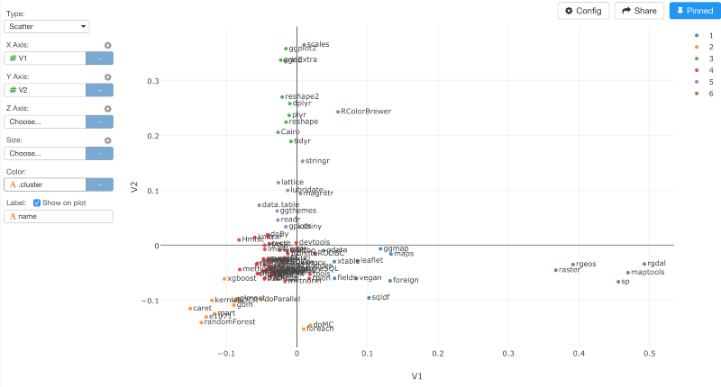

#なぜデータ分析においては、SQLではなくRを使うべきか？ Google BigQueryのGitHubのデータを使ってRの
パッケージをクラスタリングする

A few weeks ago, Google announced that it has made a full snapshot of the contents of more than 2.8 million open source Github repositories publicly available. It contains 2 billion different file paths and the content of the latest revision for 163 million source files. The total data is 3TB+. Wow, that sounds crazy, I thought.

There are a few folks already started analyzing the data. For example, Francesc has analyzed Go language codes data to find the most popular Go package names.
So I thought maybe we at Exploratory team should also try analyzing the data. But if we do, of course we are more interested in knowing more about our most favorite language of the world — R. The recent release of Exploratory Desktop has added Google BigQuery data import with ‘bigrquery’ package out of the box, so we should be able to quickly start this.

###Strategy for Data Analysis

Because Exploratory is really about R and dplyr, our strategy is to not have Google BigQuery to do everything. Rather, we use it to do what it is good at, which is to query and extract data from the database. And we use dplyr to take care of the data wrangling, and use R to do advanced analysis with advanced algorithm. With this strategy, we should be able to do beyond what could be done with just SQL query, in a quick and more efficient way.


By the way, dplyr is the most rapidly growing and widely adopted R package that provides a super fast data wrangling capability with a set of grammar based functions.


###Goal

The question we had was, “Can we get to know the similarities of R packages by extracting all the package names from all the R script files?” Our assumption was, if the two packages were used together in many of the same files they should be considered as similar, or at least we could say they tended to be used in similar tasks.

The result turned out to be very interesting and not far from our intuition. If you are interested in seeing the result now, here is an interactive chart that shows you the multiple clusters of top 100 most popular R packages. You can use mouse to drag any area you want to zoom in and double click to zoom out.

https://exploratory.io/viz/kanaugust/9ae918f23b3f?cb=1470006301029


Now, I’m going to walk you through how we did to find the similarities among the R packages.


##Google BigQuery Setup

Before starting to work with Google BigQuery, you need to create a Project and a Data Set first. I’ve written a quick instruction for this if you are not familiar with Google BigQuery.

Google BigQueryについて詳しくない方は、[こちら](
)の方で、Google BigQueryの設定について詳しく解説しているので、よかったらご覧ください。


Also, be careful for querying against this Github data. One of the data I’m going to use below has about 1.5 TB. Google BigQuery would charge bills by amount of the data it processed, not by the result of the query. If you want to play around by running various queries I’d recommend you use the following sampled data Google BigQuery team created first.

github_repos.sample_files
github_repos.sample_contents

These are much smaller (less than 23GB), compared to the original data I’m going to demonstrate below, hence you won’t get charged for a while until it hits the monthly free terabyte.

##Extract Data for R Files

In order to access to Google BigQuery from Exploratory Desktop, you can open Data Import dialog by selecting ‘Google BigQuery’ under ‘Import Remote Data’ menu. This will open a web browser UI asking to authorize Exploratory to access data on your behalf. Once the authorization is done, go back to the Data Import dialog UI.

We are interested in the following two data tables.

github_repos.files
github_repos.contents

These are under a public project ‘bigquery-public-data’ therefore you don’t see these tables in the left hand side tree.

‘github_repos.files’ contains information about the files, so you can find the file path, file id, and repository name that each file belong to.
‘github_repos.contents’ contains the contents of all the files. And the data size of these tables are huge, especially github_repos.contents is 1.57TB, and again, you need to be cautious here. Google BigQuery charges based on the data it processed, not the result. This means, if you query against 1.57TB of data then it will quickly run out of your monthly free quota. So you want to create a ‘Table’ under your Data Set in Google BigQuery and store snapshot of the data so that you won’t need to query against the same souce data again and again. And that is what I’m going to do here.

First, I run the query below.

```
SELECT *
FROM [bigquery-public-data:github_repos.files]
WHERE lower(RIGHT(path, 2)) = '.r'
```

This query is looking at all the file names and filter only the files whose names end with ‘.r’ or ‘.R’

After hitting ‘Run’ button or Cmd+Enter, you will see the result in Preview table. Also, you can find how much of the data was processed. In this case, it is 291.56GB. But the result is only 49.53MB after filtering only R related files.


I can hit ‘Save As Table’ button to save this result as a Table in Google BigQuery.


I can click ‘Refresh’ icon to get the newly created table showing up at the left hand side if the new data set doesn’t show up automatically.


The next step is to get all the file contents for these R files. I can run the following SQL.

```
select *
from [bigquery-public-data:github_repos.contents]
where id IN (select id from [bigquery-github-1383:Github.r_files_snapshot]
```

Note that I’m using the table ‘r_files_snapshot’ I just created above in ‘where’ clause to filter only the R script files.


This time, it queried against 1.57TB! That’s huge! The performance was pretty fast for this amount of data. But, I don’t want to get charged for this amount of the data every time I run the query. So I save this as a Table again.


And I need to update the SQL to make sure it won’t query against the source data again.

```
select *
from [bigquery-github-1383:Github.r_files_contents]
```

To make it a bit easier to construct the query you can click on the table names in the left hand side tree to copy and paste the full path of the table including the project name and the data set name.


After hitting Run button you can see the processed data size is now 761.8MB, which is the same as the returned data size.


At this point, the data size is not that big so I can quickly import it into R by clicking on Import button. Once the import is done, we have the data showing up under Summary View.


By moving the mouse over ‘content’ column I can see a quick view of the file content.


##Data Wrangling with dplyr

Let’s start wrangling with the data with dplyr.

###Remove NA

I can see there are some NA values for ‘content’ column.


I can remove this by selecting ‘Drop NA’ menu from the column header dropdown.


This will build a dplyr — A grammar of Data Wrangling — command with R function like below.

```
filter(!is.na(content))
```

‘is.na’ function evaluates if a given value is NA or not, and ‘!’ (exclamation mark) reverses the effect of the function after. So this command is going to keep only the rows that are not NA for ‘content’ column.


###Extract R package loading functions

In R world, you can use several different functions like the ones listed below to load R packages in the working environment.

- library
- require
- loadNamespace
- requireNamespace

So, I want to parse all the files contents and extract only the text including these functions.
First, I can select ‘Extract Text’ from ‘content’ column header.


This will generate a command like below.

```
mutate(content_new = str_extract(content, ""))
```

‘mutate’ command create a new column with the result of the expression you write inside. In this case, ‘content_new’ is the newly created column name. I can override the column name to be ‘lib_content’ and type something like below for the pattern matching text inside the double quotes.

```
mutate(lib_content = str_extract_all(content, "(library\\([^\\(]+\\)|loadNamespace\\([^\\(]+\\)|require\\([^\\(]+\\)|requireNamespace\\([^\\(]+\\))"))
```

If you are puzzeld by this regular expression text, no worry, you are not alone. I’m not big fun of the regular expression either. Let’s take a step by step.

First, those double back slashes are there to escape the reserved characters. In this case, the opening and closing brackets, ‘(‘ and ‘)’ , need to be escaped. And the vertical line means ‘OR’ condition. So without the escaping and if we just focus on the 1st entry in the multiple OR conditions, it would look something like this.

```
library([^(]+)
```

‘^’ (caret) symbol means ‘Not’, hence ‘[^(]’ means any character that is not the opening bracket ‘(‘. And ‘+’ symbol means one or more.
When all combined, I’m trying to find ‘library()’ text and any multiple characters other than the opening bracket ‘(‘ inside the ‘library()’ function.
So the following text would be matched and extracted.

- library(ggplot2)
- library(rpart.plot)
- library(QZ, quiet = TRUE)

After you run the command above, you will see a list of the ‘package loading functions’ for each file.


Note that the data type for this new column ‘lib_content’ is ‘list’, which means we can bring each entry in the list to its own row easily by using ‘unnest’ command. I can construct the command by selecting ‘Unnest’ from the ‘lib_content’ column dropdown menu like below.


```
unnest(lib_content, .drop=FALSE)
```

After running the command I can see each function is presented in its own row.


Now, I want to get the package names inside of those loading functions. For example, if we have a function like below,

```
library(dplyr)
```

we want to extract only ‘dplyr’.

There are many ways to do this, but here, I’m using ‘str_split’ function from ‘stringr’ package and using ‘(‘ (opening bracket), ‘,’ (comma), and ‘(‘ (closing bracket) to separate the text first. Again, the vertical bar symbol means OR condition.

```
mutate(split_text=str_split(lib_content, pattern="(\\(|,|\\))"))
```

After running the command above, I can use ‘list_extract’ function from ‘exploratory’ package and extract the 2nd entry in the list.

```
mutate(lib_name=list_extract(split_text, 2))
```

Here is the result.


‘split_text’ column is the result of the ‘str_split’ operation above, and ‘lib_name’ column is the result of the ‘list_extract’ operation.

As you can see, some package names contain single or double quotes, so I can remove them with the command below.

```
mutate(lib_name=str_replace_all(lib_name, '"', ''), lib_name=str_replace_all(lib_name, "'", ''))
```

Have I told you that you can use a newly created column in a same ‘mutate’ command right away? In the above example, I stripped out the double quote and overrode the existing ‘lib_name’ column first, then I stripped out the single quote and overrode the ‘lib_name’ column again.

##List up Top 100 packages

Now, when we go to Summary View we can quickly see ‘ggplot2’, ‘dplyr’, and ‘tidyr’, ‘shiny’, ‘reshape’ are the top 5 most referenced R packages.


We also can see 5,860 unique values for ‘lib_name’ column, this means there are 5,860 R packages in this data! Yes, R has so many data science packages. There are more than 9,000 packages officially certified at CRAN, and there are probably even more packages that exist only at Github and other places.
Anyway, instead of clustering 5,860 packages, I’m more interested in knowing about the top 100 most popular packages. To do this, first I can create a branch where I will filter the top 100 packages.


Note that the branch is essentially a data frame. In the newly created branch I can run a set of commands listed below to:

- remove the empty data
- count the number of the entries per each R package
- filter only the top 100 packages based on the number of the entries

```
filter(!is_empty(lib_name))
count(lib_name)
top_n(100, n)
```


Note that ‘count’ command automatically creates a column called ’n’ for counting the entries. (More detail for ‘count’ command is here.)

I can visualize this data quickly and see the most popular packages.


Now we have a list of the top 100 packages, which I can use to filter the main data in the next step. Again, the branch is essentially a data frame so I can use this ‘package_list’ as a data frame in the next step.


##Filter only Top 100 most used packages

I can go back to ‘Main’ branch where we started originally and we can use ‘semi_join’ command to filter the data by using the data from ‘package_list’. ‘semi_join’ is one of the dplyr’s ‘join’ family commands, and it filters the current data by keeping only the rows from the current data frame that have matching entries in the target data frame. Since the current data frame and the target data frame of ‘package_list’ share the same ‘lib_name’ column, we can set the ‘lib_name’ column to ‘by’ argument to join like below.

```
semi_join(package_list, by="lib_name")
```

After running the command, you can see only 100 unique values for ‘lib_name’ column in Summary view.


Now with this data we can start clustering the packages based on the information of how the packages are used together in same files. But before doing so, first I want to make the file id and the package name (lib_name) pairs to be unique. I can do this quickly by running ‘count’ command to aggregate.


Now we can calculate the distances among the packages. But as you notice, the data is now in Group mode.


So I need to disable it by using ‘ungroup’ function before getting into the distance calculation in the next step, otherwise the distance calculation will be done for each group, which we don’t want.


##Calculate the distances among R packages

Calculating the distances among the R packages based on how often they appear together in same files is actually simple. I can use ‘do_dist.kv’ function from ‘exploratory’ package, which takes Subject, Key, and Value columns as its arguments. In this case, ‘lib_name’ column the package name is Subject, ‘id’ column for the file id is Key, and ’n’ column for the count is Value.

```
do_dist.kv(lib_name,id,n)
```

After running the command, I get every combination of the R package pairs scored with the distance values.


Now, when I try to visualize this data with Heatmap chart I get something like this.


The values are distances so the higher the numbers are, the more distant they are from one another. This chart shows that some packages are super far from every other packages, which is kind of weird.
If I go back to the previous step before calculating the distances, I can see some packages like ‘ggplot2’, ‘dplyr’, etc, are appearing a lot. With this type of skewed data, algorithms like ‘euclidean’ distance, which is the default for ‘do_dist.kv’ function, tend to produce the result like above.


So, instead of ‘euclidean’, I can use ‘binary’ as the method, which would scale the count of the packages and make the appearance of the packages per file itself is more important than how many times they appear.


```
do_dist.kv(lib_name,id,n, method=”binary”)
```

After running the command, Heatmap chart is now showing something more balanced.


Based on this, we can apply Multi Dimensional Scaling algorithm to scale the distance values into two dimensional space. Think of this as, converting the distance values among cities (San Francisco, Los Angels, etc.) into longitude and latitude values so that you can locate the cities on a map, which is a two dimensional space, for example.
I can use ‘do_cmdscale’ command from ‘exploratory’ package like below.

```
do_cmdscale(pair.name.1,pair.name.2,dist.value)
```


I can visualize this data with Scatterplot chart. We can see the overall similarity of the packages better here.


I can also cluster this data automatically, instead of visually trying to cluster with our eyes, by using ‘K-means’ algorithm like below.

```
build_kmeans.cols(V1,V2, centers=6, augment=TRUE)
```

Note that I’m setting 6 as the number of the clusters to build and setting TRUE for ‘augment’ so that it will produce the result with the cluster information right away.
Once the command is run, I can assign the cluster ID to Color.



I can zoom into only the cluster 3 and 5 by selecting them in the legend at right hand side. Here, we can see ‘tidyverse’ packages like dplyr, tidyr, stringr, lubridate, reshape, readr, ggplot2, etc, together.


If we focus on the cluster 2 we can see many Machine Learning related packages.


If we focus on the cluster 4, we can see some packages that helps acquiring data from outside and importing into R, such as jsonlite, RCurl, httr, RPostgreSQL, RMySQL, xlsx, etc, together.


##BigQuery+R = Data Science for Big Data

As you remember, our strategy was to use Google BigQuery for getting the subset of the data we were interested in, use dplyr for wrangling with the data iteratively and quickly, and use R for employing advanced algorithms to do advanced analysis. And that worked pretty well this time. Thanks to Google BigQuery’s fast query performance against Big Data, we can quickly test out a few queries and filter to the data size that can be fit comfortably into a memory on our decent PCs. Thanks to dplyr’s fast data wrangling capability, we can quickly understand the data and prepare the data for feeding into the statistical and machine learning algorithms. And thanks to R’s strong statistical packages we can quickly employ various types of algorithms to find interesting insights from the data that could not have been discovered otherwise.

Lastly, thanks to Hide Kojima, Yosuke Yasuda, and Hideaki Hayashi for experimenting many analysis on this data and coming up with interesting insights!

If you are interested in trying this out, download the latest Exploratory Desktop from our web page.


##Reproduce it in R

```
# Update to your libPaths.
.libPaths("/Users/kannishida/.exploratory/R/3.3")

# Load required packages.
library(stringr)
library(dplyr)
library(exploratory)


# Data Analysis Steps
exploratory::executeGoogleBigQuery('bigquery-github-1383','select *\nfrom [bigquery-github-1383:Github.r_files_contents] contents','bigquery-github-1383:Github.exploratory_bq_preview_table',10000,Inf,'WRITE_TRUNCATE','8c31ac9fcce3') %>%
  exploratory::clean_data_frame() %>%
  filter(!is.na(content)) %>%
  mutate(lib_content = str_extract_all(content, pattern="(library\\([^\\(]+\\)|loadNamespace\\([^\\(]+\\)|require\\([^\\(]+\\)|requireNamespace\\([^\\(]+\\))")) %>%
  select(-content) %>%
  unnest(lib_content, .drop=FALSE) %>%
  mutate(split_text=str_split(lib_content, pattern="(\\(|,|\\))")) %>%
  mutate(lib_name=list_extract(split_text, 2)) %>%
  mutate(lib_name=str_replace_all(lib_name, '"', '')) %>%
  mutate(lib_name=str_replace_all(lib_name, "'", '')) %>%
  semi_join(package_list, by="lib_name") %>%
  select(id, lib_name) %>%
  count(id,lib_name) %>%
  ungroup() %>%
  do_dist.kv(lib_name,id,n, method="binary") %>%
  do_cmdscale(pair.name.1,pair.name.2,dist.value) %>%
  build_kmeans.cols(V1,V2, centers=9, augment=TRUE)
```

The exploratory package is not on CRAN, but on Github, so you want to install it with the devtools package from Github like below.

```
install.packages("devtools")
devtools::install_github("exploratory-io/exploratory_func")
library(exploratory)
```

If you have installed Exploratory Desktop already, then the above script is setting the library path to the Exploratory’s package installation location so that you don’t need to install the dependent packages including ‘exploratory’ separately. It will just work.

##興味を持っていただいた方、実際に触ってみたい方へ

Exploratoryは[こちら](https://exploratory.io/
)からβ版の登録ができます。こちらがinviteを完了すると、ダウンロードできるようになります。


ExploratoryのTwitterアカウントは、[こちら](https://twitter.com/ExploratoryData
)です。

Exploratoryの日本ユーザー向けの[Facebookグループ](https://www.facebook.com/groups/1087437647994959/members/
)を作ったのでよろしかったらどうぞ

分析してほしいデータがある方や、データ分析のご依頼はhidetaka.koh@gmail.comまでどうぞ