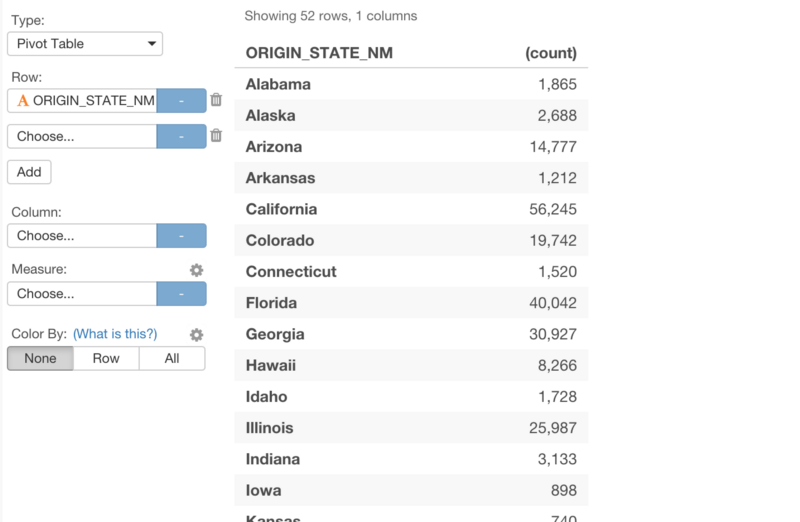

#データ分析においては、なぜExcelではなくExploratoryを使うべきか？　データのサマライズが簡単にできる超便利なPivotテーブルを爆速で説明する

Pivotテーブルをご存知ですか？ Pivot Tableは、チャート形式ではなく、テーブル形式、データのサマライズが簡単にできます。Pivotテーブルのために、Excelを使う人も多いですよね。そういうわけで、Exploratoryは、Pivotテーブルを実装しました。

Pivotテーブルは、簡単にデータをサマライズできるだけでなく、カラーを使って、外れ値やパターンをを瞬時に見つけることもできます。Exploratoryでは、Excelや他のBIツールより簡単にPivotテーブルを扱うことができます。今日は、Exploraotryを使って、そんなPivotテーブルの使い方について、簡単に見ていきたいと思います。

- 1.Pivotテーブルの基本的な使い方
- 2.色を使ったPivotテーブル
- 3.日付のデータを使った、Pivotテーブル
- 4.Pivotテーブルを共有する

###データを準備する

今回は、フライトの遅れのデータを使いたいと思います。Import Exploratory Dataから簡単にデータをインポートできるように、[こちら](https://exploratory.io/viz/kanaugust/eccdbf5bb7d1?cb=1471380653622)に、EDF（Exploratoryのデータフォーマット）があります。それぞれのページでは、データがどのように加工されたり計算されたかの詳細を、Dataタブ、もしくは、R Scriptタブの中で見ることができます。

もし、元のデータが欲しい場合は、[こちら](https://www.dropbox.com/s/x2g3qgo28syxhcl/airline_delay_2016_01.csv?dl=0)からダウンロードできます。

##1. Pivotテーブルの基本的な使い方

Pivotテーブルは、VizタブのVizタイプの下のところにあります。最近、Chart viewからViz viewに名前を変えました。

###Row(行)に列をアサインする

列を行にアサインすることができます。それぞれの行の列の値に対して、行の数をアサインします。value。この場合だと、アメリカの州の名前ですね。

###列をValueにアサインする

ARR_DELAYのような列をValueにアサインし、aggregation関数を適切な関数に変更することもできます。

###複数の列を行にアサインする

複数の列をRow(行)にアサインすることもできます。

###ある列をColumn(列)にアサインする

また、ある列をColumn(列)にアサインすることもできます。

##2. 色を使ったPivotテーブル

データの傾向がもっと見つけやすくなるように、Pivotテーブルで色を使うこともできます。これには、２つのやり方があります。

###1.行で色を区切る

まず１つは、それぞれの行に対して、値を正規化して、色をアサインすることです。

###2.すべての行で色を区切る

2つ目のやり方は、すべての行と列で値を正規化して、色をアサインすることです。

そして、いつでも、Color設定のポップアップから、カラーパレットを変更することもできます。

Reverse Palette Orderを使って、色の向きを逆にすることもできます。例えば、大きい順ではんあく、小さい順に暗い色をアサインすることもできます。

##3. 日付のデータを使ったPivotテーブル

Date / Timeデータ・タイプをColumn(列）にアサインしたとき、もう少し面白いことができます。BarチャートやLineチャートなどと同じように、ここでも、Date / Time のaggregationのレベルを設定することができます。

Dateデータ・タイプのFL_DATEをアサインしたときに、デフォルトでは、aggregationのレベルは、Yearに設定されています。

これを、Weekに変更することもできます。

こうして見てみると、カレンダーみたいになりましたね笑

##4. Pivotテーブルをシェアする

他のビジュアライゼーションのタイプと同じように、再現可能なデータ分析のステップといっしょにこれをシェアすることができます。

これを見た人は、Pivotテーブルだけでなく、どうやってこのデータを作ったかというところまで見ることができます。また、これをダウンロードすると、簡単に、同僚といっしょにコラボレートすることができます。

最後に、Twitter, Facebook, SlackのようなSNSやコミュニケーションツールで、シェアするだけでなく、ブログやWebサイトにPivotテーブルを埋め込むこともできます。

##興味を持っていただいた方、実際に触ってみたい方へ

Exploratoryは[こちら](https://exploratory.io/
)からβ版の登録ができます。こちらがinviteを完了すると、ダウンロードできるようになります。

ExploratoryのTwitterアカウントは、[こちら](https://twitter.com/ExploratoryData
)です。

Exploratoryの日本ユーザー向けの[Facebookグループ](https://www.facebook.com/groups/1087437647994959/members/
)を作ったのでよろしかったらどうぞ

分析してほしいデータがある方や、データ分析のご依頼はhidetaka.koh@gmail.comまでどうぞ