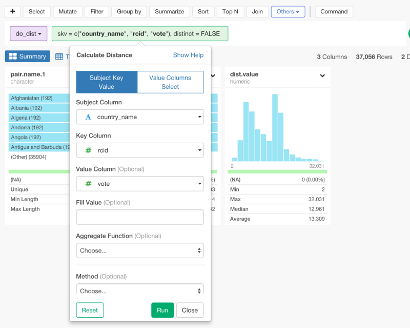
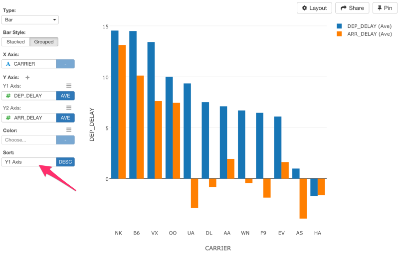

#Introduction to Exploratory Desktop v2.0

5月にExploratoryをローンチしてから、2600人もの人が登録してくれました。そのうち1700人のアカウントをアクティベートしています。そして、500人が、毎週継続的に使ってくれています。Exploratoryに対するユーザの熱狂的な反応を見ることはとてもエキサイティングな体験です。なぜなら、この反応こそが、私たちが、平日も夜も、週末も働き続けている唯一の理由だからです。だから、まず、あなたの時間を使って、ベータ版にトライして、継続的で親切なサポートをしてくれたことに対して、感謝の意を示させて下さい。ありがとうございます。

But, at the same time, it is also preventing many people from getting into this wonderful R and dplyr world. Unless you are not familiar with R you get confused on where to start.

数ヶ月に及ぶユーザからのフィードバックを通して、私たちはたくさんのことを学ぶことができました。Exploratoryにとって最も大きかった学びの1つは、コマンドラインインターフェイスについてです。私たちは、これをとても気に入っています。もちろん、熱狂的なユーザのうちの何割かもすごく気に入っています。Rとdplyrのフレームワークを利用して、データを対話的に、柔軟に、素早く分析することができるからです。しかし、同時に、ユーザが元々、Rに馴染みのない限り、コマンドラインインターフェイスは、ユーザーをRとdplyrの素晴らしい世界から遠ざけてしまうこともわかりました。

Now, our realization is, there are a few amazing things R and dplyr provide.

Rとdplyrの素晴らしい点は次の3つです。

- 1. データ分析をしていく上での包括的な関数を備えている点
- 2. Rとdplyrの文法に基づいたデータ分析が可能な点
- 3. ステップバイステップで、データ分析をすることが、他の人にとってデータを理解しやすく、データの再現性が高くなる点

しかし、少し前までは、これらの恩恵を受けることができたのは、コマンドラインインターフェイスに慣れている人や拒否反応がない人だけだったのです。そこで、Exploratoryは、もっと私たちのユーザが、コマンドラインインターフェイスに馴染みがなくても、気軽に始めることができて、これらの恩恵を受けて、しだいにRやdplyrに慣れていける方法があるのではないかと考えました。

数週間のハードワークを経て、私たちは、既存のユーザの期待を裏切らないで、この問題を解決することを助けることができるような機能を実装しました。私たちは、これをUIモードと呼んでいます。UIモードでは、dplyrやtidyrやその他のどのコマンドでもシンプルなUIダイアログが表示されます。だから、Rのバックグラウンドがないユーザでさえも、Rの恩恵を受けて自分自身のデータに対して取り組んでいくことができます。私たちは、これをExploratory Desktop v2.0としてリリースしました。今日は、その概要についてこれから説明していきたいと思います。

##UI for dplyr

データをインポートした後に、一番最初に気づくのは、一番上にボタンがいくつかあることだと思います。これらは、データ分析をしていくための、dplyrの代表的なコマンドです。もしあなたが、SQLに馴染みがあれば、気にいることは間違いありません。

###Select

これは、selectコマンドのUIモードです。指定の列だけを選んだり、捨てることができるだけでなく、便利な関数といっしょに使うこともできます。

###Filter

これは、filterコマンドのUIモードです。データをフィルタリングすることができます。ドロップダウンから値を選ぶことができます。

###Join

これは、joinコマンドのUIモードです。数あるジョインコマンドのうちどれか１つとターゲットデータフレームを選んで、データをジョインさせることができます。Excelでいう、lookupコマンドのようなものです。

###Other Data Wrangling, Analytics, Text Mining Operations

もちろん、上で示した以外にもたくさんのコマンドを使うことができます。Othersボタンを押すと、それらを確認することができます。

ここには、tidyrやdplyrに関連したたくさんのデータ分析や統計的な分析用や機械学習用やテキスト分析のためのコマンドを見つけることができます。

例えば、これは、KeyとValue列に基いてcountry namesのようなsubject　valuesの中の距離を計算することができるdo_distコマンドの例です。

###ドラッグ・アンド・ドロップ機能

直感的にドラッグ・アンド・ドロップするだけで、トークンの中の順番を変えることもできます。これは、あなたが、列のどれかを先に表示させたい時や、先に計算する必要があるときや、先に列をグルーピングする必要があるときなどに便利です。

##Command Mode

この新しいUIモードは素晴らしいですが、慣れてくると、コマンドラインインターフェイスのほうがさらに早く、柔軟に、データを分析していくことができるとわかっています。なので、私たちは、今までと同様に、コマンドラインインターフェイスもサポートしています。2つの方法があります。

1つは、上にあるCommandボタンを単にクリックするだけです。

すると、昔と同様に、自分のお気に入りのコマンドや関数をダイレクトにタイプしていくことができます。

次に2つ目は、まずUIモードではじめます。そして、コマンドラインインターフェイスにチェンジできます。どの紫色のコマンドボックスも、この下矢印のアイコンを持っています。クリックして‘Convert to command text’を選ぶと、コマンドラインインターフェイスに変えることができます。

これで、自分のやりたいようにカスタマイズしていくことができるように、ステップをコマンドラインに変えていくことが出来ます。

##Function List

これだけはありません。バージョン1.0からこのFunction Listダイアログ機能を紹介していましたが、ほとんどのユーザがこれに気づいていませんでした。しかし、これは私たちにとっては、バージョン1.0の中で、とても大きい機能だったのです笑。しかし、UIモードを使えば、だれでもすぐにこのボタンに、気づくことができます。Function Listダイアログを開くと、MutateやSumarizeやFilterのダイアログを見ることができます。関数を見つけるのが簡単なだけでなく、素早く関数を見つけることができるようにタイプサーチをすることもできます。それぞれの関数をクリックすると使い方の詳細を見ることができます。ダブルクリックすると、直接、Expressionのテキストエリアに挿入することができます。

さらに便利なのが、Show Docのリンクを押すと関数のリファレンスを開くことができます。ただし、このときは、マウスの位置が、調べたい関数の内側になっていることを確認していください。これで新機能のUIモードについては以上です。しかし、2.0から追加された大きい機能がまだ2つほどあります。

##Chart — Multiple Columns for Y-Axis

Y軸同士を比較したり、Y軸同士に相関関係があるのかどうかを確認するために、Y軸に複数列をアサインできる機能を実装しました。それぞれの列は、aggregate関数やwindow関数のコンフィグレーションを持っているので、これで、とても簡単にデータを比較することができます。

##Sorting (Arrange)

複数の列をY軸にアサインしたときは、バーの順番をそれぞれやりたいようにソートすることができます。今回のケースだとソートするのをY軸かX軸を選べるだけではなく、昇順か降順かまで設定することができます。

##Private Share

もし、分析を通して、何か興味深いことを発見したら、分析をより良いものにしていくために、誰かとシェアしたりコラボレートしたくありませんか？　バージョン1.0でさえ、シェアやコラボレートはできましたが、パブリックでしかできませんでした。だから、私たちは、プライベートシェア機能を実装しました。プライベートシェアでは、チャートやデータを限定でシェアすることができます。シェアされたチャートやデータにアクセスするには、ユーザによってインバイトされる必要があります。

これが、パーソナルオプションの一部としてのプレミアム機能の一部です。クレジットカードなしで、30日間無料のお試し期間があります。

##最後に

私たちは、地球にいる誰もが、データを分析することやデータを理解することを特定の誰かにアウトソースする必要なしにできるものだと考えています。自分のやりたいように、自分のデータを所有したり、理解することは、データが溢れているこの時代において、人間の基本的な能力になるべきものだと考えています。例えば、あなたの携帯を使えば、あなたの歩数や動きや位置などのデータを見ることができます。

多くの人は、質問に答えたり、分析していくために、データに取り組むことを全くしないで、データを分析できる者とできなざる者の両者に線を引いてしまっているのです。

今日においては、データを分析していくことは、とてもハードで、高度な専門性を要すると捉えられています。

これは、私たちが作りたい世界ではありません。私たちは、データをインタラクティブに、自分自身で分析していくことができるツールを提供することによって、この問題を解決したいと思っています。

Rは、私たちがデータサイエンティストという名を聞いて連想するような人にとって、分析のためのベストな土台を作りました。Rの中のdplyrのようなツールは、プログラムを書けるような人たちにとって、とても協力で、簡単です。だから、Exploratoryは、これをプログラムを書けない人たちまでにもアクセス可能なものとして、広げたいと思っています。

私たちは、これが長い道のりになることがわかっています。しかし、私たちは、私たちのこのゴールへの第二段階に入ることができたと感じています。あなたが、私たちのExploratoryバージョン2.0を気に入ってくれることを心から願っています。

##興味を持っていただいた方、実際に触ってみたい方へ

Exploratoryは[こちら](https://exploratory.io/
)からβ版の登録ができます。こちらがinviteを完了すると、ダウンロードできるようになります。

ExploratoryのTwitterアカウントは、[こちら](https://twitter.com/ExploratoryData
)です。

Exploratoryの日本ユーザー向けの[Facebookグループ](https://www.facebook.com/groups/1087437647994959/members/
)を作ったのでよろしかったらどうぞ

分析してほしいデータがある方や、データ分析のご依頼はhidetaka.koh@gmail.comまでどうぞ