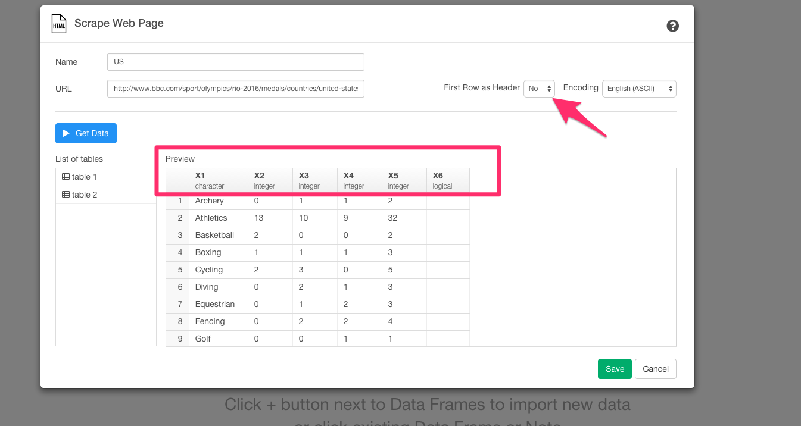

#スクレイピングしてきたデータを使って、2016年リオ五輪で、トップ10の国が各スポーツごとに獲得したメダル数をビジュアライズまでしてみた。

##2016年リオ五輪のデータを簡単にスクレイピングする

実は、このデータは、2016年リオ五輪参加国のスポーツごとのメダル獲得数のデータを表しています。ところが、こうやってウェブページにに埋まっていると、わざわざスクレイプするスクリプトを書いて、その後取ってきたデータを加工して分析できるようにするという過程が、結構めんどくさかったりしますよね。今、Rのフロントエンドということで話題になっているExploratoryだと、データ分析だけでなく、こういったウェブ・ページからデータをスクレイピングしてくるのがものすごく簡単でシンプル、さらにはその後のデータの加工もデータ分析しながら簡単に出来るといことなので、早速やってみました。最終的には、2016年リオ五輪で、トップ10の国が各スポーツごとに獲得したメダル数をビジュアライズまでしてみたいと思います。

Data Framesの横の＋アイコンをクリックして、import Remote Dateを選んでください。

Webからデータをとってきたいので、Scrape Web Pageを選びます。

さっきのページのリンクを貼ります。

そして、Get Dataボタンを押します。すると、リンクを貼るだけでデータをスクレイピングしてこれました。

でも、あれ？　アーチェリーのメダル獲得数が列になってしまっていますね。First Row as Headerの設定がYesになっているので、Noに変えて試してみましょう。

これでうまくいきましたね。これは、アメリカのデータだけですが、全く同じことをトップ10ランキングの他の国に対してもしていきましょう。

ここでは、スクレイピングでとってきたWEB上のデータですけど、GitHub、Google Analytics、Google Spread sheet、Mongo DB、MySQL、JSON REST APIなどのたくさんのデータベースから本当に簡単にデータをインポートしてきて分析することも可能です。

##bind_rows関数を使って、トップ10の国のデータをひとつのデータフレームにまとめる

いまのままだと、トップ１０の国のデータが別々のデータフレームに散らばっていますね。 なので、bind_rows関数を使ってUSのデータフレームにすべてのデータをまとめていきましょう。

`bind_rows("China"=China,"Germany"=Germany, "Russia"=Russia, "Japan"=Japan, "France"=France, "Italy"=Italy, "Netherlands"=Netherlands, "Australia"=Australia, "United_Kingdom"=UK, .id="country_name")`

Runボタンを押します。

列数と行数が増えていますね。これで、散らばっていたデータをUSのデータフレームにまとめることができました。次に、country_name列の行の値がNA値のときは、値にUSが入るようにしましょう。

`mutate(country_name = na_if(country_name,""), country_name=coalesce(country_name,"US"))`

##行の名前を変更する

列の名前が、X1、X2、X3、X4、X5になっていてわかりにくいので、それぞれが、スポーツ名、金メダル、銀メダル、銅メダル数、合計数を表わしていることがわかりやすいように、Renameコマンドを使って名前を変更していきましょう。

まず、最初にX1列のヘッダーからRenameを選びます。

すると、以下のコマンドを自動生成します。

`rename(new_column = X1)`

これに下記のように、書き加えていきましょう。

`rename(sports = X1, Gold = X2, Silver = X3, Bronze = X4, Total = X5 )`

##gatherを駆使して、それぞれのメダルの獲得数を計算する

今は、金メダル、銀メダル、銅メダルの獲得数がちがう列にばらばらになっていますね。目的である、2016年リオ五輪で、トップ10の国が各スポーツごとに獲得したメダル数をビジュアライズするには、メダルの色を表すColorとそれぞれのメダルの獲得数を表すtotal_per_colorという2つの列に金メダル、銀メダル、銅メダルの獲得数をまとめる必要があります。そういう場合は、gatherコマンドが便利です。gatherコマンドは、複数の列を、１つの列にすることができます。説明だけだと、ピンとこないかもしれませんね。データを整形しながら、具体的に説明していくので、見ていってください。

`gather(color, total_per_color, Gold, Silver, Bronze, na.rm=TRUE)`

##2016年リオ五輪で、トップ10の国が各スポーツごとに獲得したメダル数を計算する

##recode関数を使って、メダルポイントをつける

##countrycode関数を使って、一瞬で国から大陸名を計算する

##興味を持っていただいた方、実際に触ってみたい方へ

Exploratoryは[こちら](https://exploratory.io/
)からβ版の登録ができます。こちらがinviteを完了すると、ダウンロードできるようになります。

ExploratoryのTwitterアカウントは、[こちら](https://twitter.com/ExploratoryData
)です。

Exploratoryの日本ユーザー向けの[Facebookグループ](https://www.facebook.com/groups/1087437647994959/members/
)を作ったのでよろしかったらどうぞ

分析してほしいデータがある方や、データ分析のご依頼はhidetaka.koh@gmail.comまでどうぞ

