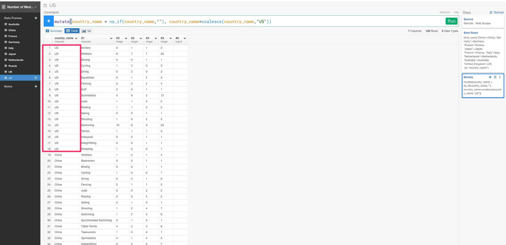

#スクレイピングしてきたデータを使って、2016年リオ五輪で、トップ10の国が各スポーツごとに獲得したメダル数をビジュアライズまでしてみた。

##2016年リオ五輪のデータを簡単にスクレイピングする

実は、このデータは、2016年リオ五輪参加国のスポーツごとのメダル獲得数のデータを表しています。ところが、こうやってウェブページにに埋まっていると、わざわざスクレイプするスクリプトを書いて、その後取ってきたデータを加工して分析できるようにするという過程が、結構めんどくさかったりしますよね。今、Rのフロントエンドということで話題になっているExploratoryだと、データ分析だけでなく、こういったウェブ・ページからデータをスクレイピングしてくるのがものすごく簡単でシンプル、さらにはその後のデータの加工もデータ分析しながら簡単に出来るといことなので、早速やってみました。最終的には、2016年リオ五輪で、トップ10の国が各スポーツごとに獲得したメダル数をビジュアライズまでしてみたいと思います。

Data Framesの横の＋アイコンをクリックして、import Remote Dateを選んでください。

Webからデータをとってきたいので、Scrape Web Pageを選びます。

さっきのページのリンクを貼ります。

`https://exploratory.io/viz/Hidetaka-Ko/861f65f5d38e?cb=1471653914194`

そして、Get Dataボタンを押します。すると、リンクを貼るだけでデータをスクレイピングしてこれました。

でも、あれ？　アーチェリーのメダル獲得数が列になってしまっていますね。First Row as Headerの設定がYesになっているので、Noに変えて試してみましょう。

これでうまくいきましたね。これは、アメリカのデータだけですが、全く同じことをトップ10ランキングの他の国に対してもしていきましょう。

ここでは、スクレイピングでとってきたWEB上のデータですけど、GitHub、Google Analytics、Google Spread sheet、Mongo DB、MySQL、JSON REST APIなどのたくさんのデータベースから本当に簡単にデータをインポートしてきて分析することも可能です。

##bind_rows関数を使って、トップ10の国のデータをひとつのデータフレームにまとめる

いまのままだと、トップ１０の国のデータが別々のデータフレームに散らばっていますね。 なので、bind_rows関数を使ってUSのデータフレームにすべてのデータをまとめていきましょう。

`bind_rows(Australia,China,France, Germany, Italy, Japan, Netherlands, Russia, UK)`

カラム数や行数を見るとわかるように、ばらばらになっていたデータフレームを１つのデータフレームにまとめることができました。しかし、今のままだと、どの値がどの国を表しているのかがわかりませんね。なので、引数にcountry_nameを加えていきましょう。

`bind_rows("China"=China,"Germany"=Germany, "Russia"=Russia, "Japan"=Japan, "France"=France, "Italy"=Italy, "Netherlands"=Netherlands, "Australia"=Australia, "United_Kingdom"=UK, .id="country_name")`

Runボタンを押します。

次に、country_name列の行の値がNA値のときは、値にUSが入るようにしましょう。

`mutate(country_name = na_if(country_name,""), country_name=coalesce(country_name,"US"))`

##行の名前を変更する

列の名前が、X1、X2、X3、X4、X5になっていてわかりにくいので、それぞれが、スポーツ名、金メダル、銀メダル、銅メダル数、合計数を表わしていることがわかりやすいように、Renameコマンドを使って名前を変更していきましょう。

まず、最初にX1列のヘッダーからRenameを選びます。

すると、以下のコマンドを自動生成します。

`rename(new_column = X1)`

これに下記のように、書き加えていきましょう。

`rename(sports = X1, Gold = X2, Silver = X3, Bronze = X4, Total = X5 )`

##gatherを駆使して、それぞれのメダルの獲得数を計算する

今は、金メダル、銀メダル、銅メダルの獲得数がちがう列にばらばらになっていますね。目的である、2016年リオ五輪で、トップ10の国が各スポーツごとに獲得したメダル数をビジュアライズするには、金メダル、銀メダル、銅メダルの獲得数をまとめる必要があります。そういう場合は、gatherコマンドが便利です。

gatherコマンドは、複数の列を、１つの列にすることができます。第一引数と第二引数に新しく作りたい列名を入力し、第三引数で、新しい列に入れる値の列を選びます。

`gather(color, total_per_color, Gold, Silver, Bronze, na.rm=TRUE)`

この場合だと、メダルの色を表すColorとそれぞれのメダルの獲得数を表すtotal_per_colorという2つの列にGold, Silver, Bronzeのメダルの色の値を入れています。

##recode関数を使って、メダルポイントをつける

これで、メダルごとの獲得数がわかったので、トップ10の国が各スポーツごとに獲得したメダル数を計算することができます。ただし、今のままだと金メダルも、銀メダルも、銅メダルの獲得数も同じ扱いになってしまっています。より意味のある、正確なデータを知りたいのなら、メダルの価値を、金メダル＞銀メダル＞銅メダルとする必要があります。そういうときは、recode関数が便利です。recode関数を使うと、指定の値を、任意の値に置き換えることができます。ここでは、[NewYorkタイムズ](http://beijing2008.blogs.nytimes.com/2008/08/23/the-medal-rankings-which-country-leads-the-olympics/?_r=0)で提案されているように、金メダルに4、銀メダルに2、銅メダルに1を当てはめたいと思います。それを意味する列名をweightにします。

`mutate(weight = recode(color, "Gold"=4,"Silver"=2,"Bronze"=1))`

次に、メダルのweightにメダルごとの獲得数を掛けあわせて、メダルごとの合計得点数を意味するscore列を作りましょう。

`mutate(score = total_per_color*weight)`

##トップ10の国が各スポーツごとに獲得したメダル数を計算する

まず、国とスポーツの関係を見ていきたいわけなので、sports列とcountry_name列をグルーピングしましょう。

`group_by(sports, country_name)`

次に、summarizeコマンドとsum関数を使って、score列の合計数を計算しましょう。

`summarize(counts = sum(score))`

##countrycode関数を使って、一瞬で国から大陸名を計算する

また、countrycode関数を使うと、簡単に、国名からアジア、ヨーロッパ等といった大陸名を抽出することもできます。

`mutate(Continent = countrycode(country_name,origin="country.name",destination="continent"))`

##Scatterを使って、ビジュアライズする

データを直観的に理解するために、Vizタブを押して、ビジュアライズしてみましょう。チャートタイプは、Scatterを選び、X軸にsports,Y軸に、country_name,Size軸に、counts、Color軸にContinentを当てはめましょう。

これで、2016年リオ五輪で、トップ10の国が各スポーツごとに獲得したメダル数をビジュアライズすることができました。

##データとビジュアライズを誰でも再現可能な状態で、シェアする

このビジュアライズやそれまでのステップを誰かと共有したくありませんか？　そういう場合は、Shareボタンを押してみましょう。

タイトルなどを入力していきます。そして、矢印の場所をクリックしてShareボタンを押すと、データがどのように加工されたり計算されたかの詳細もシェアすることができます。

興味がありましたら、[こちら](https://exploratory.io/viz/Hidetaka-Ko/861f65f5d38e?cb=1471653914194)をクリックするとチャートがシェアされているページに飛びます。それぞれのページでは、データがどのように加工されたり計算されたかの詳細を、Dataタブ、もしくは、R Scriptタブの中で見ることができます。もしExploratory Desktopをすでにお持ちでしたら、Download ボタンを押して、チャートとデータをダウンロードしてインポートすることも簡単にできます。

##興味を持っていただいた方、実際に触ってみたい方へ

Exploratoryは[こちら](https://exploratory.io/
)からβ版の登録ができます。こちらがinviteを完了すると、ダウンロードできるようになります。

ExploratoryのTwitterアカウントは、[こちら](https://twitter.com/ExploratoryData
)です。

Exploratoryの日本ユーザー向けの[Facebookグループ](https://www.facebook.com/groups/1087437647994959/members/
)を作ったのでよろしかったらどうぞ

分析してほしいデータがある方や、データ分析のご依頼はhidetaka.koh@gmail.comまでどうぞ

