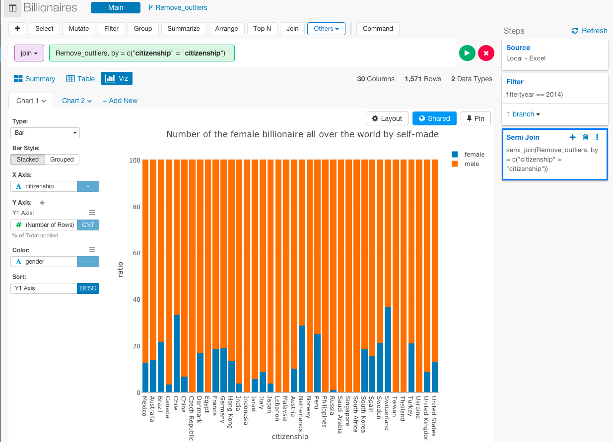
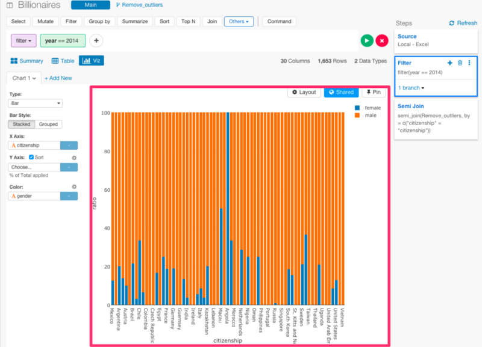
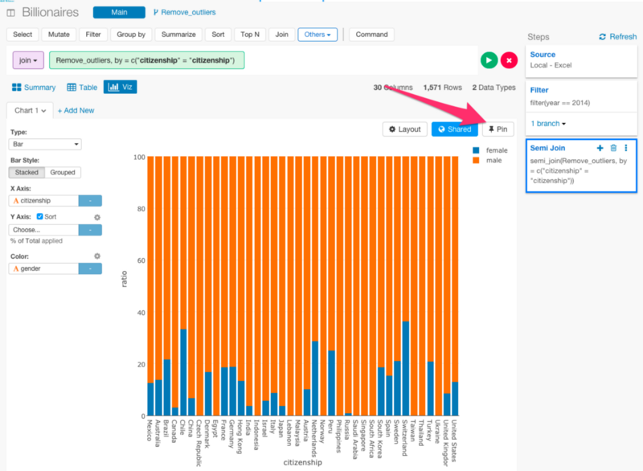
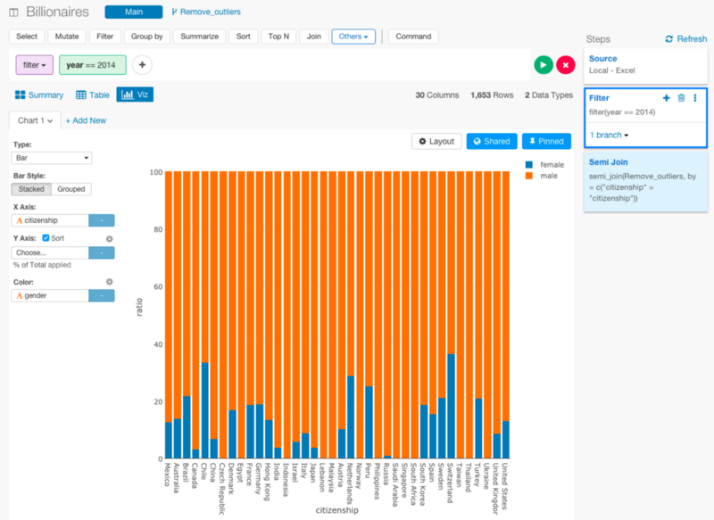
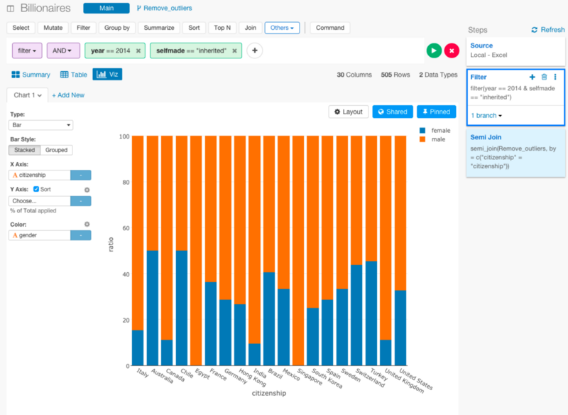
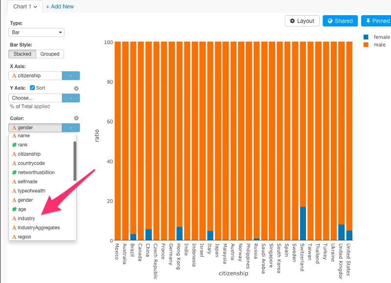
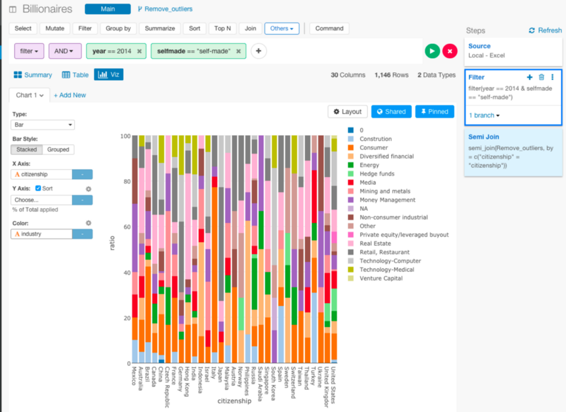

#Pin機能の説明

チャートを固定したまま、分析をするときの変数を変えて、それらの変数がデータにどのような変化をもたらすのかを見てみたいと思ったことはありませんか？
ExploratoryのPin機能はそんなときに便利です。

例えば、このデータは、女性の億万長者の比率を表わしています。順に見ていくと、チリ、スイス、オランダ、ペルー、ドイツ、フランス、デンマークとなっていて、ヨーロッパが多くなっていますね。

ちなみに、このデータには、どうやって億万長者になったかを表すselfmadeという列があります。この列を使って、相続で億万長者になった女性の場合と、自力で億万長者になった女性がいる国に違いがあるのか見てみたいと思います。なので、最初のyearを指定したFilterのステップに戻りたいと思います。

すると、Filterのステップに戻るとY軸のratioが外れ、チャートの様子も変わってしまいました。これは、今青くなっているFilterのステップの時点では、semi_joinコマンドを使っていないため、国における億万長者の数が5人以上にフィルタリングした国だけのデータフレームを結合できていないからなんです。この問題を防ぐために、Pinボタンというのがあります。

Pinボタンを押すと、最後のsemi_joinコマンドのステップが青くなります。すると、チャートは、この青くなった部分に固定されます。この状態で、最初のFilterのステップに戻ると、このように、チャートが青のステップに固定されたままになるので、変数の値を変えて、チャートを比較できるようになります。

まず、相続で、億万長者になった女性だけにフィルタリングしてみましょう。

フランス、ドイツ、スペイン、スウェーデン、スイスなどのようなヨーロッパの国が相続によって億万長者になった人が多いのが確認できます。

では、次に、自力で、億万長者になった女性だけにフィルタリングしてみます。

すると、多くの国が急に消えてしまいました。これは興味深いですね。このデータによると、アメリカとスイスだけが、自力で億万長者になった女性が多いということになります。

最後に、今までは、性別で、億万長者の比率を比較していましたが、途中で、産業ごとの、億万長者の比率を比較したいとなったとしましょう。そういうときにも、ExploratoryのPin機能が便利です。Color軸だけをちょっと変えるだけで比較することができるのです。

入れ替えてみます。

このチャートは最後の青のステップに固定されていますけど、Pinした状態で、グルーピングのステップが更新されると、Exploratoryが、自動的に、ビジュアライズの結果も更新してくれるのです。

以上が、ExploratoryのPin機能の説明でした。

##興味を持っていただいた方、実際に触ってみたい方へ

Exploratory Desktopは[こちら](https://exploratory.io/
)から登録した後にダウンロードしてすぐに使ってもらうことができます。もちろん、無料で始めることができます！

ExploratoryのTwitterアカウントは、[こちら](https://twitter.com/ExploratoryData
)です。

Exploratoryの日本ユーザー向けの[Facebookグループ](https://www.facebook.com/groups/1087437647994959/members/
)を作ったのでよろしかったらどうぞ

分析してほしいデータがある方や、データ分析のご依頼はhidetaka.koh@gmail.comまでどうぞ