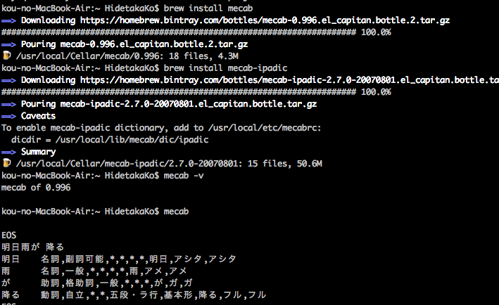
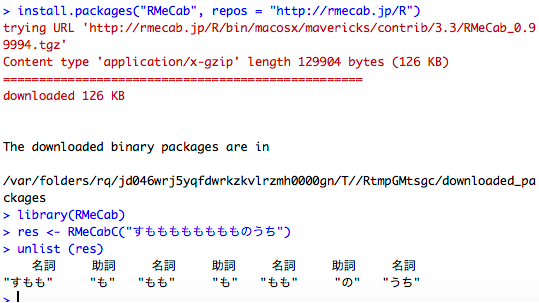
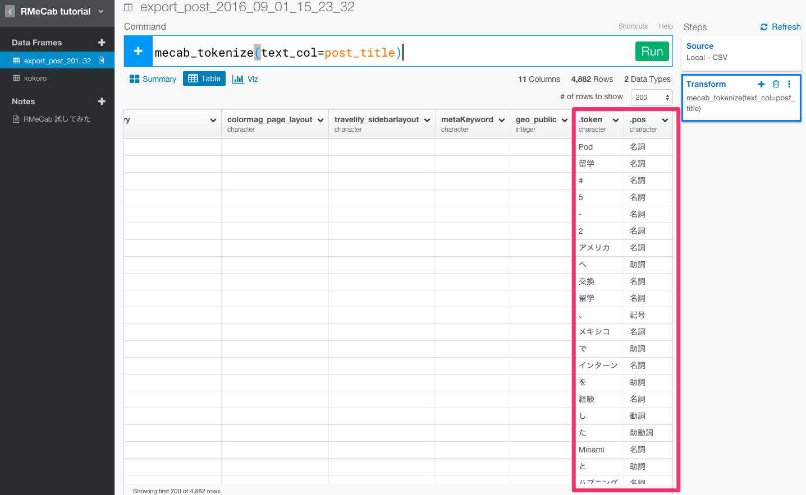
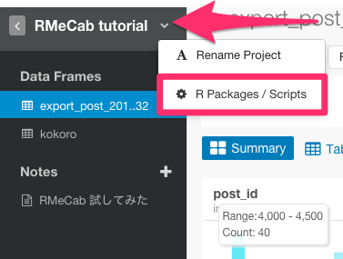
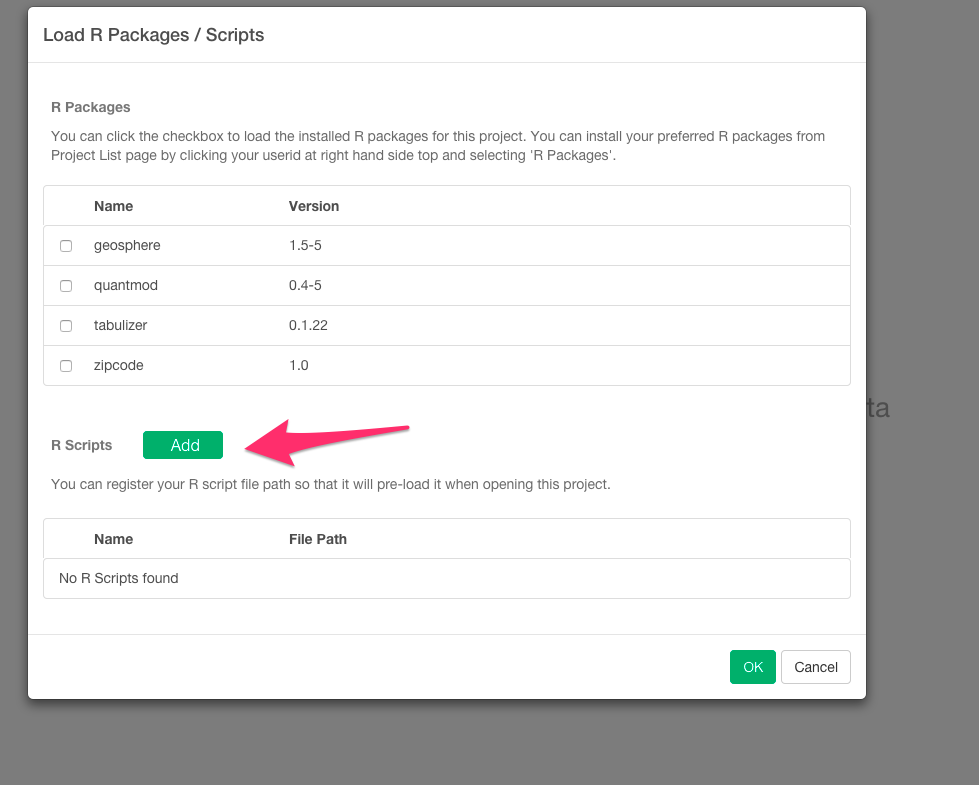
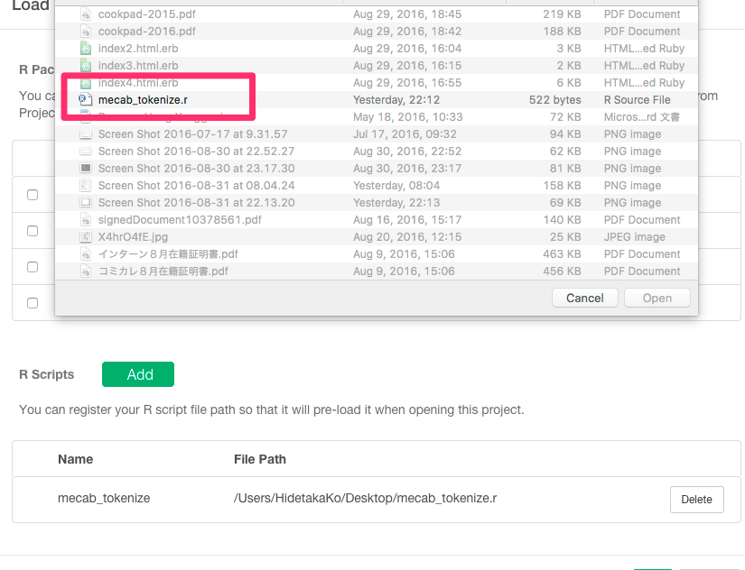
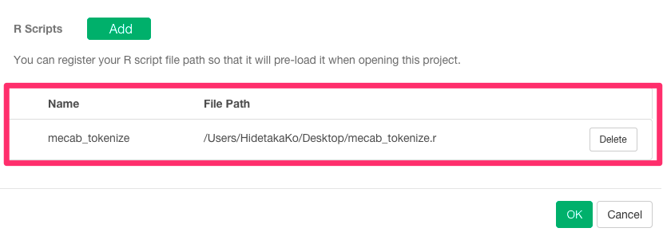
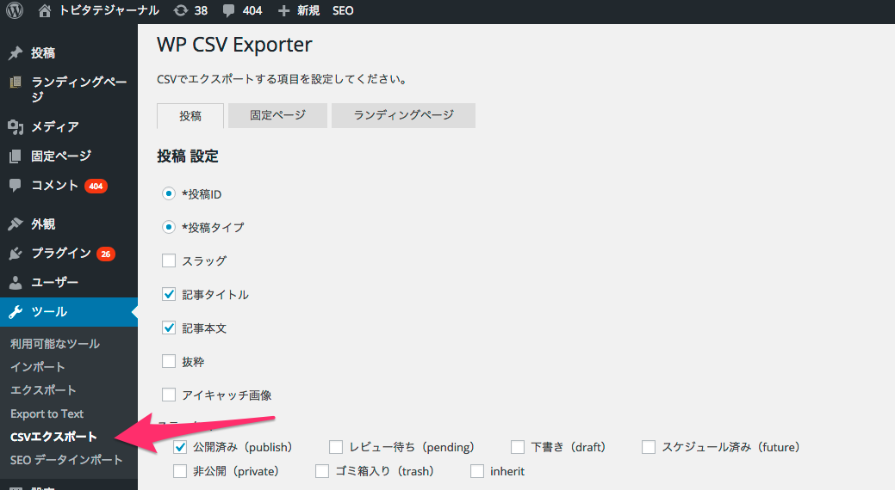
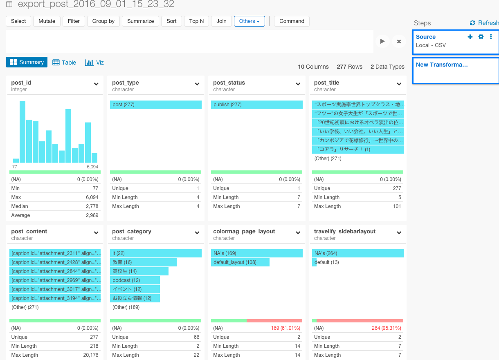

#RMeCabを使って、タダで留学できると話題のトビタテ留学JAPANの学生が投稿している留学ブログサイトのデータをインポートしてテキスト分析してみた トップ２０編

タダで留学できると話題の[トビタテ留学JAPAN](http://hidetaka.hateblo.jp/entry/2015/06/26/%E2%97%8B%E2%97%8B%E3%81%A7%E3%82%82%E2%97%8B%E2%97%8B%E3%81%AB%E3%81%AA%E3%82%8C%E3%82%8B%E6%99%82%E4%BB%A3%EF%BC%81_%E3%82%B7%E3%83%AA%E3%82%B3%E3%83%B3%E3%83%90%E3%83%AC%E3%83%BC%E3%81%A8%E3%83%88)という留学奨学金プログラムはご存知でしょうか？　

ぼくは、そんなトビタテ留学JAPANの学生が留学体験記を投稿している[トビタテジャーナル](http://tobitate-student.com/)というサイトの運営・開発をしています。サイトのデータベースから投稿されたテキストを分析してみると、留学生はどんな単語をよく使っているのかという質問に答えたり、分類ごとにクラスタリングしていくことができそうです。自分でブログやメディアなどを運営している人はそういうことが気になって分析してみたいと思ったことは1度や2度ではないのではないでしょうか？

ところが、テキストデータだと、そのデータをエクスポートすることや、その後取ってきたデータを加工して分析やビジュアライズできるようにするという過程が、結構めんどくさかったりしますよね。

だから、今日は、Exploraotryを使って、そんな日本語のテキスト分析の方法について、簡単に見ていきたいと思います。


##Mecab本体と辞書の２つをターミナルからインストールする

日本語のテキスト解析をするときに、最も特有な手法の一つが、単語分割の方法です。
そのためにRMeCabという便利なツールがあるので、インストールしましょう。

環境

- MacOX 10.8.5(Mountain Lion)
- Homebrewがインストールされていること。Homebrewを持ってない方は、[こちら](http://brew.sh/index_ja.html)からHomebrewをダウンロードしてください。

MacでMecabを使うためには、Mecab本体と辞書の２つをインストールする必要があります。

brew install mecabで、Mecab本体をインストールします。

```
brew install mecab
```
次に、brew install mecab-ipadicで、Mecabで利用する辞書をインストールします。

```
brew install mecab-ipadic
```
次のように表示されれば、インストールは成功しています。



##RMeCabをRstudioからインストールする

RMeCabをパッケージをインストールしましょう。ターミナルから次のコマンドを打ち込んで下さい。

```
R -e "install.packages(\"RMeCab\", repos = \"http://rmecab.jp/R\")"
```

次のように表示されれば、インストールは成功しています。



WindowsでMecabをインストールしたい方は、[こちら](http://handsrecs2nd.seesaa.net/article/140090025.html)をどうぞ。


##RMeCabにある機能を、Exploratoryで使いやすくするように、関数を定義します

RMeCabにある機能は、あくまでRの上で使うことを想定されているので、それをExploratoryの仕組みの中で使いやすくするように、カスタマイズされた新しい関数を定義し、コマンドラインから使えるようにします。

まず、下記のコードを書いたこのファイルをこちらからダウンロードしてください

```
mecab_tokenize <- function(tbl, text_col, .drop=TRUE){
 loadNamespace("RMeCab")
 loadNamespace("tidyr")
 text_cname <- as.character(substitute(text_col))
 text <- tbl[[text_cname]]
 tokenize <- function(text){
   tokens <- unlist(RMeCab::RMeCabC(text))
   data.frame(.token = tokens, .pos = names(tokens))
 }
 if(.drop){
   tbl[[text_cname]] <- lapply(text, tokenize)
   token_col <- text_cname
 } else {
   tbl$.token <- lapply(text, tokenize)
   token_col <- ".token"
 }
 tidyr::unnest_(tbl, token_col)
}

```


次に、矢印の部分を押して、R packages/Scriptsを選んで下さい。



矢印のAddボタンを選んで下さい。



さっき関数を定義したファイルを選んで下さい。



しっかり保存されていますね。



WindowsでRMecabをインストールしたい方は、[こちら](http://rmecab.jp/wiki/index.php?RMeCab)をどうぞ。

##Wordpressの投稿データをCSVエクスポートする

管理者画面から、投稿データをCSVエクスポートします。



このCSVをExploratoryにインポートします。



これで、テキスト分析をしていくための土台が整いました。

WordpressでCSVエクスポートができない方は、[こちら](https://wordpress.org/plugins/wp-csv-exporter/)からWP CSV Exporterというプラグインをダウンロードしてください。

##データを整形する

##ビジュアライズする


##興味を持っていただいた方、実際に触ってみたい方へ

Exploratoryは[こちら](https://exploratory.io/
)からβ版の登録ができます。こちらがinviteを完了すると、ダウンロードできるようになります。


ExploratoryのTwitterアカウントは、[こちら](https://twitter.com/ExploratoryData
)です。

Exploratoryの日本ユーザー向けの[Facebookグループ](https://www.facebook.com/groups/1087437647994959/members/
)を作ったのでよろしかったらどうぞ

分析してほしいデータがある方や、データ分析のご依頼はhidetaka.koh@gmail.comまでどうぞ