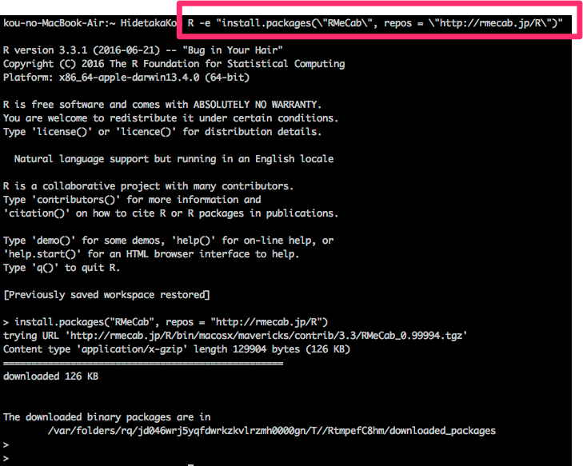
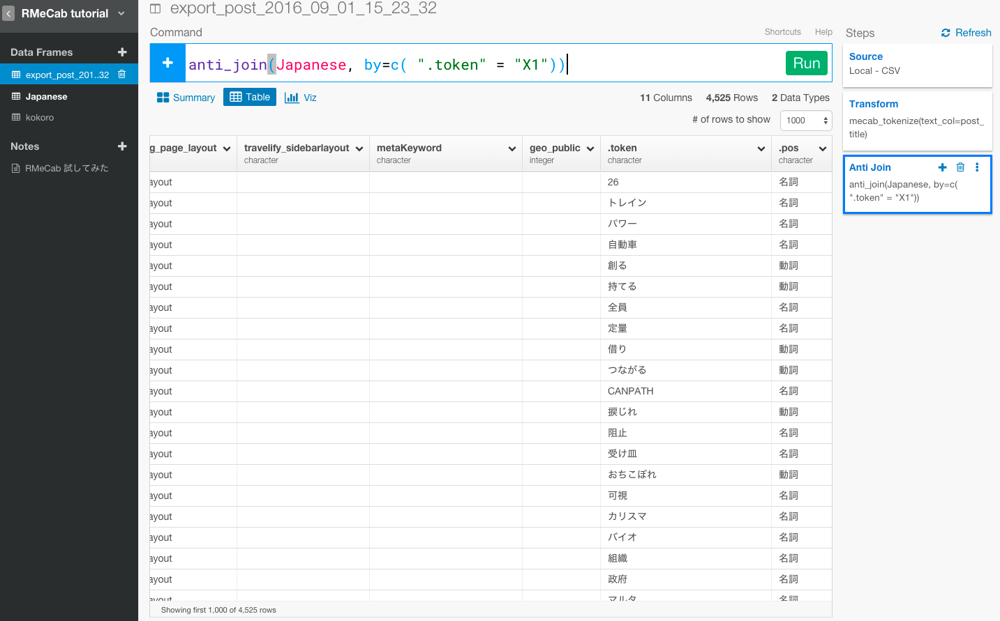
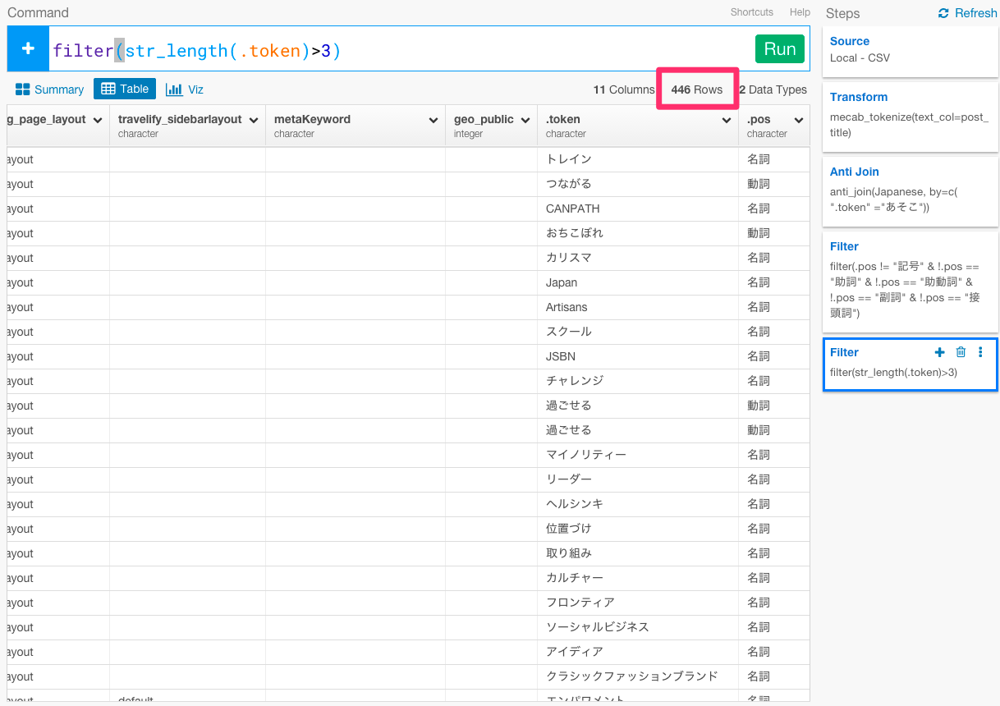
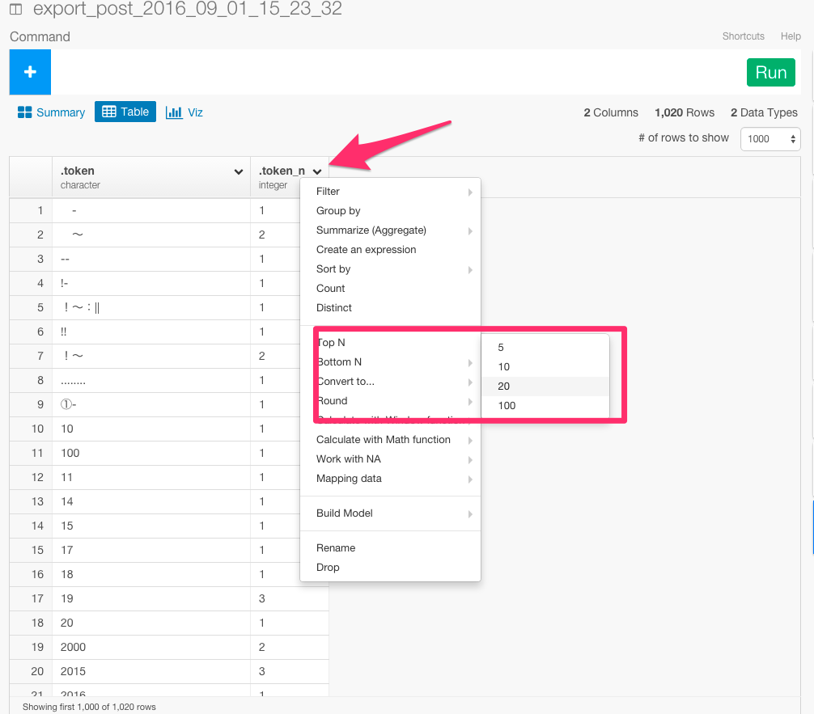
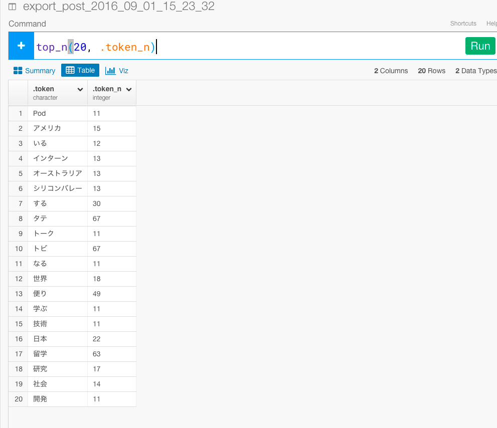

#RMeCabを使って、タダで留学できると話題のトビタテ留学JAPANの学生が投稿している留学ブログサイトのデータをインポートしてテキスト分析してみた トップ２０編

タダで留学できると話題の[トビタテ留学JAPAN](http://hidetaka.hateblo.jp/entry/2015/06/26/%E2%97%8B%E2%97%8B%E3%81%A7%E3%82%82%E2%97%8B%E2%97%8B%E3%81%AB%E3%81%AA%E3%82%8C%E3%82%8B%E6%99%82%E4%BB%A3%EF%BC%81_%E3%82%B7%E3%83%AA%E3%82%B3%E3%83%B3%E3%83%90%E3%83%AC%E3%83%BC%E3%81%A8%E3%83%88)という留学奨学金プログラムはご存知でしょうか？　

ぼくは、そんなトビタテ留学JAPANの学生が留学体験記を投稿している[トビタテジャーナル](http://tobitate-student.com/)というサイトの運営・開発をしています。サイトのデータベースから投稿されたテキストを分析してみると、留学生はどんな単語をよく使っているのかという質問に答えたり、分類ごとにクラスタリングしていくことができそうです。自分でブログやメディアなどを運営している人はそういうことが気になって分析してみたいと思ったことは1度や2度ではないのではないでしょうか？

ただでさえテキスト・データを加工したり、分析するのは手間がかかる作業ですが、特に日本語になると、英語などの言語と違い、単語と単語の間にスペースがないので、トークナイズ（単語ごとに分ける）するのがさらに難しいです。ただ、知ってる人も多いかと思いますが、オープンソースで、MeCabという、Google 日本語入力開発者の一人である工藤拓さんによって開発されたライブラリを使うと日本語をトークナイズするのが簡単にできます。さらに都合のいいことに、RでMeCabが使えるように、石田基広さんが作られたRMeCabというのがあるので、それを使うと簡単にRで、つまりはExploratoryの中でテキスト・データをトークナイズしていくことができます。

今日は、そのMeCabのインストール、さらにそれをExploratoryの中で使うためのセットアップ、そして軽く日本語データに対するテキスト分析の方を順を追って説明していきたいと思います。

##Mecabと辞書をインストール

以下にMacでのインストールを説明しますが、Windowsの方は、[こちら](http://rmecab.jp/wiki/index.php?RMeCab)を参照してください。

環境

- MacOX 10.11.6(ElCapitan)
- Homebrewがインストールされていること。Homebrewを持ってない方は、[こちら](http://brew.sh/index_ja.html)からHomebrewをダウンロードしてください。

MacでMecabを使うためには、Mecab本体と辞書の２つをインストールする必要があります。

brew install mecabで、Mecab本体をインストールします。

```
brew install mecab
```
次に、brew install mecab-ipadicで、Mecabで利用する辞書をインストールします。

```
brew install mecab-ipadic
```
次のように表示されれば、インストールは成功しています。


##RMeCabをインストールする

次に、RからMeCabが使えるようRMeCabをインストールしましょう。こちらもMacでの例を説明しますが、Windowsの方は[こちら](http://handsrecs2nd.seesaa.net/article/140090025.html)を参照してください。


ターミナルから次のコマンドを打ち込んで下さい。

```
R -e "install.packages(\"RMeCab\", repos = \"http://rmecab.jp/R\")"
```

次のように表示されれば、インストールは成功しています。




##RMeCabにある機能を、Exploratoryで使いやすくするように、関数を定義する

RMeCabのトークナイズの関数をExploratoryの仕組みの中で使いやすくするように、こちらに関数を定義しましたので、下記のコードを[こちら](https://gist.githubusercontent.com/double-y/1861e9517a73167586471ec088ac0951/raw/01d5d92a6020a535d6e13f8e252ae447c42f1eed/mecab_tokenize)からダウンロードしてください。


```
mecab_tokenize <- function(tbl, text_col, .drop=TRUE){
 loadNamespace("RMeCab")
 loadNamespace("tidyr")
 text_cname <- as.character(substitute(text_col))
 text <- tbl[[text_cname]]
 tokenize <- function(text){
   tokens <- unlist(RMeCab::RMeCabC(text))
   data.frame(.token = tokens, .pos = names(tokens))
 }
 if(.drop){
   tbl[[text_cname]] <- lapply(text, tokenize)
   token_col <- text_cname
 } else {
   tbl$.token <- lapply(text, tokenize)
   token_col <- ".token"
 }
 tidyr::unnest_(tbl, token_col)
}

```


次に、矢印の部分を押して、R packages/Scriptsを選んで下さい。


矢印のAddボタンを選んで下さい。


さっき関数を定義したファイルを選んで下さい。


しっかり保存されていますね。


##Wordpressの投稿データをCSVエクスポートする

管理者画面から、投稿データをCSVエクスポートします。


このCSVをExploratoryにインポートします。


これで、テキスト分析をしていくための土台が整いました。

WordpressでCSVエクスポートができない方は、[こちら](https://wordpress.org/plugins/wp-csv-exporter/)からWP CSV Exporterというプラグインをダウンロードしてください。

##テキスト分析をする

###トークナイズする


センテンスになっているので、さきほど定義した関数を使って、トークナイズしましょう。

`mecab_tokenize(text_col=post_title)`


これで、センテンスだったpost_title列が品詞ごとの単語に分かれましたね。

###stopwordを取り除く

次に、今のままだと、矢印のように、日本語には、意味のない不要な単語が多く含まれています。これらの単語をstopwordsと呼んでいます。


意味のあるテキスト分析をするためには、これらの単語を取り除く必要があります。そのために、[こちら](http://svn.sourceforge.jp/svnroot/slothlib/CSharp/Version1/SlothLib/NLP/Filter/StopWord/word/Japanese.txt)に日本語の不要な単語リストがまとまったファイルがあります。ダウンロードして拡張子をcsvに変えてExploratoryにインポートしてください。


Get Dataボタンを押してください。次に、日本語の不要な単語リストがまとまったデータフレームを.token列にanti_joinしてマッチした単語を取り除きます。

`anti_join(Japanese, by=c( ".token" ="あそこ"))`



Runボタンを押します。


不要な単語が取り除かれたのが確認できました。

###さらに不要なデータを取り除く

次に、データを見ていくと記号がいくつか入っていることに気が付きます。これも意味がないのでフィルタリングしてデータを取り除いていきましょう。


`filter(.pos != "記号")`


これで記号を取り除くことができました。

また、見ていくと助詞や助動詞や副詞や接頭詞も不要であることに気が付きます。同じようにフィルタリングをかけましょう。

`filter(.pos != "記号" & !.pos  == "助詞" &  !.pos  == "助動詞" & !.pos  == "副詞" & !.pos  == "接頭詞")`


ずいぶんと減ってきましたね。あとは、字数が少なすぎるテキストも意味がないので、str_length関数を使って3文字以下の取り除きましょう。

`filter(str_length(.token)>3)`



これで、不要な単語はほとんど取り除くことができました。

###トップ２０を計算する

次に、最もよく頻出している意味のある単語トップ２０を計算して出したいと思います。それぞれの単語の個数を数えるために、まず、.token列をグルーピングします。

`group_by(.token)`


次に、.token列をsummarizeしてそれぞれの単語の個数を数えましょう。

`summarize(.token_n = n())`


次に、top_n関数を使ってランキングを計算します。

.token_n列のヘッダーをクリックして、Top Nを選んで下さい。



すると、コマンドが自動生成されます。Runボタンを押してください。



これで、最もよく頻出している意味のある単語トップ２０を計算することができました。

##ビジュアライズする

次に、データを直観的に理解するためにVizタブに行って、X軸に.tokenをY軸に.token_nをあてはめてビジュアライズしてみましょう。


##興味を持っていただいた方、実際に触ってみたい方へ

Exploratoryは[こちら](https://exploratory.io/
)からβ版の登録ができます。こちらがinviteを完了すると、ダウンロードできるようになります。


ExploratoryのTwitterアカウントは、[こちら](https://twitter.com/ExploratoryData
)です。

Exploratoryの日本ユーザー向けの[Facebookグループ](https://www.facebook.com/groups/1087437647994959/members/
)を作ったのでよろしかったらどうぞ

分析してほしいデータがある方や、データ分析のご依頼はhidetaka.koh@gmail.comまでどうぞ