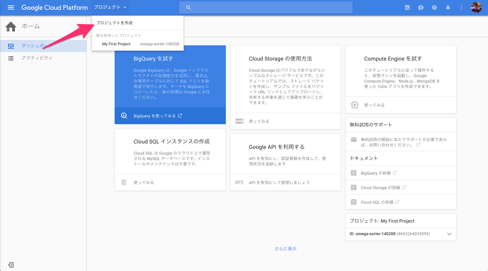
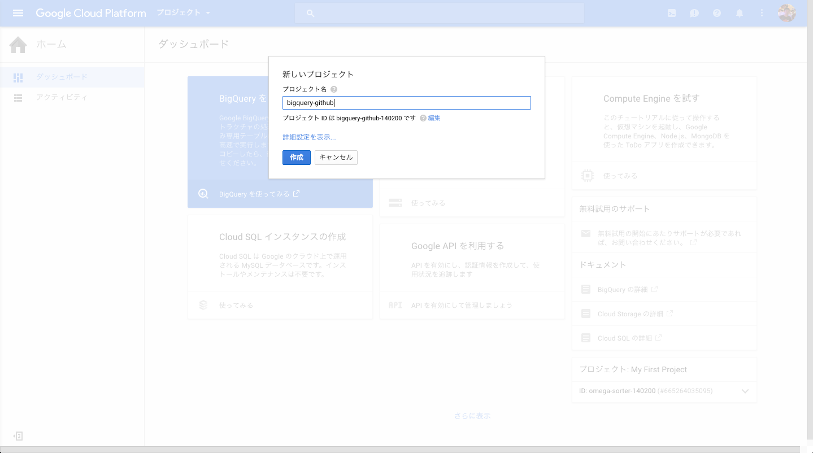
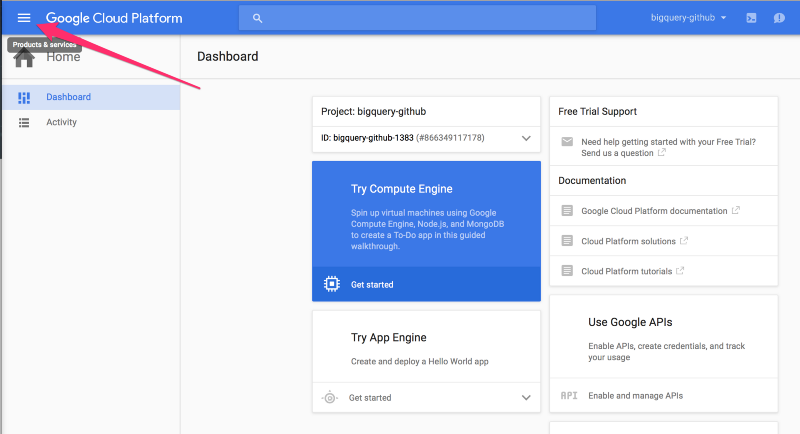
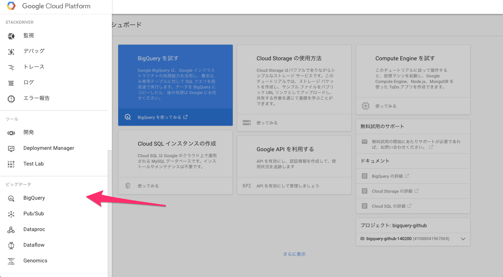
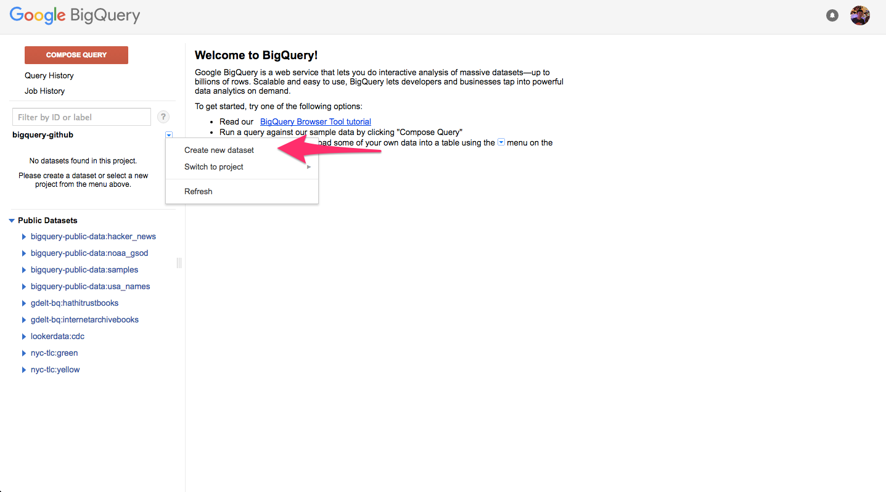
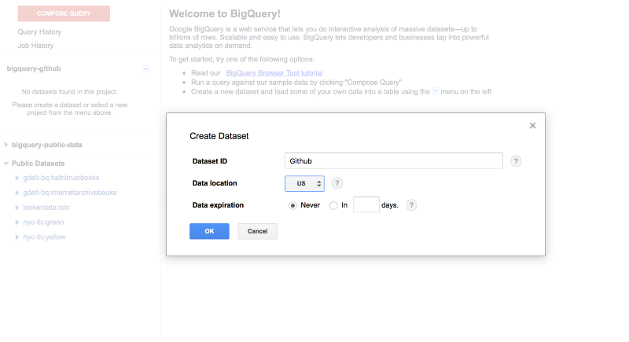

#Google公式のGoogle BigQueryを爆速で設定する

自分のクレジットカード情報を記入する必要がありますが、60日間の無料お試し期間があり、1 TB / 月まで無料ですので、サクッと試すぐらいでしたらあまり心配しなくてもいいのではないでしょうか。ので利用しましょう。もし限度を超えることがあったとしても、勝手に課金される前に、YesかNoと断れるようになってます。詳しくは[こちら](https://cloud.google.com/bigquery/pricing?hl=ja)の方に、Google BigQueryの料金体系が書いてあります。

##プロジェクトを作成する

いったんサインアップすると、Google Cloud Consoleページからプロジェクトを作成することができます。

ヘッダーのドロップダウンメニューからプロジェクトを作成を選んで下さい。

プロジェクト名を入力してください。

##データセットを作りましょう

いったんプロジェクトを作ると、左側のメニューボタンを押して下さい。

メニューからBigQueryを選び、Google BigQueryのUIを開きましょう。

矢印のアイコンの隣にあるボタンを押して、データセットを作成してください。

データセットIDをタイプして、OKボタンをクリックしてください。

これで設定は終了です。Google BigQueryのデータ分析については、こちら↓で書いているのでよろしかったらどうぞ。

[なぜデータ分析においては、SQLではなくRを使うべきか？ Google公式のGoogle BigQueryに保存されてる３TBのGitHubデータを使って、Rのパッケージをクラスタリングしてみた](https://github.com/21-Hidetaka-Ko/Japanese-blog/blob/master/articles/Google%20BigQuery-tutorial.md)

##興味を持っていただいた方、実際に触ってみたい方へ

Exploratoryは[こちら](https://exploratory.io/
)からβ版の登録ができます。こちらがinviteを完了すると、ダウンロードできるようになります。

ExploratoryのTwitterアカウントは、[こちら](https://twitter.com/ExploratoryData
)です。

Exploratoryの日本ユーザー向けの[Facebookグループ](https://www.facebook.com/groups/1087437647994959/members/
)を作ったのでよろしかったらどうぞ

分析してほしいデータがある方や、データ分析のご依頼はhidetaka.koh@gmail.comまでどうぞ