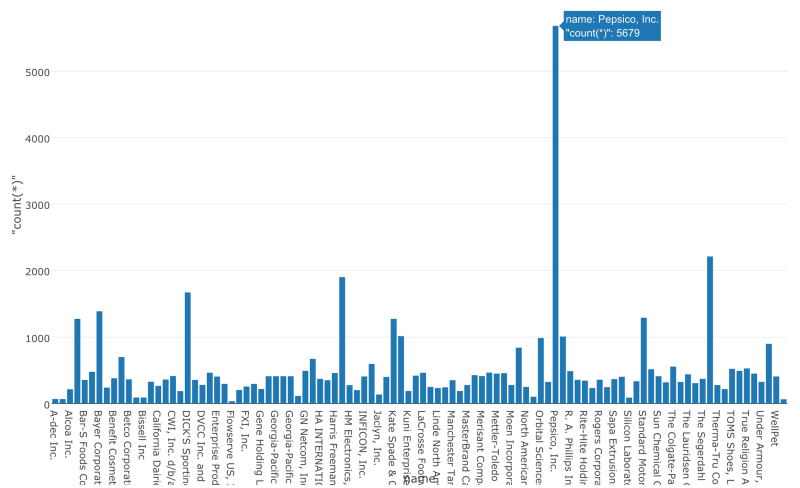

# サルでもわかるテキスト分析入門その１ — Rによるテキスト分析のためのドキュメントとデータを準備する

もし、たくさんのドキュメントを持っていたら、そのドキュメント同士の類似性を調べてみたいと思いませんか？
例えば、ここに、カリフォルニアにある会社がどんなことをしているかを明らかにするために、公開している‘California Transparency in Supply Chain Act’というデータがあります。これは、会社に、会社のビジネスに関わっているサプライチェーンにおいて、違法に労働搾取をしていたりするのを根絶する権限を与えます。このデータは、[Eddie Bauer](http://www.eddiebauer.com/static/pdf/California_Transparency_Supply_Chain.pdf
)からダウンロードしました。

サプライチェーンとは、企業の経営・管理で使用する用語で、原材料・部品の調達から、製造、在庫管理、販売、配送までの製品の全体的な流れのこと。 それぞれの工程が別個にあるのではなく、鎖としてつながっているという意味で、特に物流の仕組みや上流・下流を含めた複数企業間の連携を強調していう場合もあります。

このデータを分析していて出てきた質問は、「A会社のドキュメントと比べて、類似性はあるのか？」や「その会社が毎日なにをしているかに関係なく、同じテンプレートを使ったり、模範的なドキュメントのコピペをしているのを見破れるかどうか」ということです。

Exploratoryでは、そんな問題を解決するために、テキスト分析を行うことができます。

専門家ではない限り、理解するのは簡単ではないですが、１つづつ説明していきたいと思います。また、すべてのステップをRstudioなどで再現することもできます。

##データをインポートする

まず、[こちら](https://www.dropbox.com/s/w1sy4u8j71m3vlq/CA_Trans_Supply_Chain.csv?dl=0
)から、‘California Transparency in Supply Chain Act’というデータをダウンロードします。もし、R consoleやR Studioで同じことをするなら、以下のコードを走らせてください。

`library(readr)`

`read_delim("/Users/kannishida/Downloads/CA_Trans_Supply_Chain.csv" , ",", quote = "\"", )`

Exploratoryなら、‘Import Local Data’ダイアログから、‘CSV’を選んで、ダウンロードしたデータを選んでください。

ダウンロードした後は、こんな感じになります。

いくつかの会社の名前が長すぎて、読むのが難しいので、‘str_sub’関数を使って、最初の50文字に減らします。

`mutate(name = str_sub(name, 1, 50))`

##テキストをトークン化する

これから、Exploratory独自の関数である、‘do_tokenize’関数を使って、テキストを単語にトークン化かします。

`do_tokenize(text)`

以下のように、列のヘッダーメニューからコマンドを選ぶことができます。

Runボタンを押すと、結果はこんな感じになります。

3つの列ができました。

- document_id — ドキュメントやグループにつきユニークなIDをひとつ持っています。

- sentence_id — それぞれのグループの中のセンテンスにつきユニークなIDをひとつ持っています。例えば、‘Dollar Tree’というドキュメントは、12センテンス持っています。

- token— トークン化された単語のことです。

簡単に、いくつの単語が、それぞれのドキュメントにあるのかを見たり、チャート画面で、Barチャートを使って、name列をX軸に指定することによって、ドキュメントを比較することができます。

‘Dollar Tree’ドキュメントには、356文字あることがわかりました。また、最も多くの単語を記録しているドキュメントは、‘Pepsico, Inc.’のようですね。

##Stop Wordsを除去する

サマリー画面に行くと、“and”, “the”, “to”, “of”などの単語が頻繁に記録されていることを確認できます。

これらの単語は、一般的なものなので、ドキュメントを比較したり、特定したりするのを助けるのに役立たったりはしませんよね。ここで、本当に探したいものは、ドキュメントを特定するのを助ける単語ですね。

例えば、この2つのドキュメントの例で考えてみましょう。

Document A:
This is an apple.

Document B:
This is a banana.

直感的に、この2つのドキュメントを見分けるためには、ドキュメントAからは、‘apple’、ドキュメントBからは、‘banana’という単語だけが必要ですよね。他の単語は必要ではありません。ドキュメントAとBは、ほとんど同じだからだけではなく、Thisなどの、一般的な共通した単語を使っているからです。これらの単語は、‘stop words’と呼ばれています。

Exploratoryの独自関数である、‘is_stopword’関数を使って、‘stop words’を除去しましょう。

`filter(!is_stopword(token))`

この関数は、単語が、‘stop words’に登録されている一連のリストと一致したら、TRUEを返します。

ヘッダーメニューから、このコマンドを使うことができます。

今回は、最も頻繁に記録されている単語は、“supply”, “suppliers”, “human”, “trafficking”などになりましたね。このドキュメントは、サプライチェーンにおける労働条件についてなので、納得の結果ですね。

##アルファベットだけ抜き出す

‘token’列をアルファベット順にソートしてみると、データの中にたくさんの数字があることがわかります。

`arrange(token)`

このテキストの情報は、ドキュメントの中にパターンを見出すのに少しは役立つかもしれませんが、ほとんどの場合は、大して役に立ちません。例えば、データを示す1というデータを持っていても、1が何を意味するのかがわからないと意味がありません。それは、単位であり、位置であり、クラスなのです。いまのままだと、便利というよりむしろ邪魔です。

‘is_alphabet’という関数を使うと、アルファベットのままにしておくことができます。この関数は、指定した単語が、アルファベットだけを含んでいるときだけ、TRUEを返します。下記のように、追加で条件を加えることもできます。

`filter(!is_stopword(token) & is_alphabet(token))`

Runボタンを押すと、トークン列に文字のテキストデータが見れなくなりましたね。

##複数の派生語を語幹に基いて計算する

サマリー画面を見るとわかるように、“suppliers”と“supplyr”の2単語がドキュメントの中にとても多いですね。

“suppliers”が、“supplier”の複数形であることを考慮にいれると、この2単語を全くの別物として区別するべきではありませんよね。むしろ、ドキュメントをより正確に特定するためには、このような2単語を同一のものとして扱う必要があります。

幸運にも、この問題を解決するための、‘word stem’や‘stemming’と呼ばれるような技術があります。これは、それぞれの単語の語幹に基いて、派生した単語を減らすことができる技術です。例えば、‘play’, ‘plays’, ‘playing’, ‘played’のような一連の単語は、‘stemming’した後だと、全て‘play’として扱われます。Exploratoryの独自関数である、‘stem_word’関数を使って複数の派生語を語幹に基いて計算しましょう。

`mutate(token_stem = stem_word(token))`

すると、‘supplier’が最も頻繁に記録されている単語になりましたね。テーブル画面を見ると、stemmingされた後と前とを簡単に比較することができます。

##n-gramsを作る

今、“supply”といえば、‘supply chain’についてのドキュメントだとわかります。しかし、‘supply chain’と‘supply carrots’は、このコンテキストにおいて、全くの別物なので、ドキュメントを特定するために、区別する必要があります。

自然言語処理の分野においては、これを‘n-gram’と呼んでいます。‘n-gram’とは、隣り合う単語を連結することです。例えば、mono-gram (1-gram)は1単語、Bi-gram (2-gram)は、‘Supply Chain’のような隣り合う2単語を、Tri-gram (3-gram)は、‘Supply Chain Act’のような隣り合う3単語をいっしょに連結することを意味します。Exploratoryの独自関数である、‘do_ngram’関数を使ってみましょう。

`do_ngram(token_stem, n=1:2)`

自分がほしいn-gramのタイプをnの引数で設定します。例えば、上の例では、mono-gramとbi-gramの両方を得ようとしています。もし、tri-gramも得たいなら、以下のように、1から3までnの引数で設定する必要があります。

`do_ngram(token_stem, n=1:3)`

Runボタンを押す前に、ひとつ大切なことを思い出す必要があります。それは、境界についてです。‘do_ngram’関数は、単に隣り合う単語を連結します。しかし、センテンスをまたいで、単語を連結することは意味を成しません。だから、‘n-gram’は、同じセンテンス内だけで行れる必要があります。

そうするために、‘group_by’コマンドを使いましょう。‘name’はそれぞれのドキュメントを表し、‘sentence_id’は、それぞれのドキュメント内のセンテンスを表します。この2つの列を使って、以下のように境界を設定することができます。

`group_by(name, sentence_id)`

すると、2172グループになっているのが確認できますね。これは、基本的にセンテンスの数と同じです。Runボタンを押してください。

`do_ngram(token_stem, n=1:2)`

‘bi-gram’が加えられたのがわかりますね。

このシリーズでは、テキスト分析の一部である、「データの準備」について主に書きました。次のシリーズでは、それぞれのドキュメントをTF-IDFと呼ばれる指標を使って、ドキュメントにおけるそれぞれの単語の数を定量化します。

##Rで再現する

ExploratoryでRスクリプトを生成することによって、これらのステップをすべてRで再現することができます。

生成されたRスクリプトは、こんな感じになります。(ただし、libraryコマンドは、まだうまく生成できていません。すぐに改善される予定です。)

library(readr)
library(dplyr)
library(stringr)
library(exploratory)

read_delim("/Users/kannishida/Download/CA_Trans_Supply_Chain.csv" , ",", quote = "\"", skip = 0 , col_names = TRUE , na = c("","NA"), n_max=-1 , locale=locale(encoding = "UTF-8", decimal_mark = ".") , progress = FALSE) %>%
  exploratory::clean_data_frame() %>%
  mutate(name = str_sub(name, 1, 50)) %>%
  do_tokenize(text) %>%
  filter(!is_stopword(token) & is_alphabet(token)) %>%
  select(-document_id) %>%
  mutate(token_stem = stem_word(token)) %>%
  group_by(name, sentence_id) %>%
  do_ngram(token_stem, n=1:2)

exploratoryパッケージは、CRANにではなく、GitHub上にあります。興味がある方は、GutHubからdevtoolsパッケージといっしょにインストールすることができます。

`install.packages("devtools")`

`devtools::install_github("exploratory-io/exploratory_func")`

`library(exploratory)`

##興味を持っていただいた方、実際に触ってみたい方へ

Exploratoryは[こちら](https://exploratory.io/
)からβ版の登録ができます。こちらがinviteを完了すると、ダウンロードできるようになります。

Exploratoryの日本ユーザー向けの[Facebookグループ](https://www.facebook.com/groups/1087437647994959/members/
)を作ったのでよろしかったらどうぞ

ExploratoryのTwitterアカウントは、[こちら](https://twitter.com/ExploratoryData
)です。
