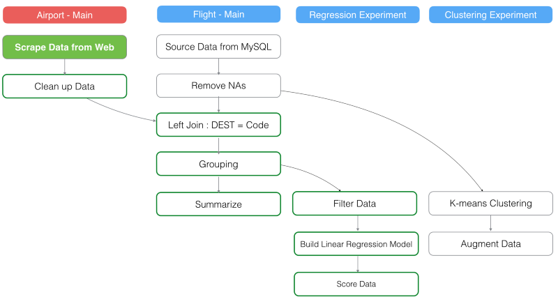

# サルでもわかるテキスト分析入門その１ — Preparing Document and Term Data for Text Mining in R

もし、たくさんのドキュメントを持っていたら、そのドキュメント同士の類似性を調べてみたいと思いませんか？
例えば、ここに、カリフォルニアにある会社がどんなことをしているかを明らかにするために、公開している‘California Transparency in Supply Chain Act’というデータがあります。これは、会社に、会社のビジネスに関わっているサプライチェーンにおいて、違法に労働搾取をしていたりするのを根絶する権限を与えます。このデータは、[Eddie Bauer](http://www.eddiebauer.com/static/pdf/California_Transparency_Supply_Chain.pdf
)からダウンロードしました。

サプライチェーンとは、企業の経営・管理で使用する用語で、原材料・部品の調達から、製造、在庫管理、販売、配送までの製品の全体的な流れのこと。 それぞれの工程が別個にあるのではなく、鎖としてつながっているという意味で、特に物流の仕組みや上流・下流を含めた複数企業間の連携を強調していう場合もあります。

このデータを分析していて出てきた質問は、「A会社のドキュメントと比べて、類似性はあるのか？」や「その会社が毎日なにをしているかに関係なく、同じテンプレートを使ったり、模範的なドキュメントのコピペをしているのを見破れるかどうか」ということです。

Exploratoryでは、そんな問題を解決するために、テキスト分析を行うことができます。

専門家ではない限り、理解するのは簡単ではないですが、１つづつ説明していきたいと思います。また、すべてのステップをRstudioなどで再現することもできます。

##データをインポートする

If you are working with R console or R Studio, you can run a command like below.

まず、[こちら](https://www.dropbox.com/s/w1sy4u8j71m3vlq/CA_Trans_Supply_Chain.csv?dl=0
)から、‘California Transparency in Supply Chain Act’というデータをダウンロードします。もし、R consoleやR Studioで同じことをするなら、以下のコードを走らせてください。

`library(readr)`

`read_delim("/Users/kannishida/Downloads/CA_Trans_Supply_Chain.csv" , ",", quote = "\"", )`

If you are working with Exploratory then you can select ‘CSV’ from ‘Import Local Data’ dialog and select the downloaded data.

And it looks something like below after you import this CSV file.

Since some of the company names are super long and hard to read, we can use ‘str_sub’ function from ‘stringr’ package to strip them down to the first 50 characters.

mutate(name = str_sub(name, 1, 50))

Given that we are interested in the text of the disclosure document data itself to find the similarity among the documents, we will keep this ‘mutate’ step.

##Tokenize Text

We can tokenize the text into words by using ‘do_tokenize’ command from ‘exploratory’ package, which internally utilizes ‘unnest_token’ from ‘tidytext’ package.

do_tokenize(text)

You can construct this command from the column header menu like below.

After you run the command you get the result like below.

There are three new columns.

- document_id — it has an unique ID per document or group, in this case that happens to be the name of the company who owns the document.
- sentence_id —it has an unique ID per sentence within each group. For example, the document for ‘Dollar Tree’ has twelve sentences so you will see the IDs starting from 1 to 12.
- token— It has the tokenized words, each of which is presented in each row.

You can quickly see how many words are in each document and compare among the documents in Chart view by assinging ‘name’ column to X-Axis with Bar chart type.

We can see there are 356 words in ‘Dollar Tree’ document. And the document with the most words award goes to ‘Pepsico, Inc.’, they have a lot to say about this topic, I assume.

##Remove Stop Words

When we go to Summary view we can quickly see that the most frequent words are “and”, “the”, “to”, “of”, etc.

These words are so generic that they wouldn’t really help to identify each document. What we are essentially looking for here are the words that would help characterizing each document.
Let’s consider we have these two documents.

Document A:
This is an apple.
Document B:
This is a banana.

And we know intuitively that in order to differentiate these two documents we just need only ‘apple’ from Document A and ‘banana’ from Document B, and we don’t really need the other words, not because they are exactly the same between Document A and B, but because they are very common words in general. And these words are called ‘stop words’.
By the way, this is a super simplified example, and defining ‘stop words’ itself would involve a lot more, but that is for a different topic later.
We can quickly remove these ‘stop words’ by using ‘is_stopword’ function from ‘exploratory’ package inside ‘filter’ command like below.

filter(!is_stopword(token))

This function evaluates each word if it matches with a list of the registered ‘stop words’ and returns TRUE if matches. Note that the ‘stop words’ list is provided through ‘tidytext’ package and based on the three lexicons of “onix”, “SMART”, and “snowball”.

You can construct this command from the header menu.

Now we can see that the most frequent words are “supply”, “suppliers”, “human”, “trafficking”, etc, in Summary view. This intuitively makes sense because these are the documents about the labor condition in the supply chains at the end of the day.

##Keep only alphabetical characters

When you look at the data closer by sorting with ‘token’ column alphabetically, you would notice that there are bunch of numbers (or digits) in the data.

arrange(token)

While these ‘text’ information might help to find some patterns among the documents, most of the times they actually don’t really help characterizing the documents. For example, when we have ‘1’ as data we don’t really know what this ‘1’ means, it could be an unit, position, class, chapter, etc. So it could be more noisy than useful.
We can keep only the alphabet letters by using ‘is_alphabet’ function in ‘filter’ command to keep only the data that has only the alphabet letters. This function evaluates each word presented in each row and returns TRUE when a given word contains only alphabet letters. We can add this additional condition in the existing ‘filter’ command like below.

filter(!is_stopword(token) & is_alphabet(token))

After we run the command we no longer see those number ‘text’ data in ‘token’ column.

##Stem Words into their basic form

As you can see in Summary view, two words of “suppliers” and “supplyr” are very popular words among the documents.

But given that “suppliers” is just a plural form of “supplier” we might not want to make these two words as completely different entries, rather we want to treat these as same so that we can identify the documents better.
For example, if one document contains a word “supplier network” and another document contain “suppliers network“, probably these two are talking about similar subject as compared to the difference between “supplier network“ and “Internet network” or “social network”.
Luckily, there is a technique called ‘word stem’ or ‘stemming’ for dealing with situations like this. It is a technique to reduce the inflected words to their base or root forms. So the word like ‘play’, ‘plays’, ‘playing’, ‘played’ will all become ‘play’ after the ‘stemming’.
We can use a function ‘stem_word’ from the exploratory package that wraps ‘wordstem’ function from ‘quanteda’ package to do the ‘stemming’. You can use it inside ‘mutate’ command like below.

mutate(token_stem = stem_word(token))

We can see that ‘supplier’ is the most frequent word now.
When we go to Table view we can easily compare the words before the stemming and after the stemming.

##Construct n-grams

Now, speaking of “supply” word, as we know these are the documents about ‘supply chain’, which means there must be many documents are using ‘supply chain’ as a term. And ‘supply chain’ and ‘supply carrots’ are two different things especially in this context and we want to take advantage of such difference in order to identify the documents.
In Natural Language Processing, we call this ‘n-gram’, which is nothing but concatenating the words that are next to each other. For example, mono-gram (1-gram) is a single word. Bi-gram (2-gram) means two words next to each other such as ‘Supply Chain’. And Tri-gram (3-gram) means three words together such as ‘Supply Chain Act’.
We can use ‘do_ngram’ function from the exploratory package, which uses ‘skipgram’ function from ‘quanteda’ package, like below.

do_ngram(token_stem, n=1:2)

We can use ’n’ argument to set what types of ‘n-gram’ we want. In the above example, we are trying to get both mono-gram and bi-gram. If you like to include ‘tri-gram’ also, then you can set the ’n’ argument to including from 1 to 3 like below.

do_ngram(token_stem, n=1:3)

Before you run this command though, there is an important thing you need to consider, which is a ‘boundary’. The ‘do_ngram’ function will simply concatenate the words that are next to each other. More precisely, it is going to grab the next word and concatenate it with the current word for every single row to create ‘bi-gram’, for example. But intuitively you would know that concateanting the words across the sentences would not make much sense. So the ‘n-gram’ should be done only within the same sentence.
In order to have ‘do_ngram’ function do the ‘n-gram’ operation only within a sentence we can use ‘group_by’ command to set the sentence as the boundary. Given ‘name’ represents each document and ‘sentence_id’ represents each sentence within each document we can use these two columns to set the boundary like below.

group_by(name, sentence_id)

You can see that there are 2172 groups now, this is basically equivalent to the number of the sentences.
And now we can run the ‘do_ngram’ function.

do_ngram(token_stem, n=1:2)

You can see ‘bi-gram’ terms are added now.
Additionally, you can use ‘skip’ argument inside ‘do_ngram’ command to skip words to construct the n-grams. Also, you can simply use ‘filter’ command to exclude some words that you don’t see any value or see as ‘noise’.
Anyway, these are the main steps of the ‘data preparation’ part of the text analytics we are performing in this series. As a next step, we can start quantifying each document by giving a score to each term per document by using something called TF-IDF. But, this post has already gone super long, I’m going to separate that part to the next post. Stay tuned!

##eReproduce it in R
You can reproduce all the steps we went through above in R by generating an R script in Exploratory Desktop.

The generated R script would look like below. (Note that the library commands are not correctly generated with this feature yet. We are working on to fix it soon!)
library(readr)
library(dplyr)
library(stringr)
library(exploratory)

read_delim("/Users/kannishida/Download/CA_Trans_Supply_Chain.csv" , ",", quote = "\"", skip = 0 , col_names = TRUE , na = c("","NA"), n_max=-1 , locale=locale(encoding = "UTF-8", decimal_mark = ".") , progress = FALSE) %>%
  exploratory::clean_data_frame() %>%
  mutate(name = str_sub(name, 1, 50)) %>%
  do_tokenize(text) %>%
  filter(!is_stopword(token) & is_alphabet(token)) %>%
  select(-document_id) %>%
  mutate(token_stem = stem_word(token)) %>%
  group_by(name, sentence_id) %>%
  do_ngram(token_stem, n=1:2)

The exploratory package is not on CRAN, but on Github, so you want to install it with the devtools package from Github.

install.packages("devtools")
devtools::install_github("exploratory-io/exploratory_func")
library(exploratory)

You will also need the following R packages to be installed before running the above script.

tidytext
Matrix
quanteda

##興味を持っていただいた方、実際に触ってみたい方へ

Exploratoryは[こちら](https://exploratory.io/
)からβ版の登録ができます。こちらがinviteを完了すると、ダウンロードできるようになります。

チュートリアルは[こちら](http://docs.exploratory.io/tutorials/intro.html
)から見ることができます。

Exploratoryの日本ユーザー向けの[Facebookグループ](https://www.facebook.com/groups/1087437647994959/members/
)を作ったのでよろしかったらどうぞ

ExploratoryのTwitterアカウントは、[こちら](https://twitter.com/ExploratoryData
)です。
