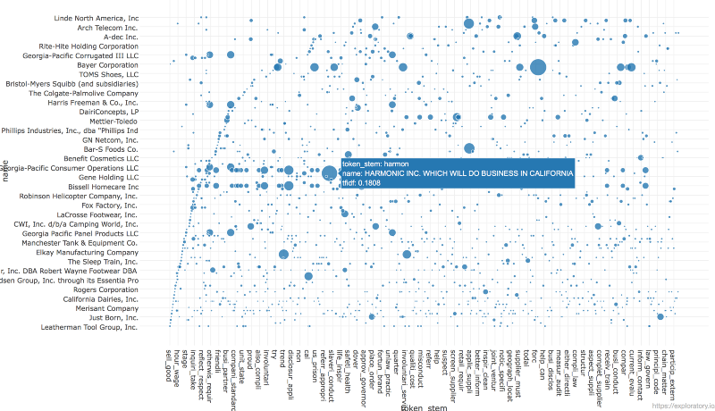
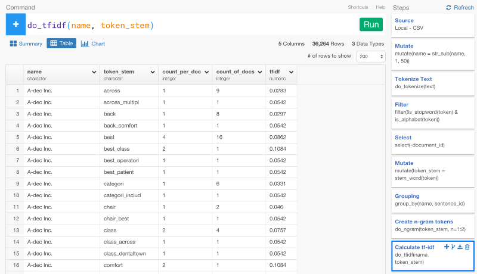
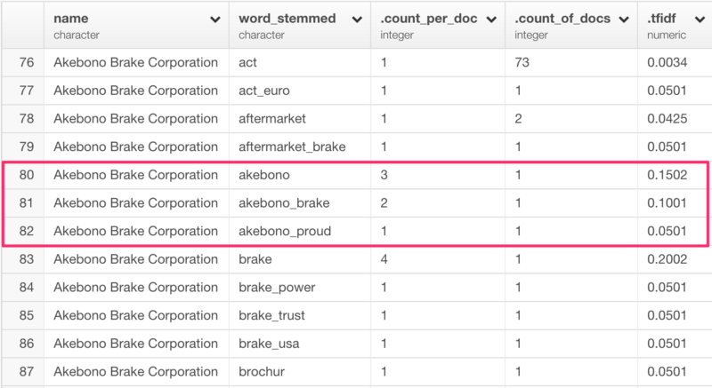
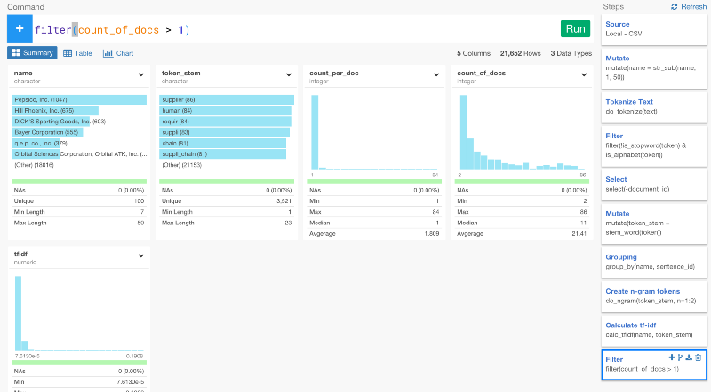
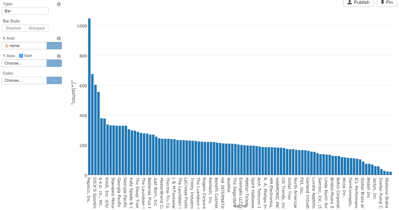
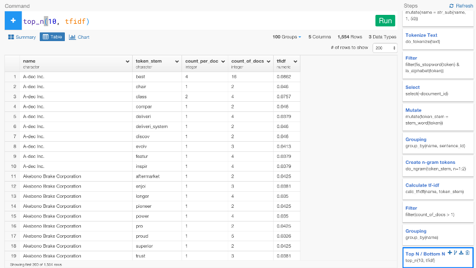
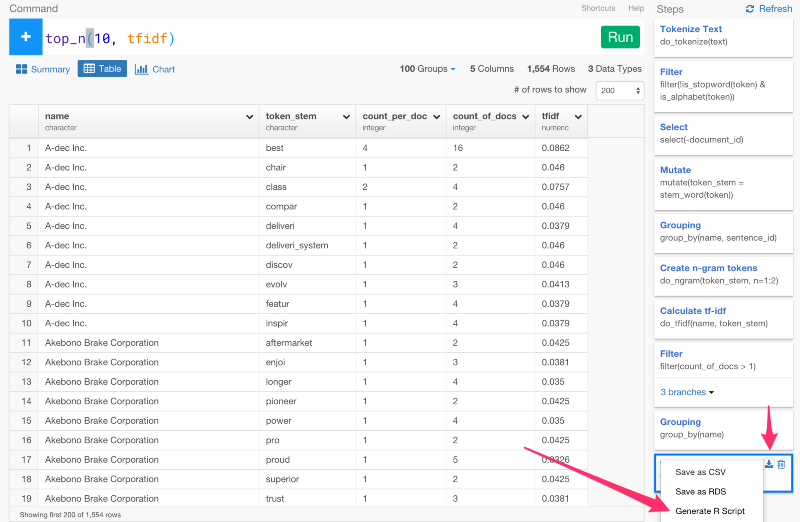

# サルでもわかるテキスト分析入門その2 — RでTF-IDFを計算することによって、ドキュメントを定量化する

このシリーズは、[サルでもわかるテキスト分析入門その１ — Rによるテキスト分析のためのドキュメントとデータを準備する](
)の続きです。前のシリーズでは、テキストデータを単語にトークン化して、stop wordsを取り除いて、派生語を語幹に戻し、n-gramsを作るところまで説明しました。今回のシリーズでは、TF-IDF (Term Frequency — Inverse Document Frequency)と呼ばれる概念に基いて、それぞれのドキュメントを定量化するところまで説明します。TF-IDFの値は、ドキュメントにおけるそれぞれの単語の重要度を表します。TF-IDFの値が高ければ高いほど、その単語は、そのドキュメントにおいて、重要であるということを意味します。

しかし、ある単語が、すべてのドキュメントに書かれていれば、その単語はさほど重要ではなくなります。例えば、わたしたちが分析するデータの例だと、もし、どのドキュメントも‘supply chain’について論じていたら、‘supply chain’という単語は、それぞれのドキュメントを特定するのに役立ちません。

この記事では、Exploratoryを使って、簡単に、TF-IDFを簡単に計算して、それぞれのドキュメントにおいて、どの単語が一番大切かを計算して出していく方法を説明します。最後には、すべてのステップをR studioで再現します。

##TF-IDFを計算する

‘exploratory’パッケージで作られたExploratoryの独自関数である、‘do_tfidf’コマンドを使って、TF-IDFを計算します。

`do_tfidf(name, token_stem)`

最初の引数は、ドキュメントを示す列で、2番目の引数は、単語を示す列です。

- count_per_doc — それぞれの単語が、それぞれのドキュメントにつき何度現れるかを計算します。単語の頻度のことです。

- count_of_docs — 指定した単語が現れるそれぞれのドキュメントの数を表します。ドキュメントの頻度のことです。

- tfidf — ドキュメントにつき現れるそれぞれの単語の数を計算したtf-idfという値のことです。

この3つの値はとても便利です。例えば、‘count_of_docs’が1と同じだったら、それは、特定の単語が、１つのドキュメントでしか現れていないことを意味します。ということは、ドキュメントの類似性を見つけるのに役立たないということなのです。

‘akebono’, ‘akebono_brake’, and ‘akebono_proud’の‘count_of_doc’の値が、1になっているのに気づきますね。これは、‘akebono’という単語は、このドキュメントを所有している会社の名前だからです。‘akebono’という単語は、このドキュメントでたくさん出てくるので、‘akebono’と‘aftermarket’を比較したとき、‘akebono’のTF-IDFの値は、‘aftermarket’より高くなるでしょう。しかし、直感的には、‘aftermarket’のほうが、‘akebono’よりドキュメント間の類似性を見出すのに役立ちますよね。

だから、‘filter’コマンドを使って、count_of_docの値を1以上にフィルタリングしましょう。

`filter(count_of_docs > 1)`

どのドキュメントにどれだけ単語が含まれてるかをチャート画面でビジュアライズしてみます。

##ドキュメントを特定するトップ10の単語を計算する

見るとわかるように、200以上の単語が書かれているドキュメントがたくさんあります。しかし、すべての単語を見ていくには多すぎるので

トップ10だけに絞ってみましょう。そのために、まず、‘name’列をgroup byします。

`group_by(name)`

次に、‘top_n’コマンドを使って、‘tfidf’の値に基いて、トップ10を計算して出します。

`top_n(10, tfidf)`

今回のシリーズで、ドキュメントにつき現れるそれぞれの単語の値を表す、TF-IDFを計算して得ることができました。次のシリーズでは、このTF-IDFの値に基いて、‘Cosine Similarity’を計算して、ドキュメントの類似性を出す方法を説明会します。

##Rで再現する

ExploratoryでRスクリプトを生成することによって、これらのステップをすべてRで再現することができます。

生成されたRスクリプトは、こんな感じになります。(ただし、libraryコマンドは、まだうまく生成できていません。すぐに改善される予定です。)

library(readr)

library(dplyr)

library(stringr)

library(exploratory)

read_delim("/Users/kannishida/Dropbox/Data/CA_Trans_Supply_Chain.csv" , ",", quote = "\"", skip = 0 , col_names = TRUE , na = c("","NA"), n_max=-1 , locale=locale(encoding = "UTF-8", decimal_mark = ".") , progress = FALSE) %>%

  exploratory::clean_data_frame() %>%

  mutate(name = str_sub(name, 1, 50)) %>%

  do_tokenize(text) %>%

  filter(!is_stopword(token) & is_alphabet(token)) %>%

  select(-document_id) %>%

  mutate(token_stem = stem_word(token)) %>%

  group_by(name, sentence_id) %>%

  do_ngram(token_stem, n=1:2) %>%

  do_tfidf(name, token_stem) %>%

  filter(count_of_docs > 1) %>%

  group_by(name) %>%

  top_n(10, tfidf)

exploratoryパッケージは、CRANにではなく、GitHub上にあります。興味がある方は、GutHubからdevtoolsパッケージといっしょにインストールすることができます。

`install.packages("devtools")`

`devtools::install_github("exploratory-io/exploratory_func")`

`library(exploratory)`

##興味を持っていただいた方、実際に触ってみたい方へ

Exploratoryは[こちら](https://exploratory.io/
)からβ版の登録ができます。こちらがinviteを完了すると、ダウンロードできるようになります。

Exploratoryの日本ユーザー向けの[Facebookグループ](https://www.facebook.com/groups/1087437647994959/members/
)を作ったのでよろしかったらどうぞ

ExploratoryのTwitterアカウントは、[こちら](https://twitter.com/ExploratoryData
)です。
