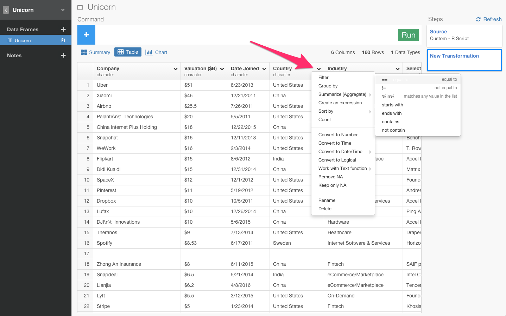

RのフロントエンドExploratoryで簡単にユニコーン企業のデータをスクレイピングしてきて、分析してみた

##0. 簡単にスクレイピング

実は、このデータは、世界中のユニコーン企業のデータを表しています。
ユニコーン企業というのは、上場していなくて、評価額が１ビリオンドル以上の評価額を得ている企業のことを指します。代表的なのだと、UberとかAirbnbとか。

どの国がユニコーンが多いのかとか、期間とバリエーションの関係性とか、いつユニコーン企業が多く生まれてるのかって気になったりしませんか？　それをExploratoryを使ってみていくことができるのでやってみます。

##1. 簡単にスクレイピング

まず、ここにさっきのリンクを貼るだけでデータをスクレイピングしてこれます。

リンクを貼るだけでデータをスクレイピングしてこれました。

もっと視覚的にわかりやすいようにチャート画面に行って、ビジュアライズ化してみます。

例えば、X軸にCountryを当てはめて、国ごとのユニコーン企業の数を出してみましょう。

ここでは、スクレイピングでとってきたWEB上のデータですけど、GitHub、Google Analytics、Google Spread sheet、Mongo DB、MySQL、JSON REST APIなどのたくさんのデータベースから本当に簡単にデータをインポートしてきて分析することも可能です。

##2. 日本にユニコーン企業はいるのか？

日本にユニコーン企業がいるのか見てみましょう。

まず、テーブル画面に行ってみます。

＋アイコンをクリックして、コマンドを打ち込みます。日本だけにフィルタリングしたいので、filterコマンドをクリックします。

次は、レコメンドされているCountryをクリックします。

次は、レコメンドされているJapanをクリックします。

実は、メルカリだけなんですよね。

ちなみに、いつもこうやってどういうカラム名、ファンクションを出したらいいのかっていうのを絶えずこのアプリケーションがチェックしてるのでいつもそのときに適したリストがレコメンドされてでてくるんです。だから、ユーザーはどこで何のfunctionを使わないといけないかを覚えておく必要はないんです。また、右に関数の説明や例が表示されるので、関数の意味をGoogleで調べる必要もありません。

##3. データから数字だけを抜き出す

次に、バリエーションのところがキャラクターになっていて、通貨の記号がはいってるんですよね。

数字以外の記号が入っているせいで、このままだと、チャートに行って、X軸をcompany、次にY軸をvalidationにしようにもsumっていう関数が使えないんですよね。

今回は、通貨の記号ですけど、％が入ってたり、円がはいってたり。こういうのってけっこうありますよね。そういうのってけっこう、regular expression とか使いながら地道にとっていけなかったりするんですけど、Exploratoryでは、コマンド１つでいけるんですよ。

要するに、通貨であれ、何かの記号であれ、数字だけを抜き出してきたいだけですよね？　そういうときは、まずここをクリックしてみます。

数字だけに転換することを意味するConvert To Timeを選びます。

すると、自動的に数字だけを抽出するコマンドが入力されます。サマリー画面も、テーブル画面もダラーを抜いたナンバーだけのカラムができましたね。

もう一回、さっきのチャートに戻って、Y軸をnumberのバリエーションができたのでそちらに変えます。そうすると、今度はsumっていう関数が使えますよね。

で、これがあまりにも数が多すぎてもしょうがないので、top_n()という関数を使って、上位１０位だけ見てみましょう。

これで評価額がトップ１０のユニコーン企業を見ることができました。

##4.  ユニコーン企業になって、どれくらいたっているか

Date.Joinedは、ユニコーン企業にいつなったか、で、そこから何年たっているかを表しています。ユニコーン企業になって、どれくらいたっているかとそこから今日までのバリエーションを比べてどういう関係性があるのかちょっと見てみたいと思いませんか？

そのために、まずこのDate.JoinのカラムがcharacterになっているのでDateに変えてみましょう。
ここが、4/8/2015となっているのでMonth Day Yearを選びます。

これでサマリーを診てもらうと、こういうふうにもともとはcharacterだったのがDateに変わって、こういうふうにヒストグラムになっているのがわかりますね。

これを今日の日付の2016年から単純にマイナスすると、ユニコーンになってから今日までどれくらいたっているかを表しますよね？

それを表すyears_since_joinedという新しいカラムを作りたいと思います。

これでチャートのほうに戻ってもらって、今度逆にScatter Plotなんか使って、X軸にyear_since_joinedを、Y軸に、validation,
Labelにcompanyを指定すると、いくつかのdotが出てきましたよね。

例えば、Uberなんかは約３年かかって５０ビリオンの評価額になっていることがわかりますね。

##5.累積を表すチャートを出す

次に、最近ITバブルなんて言われたりしてますけど、ユニコーン企業も一気に増えていったりしてるのでしょうか？

チャートを見てみますと、いついくつのユニコーン企業が生まれたのかをわかっても、累積されたものとして計算されてないので、どんな感じで増えていってるのかがわかりにくいですよね？なので、合計数が累積されたチャートを作りたいと思います。

そのために、まずDate.Joinをグルーピングします。
これでテーブルviewを見ると、ここにDate.Joinでグルーピングされてるのがわかりますね。

次にsummarize関数を使って、グルーピングされたdateごとのユニコーン企業の数を見てみたいと思います。

チャート画面に行ってみます。

例えば、これで2015年に80社近く、ユニコーン企業が生まれたりしているということがこれでわかりました。

次に、明示的に、日付でソートしてみましょう。

この状態で、cumsum関数というのを使うと、countの累積を計算できます。なので、累積を表したcum_countという新しいカラムを作りたいと思います。

これでチャートに行って、チャートタイプをLineに、Y軸をcum_countに変えてみると

ユニコーン企業が2014年を機にいっきに増えてることがわかったりします。こういう分析って他のツールだと難しいですよね。

##6. Note

##最後に

ユニコーンといえば、ぼくは以前、DHHさんのブログの記事に感銘を受けたことがあります。とても良い記事で、Mediumで1位、Hacker Newsで3位くらいになっていました。

DHH氏はRuby on Railsの生みの親で、Basecampという会社のCTOでもあります。「小さなチーム大きな仕事」「強いチームはオフィスを捨てる」を書いた人です。今回は彼のブログの一部を翻訳してみたので、ユニコーンという言葉に興味がある方は目を通してみてほしいです。もちろん、DHH氏本人から翻訳の許可を頂いています。

####ブログ: Reconsider (投資家をチームに入れていいのか？)

あなたは、今スタートアップ業界にはびこる “ディスラプトマニア”の空気に嫌気がさしていませんか。そう、私が今日ブログを書いた理由は、そんな人達が、周りにとって、やっかいで吐き気がするほどの感覚を持っていて、ディスラプトマニアになることがスタートアップが生き残るたった１つの道ではないということを気づいてほしいからです。既存産業をディスラプトしようとユニコーン企業になることに夢中になることは、スタートアップをはじめることに対して、他人のモチベーションを押し出すだけでなく、ここにいるみなさんや世界中の人達を徹底的に毒することにもなりうるのです。

今の起業家たちと話すときは、ネットワーク効果の話や、或はマネタイズのいい言葉を話題にしない日はありません。
この雰囲気では、「スタートアップ」という単語は、ビジネス全体を支配することへの追求を描くことだけに狭まっていくでしょう。スタートアップは成功によって得られる財産やユニコーン企業を創ることにとりつかれています。インターネットで、または、インターネットのために仕事をするすべての世代の人たちは、 神めいた存在であるユニコーンや成功に付随するもので溢れた強迫観念と化しています。

しかし、だれが彼らを責めることができるというのでしょうか？この一連の夢物語はたえず強まっているのです。

問題の根底から始めましょう。将来有望なユニコーンになることを期待して、少額の投資を多く行う人のことをエンジェルと呼びます。エンジェル？と不思議に思う人もいるかもしれません。実はこれは、キリストが両替商を聖堂から追い出して、「金持ちが天国へ行くよりもラクダが針の穴を通り抜ける方が簡単だ」と言い放ったという聖書の話に由来しています。

“金持ちが神の国へ入るより、ラクダが針の目を通り抜ける方が簡単である” （小さなものは不利であることのたとえであると同時に金銭は諸悪の元凶であることのたとえでもあります）。

（中略）

ユニコーンの象徴は、雑誌の表紙を飾るモデルの顔と同じ感じです。何倍にも加工され、細心を払って配置され、何時間にもわたって働かされます。

ウェブは、これまでで最も優れた起業プラットフォームだと思います。参入障壁が低く、圧倒的に多くの人にリーチすることができます。僕はウェブが大好きです。そこに許可は不要で、リーチは広大で、実装に多様性があります。資金へのアクセスという架空の壁を信じちゃいけません。そんなものは存在しないのです。

自分のモチベーションを分析して、問いただそう。思い切って資金を断り、何か役に立つものを立ち上げよう。宇宙にちょっとのくぼみを生むだけで十分です。

自分の承認欲求を抑えましょう。

そして、いつまでも幸せに暮らしましょう。

元の[英語記事](https://blog.exploratory.io/introducing-exploratory-desktop-ui-for-r-895d94ef3b7b#.4dncgv1rt
)もどうぞ。
