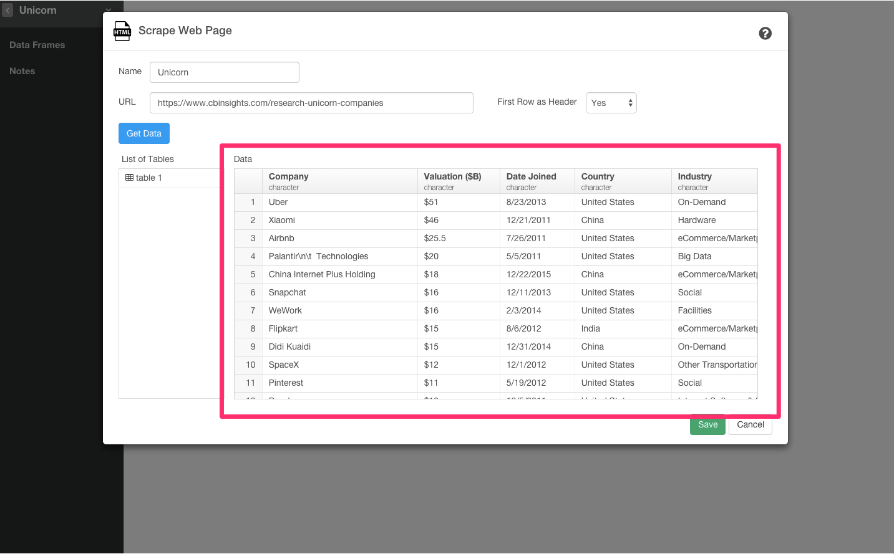
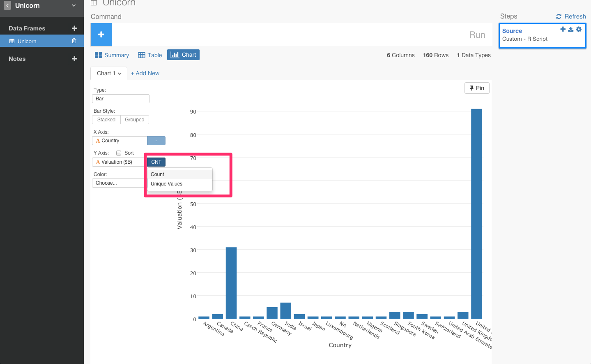
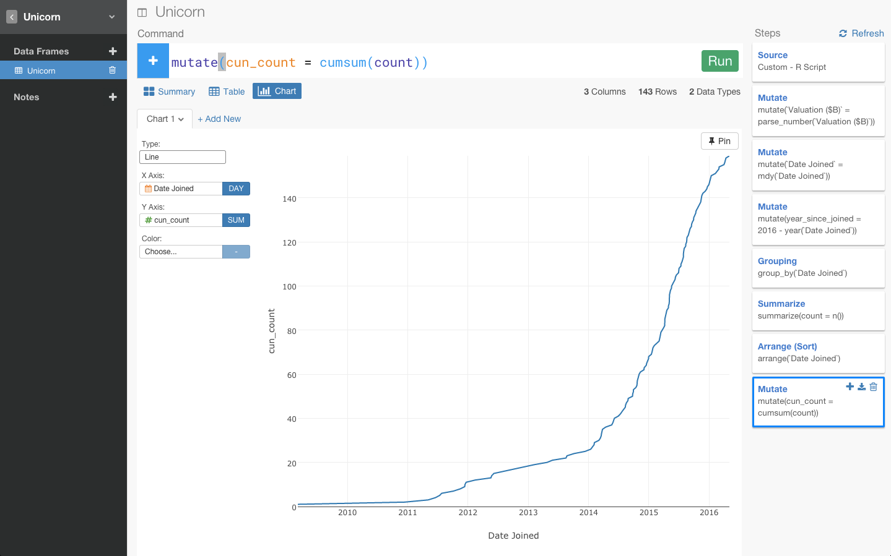
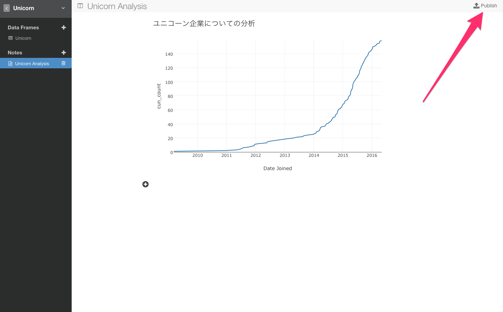

RのフロントエンドExploratoryで簡単にユニコーン企業のデータをスクレイピングしてきて、分析してみた

##0. はじめに

実は、このデータは、世界中のユニコーン企業のデータを表しています。 ユニコーン企業というのは、上場していなくて、評価額が１ビリオンドル以上の評価額を得ている企業のことを指します。代表的なのだと、UberとかAirbnbとか。

面白そうなデータですよね。どの国がユニコーンが多いのかとか、期間とバリエーションの関係性とか、いつユニコーン企業が多く生まれてるのかなって質問に答えることができそうです。ところが、こうやってウェブページにに埋まっていると、わざわざスクレイプするスクリプトを書いて、その後取ってきたデータを加工して分析できるようにするという過程が、結構めんどくさかったりしますよね。

今、Rのフロントエンドということで話題になっているExploratoryだと、データ分析だけでなく、こういったウェブ・ページからデータをスクレイピングしてくるのがものすごく簡単でシンプル、さらにはその後のデータの加工もデータ分析しながら簡単に出来るといことなので、早速やってみました。

##1. 簡単にスクレイピング

リンクを貼るだけでデータをスクレイピングしてこれました。

もっと視覚的にわかりやすいようにチャート画面に行って、ビジュアライズしてみます。

例えば、X軸にCountryを当てはめて、国ごとのユニコーン企業の数を出してみましょう。

ここでは、スクレイピングでとってきたWEB上のデータですけど、GitHub、Google Analytics、Google Spread sheet、Mongo DB、MySQL、JSON REST APIなどのたくさんのデータベースから本当に簡単にデータをインポートしてきて分析することも可能です。

##2. 日本にユニコーン企業はいるのか？

日本にユニコーン企業がいるのか見てみましょう。日本だけにフィルタリングしたいので、カラムのヘッダーをクリックしてfilterコマンドを選びます。

すると、自動的にfilter(Country ==　）が入力されます。次に、レコメンドされている候補からJapanを選びます。

実は、メルカリだけなんですよね。

ちなみに、いつもこうやってどういうカラム名、ファンクションを出したらいいのかっていうのを絶えずこのアプリケーションがチェックしてるのでいつもそのときに適したリストがレコメンドされてでてくるんです。だから、ユーザーはどこで何のfunctionを使わないといけないかを覚えておく必要はないんです。また、右に関数の説明や例が表示されるので、関数の意味をGoogleで調べる必要もありません。

##3. データから数字だけを抜き出す

次に、バリエーションのところがキャラクターになっていて、通貨の記号がはいってるんですよね。

数字以外の記号が入っているせいで、このままだと、チャートに行って、X軸をcompany、次にY軸をvalidationにしようにもsumっていう関数が使えないんですよね。

今回は、通貨の記号ですけど、％が入ってたり、円がはいってたり。こういうのってけっこうありますよね。そういうのってけっこう、regular expression とか使いながら地道にとっていけなかったりするんですけど、Exploratoryでは、コマンド１つでいけるんですよ。

要するに、通貨であれ、何かの記号であれ、数字だけを抜き出してきたいだけですよね？　そういうときは、まずここをクリックしてみます。

数字だけに転換することを意味するConvert To Timeを選びます。

すると、自動的に数字だけを抽出するコマンドが入力されます。サマリー画面も、テーブル画面もダラーを抜いたナンバーだけのカラムができましたね。

もう一回、さっきのチャートに戻って、Y軸をnumberのバリエーションができたのでそちらに変えます。そうすると、今度はsumっていう関数が使えますよね。

で、これがあまりにも数が多すぎてもしょうがないので、top_n()という関数を使って、上位１０位だけ見てみましょう。

これで評価額がトップ１０のユニコーン企業を見ることができました。

##4.  ユニコーン企業になって、どれくらいたっているか

Date.Joinedは、ユニコーン企業にいつなったか、で、そこから何年たっているかを表しています。ユニコーン企業になって、どれくらいたっているかとそこから今日までのバリエーションを比べてどういう関係性があるのかちょっと見てみたいと思いませんか？

そのために、まずこのDate.JoinのカラムがcharacterになっているのでDateに変えてみましょう。
ここが、4/8/2015となっているのでMonth Day Yearを選びます。

これでサマリーを診てもらうと、こういうふうにもともとはcharacterだったのがDateに変わって、こういうふうにヒストグラムになっているのがわかりますね。

これを今日の日付の2016年から単純にマイナスすると、ユニコーンになってから今日までどれくらいたっているかを表しますよね？

それを表すyears_since_joinedという新しいカラムを作りたいと思います。

これでチャートのほうに戻ってもらって、今度逆にScatter Plotなんか使って、X軸にyear_since_joinedを、Y軸に、validation,
Labelにcompanyを指定すると、いくつかのdotが出てきましたよね。

例えば、Uberなんかは約３年かかって５０ビリオンの評価額になっていることがわかりますね。

##5.累積を表すチャートを出す

次に、最近ITバブルなんて言われたりしてますけど、ユニコーン企業も一気に増えていったりしてるのでしょうか？

チャートを見てみますと、いついくつのユニコーン企業が生まれたのかをわかっても、累積されたものとして計算されてないので、どんな感じで増えていってるのかがわかりにくいですよね？なので、合計数が累積されたチャートを作りたいと思います。

そのために、まずDate.Joinをグルーピングします。
これでテーブルviewを見ると、ここにDate.Joinでグルーピングされてるのがわかりますね。

次にsummarize関数を使って、グルーピングされたdateごとのユニコーン企業の数を見てみたいと思います。

チャート画面に行ってみます。

例えば、これで2015年に80社近く、ユニコーン企業が生まれたりしているということがこれでわかりました。

次に、明示的に、日付でソートしてみましょう。

この状態で、cumsum関数というのを使うと、countの累積を計算できます。なので、累積を表したcum_countという新しいカラムを作りたいと思います。

これでチャートに行って、チャートタイプをLineに、Y軸をcum_countに変えてみると

ユニコーン企業が2014年を機にいっきに増えてることがわかったりします。

##6. Note

##興味を持っていただいた方、実際に触ってみたい方へ

Exploratoryは[こちら](http://docs.exploratory.io/tutorials/flight4.html
)からβ版の登録ができます。こちらがinviteを完了すると、ダウンロードできるようになります。

チュートリアルは[こちら](http://docs.exploratory.io/tutorials/intro.html
)から見ることができます。

英語が読める方は[Introducing Exploratory Desktop — UI for R](https://blog.exploratory.io/introducing-exploratory-desktop-ui-for-r-895d94ef3b7b#.4dncgv1rt
)もどうぞ

