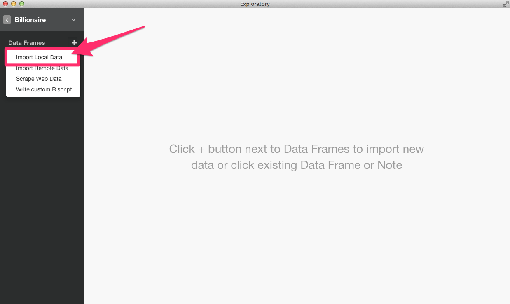
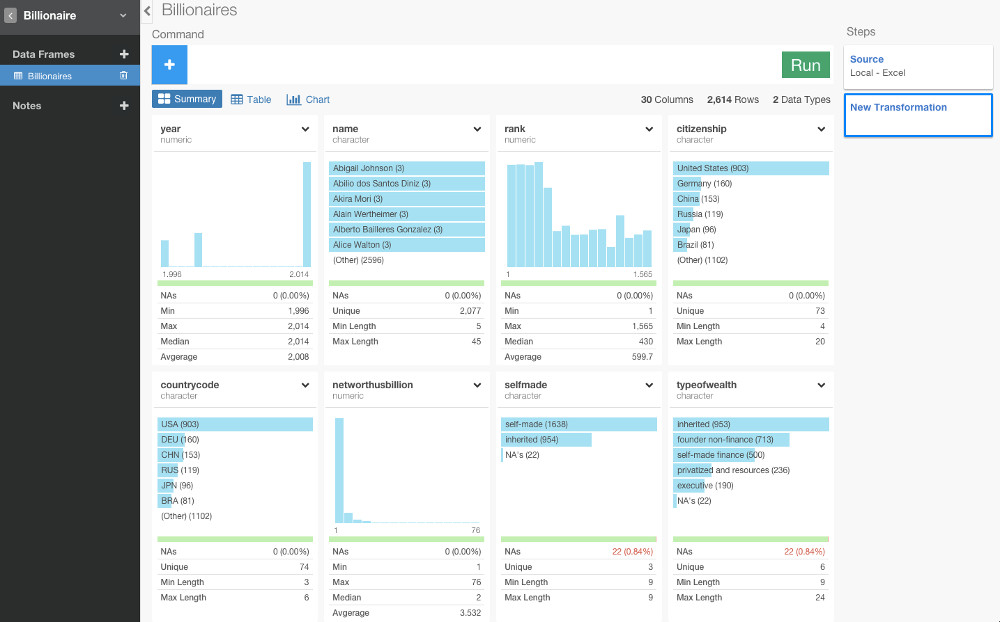
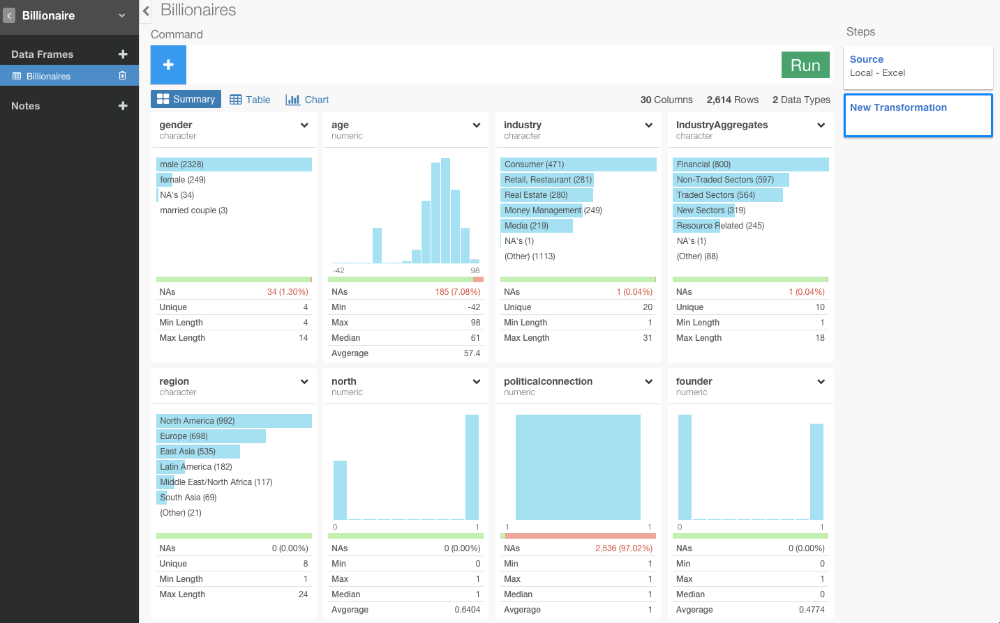
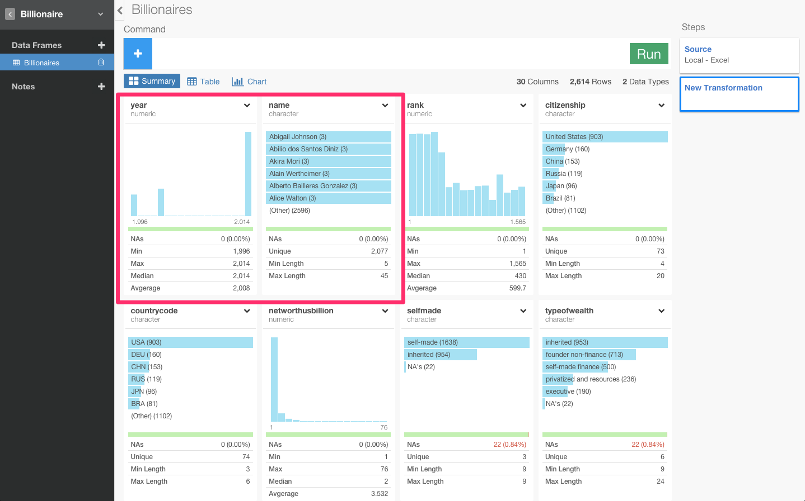
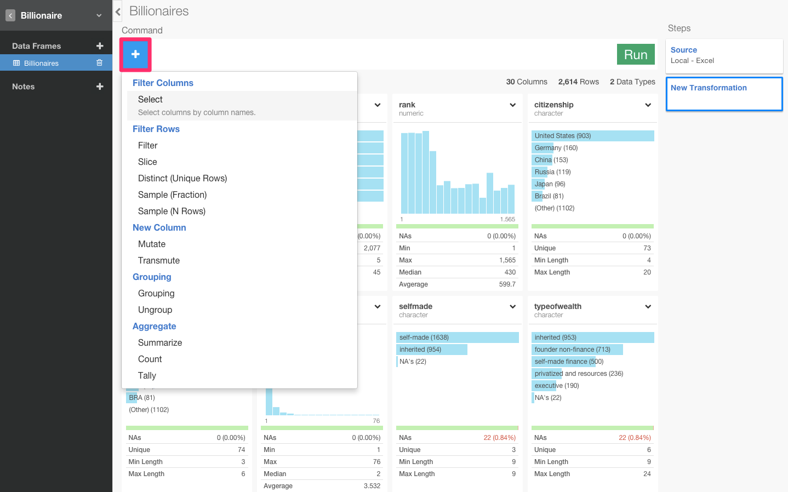
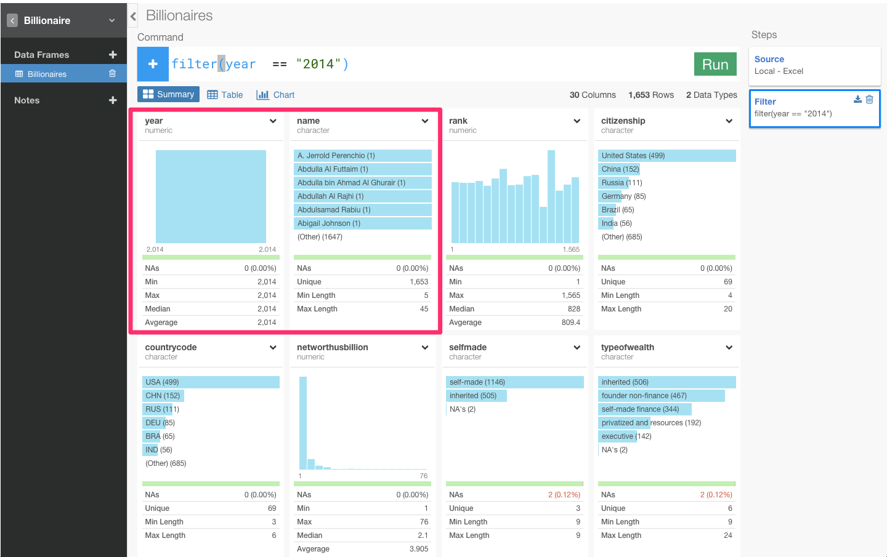
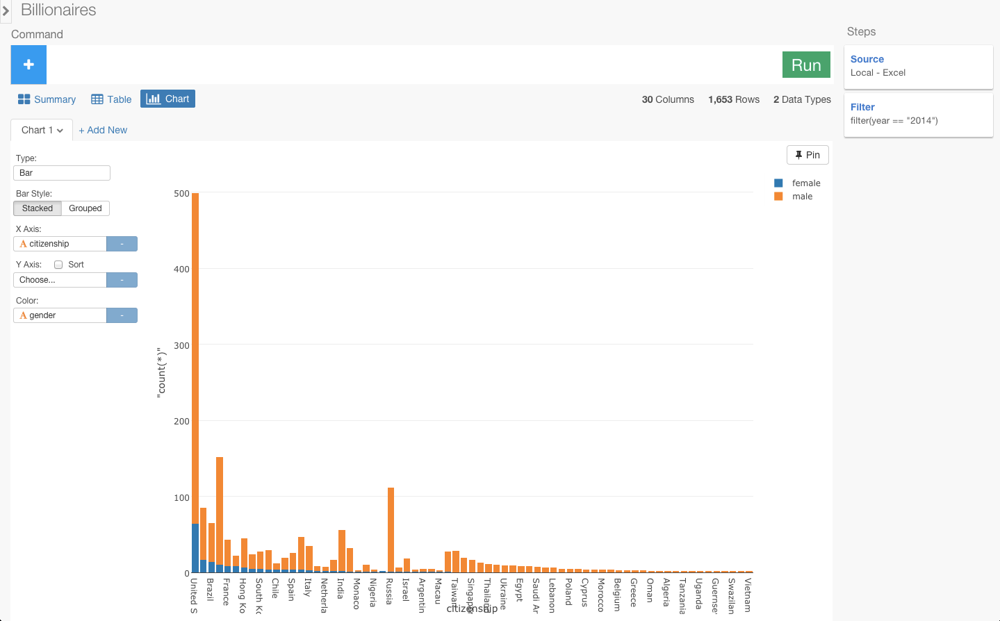
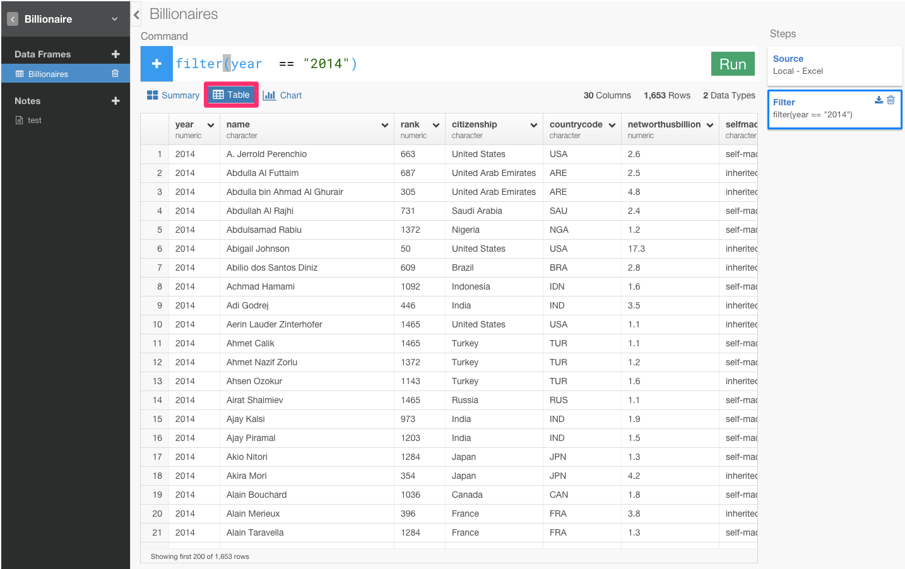

ぱっと見て、このデータがなんのデータかとかってわかりますか？　これだけ見ただけだとなんのデータかわからないですよね〜。

これは実は、フォーブズ誌からダウンロードしてきた世界の億万長者についてのデータなんですね。

そもそも億万長者ってどの国に多いんですかね。また、億万長者ってどうやってなってるんですかね。はたまた、億万長者って男性と女性どちらのほうが多いのでしょうか？

また、最近読んだ記事↓によると、ヨーロッパは女性が活躍しやすい社会だったりするそうです。だとすると、今、ヨーロッパには、女性の億万長者も多かったりするのでしょうか？

こんな疑問を、データ分析によって簡単に解決することができるプロダクトがあります。それが、ぼくが今シリコンバレーで関わっているプロジェクトです。簡単に説明すると、コマンドラインインターフェイスで、データ解析とビジュアライズが同時に、柔軟にできるソフトウェアです。

まず、ここからプロジェクトを作ることができます。

次に、ここからデータをインポートできます。

##サマリー画面

すると、さっきはエクセルでなんのことかわからなかったデータが、インポートしただけでわかりやすくなりましたね。
例えば、このcitizenshipというカラムは、その国の市民権を持っている億万長者の人の数を表しています。アメリカが一番多いことがひと目でわかります。selfmadeカラムは、selfmadeだと 起業家として億万長者になったことを意味し、inheritedだと親の相続で億万長者になっていることを意味しています。genderカラムを見てみると、女性より男性のほうが圧倒的に億万長者が多いことがわかりますね。

##ヨーロッパだと、女性の億万長者が多いのか？

これからExploratoryでできることの紹介も兼ねて、冒頭で少し述べた、「今、ヨーロッパには、女性の億万長者も多かったりするのでしょうか？」という問いにデータの面から分析していきたいと思います。

###準備

まず、今のままだと正確なデータを分析していくことができません。なぜでしょうか？

yearカラムとnameカラムを見てみましょう。

yearカラムは、2014年、2000年、1996年の3つのデータが含まれていますね。
次に、nameカラムを見てみると、例えば、Akira Moriさん（森ビルの人）の最後には、3となっていますね。これは、3回カウントされているということです。つまり、このデータにおいてAkira Moriさんは、2014年、2000年、1996年どの年度のときにも億万長者としてカウントされていたことを意味します。

ぼくたちが知りたいのは、今のヨーロッパの億万長者についての情報であり、同じ人物が複数回カウントされていると意味のあるデータがとれなくなるので、最新の2014年以外のデータは排除する必要があります。

そういう場合、エクセルとかだと画面のどこかから、指定のカラム以外を排除する関数のボタンを探したりするのに対し、Exploratoryは＋アイコンを押すとデータを分析するためのコマンドの一覧が表示されるので、そこから選んだり、また自分でSQLコマンドを書くように打ち込んでいくことも可能です。

2014年のデータだけにフィルタリングして見たいわけなので、filter関数というのを使います。そしてyear == 2014 と指定してRunボタンを押すと

すると、yearが2014年だけになり、nameの回数も3から1になりましたね。

チャート画面では、ビジュアライゼーションによってデータをより直観的に理解することができるようになります。

それぞれの国ごとにおける性別のグラフを見たいので、X軸にcitizenship、colorにgenderを指定します。青はfemaleで、オレンジは、maleを表しています。

億万長者は、アメリカ市民がたくさんいて、男性の比率が圧倒的に高いことがひと目でわかりますね。
たったこれだけで、簡単なグラフを作ることができました。

つまり、Exploratoryでは、データをインポートしただけで、データの概要を直観的に理解することができるようになり、さらにデータ分析するうえで致命的なミスに気づいて、改善するところまでできました。

###それぞれの国における億万長者の男女の比率の計算

ただし、「今、ヨーロッパには、女性の億万長者も多かったりするのでしょうか？」という問いに答えるためには、このグラフだけではまだ解決できていない問題があります。それは、それぞれのバーの高さが違うため、それぞれの国における億万長者の男女の比率がわからないことなんです。

だから、それぞれの国における女性の比率を計算してだしてみたいと思います。

まず、テーブル画面に行くと、エクセルのような形で行形式でデータを見ることができます。

citizenship(どの国）とgender（男女）の関係について知る必要があるので両者をグルーピングします。グルーピングするには、group_byという関数を使うとできます。

citizenshipとgenderがグルーピングされていることを確認できますね。

さて、これから比率をだしていくために、それぞれの国でそれぞれの性別が何人いるかを表すカウントって名前のカラムを作ります。統合して新しいカラムを作るときは、集計を意味するsummerizeという関数を使います。カーソルを動かしながらこういったいろんなファンクションが用意されています。

そういえば、もう気づいたかもしれないですけど、いつもこうやってどういうカラム名、ファンクションを出したらいいのかっていうのを絶えずこのアプリケーションがチェックしてるのでいつもそのときに適したリストがレコメンドされてでてくるんです。例えば、この時に出てくるリストは、summerize（集計）のときにだけ使えるリストです。だから、ユーザーはどこで何のfunctionを使わないといけないかを覚えておく必要はないんです。システムに従うだけで大丈夫です。averageも出したいならあるし、total出したいならsum（布石）　今回はcountしたいからn

比率を出したいんですがどうやってだします？　例えば、オーストラリアを見て下さい。femaleが4人で、maleが25人だから、女性の比率が多い国はここで、合計の29人を4人で割ったらいいですよね？　だから、とりあえず合計のカラムを作ってみましょう。今回はmutateを使います。なぜ今回はmutateなのか？

違いは、行をまとめるときは、さっきのようにsummerizeを使う。それに対し、mutateの場合は、この行のまま新しいカラムを作りたいときに計算をするときに使います。計算をしたいときは基本的にこの２つしか使いません。

今回は、それぞれの行を残しながら計算をしたいのでmutateを使う。

そのためには、合計を示すsumというfunctionを使います（totalとratioのステップを分ける）

テーブルだけだといまいちわからないですよね？　もっとビジュアライズ化して直観的に理解できるようにチャートに行ってみましょう

###意味の有るデータのために母集団をfilter、トータルの数が５以上

意味の有るデータのために母集団をfilter、トータルの数が５以上
ピンせずにやってみる

ピンというボタンを押すと、一番最後にfilterした部分が青くなりましたよね？この青くなった最後のステップのデータにこのチャートは固定されてます。今ここでSTEPを移動しましたけど、もしピンしていないとチャートはこのときのデータを取りにいこうとします。でも、ピンしているからこの青くなっているデータのままです。femaleの多い国は、ゆっくり、フランスとかドイツとかチリとかオーストラリアなんですね。

selfmadeだけにしたら、なんか国が減ってしまいましたね。スイスランドとアメリカになっていますね。　さっきのフランスやドイツなどは消えてしまいましたね。ゆっくり。

inheritedにしたら、もっと国が増えていて、トルコやオーストラリアやチリが多くなっていますね。そこから、フランスやドイツが見えますよね。

つまり、ヨーロッパでは、selfmadeで億万長者になった人はあまりいないんですね。

これでもうほとんど終わりなんですけど、最後に１つだけ見せたい機能があるんです。これはけっこう面白い機能ですし、なんで右のようなステップになっているのかっていうのがもっと理解してもらえると思いますから。ちょっと見て下さい。

いまはgenderのratioを見てるけど、そうじゃなくてindustryごとのratioを見てみたいと思いませんか？　そういうときは、groupingのSTEPに行って、ひとつ変えるだけですぐできるんです。じゃあgroupingに行ってみましょう。selfmade消す。このチャートは、一番最後の青くなっているところにピンされているんですけどいまグルーピング変えたらその結果を自動的に一番最後まで実行してチャートのデータを出すことができるんですよ。

この発見をシェアしたいと思いませんか？　一部の国は、建設業のビリオネアが多い。今日は時間がないんで、この辺にしますけど、こんなふうにブログを書く感覚で簡単にデータ分析のレポートを書くことができます。データアナリシスするだけじゃなくて、他の仕事仲間とかと簡単にシェアすることもできます。

##ブログをpublishする

Excelをディスる
どんどんステップ足していくこともできるし、修正することもできます。なにをするときも、いつもここのコマンドで変えることができるから、文法さえ覚えてしまえばこんなに簡単にいろんなデータをいろんな角度から見ていくことができるんです。

##最後に

留学先である、人材の流動性が高いシリコンバレーは実力主義のイメージが強いですが、仮にそうだとすると、次のデータはどう説明すればいいのでしょうか。[ソース](https://medium.com/diversify-tech/i-m-a-white-guy-in-silicon-valley-and-i-m-done-buying-the-meritocracy-myth-2cc0ef9f9b60#.lql629j9y)

1. シリコンバレーのトップ企業の管理職は78%が男性
2. エンジニアは85%が男性
3. 取締役レベルだと89%が男性
4. CEOレベルだと93%が男性
5. ベンチャー投資家だと96%が男性　

「シリコンバレー = 実力が全ての世界」とするのであれば、このデータからは「男性の実力 > 女性の実力」と結論付けるしかありません。だが実際には、シリコンバレーは男社会で(日本ほどではありませんが)、女性はキャリア面でハンデを負っています。

だから、ぼくの留学先であるシリコンバレーでは、女性エンジニアが少ないから、女性エンジニアを増やそうという動きが出てきています。ついこないだ、プログラミングでジェンダーギャップを失くそうとしているShe++という団体がスタンフォード大学でカンファレンス的なのをしていたので見に行ったりしてました。

社会的に恵まれている人たちの中でも、実力主義を宗教のように信じている人たちは、実力の劣る人たちを見て「努力不足だ」と蔑むことはしても、男女の問題など、その後ろにある社会の不平等に気付かないことが多い気がします。完全な実力主義社会など存在しないことを、忘れてはいけません。

##追記

- 棒グラフ以外も見れる
- データベースの豊富さ
- 今回は使いませんでしたが、このソフトウェアはプログラミング言語「R」の上に開発されているので、使うコマンドや関数はRとほとんど同じになります。Rでできることは全てできます。Rは数学系のライブラリが充実しているので、クラスタリングやコホート分析や決定木分析などのような高度な統計や数学を応用してデータを分析していくことも可能です。

