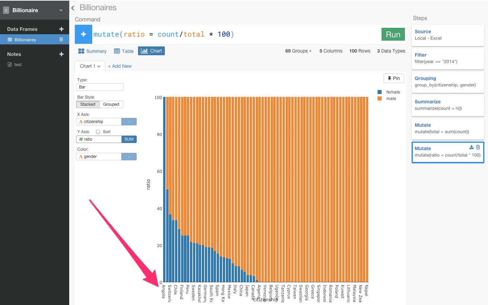
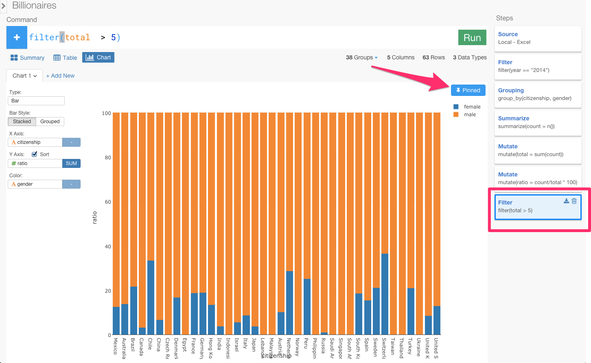

ぱっと見て、このデータがなんのデータかとかってわかりますか？　これだけ見ただけだとなんのデータかわからないですよね〜。

これは実は、フォーブズ誌からダウンロードしてきた世界の億万長者についてのデータなんですね。

そもそも億万長者ってどの国に多いんですかね。また、億万長者ってどうやってなってるんですかね。はたまた、億万長者って男性と女性どちらのほうが多いのでしょうか？

また、最近読んだ記事↓によると、ヨーロッパは女性が活躍しやすい社会だったりするそうです。だとすると、今、ヨーロッパには、女性の億万長者も多かったりするのでしょうか？

こんな疑問を、データ分析によって簡単に解決することができるプロダクトがあります。それが、ぼくが今シリコンバレーで関わっているExploratoryというプロジェクトです。簡単に説明すると、コマンドラインインターフェイスで、データ解析とビジュアライズが同時に、柔軟にできるソフトウェアです。

まず、ここからプロジェクトを作ることができます。

次に、ここからデータをインポートできます。

##サマリー画面

すると、さっきはエクセルでなんのことかわからなかったデータが、インポートしただけでわかりやすくなりましたね。
例えば、このcitizenshipというカラムは、その国の市民権を持っている億万長者の人の数を表しています。アメリカが一番多いことがひと目でわかります。selfmadeカラムは、selfmadeだと 自分の力（起業など）で億万長者になったことを意味し、inheritedだと親の相続で億万長者になっていることを意味しています。genderカラムを見てみると、女性より男性のほうが圧倒的に億万長者が多いことがわかりますね。

##ヨーロッパだと、女性の億万長者が多いのか？

これからExploratoryでできることの紹介も兼ねて、冒頭で少し述べた、「今、ヨーロッパには、女性の億万長者も多かったりするのでしょうか？」という問いにデータの面から分析していきたいと思います。

###準備

まず、今のままだと正確なデータを分析していくことができません。なぜでしょうか？

yearカラムとnameカラムを見てみましょう。

yearカラムは、2014年、2000年、1996年の3つのデータが含まれていますね。
次に、nameカラムを見てみると、例えば、Akira Moriさん（六本木の森ビルの人）の最後には、3となっていますね。これは、3回カウントされているということです。つまり、このデータにおいてAkira Moriさんは、2014年、2000年、1996年どの年度のときにも億万長者としてカウントされていたことを意味します。

ぼくたちが知りたいのは、今のヨーロッパの億万長者についての情報であり、同じ人物が複数回カウントされていると意味のあるデータがとれなくなるので、最新の2014年以外のデータは排除する必要があります。

そういう場合、エクセルとかだと画面のどこかから、指定のカラム以外を排除する関数のボタンを探したりするのに対し、Exploratoryは＋アイコンを押すとデータを分析するためのコマンドの一覧が表示されるので、そこから選んだり、また自分でSQL文を書くように打ち込んでいくことも可能です。

また、それぞれのカラムの矢印の部分を押してコマンドを選択することも可能です。

2014年のデータだけにフィルタリングして見たいわけなので、カラムの矢印の部分を押して出てきたFilterを押します。

すると自動的にfilter(year ==　)と打ち込まれます。そして、2014と指定してRunボタンを押します。

すると、yearが2014年だけになり、nameの回数も3から1になりましたね。

チャート画面では、ビジュアライゼーションによってデータをより直観的に理解することができるようになります。

それぞれの国ごとにおける性別のグラフを見たいので、X軸にcitizenship、colorにgenderを指定します。青はfemaleで、オレンジは、maleを表しています。

億万長者は、アメリカ市民がたくさんいて、男性の比率が圧倒的に高いことがひと目でわかりますね。
たったこれだけで、簡単なチャートを作ることができました。

つまり、Exploratoryでは、データをインポートしただけで、データの概要を直観的に理解することができるようになり、さらにデータ分析するうえで致命的なミスに気づいて、改善するところまでできました。

###それぞれの国における億万長者の男女の比率の計算

ただし、「今、ヨーロッパには、女性の億万長者も多かったりするのでしょうか？」という問いに答えるためには、このグラフだけではまだ解決できていない問題があります。それは、それぞれのバーの高さが違うため、それぞれの国における億万長者の男女の比率がわからないことなんです。

だから、それぞれの国における女性の比率を計算してだしてみたいと思います。

まず、テーブル画面に行くと、エクセルのような形で行形式でデータを見ることができます。

citizenship(どの国）とgender（男女）の関係について知る必要があるので両者をグルーピングします。グルーピングするには、Group_byを使うとできます。
先ほどと同じように、citizenshipの矢印の部分を押します。

Group_byをクリックします。

すると、group_by(citizenship)と自動的に入力されます。これにgender（男女）を加えます。

citizenshipとgenderがグルーピングされていることを確認できますね。

さて、これから比率をだしていくためには〜が必要です。だから、まず、それぞれの国でそれぞれの性別が何人いるかを表すcountって名前のカラムを作ります。カラムを統合して新しいカラムを作るときは、集計を意味するsummerizeという関数を使います。

カーソルを動かしながらこういったいろんなファンクションが用意されています。いつもこうやってどういうカラム名、ファンクションを出したらいいのかっていうのを絶えずこのアプリケーションがチェックしてるのでいつもそのときに適したリストがレコメンドされてでてくるんです。

例えば、この時に出てくるリストは、summerize（集計）のときにだけ使えるリストです。だから、ユーザーはどこで何のfunctionを使わないといけないかを覚えておく必要はないんです。また、右に関数の説明や例が表示されるので、関数の意味をGoogleで調べる必要もありません。平均を出したい場合は、mean関数を使えばいいし、合計を出したいならsum関数が使えます。今回はcountしたいので、そのときは、n関数を使います。

例えば、オーストラリアを見て下さい。femaleが4人で、maleが25人になっています。女性の比率を求めるには、男女の合計である29人を女性の4人で割ったらいいですよね？　だから、まず合計を意味するtotalカラムを作ってみましょう。新しいカラムを作るために、今回はmutateコマンドを使います。なぜ今回は、前回のようにsummerizeではなく、mutateなのか？

違いは、行をまとめるときは、さっきのようにsummerizeを使います。それに対し、mutateの場合は、この行のまま新しいカラムを作りたいときに計算をするときに使います。

今回は、それぞれの行を残しながら計算をしたいのでmutateを使います。そして、合計を出すsum関数を使います

合計を表すカラムが作れたので、次は、それを基に比率を表すratioというカラムを作りましょう。countカラムをtotalカラムで割り算をすると、比率を出すことができます。

0.1379や0.8621となっていてわかりにくいので、確率なので100倍します。

オーストラリアでは、億万長者のうち、約13%が女性で、約86%が男性ということです。
これで、それぞれの国における億万長者の男女の比率を計算して求めることができました。

###意味のあるデータにする

テーブルだけだといまいちわからないので、もっとビジュアライズ化して直観的に理解できるようにチャート画面に行ってみましょう。
X軸にcitizenshipをY軸にratioをcolorにgenderを指定します。

女性の億万長者の比率が圧倒的に高い国は、Angola（アンゴラ）になっています。

では、Angola（アンゴラ）が本当に世界で一番女性の億万長者の比率が高い国であると言えるのでしょうか？

テーブル画面に行ってみましょう。

Angola（アンゴラ）の億万長者の合計人数は1人でその1人は女性になっています。つまり、母集団の数が少なすぎるため意味のあるデータではなくなっているのです。意味の有るデータにするために母集団の数にフィルタリングをかけましょう。ここでは、５人以上にフィルタリングします。

これで、totalが5人以上の国しか表示されなくなりましたね。

###ヨーロッパは女性が活躍しやすい社会なのか？

この状態で、チャート画面にもう一度行ってみます。

女性の億万長者が多い国は、順に見ていくと、チリ、スイス、オランダ、ペルー、ドイツ、フランス、デンマークとなっていて、確かにヨーロッパが多くなっていますね。

最初に少し述べた、どうやって億万長者になったかを表すselfmadeというカラムを覚えていますか？　このカラムを使って、相続で億万長者になった場合と、自力で億万長者になった国に違いがあるのか見てみましょう。なので、最初のyearを指定したFilterのステップに戻りたいと思います。

あれ、Filterのステップに戻るとY軸のratioが外れ、チャートの様子も変わってしまいましたね。これは、今青くなっているFilterのステップの時点では、ratioカラムは存在していないからなんです。この問題を防ぐために、Pinボタンというのがあります。

Pinというボタンを押すと、一番最後にfilterした部分が青くなりましたよね？この青くなった最後のステップのデータにこのチャートは固定されてます。この状態で、Filterのステップに戻ってみると・・・

今ここでSTEPを移動しましたけど、Pinしているので、この青くなっているSTEPにチャートを固定しながら、過去のSTEPを更新できるようになりました。
この状態で、相続で億万長者になった人だけにフィルタリングしたいと思います。

相続で億万長者になった女性の多い国は、オーストラリア、チリ、フランス、ドイツ、ブラジル、スペイン、スウェーデン、スイスとやっぱりヨーロッパが多くなっていますね。

次に、自力で億万長者になった人（selfmade）だけにフィルタリングしたいと思います。

なんか国が一気に減ってしまいましたね。自力で億万長者になった女性の多い国はスイスとアメリカが少しいるくらいになっています。さっきのフランスやドイツなどのヨーロッパを中心とした国々は消えてしまいましたね。

つまり、確かに、ヨーロッパには女性の億万長者の数は世界的に見ても多いです。しかし、ヨーロッパの女性の億万長者のほとんどが、親族からの相続なのです。自力で億万長者になった女性はあまりいません。だから、「ヨーロッパは女性が活躍しやすい社会」であるとは一概に言うことはできないかもしれません。

###おまけ

これでもうほとんど終わりなんですけど、最後に１つだけ見せたい機能があるんです。これは技術的にもけっこう面白い機能で、なんで右のようなステップになっているのかっていうのがもっと理解してもらえると思います。

いまはgender（性別）のratio（比率）を見てますけど、そうじゃなくてindustry（産業）ごとのratioを見てみたいと思いませんか？　そういうときは、groupingのSTEPに行って、ひとつ変えるだけですぐできるんです。じゃあGroupingに行ってみましょう。

このチャートは、一番最後の青くなっているところにピンされているんですけどいまGroupingを更新したらその結果を自動的に一番最後まで実行してチャートのデータを出すことができるんですよ。

##記録する、シェアする

この発見を記録したり、シェアしたいと思いませんか？　Noteというボタンを押してみましょう。

こんなふうにブログを書く感覚で簡単にデータ分析のレポートを書くことができます。データ分析するだけじゃなくて、他の仲間にも簡単にシェアすることもできます。

この最初からの一連のステップをExcelですることを想像できるでしょうか？笑

Exploratoryでは、どんどん分析のためのステップ足していくこともできるし、途中で修正することもできます。どんなデータ分析をするときも、いつも指定の場所からコマンドを打つことができるので、Rの文法さえ覚えてしまえばこんなに簡単にいろんなデータをいろんな角度から見ていくことができるんです。

##最後に

留学先である、人材の流動性が高いシリコンバレーは実力主義のイメージが強いですが、仮にそうだとすると、次のデータはどう説明すればいいのでしょうか。[ソース](https://medium.com/diversify-tech/i-m-a-white-guy-in-silicon-valley-and-i-m-done-buying-the-meritocracy-myth-2cc0ef9f9b60#.lql629j9y)

1. シリコンバレーのトップ企業の管理職は78%が男性
2. エンジニアは85%が男性
3. 取締役レベルだと89%が男性
4. CEOレベルだと93%が男性
5. ベンチャー投資家だと96%が男性　

「シリコンバレー = 実力が全ての世界」とするのであれば、このデータからは「男性の実力 > 女性の実力」と結論付けるしかありません。だが実際には、シリコンバレーは男社会で(日本ほどではありませんが)、女性はキャリア面でハンデを負っています。

だから、ぼくの留学先であるシリコンバレーでは、女性エンジニアが少ないから、女性エンジニアを増やそうという動きが出てきています。ついこないだ、女性のコンピュータサイエンス教育によってジェンダーギャップを失くそうとしている[She++](http://www.sheplusplus.org/
)という団体がスタンフォード大学でカンファレンス的なのをしていたので見に行ったりしてました。

社会的に恵まれている人たちの中でも、実力主義を宗教のように信じている人たちは、実力の劣る人たちを見て「努力不足だ」と蔑むことはしても、男女の問題など、その後ろにある社会の不平等に気付かないことが多い気がします。完全な実力主義社会など存在しないことを、忘れてはいけません。

##追記

- 今回は、棒グラフしか使いませんでしたが、棒グラフ以外のグラフタイプもサポートしています。

- 今回は、ローカルのファイルをインポートしてきて分析しましたが、以下のように、GitHub、Google Analytics、Google Spread sheet、Mongo DB、MySQL、JSON REST APIなどのたくさんのデータベースから本当に簡単にデータをインポートしてきて分析することも可能です。

また、データがWeb上にある場合は、リンクを貼っていただけると簡単にスクレイピングして取得することも可能です。

- 今回は使いませんでしたが、このソフトウェアはプログラミング言語「R」の上に開発されているので、使うコマンドや関数はRとほとんど同じになります。Rでできることは全てできます。Rは数学系のライブラリが充実しているので、クラスタリングやコホート分析や決定木分析などのような高度な統計や数学を応用してデータを分析していくことも可能です。

Exploratoryは[こちら](http://docs.exploratory.io/tutorials/flight4.html
)からダウンロードできます。

チュートリアルは[こちら](http://docs.exploratory.io/tutorials/intro.html
)から見ることができます。
