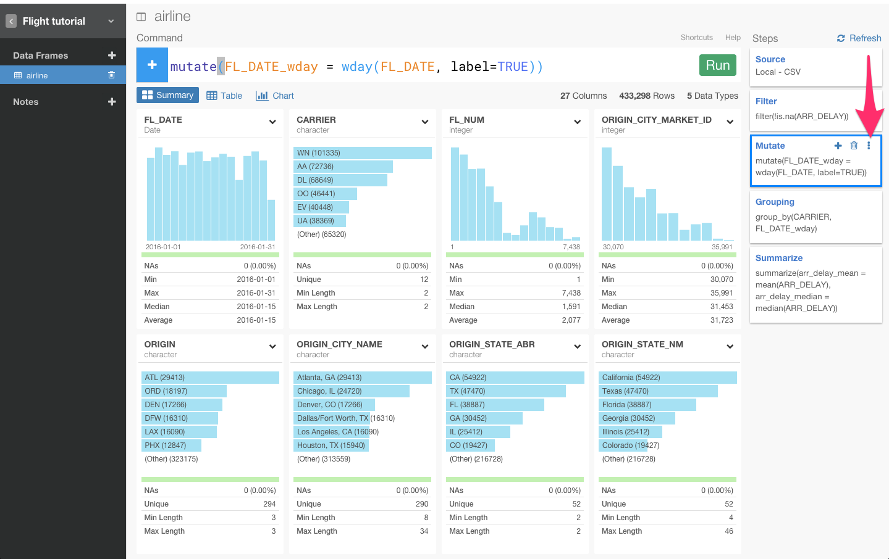
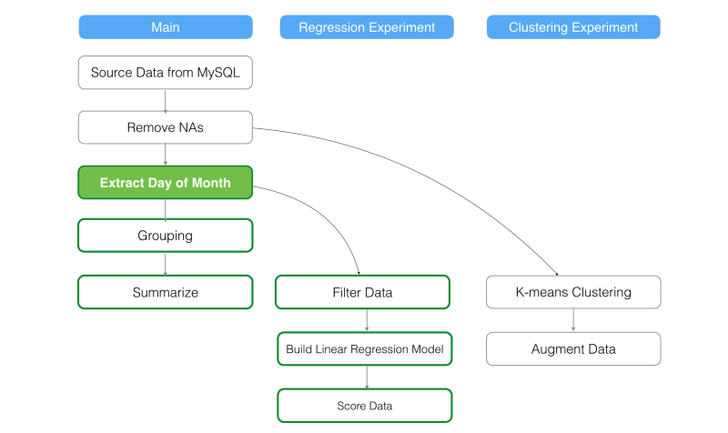

#Introducing Branch for Running Multiple Experiments Quickly

データを探っていくときに、何か発見して、たくさんの質問が思いついたりした経験はありませんか？　今までだと、そのような試行錯誤を繰り返すためには、たくさんの異なるデータ分析のやり方を試さないとだめでしたよね。

また、アルゴリズムやパラメータの設定で区別された異なるモデルを作ることだったり、CountriesやYearsやStatusなどでグルーピングされたデータをaggregateして、それぞれの違いを素早く確認したかったりしませんか？　でも、データがaggregateされた後だと、データの大部分が失われているので、失われたデータに対してクエリできなかったり、フィルタリングできなかったりしますよね。

今までなら、そういう場合は、同じデータに対して、いくつもデータフレームを新しく作り、途中まで全く同じデータ分析ステップを入力する必要がありめんどくさくありませんでしたか？

この問題を解決するために、Exploratoryは、‘Branch’機能を実装しました。

プログラミング経験がある人にとっては、この‘Branch’というのは、Gitにおけるbranchとほぼ同じものだと考えてもらったほうがわかりやすいかもしれません。どうなっているのか、なぜこれが便利かを今から説明していきます。

##異なる分析フローを試すために、ブランチを作る

例えば、下図のように、NA値を除去して、曜日情報を抜き出して、データを統合するような分析をしたいとします。

データはこのような感じになるでしょう。

今、この‘flight delay’データの例における、Arrival Delay Time （到着時間）とDeparture Delay Time（出発時間）に相関関係があるかを確かめるために、線形回帰モデルを作りたいとします。しかし、データを見てみると、今、この状態では、モデルを作るのに、必要なデータがありません。なぜなら、分析の最後のステップで、summarizeをしたときにsummarizeに含まれていないデータの大部分は消えてしまったからです。

もちろん、もう１つのデータフレームを作って試すことも出来ますが、途中まで全く同じデータ分析ステップを入力する必要があったりめんどくさいですよね？こういうときにBranch機能が使えます。Branch機能を使えば、下図のように、‘Extract Day of Week’ステップから‘Linear_Regression’というブランチを簡単に作って試すことができます。

下図で赤矢印で指している‘Branch’をクリックしてみてください。

すると、線形回帰モデルを作って検証するために、このブランチ特有のデータ分析ステップを加えることができます。

K-meansクラスタリングモデルを作ることもできますが、今回は、メインブランチの‘Remove NAs’から新しくブランチを作ってみましょう。このような感じになります。

これは、あなたがK-means Clustering branchにいるときに見えるチャートです。

メインブランチでは、どのステップからどのブランチが枝分かれしているのか一目瞭然です。

##DAGエンジンによって、データ依存性を管理する

ブランチ機能は、Exploratoryが独自に開発しているExploratory DAG (Directed acyclic graph)エンジンの上で実装されています。これは、つまり、どれかのステップからブランチを作ることができるだけでなく、データの中のデータ依存性も期待できるといいことなのです。どういうことかと説明すると、

####メインブランチのデータ分析ステップに変更があったときに何が起こるか？

メインブランチのデータ分析ステップに変更があったときに何が起こると思いますか？

Exploratoryは、バックエンドでデータ依存性を自動的に管理しています。だから、オリジナルのデータをインポートしてくるステップを含め、メインブランチのデータ分析ステップの変更は、すべて自動的に子ブランチに反映されます。

‘Regression Experiment’と‘Clustering Experiment’ブランチの例を使って、具体的に確認していきましょう。

####ローカルやリモートデータのデータをリロードする。

例えば、‘Refresh’ボタンをクリックしてリモートのデータベースからデータをリロードしてみましょう。すると、メインブランチと子ブランチすべてのステップのステップのデータが更新され、それぞれのステップのデータをキャッシュします。

背景色が緑のBOXは、ユーザによってデータが更新されるステップです。枠が緑のBOXは、自動的にデータが更新されるステップです。

####メインブランチのステップを変更する

例えば、メインブランチで、‘Extract Day of Week’ステップを‘Extract Day of Month’に変えてみましょう。このステップは、メインブランチにありますが、メインブランチで‘Extract Day of Month’ステップをした後に、自動的に、メインブランチの全てのステップに、変更を反映させ、‘Extract Day of Month’に対して、データ依存性を持っているブランチだけにも変更を反映させます。

上記の例だと、‘Clustering Experiment’ブランチのデータは、全く更新されません。なぜなら、‘Extract Day of Month’.ステップの更新に依存性がないからです。今、もし、メインブランチの‘Grouping’を更新しても、‘Regression Experiment’と‘Clustering Experiment’ブランチの両方は全く影響を受けません。

####ブランチが除去されたときは、ステップも除去されるのか？

メインブランチでステップが除去されると、そのステップに依存性のあるブランチは自動的に、削除される前のステップにマッピングされます。次のケースを考えてみてください

‘Regression Experiment’ブランチが直接枝分かれしている‘Extract Day of Week’ステップを削除したとしましょう。すると、‘Regression Experiment’ブランチは、親のいないブランチになってしまいますね。しかし、ExploratoryDAGエンジンが自動的に、削除される1つの前のステップ、つまり、‘Remove NAs’ステップに接続し直します。

そして、メインブランチと‘Regression Experiment’ブランチの全てのステップのキャッシュを更新します。

####もし、いくつかのデータフレームが別のデータフレームから来ていたら？

Exploratoryでは、下記のように、異なるデータフレームからデータをジョインしたり、マージすることができます。

上の写真だと、背景色が赤色の‘Aiport — Main’BOXは、‘Flight’データフレームのメインブランチの3番目のステップでジョインしたデータフレームと異なっています。

例えば、元のウェブサイトから‘Airport’データをリロードしたとしましょう。すると、‘Airport’データフレームのメインブランチの‘Clean up Data’は更新されます。つまり、‘Left Join’ステップが更新され、全てのステップもその後に同じように更新されます。‘Flight’データフレームのメインブランチにある‘Grouping’ステップが更新されると、‘Regression Experiment’ブランチのステップも全て更新されます。しかし、データ依存性のあるステップのない‘Clustering Experiment’ブランチは全く影響を受けません。

##Exploratoryが大切にしていること

最も大切なことは、ユーザが思い通りにデータ分析をすることができるように、操作をできるだけ直感的にしているということです。
私たちは、人間です。たくさんのことに好奇心を持つので、たくさんの疑問を持ちます。Exploratoryのビジョンは、どんなデータに対しても、早く、直感的で、インテラクティブな、データ分析を可能にすることです。

##興味を持っていただいた方、実際に触ってみたい方へ

Exploratoryは[こちら](https://exploratory.io/
)からβ版の登録ができます。こちらがinviteを完了すると、ダウンロードできるようになります。

チュートリアルは[こちら](http://docs.exploratory.io/tutorials/intro.html
)から見ることができます。

Exploratoryの日本ユーザー向けの[Facebookグループ](https://www.facebook.com/groups/1087437647994959/members/
)を作ったのでよろしかったらどうぞ