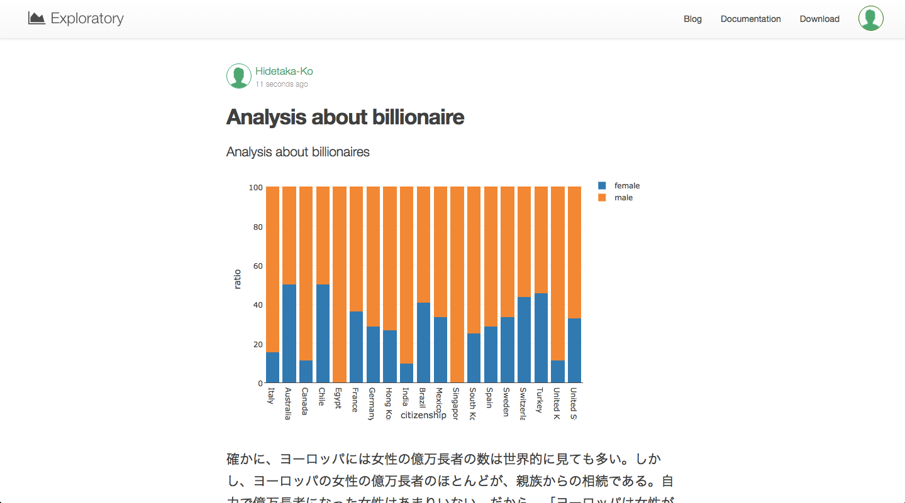

#Introducing Branch for Running Multiple Experiments Quickly

データを探っていくときに、何か発見して、たくさんの質問が思いついたりした経験はありませんか？　今までだと、そのような試行錯誤を繰り返すためには、同じデータに対して、たくさんの異なるデータ分析のやり方を試さないとだめでしたよね。

One of the common things you might want to do is to build different models that are differentiated by algorithms, parameter settings, or the subset of the data. Or, another typical thing would be to aggregate data at some grouping levels like Countries, Years, Status, etc, and try to understand the summary level information. After the aggregation though, you have just lost the detail level of the data, which means you can’t query against the detail level data or you can’t filter the detail data by the result of the aggregated data.

You can address these challenges by simply copying the data set multiple times. But that means you need to repeat the same data wrangling steps over the same data again and again. Or, you can copy or save the intermediate data output that is the result of such data wrangling. But this will create bunch of the data sets that look kind of similar but somewhat different. Not only this makes it harder to understand how each of the data is prepared, but also some of the data sets will easily end up being staled as you would continue wrangling with data through your data exploration phase.

この問題を解決するために、Exploratoryは、‘Branch’機能を実装しました。

プログラミング経験がある人にとっては、この‘Branch’というのは、Gitにおけるbranchとほぼ同じものだと考えてもらったほうがわかりやすいかもしれません。どうなっているのか、なぜこれが便利かを今から説明していきます。

##異なる分析フローを試すために、ブランチを作る

例えば、下図のように、NA値を除去して、曜日情報を抜き出して、データを統合するような分析をしたいとします。

データはこのような感じになるでしょう。

今、この‘flight delay’データの例における、Arrival Delay Time （到着時間）とDeparture Delay Time（出発時間）に相関関係があるかを確かめるために、線形回帰モデルを作りたいとします。しかし、データを見てみると、今、この状態では、モデルを作るのに、必要なデータがありません。なぜなら、分析の最後のステップで、summarizeをしたときにsummarizeに含まれていないデータの大部分は消えてしまったからです。

もちろん、もう１つのデータフレームを作って試すことも出来ますが、途中まで全く同じデータ分析ステップを入力する必要があったりめんどくさいですよね？こういうときにBranch機能が使えます。Branch機能を使えば、下図のように、‘Extract Day of Week’ステップから‘Linear_Regression’というブランチを簡単に作って試すことができます。

下図で赤矢印で指している‘Branch’をクリックしてみてください。

すると、線形回帰モデルを作って検証するために、このブランチ特有のデータ分析ステップを加えることができます。

K-meansクラスタリングモデルを作ることもできますが、今回は、メインブランチの‘Remove NAs’から新しくブランチを作ってみましょう。このような感じになります。

これは、あなたがK-means Clustering branchにいるときに見えるチャートです。

メインブランチでは、どのステップからどのブランチが枝分かれしているのかを見ることが一目瞭然です。

##DAGエンジンによって、データ依存性を管理する

Branch feature is built on top of our organically and locally made Exploratory DAG (Directed acyclic graph) engine. This means, not only you can create a branch off of any step of the data wrangling step but also you can count on all the data dependency you would expect among the steps and among the branches.

ブランチ機能は、
What will happen when the data wrangling steps in Main changed?
Creating a new branch off from one of the steps in the main is actually the easiest part. As some of you probably know, each step of the data wrangling has corresponding data cache to make the performance better and to make the command syntax suggestion appropriate. So, what will happen to the child branches when you update one of the data wrangling steps in the main? Well, it will take care of managing such data dependency automatically behind the scene. This means that any change in the data wrangling chain in the main, including the step for extracting the original data, will be reflected automatically in the child branches when necessary.
Let’s take a look a few scenarios to see how this really works. We will use the previous example where we had one main branch and two branches of ‘Regression Experiment’ and ‘Clustering Experiment’.

Reloaded the source data from local or remote data
Let’s say we have re-loaded the data from a remote database by clicking on ‘Refresh’ button at the top of the data transformation step. This will refresh all the steps in the main and the branches and regenerate the data cache for each step.

The green background colored box indicates a step that has been updated by the user. The green color bordered boxes indicate that they are the steps that will be refreshed automatically.
Updated a step in the middle in the main
Let’s say you have updated one of the steps called ‘Extract Day of Week’ to ‘Extract Day of Month’ in the main. It depends on where this step is in the main, but basically this will refresh all the steps after ‘Extract Day of Month’ step in the main and only the steps in the branches that have the data dependency to ‘Extract Day of Month’ step.

In the above scenario, ‘Clustering Experiment’ branch won’t get updated at all because it doesn’t have any data dependency to the updated step ‘Extract Day of Month’.
Now, if we updated ‘Grouping’ step of the main, then both ‘Regression Experiment’ and ‘Clustering Experiment’ branches will have no impact.

What happens when a step, from which branches are branched off, is removed?
Once the step is deleted in the main then any branch that was depending on the step will be automatically re-mapped to the previous step of the deleted step. Consider the following case.

We removed ‘Extract Day of Week’ step which ‘Regression Experiment’ branch was directly branched off from. This would make ‘Regression Experiment’ branch an ‘orphan’ branch, but Exploratory DAG engine will automatically re-connect it to the step before the deleted step, that is ‘Remove NAs’ step as you see in the picture below.

And, it will refresh the data cache for all the steps after in the main and the steps in ‘Regression Experiment’ branch.
What if some data is coming from another data frame?
You might be joining or merging with data that is coming from a different data frame like below.

In the above picture, the red background box ‘Aiport — Main’ is a different data frame with which we are joining ‘Flight Main’ data frame at the third step in the main of ‘Flight’ data frame.
Let’s say we have re-loaded the ‘Airport’ data from the original website. This will refresh ‘Clean up Data’ step in the main of ‘Airport’ data frame. And this means that the ‘Left Join’ step will be refreshed and all steps after will be refreshed as well. And since one of the steps in the main of ‘Flight’ data frame called ‘Grouping’ gets refreshed, this will make all the steps of ‘Regression Experiment’ refreshed. However, ‘Clustering Experiment’ will have no impact because it doesn’t have any dependency on all the steps that are refreshed this time.

##Lazy data caching

The refreshing or regenerating of the data cache for each data wrangling step happens only when it is required. Which means, nothing really happens in the branches when the underlying steps in the main gets updated, until you go to the branches to see the data.
There is much more, but the most important thing is that we wanted to make this experience as intuitively smooth as possible so that you as users should see what you would expect to see with these data wrangling steps. Yes, just works! ;)
We are creative human being, we are curious and have a lot of questions of the world. Our goal is to provide a fast, interactive, iterative, and inprovised data exploration experience against any type of data so that you can explore the data and ask more questions with confidence and excitement.
With this Branch feature taking care of the data dependency behind the scene, you can quickly wrangle with your data in a very flexible way without spending too much time worrying about how to manage your data analysis experiments or relationship between the intermediate outputs. This means, there will be more time for analyzing data, forming your questions, and exploring data to find answers.
If you are already Exploratory Desktop users please download the latest. If your are not and want to try this out please sign up for the beta access at our website.

##興味を持っていただいた方、実際に触ってみたい方へ

Exploratoryは[こちら](https://exploratory.io/
)からβ版の登録ができます。こちらがinviteを完了すると、ダウンロードできるようになります。

チュートリアルは[こちら](http://docs.exploratory.io/tutorials/intro.html
)から見ることができます。

Exploratoryの日本ユーザー向けの[Facebookグループ](https://www.facebook.com/groups/1087437647994959/members/
)を作ったのでよろしかったらどうぞ