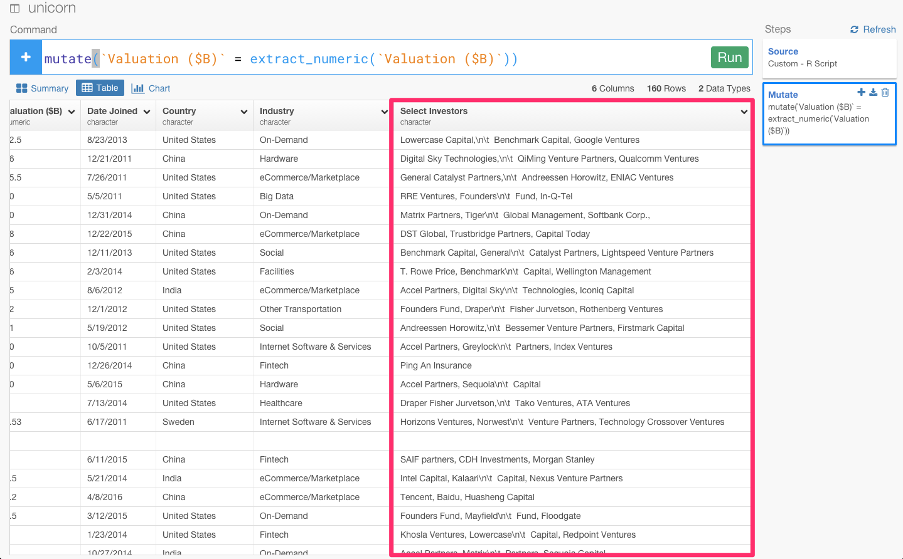

RのフロントエンドExploratorynのcommand builder機能で簡単にデータを整形してみた

##0. はじめに

実は、このデータは、世界中のユニコーン企業のデータを表しています。 ユニコーン企業というのは、上場していなくて、評価額が１ビリオンドル以上の評価額を得ている企業のことを指します。代表的なのだと、UberとかAirbnbとか。

面白そうなデータですよね。ところが、取ってきたデータを加工して分析できるようにするという過程が、結構めんどくさかったりしますよね。

例えば、Select Investorsカラムのところに\n\t であったり、空白であったり余計なものが入っていて、データを分析していくことができません。

しかし、今、Rのフロントエンドということで話題になっているExploratoryのcommand builder機能だと、データの加工もデータ分析しながら簡単に出来るといことなので、早速やってみました。

##1. command builder機能で余計な文字を取り除く

次に、Select Investorsカラムのところに\n\tであったり、空白という余計な文字が入っていますね。

これもまた、command builder機能を使うとすぐ取り除くことができます。カラムのヘッダーをクリックします。

これは、textに対するコマンドなので、Working with Text functionを選び、そこから、Clean Textを選びます。

するとこうやって、余計な文字が消えデータを分析していきやすくなりました。