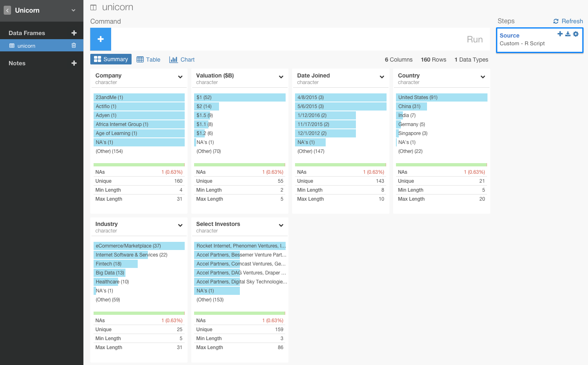
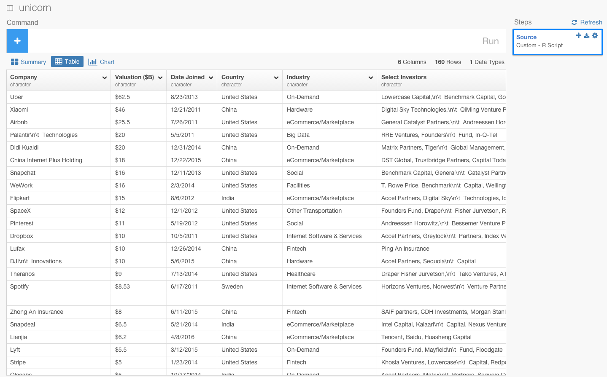
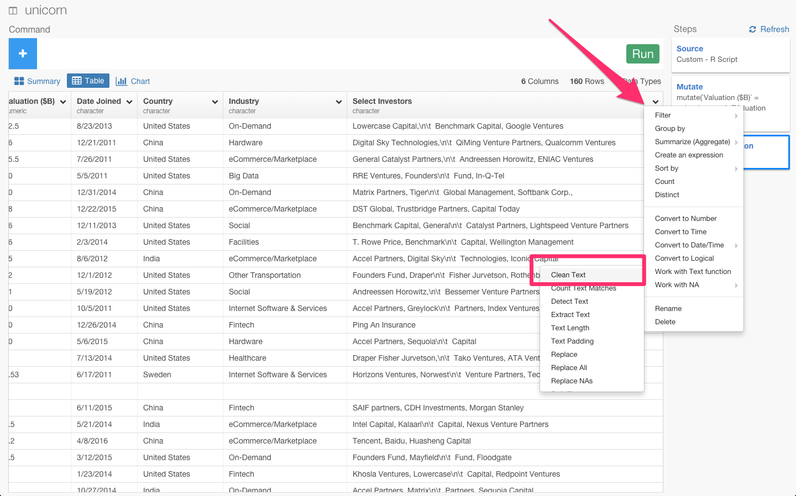
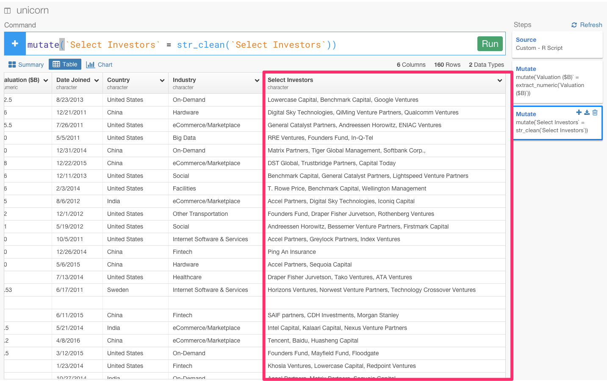

RのフロントエンドExploratorynのcommand builder機能で簡単にデータを整形してみた

##0. はじめに

実は、このデータは、世界中のユニコーン企業のデータを表しています。 ユニコーン企業というのは、上場していなくて、評価額が１ビリオンドル以上の評価額を得ている企業のことを指します。代表的なのだと、UberとかAirbnbとか。

面白そうなデータですよね。ところが、取ってきたデータを加工して分析できるようにするという過程が、結構めんどくさかったりしますよね。

例えば、このままだとValuationカラムのところに通貨の記号である＄のような余計なものが入っていたり、Select Investorsカラムのところに\n\t であったり、空白であったり余計なものが入っていて、データを分析していくことができません。

しかし、今、Rのフロントエンドということで話題になっているExploratoryのcommand builder機能だと、データの加工もデータ分析しながら簡単に出来るといことなので、早速やってみました。

##1. command builder機能で通貨の記号を取り除く

まず、Valuationのところがキャラクターになっていて、通貨の記号がはいってるんですよね。

数字以外の記号が入っているせいで、このままだと、チャートに行って、X軸をcompany、次にY軸をValuation にしようにもsumっていう関数が使えないんですよね。

今回は、通貨の記号ですけど、％が入ってたり、円がはいってたり。こういうのってけっこうありますよね。そういうのってけっこう、regular expression とか使いながら地道にとっていけなかったりするんですけど、Exploratoryでは、コマンド１つでいけるんですよ。

要するに、通貨であれ、何かの記号であれ、数字だけを抜き出してきたいだけですよね？　そういうときは、まずここをクリックしてみます。

数字だけに転換することを意味するConvert To Numberを選びます。

すると、自動的に数字だけを抽出するコマンドが入力されます。サマリー画面も、テーブル画面もダラーを抜いたナンバーだけのカラムができましたね。

##2. command builder機能で余計な文字を取り除く

次に、Select Investorsカラムのところに\n\tであったり、空白という余計な文字が入っていますね。

これもまた、command builder機能を使うとすぐ取り除くことができます。カラムのヘッダーをクリックします。

これは、textに対するコマンドなので、Working with Text functionを選び、そこから、Clean Textを選びます。

するとこうやって、余計な文字が消えデータを分析していきやすくなりました。