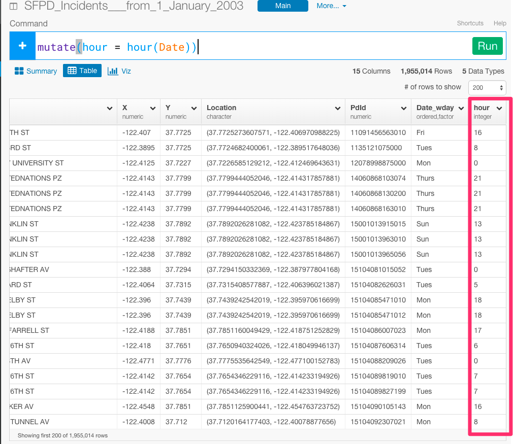
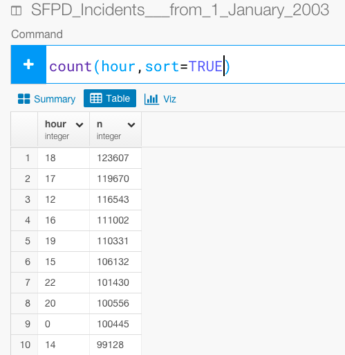
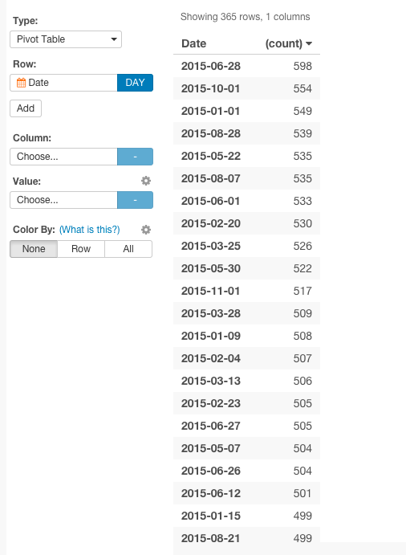

#普通のSQLよりも150倍速いと謳ってるPeriscope Dataのさらに150倍の速さでサクッとRで分析してみた。

この記事は、Rは知らないけど、SQLとか他のプログラミング言語はある程度やったことあるみたいな人向けです。
SQLでデータ分析をしていて、煩わしいと感じたことはありませんか？　これは、SQLは、データを保存するために作られているので、ある意味当たり前のことなんです。しかし、データ分析において、Rをオススメしたい理由は、実はRは、データデータの加工、分析のために作られているからなんです。Rでなら、SQLを書くだけでは考えられなかったより高度なことや効果的な方法で素早くデータを分析していくことができるのです。

普通のSQLよりも150倍速いと謳ってるPeriscope Dataという会社のブログをご存知でしょうか？

Periscope Data社が、ブログで、ぼくの留学先であるサンフランシスコの街の2003年から2015年までの犯罪データをSQLを使って分析しています。しかし、これには問題点がいくつかあります。

- おそらく、Periscope Data社は、このデータをダウンロードして、データベースにアップロードしています。このデータは、200万行もありません。どうしてデータベースが必要なのでしょうか？　このためだけに、Periscope Data社のように、Redshiftのデータベースを使うのはやめましょう。お金の無駄です。Redshiftは、ビッグデータに向いていると言われていますが、それでも、Rのインメモリを読み込むスピードに比べると、遅いです。

- SQLのクエリは、クエリを書くのが難しいだけでなく、クエリの中で問題が起こったときに、デバッグすることが困難です。それに加えて、Periscope Data社のブログのように、当人以外の人が、SQLのクエリを理解することはとても困難です。

つまり、メンテするのに、ハイコストがかかります。また、分析をはじめる前に、データを準備する段階で膨大な時間がかかります。さらに、高確率で、クエリのエラーに出くわすでしょう。そして、複雑なクエリを考えつくのに、また時間がかかるのです。しかし、Rなら、150倍の速さでサクッと仕事を切り上げられるでしょう。

だから、これから、PeriscopeData社のSQLを使った分析と、ぼくのRを使った分析を比較して、いかにRがSQLに比べてデータ分析に向いているかを説明していきたいと思います。データは[こちら](https://data.sfgov.org/Public-Safety/SFPD-Incidents-from-1-January-2003/tmnf-yvry)からダウンロードすることができます。

##どの曜日が犯罪が多いか

まず、どの曜日が犯罪が多いかを分析していきたいと思います。

mdy関数を使って、データ・タイプをcharacterからDateに変えたいと思います。


`
mutate(Date = mdy(Date))
`


次に、wday関数を使って、Dateから曜日を抽出したいと思います。

`
mutate(Date_wday = wday(Date, label = TRUE))
`


「どの曜日が犯罪件数が多いのか」を計算するために、Date_wdayをグルーピングします。

`
group_by(Date_wday)
`


そして、n関数を使って、犯罪件数を計算します。

`
summarize(numreports = n())
`


どうやら金曜日が一番多いみたいですね。


Periscope Data社はSQLを使って、このように分析しています。どちらが直感的でシンプルかは一目瞭然ですよね。


```
select
  extract(dayofweek from date)
  , count(1)
from
  sf_crime_2003_2015
group by
  1
  , 2
order by
  3
```

```
select 0, 'Sunday'
union select 1, 'Monday'
union select 2, 'Tuesday'
union select 3, 'Wednesday'
union select 4, 'Thursday'
union select 5, 'Friday'
union select 6, 'Saturday'
```

##どの時間帯に犯罪が多いか

これから、どの時間帯に犯罪が多いかを見ていきたいと思います。


hour関数を使って、hourデータを抽出します。

`
mutate(date_time = mdy_hm(str_c(Date, Time, sep=" ")), hour = hour(date_time))
`



どの時間帯に犯罪が多いかを計算するために、Hourをグルーピングします。

`
group_by(hour)
`


`
summarize(numreports = n())
`




午後の5時から6時にかけてが一番多いみたいですね。


いっぽう、Periscope Data社はSQLを使って、このように分析しています。しかし、〜。

```
select
  extract(hour from date)
  , count(1)
from
  sf_crime_2003_2015
group by
  1
  , 2
order by
  3,
```

##最も犯罪件数が多い月日はいつか？

犯罪件数が多い月日を抽出するために、Date列から、月と日を別々に抽出して、つなぎあわせる必要があります。

まず、Date列から、month関数を使って、月を抽出します。

`
mutate(Date_month = month(Date))
`


次に、Date列から、day関数を使って、月を抽出します。

`
mutate(Date_day = day(Date))
`


そして、str_c関数を使って、2つをつなぎあわせて、月日を抽出します。


`
mutate(DOY = str_c(Date_month, Date_day, sep="/"))
`


犯罪件数が多い月日を計算するために、月日を表すDOY列をグルーピングします。

`
group_by(DOY)
`


最後に、n関数を使って、件数を計算します。

`
summarize(count = n())
`




おお、これは面白いことに、犯罪件数が多い月日は、どうやら1日が多いみたいですね。

逆に、犯罪件数が少ない月日はどうなっているのでしょうか。


犯罪件数が、少ない日は、月末や年末の休日が多いみたいですね。

そして、2015年だけにデータをフィルタリングして、ビジュアライズしてみます。


Pivotテーブルでもビジュアライズしてみましょう。。


Periscope Data社はSQLを使って、このように分析しています。Periscope Data社がDOYを使い続けているのは、チャートのために、日付をソートする必要があるからなんです。しかし、Exploratoryのチャートでは、タイムシリーズをケアできているので、DOYをわざわざ使い続ける必要はありません。

```
with crime_by_doy as
(
select
  -- Check to see if it is a leap year
  case when (extract(year from date) % 4 = 0
        and extract(year from date) % 100 <> 0)
        or extract(year from date) % 400 = 0
         then
            case when extract(dayofyear from date) = 60
                   then 'Feb. 29'
                 when extract(dayofyear from date) > 60
                   then (extract(dayofyear from date) - 1)::text
                 else (extract(dayofyear from date))::text
            end
      else
         -- If it is not a leap year, no conversions are necessary
         (extract(dayofyear from date))::text
   end as doy,
   count(1) as num_incidents
from
   sf_crime_2003_2015
group by
   1
)
```

```
, generated_series as
 (
   select
      (getdate()::date - row_number()
        over(order by true) )::date as n
    from
      sf_crime_2003_2015
    limit 730 -- value for 2 years
 )

, doy_mapping as
(
  select
     (extract(doy FROM (n)::timestamp))::text as "doy"
     , to_char(n, 'Month DD') as "mm_dd"
  from
     generated_series
  where
     extract(year from n) = 2015
)

select
  crime_by_doy.doy
  , "mm_dd" as date
  , crime_by_doy.num_incidents
from
  crime_by_doy
  join doy_mapping on
    crime_by_doy.doy = doy_mapping.doy
order by 3 desc

```
とても長くて複雑ですね(笑）。なぜ、こんなに複雑になっているかというと、まず、「うるう年がいつか」を計算しています。そして、うるう年の年とうるう年でない年で、月日の設定を条件分岐させているからなんです。なぜ、こんなことをするかというと、Dateカラムのデータタイプが、characterになっているので、RでやったようにDate列から月日を抽出することができないのです。たとえ、データタイプがcharacterになっていても、Rならmdy関数一発で、データタイプをDateタイプに変えて月日を抽出していくことができます。しかし、SQLだとそうもいかないのです。だから、Rはデータ分析に向いているんです。


こちらの方で、Rの中でもデータ分析に特化しているdplyrの文法について詳しく解説しているので、よかったらご覧ください。

- [なぜデータ分析においては、SQLではなくRを使うべきか？　 データ分析ツールExploratoryを使って、dplyrを使いこなす第1弾 Filter関数編](http://qiita.com/21-Hidetaka-Ko/items/117caea621562f05ffe1)

- [なぜデータ分析においては、SQLではなくRを使うべきか？　データ分析ツールExploratoryを使って、dplyrを使いこなす第2弾　データ集計編](http://qiita.com/21-Hidetaka-Ko/items/bc7766e730a60ebf4561)

- [なぜデータ分析においては、SQLではなくRを使うべきか？　 データ分析ツールExploratoryを使って、dplyrを使いこなす第3弾　Window関数編](http://qiita.com/21-Hidetaka-Ko/items/fb9fe00ce982f240829a)

- [なぜデータ分析においては、SQLではなくRを使うべきか？　 データ分析ツールExploratoryを使って、dplyrを使いこなす第4弾　date関数編](http://qiita.com/21-Hidetaka-Ko/items/1645d89683e312f4d65c)


##興味を持っていただいた方、実際に触ってみたい方へ

Exploratoryは[こちら](https://exploratory.io/
)からβ版の登録ができます。こちらがinviteを完了すると、ダウンロードできるようになります。


ExploratoryのTwitterアカウントは、[こちら](https://twitter.com/ExploratoryData
)です。

Exploratoryの日本ユーザー向けの[Facebookグループ](https://www.facebook.com/groups/1087437647994959/members/
)を作ったのでよろしかったらどうぞ

分析してほしいデータがある方や、データ分析のご依頼はhidetaka.koh@gmail.comまでどうぞ