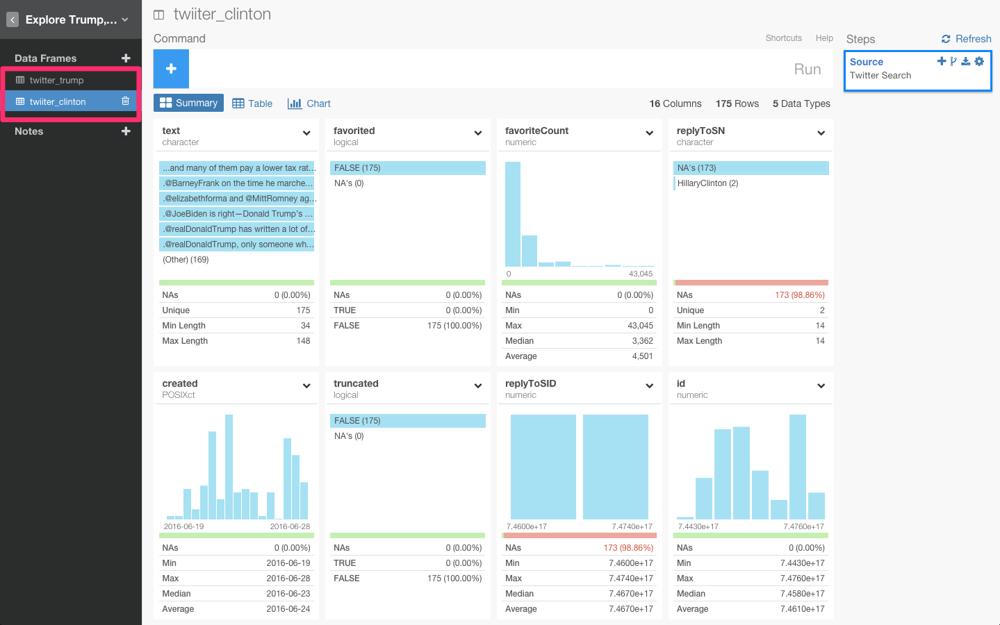
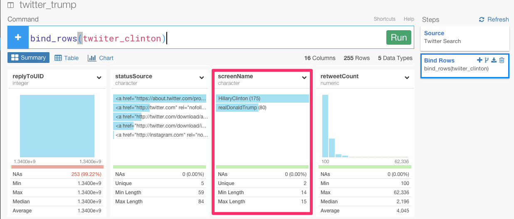

# トランプ氏とクリントン氏、アメリカ大統領選を制するのはどちらか？　RのフロントエンドExploratoryを使ってTwitterデータを分析してみた。

Exploratoryのすごいところは、Rを使って、とても簡単に、様々なデータ・ソースからデータをインポートすることができることです。Twitterもその１つです。技術的には、Jeff Gentryさんが開発した[twitteR](https://github.com/geoffjentry/twitteR)というパッケージを使っています。

そういえば、日本では今年の参院選から選挙権年齢が18歳に引き下げられましたね。舛添さんも退任することになり、東京都知事を決める選挙が行われることになりましたね。

ぼくが、留学しているアメリカ大統領選の話についてはご存知でしょうか？　

ぼくは、在日韓国人なので、日本も故郷である大阪の選挙権も持ってないこともあり、日本にいた頃は、政治の話を友達としたことなど皆無に等しかったです。しかし、アメリカ人の友達やシリコンバレーのエンジニアは、政治の話が大好きです。留学当初は、政治の話になると、途端に会話のレベルやスピードがアップしてついていけなくてコンプレックスを感じていたものでした。

アメリカは民主党・共和党の二大政党制ですが、それぞれの主張や支持者層は多岐にわたります。すべての争点において「この候補者・この党の考え方に賛成する」ということは不可能ですし、よく耳にする「民主党=庶民層、共和党=富裕層」といった分類もナイーブすぎます。

アメリカでは4年に一度の大統領選挙が行われています。アメリカの大統領は国家元首であり、行政の最高責任者であり、連邦軍の総指揮官でもあります。日本の天皇と総理大臣を合わせたような存在に近いかもしれません。大統領は議会をしのぐ力を持っているわけではありませんが、大統領が変わるとアメリカが進む方向が変わるのも事実です。

大統領選は間接選挙の形を取っていますが、事実上、国民が直接選ぶ仕組みです。今年の11月に投票が行われますが、現在は二大政党の民主党と共和党が予備選挙を行っていて、それぞれの党の候補者は7月までに決まります。

さて、誰が今回の大統領選を戦っているかご存知ですか？

トランプ氏、クリントン氏、サンダース氏です。

今日は、候補者の中でも特にふたり、トランプ氏とクリントン氏をとりあげます。

トランプ氏、クリントン氏の最近１０日間のツイートデータを使って、両者について分析してみたいと思います。

##Twitterのサーチデータをインポートする

まず、Remote Data SourcesからTwitterを選びます。

Authorize appをクリックしてください。

これが終わると、Exploratoryデスクトップアプリケーションに戻ってください。そして、検索したい単語を入力していきます。

どうやって、サーチクエリが作られているかについて知りたい方は、詳しくは、[Twitter’s Search API　](https://dev.twitter.com/rest/public/search)をどうぞ。

ここでは、まず最初に、トランプ氏のツイートを抜き出したいと思います。トランプ氏のアカウント名は、‘realDonaldTrump’なので、‘Search Text’パラメータに入力します。‘@’は、入力する必要はありません。このような感じです。

`from:realDonaldTrump`

データフレーム名を、‘twitter_trump’に設定して、‘Max # of tweets’を1000に変えます。そして、Get Dataボタンをクリックしてください。

もしプレビューのデータが大丈夫そうなら、データをロードするためにSaveボタンをクリックしてください。

ただし、TwitterのサーチAPIの制限で、データはは、７日間分だけになっています。

クリントン氏も同じようにします。

`from:HillaryClinton`

##2人のデータを結びつけます。

この時点で、トランプ氏、クリントン氏それぞれのデータフレームを見ることができますね？

両者のデータを比較するために、このデータを結びつけてみましょう。‘bind_rows’関数を使うと、両者のデータを結びつけることができます。

別にどのデータフレームからでも、この関数を使うことができますが、今回は、‘twitter_trump’データフレームからしてみましょう。下図のように、ドロップダウンメニューから＋アイコンを押して、‘Bind Rows’を選んでください。

すると、自動的に、‘bind_rows’と打ち込まれたのを確認することができます。

カンマで区切って、‘twitter_clinton’を選んでください。Runするときのコマンドはこのような感じです。

`bind_rows(twitter_clinton)`

すると、‘screenName’列の下に両者のTwitterアカウント名が表示されたのを確認することができます。

クリントン氏が最もツイートしてるのを確認できますね。

##両者のツイートはどんな感じか？

チャート画面に行くと、簡単にデータをビジュアライズ化することができます。まず、‘created’をX軸に指定して、the aggregation levelを‘DAY’に変えて、‘screenName’をColorに指定します。

##誰が最も、注目を集めているか?

もし、あなたが彼らのように立候補者だったとしたら、あなたは、選挙のために自分のツイートを拡散したいだけでなく、他の立候補者より注目を得たいですよね？　注目を測るためには、Twitterには2つの指標があると思います。１つは、Twitterのファボ数です。

もう１つは、リツイート数です。

この２つの指標を使うことによって、わたしたちは、誰が最もキャンペーンに成功しているのかがわかります。例えば、‘retweetCount’をX軸に、‘favoriteCount’をY軸に、‘screenName’をColorに指定してみましょう。

これを見ると、トランプ氏のツイートが、クリントン氏に比べると圧倒的にファボが多いことがわかりますね。これは、トランプ氏が、直近の１０日間において、Twitterを通して、たくさんの聴衆に向けて彼のメッセージを届けることに成功していることがわかります。

次に、このコマンドは、リツイート数が3000以上かどうかを振り分けます。もし、条件を満たしていたらTRUEを返し、そうでなければ、FALSEを返します。‘screenName’をX軸に、‘retweenCounts_threshold’をColorに指定してみましょう。

`mutate(retweetCounts_threshold = retweetCount > 3000)`

ファボ数も同様にしてみましょう。

`mutate(favoriteCounts_threshold = favoriteCount > 3000)`

これはすごいですね（笑）この簡単なチャートの違いは、トランプ氏とクリントン氏の違いを決定的に表わしています。トランプ氏のほとんどのツイートは、少なくとも3000回以上をリツイートとファボを記録しています。

##候補者のリツイート数とファボ数のトレンドを分析する

最後に、候補者のファボ数とリツイート数の分布を比べて、トレンドを分布してみましょう。ファボ数とリツイート数のデータを一緒にひとつのチャートに持ってきたいときは、Key列が、値が、ファボ数かリツイート数を表しているのかを区別するための情報を持つために、２つの列をKeyとValue列に持ってくる必要があります。そうするときは、gatherコマンドが便利です。

`gather(engagement_type, counts, favoriteCount, retweetCount)`

最初の引数は、新しいKey列の名前で、2番目の引数は、新しいValue列の名前です。3番目と4番目の引数は、新しいKeyとValue列に持ってきたいデータの名前です。

Runボタンを押すと、新たに‘engagement_type’と‘counts’が加えられたのを確認することができます。

チャート画面に行って、‘engagement_type’をX軸に、‘counts’をY軸に、‘screenName’をColorに指定してみましょう。

これを見ると、ソーシャルメディアにおけるトランプ氏の圧倒的な影響力を理解することができますね。

##最後に、

-わたしたちが言いたかったことは、ある問題に直面してそれが解決できる単純な問題に見えても、実際にはその問題の複雑さが分かっていないことが多いということなのです。単純化しすぎるのです。byスティーブ・ジョブズ

国民投票といえば、イギリスがEUが離脱することに決まったニュースが記憶に新しいですね。

国民投票では、表面的な「わかりやすさ」や感情論に操作されていることが多く、個人的に本当にもったいないなと思ってしまいます。

基本的に外交戦略や政治戦略って一般人からすると複雑すぎて直感的にわからない事が多いので、国民投票向きじゃないですよね。そもそもシンプルにできない論点を、無理やりシンプルにした人が勝ちという本質的じゃない勝負になっている気がします。

今回分析した、トランプ氏のロジックだって、「お金かかるから日本から軍を撤退しよう」、「移民がくるなら壁をつくればいい」、「テロが怖いならイスラム教徒を入国させなければいい」など、大多数の人には非常にわかりやすいので、どうしても人気が出るのでしょう。

つまり、多くの人がデータを読めないこと、もっというと、データを読むには、高いリテラシーが必要と認識されていることが１つの問題点なのだと思います。

Exploratoryのビジョンは、data is everywhere for everyoneです。今回のような、Twitterのインポート機能も、そのビジョンを実現するための1つの実装にすぎません。Exploratoryがあれば、「データを全く見ずに、表面的なわかりやすさや感情論に操作される国民投票」なんてなくなる。いつかそんな日がきっと来ることをExploratoryは、信じています。

##興味を持っていただいた方、実際に触ってみたい方へ

Exploratoryは[こちら](https://exploratory.io/
)からβ版の登録ができます。こちらがinviteを完了すると、ダウンロードできるようになります。

チュートリアルは[こちら](http://docs.exploratory.io/tutorials/intro.html
)から見ることができます。

Exploratoryの日本ユーザー向けの[Facebookグループ](https://www.facebook.com/groups/1087437647994959/members/
)を作ったのでよろしかったらどうぞ

