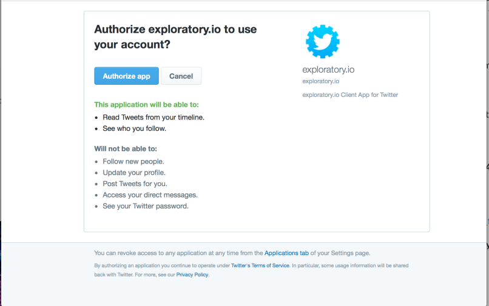
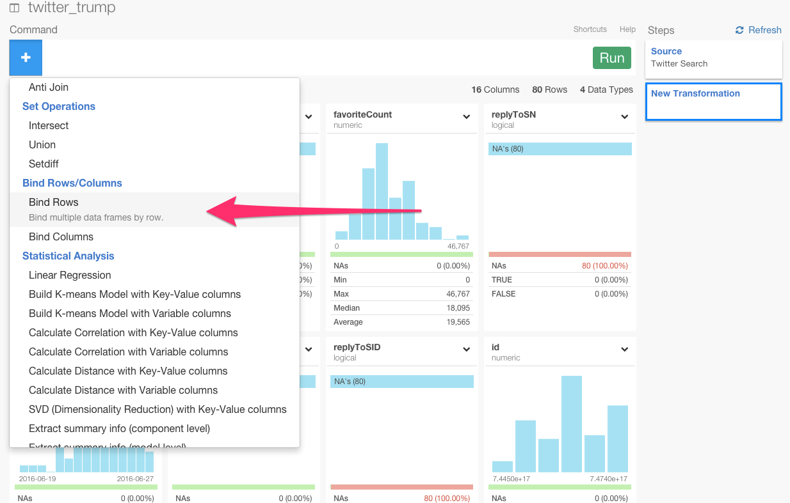

# Explore Trump, Clinton, and Sanders Tweets data and find their engagement effectiveness

Exploratoryのすごいところは、Rを使って、とても簡単に、様々なデータ・ソースからデータをインポートすることができることです。Twitterもその１つです。技術的には、Jeff Gentryさんが開発した[twitteR](https://github.com/geoffjentry/twitteR)というパッケージを使っています。

そういえば、日本では今年の参院選から選挙権年齢が18歳に引き下げられましたね。舛添さんも退任することになり、東京都知事を決める選挙が行われることになりましたね。

ぼくが、留学しているアメリカ大統領選の話についてはご存知でしょうか？　

ぼくは、在日韓国人なので、日本も故郷である大阪の選挙権も持ってないこともあり、日本にいた頃は、政治の話を友達としたことなど皆無に等しかったです。しかし、アメリカ人の友達やシリコンバレーのエンジニアは、政治の話が大好きです。留学当初は、政治の話になると、途端に会話のレベルやスピードがアップしてついていけなくてコンプレックスを感じていたものでした。

アメリカは民主党・共和党の二大政党制ですが、それぞれの主張や支持者層は多岐にわたります。すべての争点において「この候補者・この党の考え方に賛成する」ということは不可能ですし、よく耳にする「民主党=庶民層、共和党=富裕層」といった分類もナイーブすぎます。

アメリカでは4年に一度の大統領選挙が行われています。アメリカの大統領は国家元首であり、行政の最高責任者であり、連邦軍の総指揮官でもあります。日本の天皇と総理大臣を合わせたような存在に近いかもしれません。大統領は議会をしのぐ力を持っているわけではありませんが、大統領が変わるとアメリカが進む方向が変わるのも事実です。

大統領選は間接選挙の形を取っていますが、事実上、国民が直接選ぶ仕組みです。今年の11月に投票が行われますが、現在は二大政党の民主党と共和党が予備選挙を行っていて、それぞれの党の候補者は7月までに決まります。

さて、誰が今回の大統領選を戦っているかご存知ですか？

トランプ氏、クリントン氏、サンダース氏です。

今日は、候補者の中でも特にふたり、トランプ氏とクリントン氏をとりあげます。

トランプ氏、クリントン氏の最近１０日間のツイートデータを使って、両者について分析してみたいと思います。

##Twitterのサーチデータをインポートする

まず、Remote Data SourcesからTwitterを選びます。

Authorize appをクリックしてください。

これが終わると、Exploratoryデスクトップアプリケーションに戻ってください。そして、検索したい単語を入力していきます。

どうやって、サーチクエリが作られているかについて知りたい方は、詳しくは、[Twitter’s Search API　](https://dev.twitter.com/rest/public/search)をどうぞ。

ここでは、まず最初に、トランプ氏のツイートを抜き出したいと思います。トランプ氏のアカウント名は、‘realDonaldTrump’なので、‘Search Text’パラメータに入力します。‘@’は、入力する必要はありません。このような感じです。

`from:realDonaldTrump`

データフレーム名を、‘twitter_trump’に設定して、‘Max # of tweets’を1000に変えます。そして、Get Dataボタンをクリックしてください。

もしプレビューのデータが大丈夫そうなら、データをロードするためにSaveボタンをクリックしてください。

ただし、TwitterのサーチAPIの制限で、データはは、７日間分だけになっています。

クリントン氏も同じようにします。

`from:HillaryClinton`

##2人のデータを結びつけます。

この時点で、トランプ氏、クリントン氏それぞれのデータフレームを見ることができますね？

両者のデータを比較するために、このデータを結びつけてみましょう。‘bind_rows’関数を使うと、両者のデータを結びつけることができます。

別にどのデータフレームからでも、この関数を使うことができますが、今回は、‘twitter_trump’データフレームからしてみましょう。下図のように、ドロップダウンメニューから＋アイコンを押して、‘Bind Rows’を選んでください。

すると、自動的に、‘bind_rows’と打ち込まれたのを確認することができます。

カンマで区切って、‘twitter_clinton’と‘twitter_trump’を選んでください。Runするときのコマンドはこのような感じです。

`bind_rows(twitter_clinton)`

すると、‘screenName’列の下に3者のTwitterアカウント名が表示されたのを確認することができます。

クリントン氏が最もツイートしてるのを確認できますね。

##両者のツイートはどんな感じか？

チャート画面に行くと、簡単にデータをビジュアライズ化することができます。まず、‘created’をX軸に指定して、the aggregation levelを‘DAY’に変えて、‘screenName’をColorに指定します。

トランプ氏が、6月2日と3日から急激にツイートが増えた一方、クリントン氏は、5月31日から活発になっているのがわかりますね。

##誰が最も、注目を集めているか?

もし、あなたが彼らのように立候補者だったとしたら、あなたは、選挙のために自分のツイートを拡散したいだけでなく、他の立候補者より注目を得たいですよね？　注目を測るためには、Twitterには2つの指標があると思います。１つは、Twitterのファボ数です。

もう１つは、リツイート数です。

この２つの指標を使うことによって、わたしたちは、誰が最もキャンペーンに成功しているのかがわかります。例えば、‘retweetCount’をX軸に、‘favoriteCount’をY軸に、‘screenName’をColorに指定してみましょう。

We can see that Trump’s tweets tend to be more liked than retweeted in a comparison to the other two candidates while Clinton’s tweets tended to be more retweened than liked compared to the other two. However, when we look closer we notice visually that the amount of the ‘liked’ and ‘retweeted’ tweets by Trumps are significantly a lot more than the other two.

This goes to show how Trump has been successfully promoting his messages by reaching out a lot bigger audience through Twitter for the last 10 days.
We can actually see this with a simple bar chart by assigning ‘created’ date to X-Axis, ‘retweetCount’ to Y-Axis, and ‘screenName’ to Color, like below.

We can see how consistently Trump has been succeeding for spreading his tweets for the last 10 days.
Another way to look at this is to label each tweet based on whether the tweet was retweeted (or liked) more than a certain times like, for example, three thousand times.
You can create such label simply by running a command like below.
mutate(retweetCounts_threshold = retweetCount > 3000)
This will test the condition (retweetCount > 3000) and return TRUE if it satisfies the test, otherwise FALSE.
Then, we can assign ‘screenName’ to X-Axis and this new column ‘retweenCounts_threshold’ to Color like below.

Wow! This simple chart actually contrasts the difference between Trump and the other two candidates so significantly. The majority of Trump’s tweets got retweeted at least three thousand times while such tweets are rather rare rewards for Clinton and Sanders. Trump’s tweets are much more contagious.

##Trend for Retweeted and Liked Counts for each Candidates

Lastly, let’s look at the trend by comparing the distribution of each ‘favoriteCount’ and ‘retweetCount’ values among the candidates.
If we want to bring the two metrics into the chart together we can gather those two columns into Key and Value columns so that the Key column will have the information to identify whether the values presented there are ‘favoriteCount’ or ‘retweetCount. We can use ‘gather’ command from dplyr package like below.

gather(engagement_type, counts, favoriteCount, retweetCount)

The first argument value is the name of the new Key column and the second is the name of the new Value column this command will create. The third and the forth are the names of the columns that we want to gather and assign them to the new Key and Value columns.
After running the command we can see the new ‘engagement_type’ and ‘counts’ columns being added.

Now we can go to Chart and quickly assign ‘engagement_type’ to X-Axis, ‘counts’ to Y-Axis, and ‘screenName’ to Color.

It excludes the outliers as default. We can include them by clicking ‘Include Outlier’ checkbox next to Y-Axis.

Either way, it looks that Trump is completely playing a different game than the other two here. This could be because the Democrats are split to two candidates currently, once they will have picked one single candidate then we might see more effective engagement for the Democrats. Or, maybe not. The Trump’s masterful capability of influencing through social media is something that has been proved through the Republican primary race already, and that is something I’m sure the strategy and PR folks at the Democrats are super worried about.

Bringing Twitter Search data quickly into Exploratory means that we can explore the data quickly and iteratively by employing our usual grammar of data wrangling — dplyr and tidyr — and the visualization to find something we didn’t even know before. And this is what thrills me the most every time I get to work with a new data set and hope it will do for you, too!

##最後に、

-わたしたちが言いたかったことは、ある問題に直面してそれが解決できる単純な問題に見えても、実際にはその問題の複雑さが分かっていないことが多いということなのです。単純化しすぎるのです。byスティーブ・ジョブズ

国民投票といえば、イギリスが〜、記憶に新しいですね。

国民投票では表面的な「わかりやすさ」や感情論に操作されていることが多く、個人的に本当にもったいないなと思ってしまいます。

基本的に外交戦略や政治戦略って一般人からすると複雑すぎて直感的にわからない事が多いので、国民投票向きじゃないですよね。そもそもシンプルにできない論点を、無理やりシンプルにした人が勝ちという本質的じゃない勝負になっている気がします。

今回分析した、トランプ氏のロジックだって、「お金かかるから日本から軍を撤退しよう」、「移民がくるなら壁をつくればいい」、「テロが怖いならイスラム教徒を入国させなければいい」など、大多数の人には非常にわかりやすいので、どうしても人気が出るのでしょう。

つまり、多くの人がデータを読めないこと、もっというと、データを読むには、高いリテラシーが必要と認識されていることが１つの問題点なのだと思います。

Exploratoryのビジョンは、data is everywhere for everyoneです。

##興味を持っていただいた方、実際に触ってみたい方へ

Exploratoryは[こちら](https://exploratory.io/
)からβ版の登録ができます。こちらがinviteを完了すると、ダウンロードできるようになります。

チュートリアルは[こちら](http://docs.exploratory.io/tutorials/intro.html
)から見ることができます。

Exploratoryの日本ユーザー向けの[Facebookグループ](https://www.facebook.com/groups/1087437647994959/members/
)を作ったのでよろしかったらどうぞ

