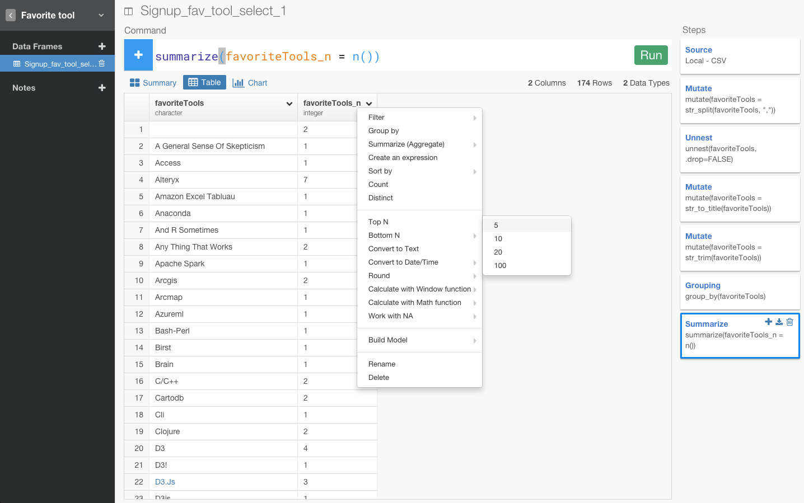

おかげさまで現在、世界中からたくさんの人たちにExploratory Desktopのベータ・トライアルの方にサインアップしていただいています。もしまだサイン・アップしてなくて興味のある方はぜひ[こちら](http://docs.exploratory.io/tutorials/flight4.html)からどうぞ
ところで、サインアップしていただく時に、皆さんの普段使っているデータ分析ツールが何か、聞かせてもらっています。そのデータがこちらにあるので、それを元にどういったツールが今世界中で人気があるか出してみたいと思いますが、実はいくつか面倒くさい問題があります。

- カンマ区切りなので、単純にツールごとに集計できない
- フリーフォームなので、スペースがいろんなとこに入ってたり、英語の大文字、小文字が混じってて、実は同じ名前であるのに同じ名前としてカウントできない。

こういったデータって結構データ分析をやっていると普通だったりするのですが、Exploratoryを使うと簡単にクリーン・アップすることができます。クリーン・アップした最後にはトップ５のデータ分析ツールを出してみたいと思います。

str_spritします。

str_spritできた。

Unnestしないと。

Unnestします。

Unnestできた。

str_titleしないと。

str_titleします。

str_titleできた。

str_trimしないと。

str_trimします。

str_trimできた。

トップ５のデータ分析ツールを出す

group_byします。

countします。

countできました。

top_nします。

top_nできました。

