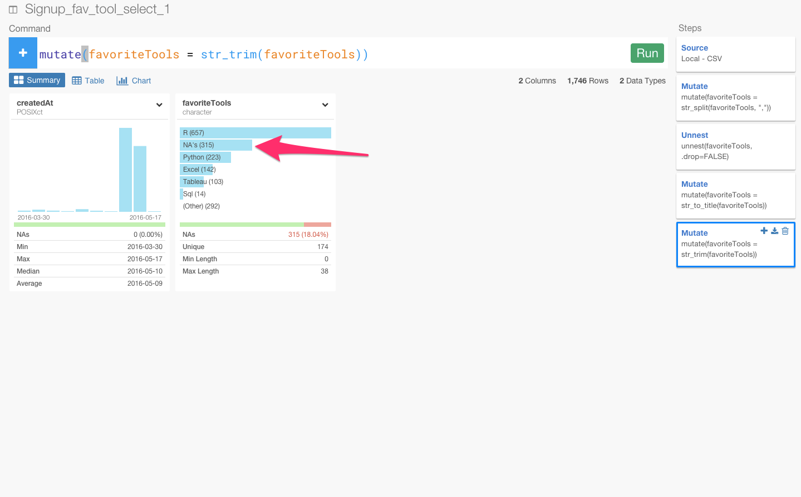
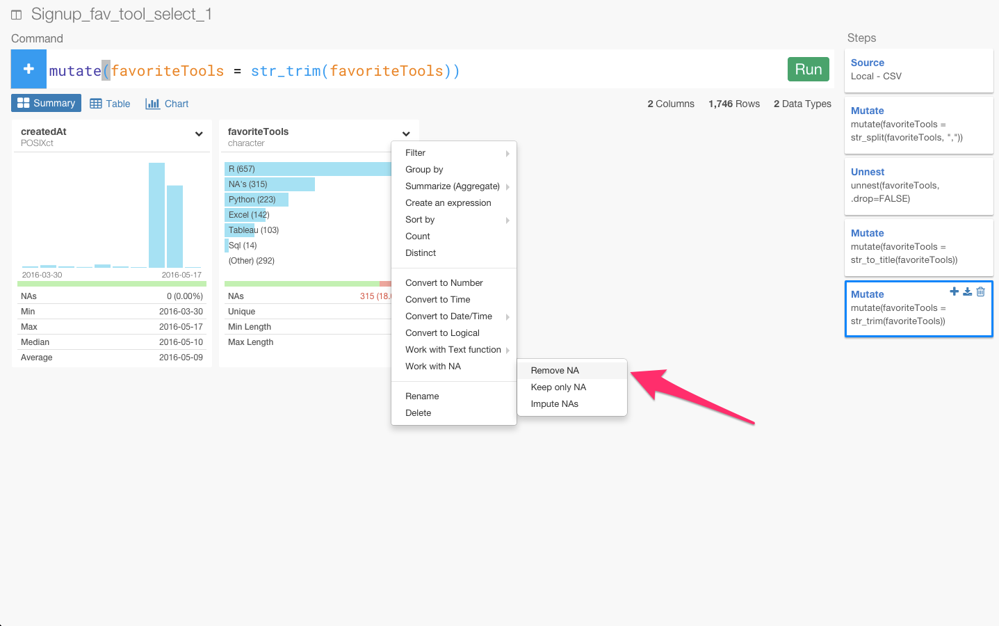
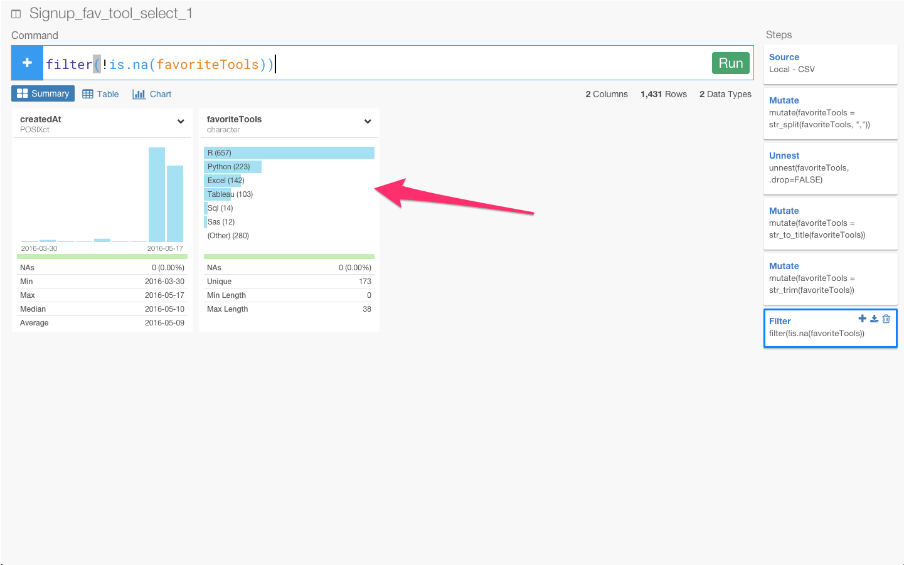

おかげさまで現在、世界中からたくさんの人たちにExploratory Desktopのベータ・トライアルの方にサインアップしていただいています。もしまだサイン・アップしてなくて興味のある方はぜひ[こちら](http://docs.exploratory.io/tutorials/flight4.html)からどうぞ。
ところで、サインアップしていただく時に、皆さんの普段使っているデータ分析ツールが何か、聞かせてもらっています。そのデータがこちらにあるので、それを元にどういったツールが今世界中で人気があるか出してみたいと思いますが、実はいくつか面倒くさい問題があります。

- カンマ区切りなので、単純にツールごとに集計できない
- フリーフォームなので、スペースがいろんなとこに入ってたり、英語の大文字、小文字が混じってて、実は同じ名前であるのに同じ名前としてカウントできない。

こういったデータって結構データ分析をやっていると普通だったりするのですが、Exploratoryを使うと簡単にクリーン・アップすることができます。クリーン・アップした最後にはトップ５のデータ分析ツールを出してみたいと思います。

##1. カンマ区切りなので、単純にツールごとに集計できない

今のままだと、1つの文字列になっているため、複数のツールが書かれている場合でも別々のツールとして計算することができません。なので、str_sprit関数を使って、一つの文字列になってるものを複数の文字列に変換したいと思います。

これは、textに対するコマンドなので、Working with Text functionを選び、str_spritを選びます。

str_spritによって一つの文字列になってるものを複数の文字列に変換することができ、データタイプもlistになりました。

でも、今のままだと1行にR, Excel, tabeleau, pythonが入っていて、それぞれのツールごとの個数を計算することができます。なので、この入れ子構造になっているのを、一回ブレイクして、R, Excel, tabeleau, python をそれぞれの行に落としこむ必要があります。unnestコマンドを使うとそれをすることができます

カラムのヘッダーからunnestをクリックします。

これで、unnestコマンドによって入れ子構造じゃなくなりましたね。

##2.実は同じ名前であるのに同じ名前としてカウントできない。

データを見ていくと、同じPythonでもpythonになっていたり、Pythonになっていたり、PYTHONになっていたりして、同じPythonを表しているのに、英語の大文字、小文字が入り混じっているために同じものとして計算できなくなっています。なので、str_title関数を使って、タイトルを統一したいと思います。

これは、textに対するコマンドなので、Working with Text functionを選び、そこから、str_titleを選びます。

str_titleによって、Pythonに統一されましたね。

次に、このようにスペースがいろんなとこにはいっていますね。このままだと、実は同じ名前であるのに同じ名前としてカウントできません。str_trim関数を使って、スペースを取り除きたいと思います。

これは、textに対するコマンドなので、Working with Text functionを選び、そこから、str_trimを選びます。

str_trimによって、スペースが取り除かれましたね。

##3.トップ５のデータ分析ツールを出す

これから、ユーザーのトップ５のデータ分析ツールを出してみたいと思います。

Exploratoryを使って簡単にクリーン・アップすることができました。しかし、それでも、NA値と呼ばれるような、空の値などの計算することができないデータがあります。トップ５のデータ分析ツールだけを出したいので、そういう場合は、NA値を排除しましょう。

これは、NA値に対するコマンドなので、Working with NAを選び、そこから、Remove NAを選びます。

Remove NAによって、NA値が取り除かれましたね。

これで、ビジュアライズしてみます。

数が多いので、上位だけにズームしてみます。上位から順に、R、Python, Excel, Tableau, Sqlであることがわかりました。

