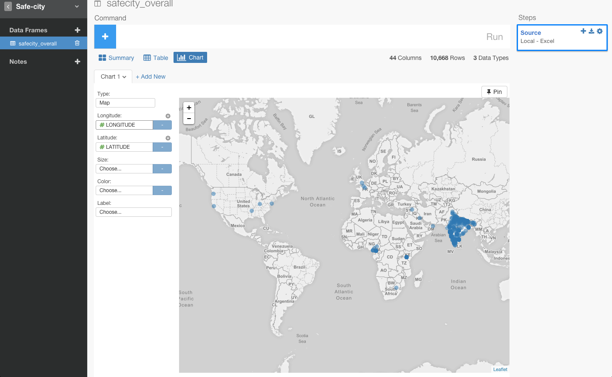
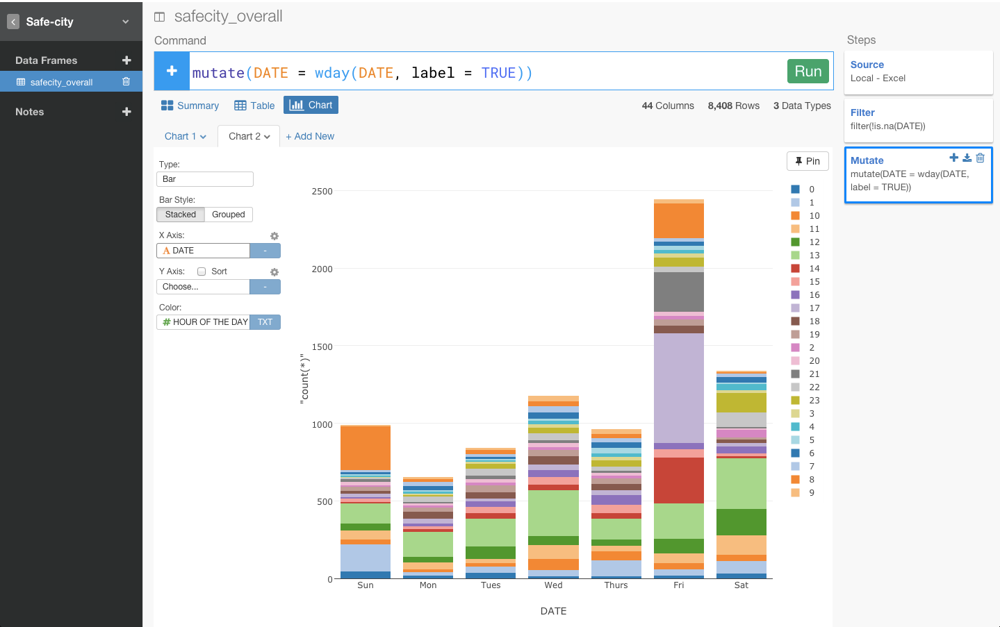

RのフロントエンドExploratoryを使って、セクハラが「いつ、どの場所に」多いかを分析して、シリコンバレーのハッカソンで２位になってきた

今回のハッカソンには、テーマがいくつか用意されていた。例えば、教育、健康、金融、社会起業などがありました。中でも、ぼくの目を一際引いたのは、次のこの単語でした。

Safe City（安全な街）

以前、友人から、セクハラの相談を受けていたこともあり、セクハラの問題を解決するアプリによって「女性にとっての安全な街」を実装するを方針でぼくは動きまいｓた。チームは無事見つかり、ハッカソンに提供されていたセクハラのデータを集めたプラットフォームを運営しているSafe cityという非営利団体のAPIを利用したWebアプリケーションを作ろうということになりました。

セクハラは、

- どこが多いのか？
- いつが多いのか？

がわかれば、セクハラを撃退するアプリのアイデアの突破口になるかもしれないなと思い、Rのフロントエンドで話題のExploratoryを使って、軽く分析してみました。

##1. スプレッドシートのデータをインポート

ぱっと見て、このデータが本当にセクハラのどういうデータなのかとかってわからないですよね〜。

こんな疑問を、データ分析によって簡単に解決することができるプロダクトがあります。それが、ぼくが今、留学先であるシリコンバレーで関わっているExploratoryというプロジェクトです。簡単に説明すると、コマンドラインインターフェイスで、データ解析とビジュアライズが同時に、柔軟にできるソフトウェアです。技術的に書くと、RのフロントエンドにNW.js (WebKitベースのデスクトップアプリSDK)とplotly.js (D3.jsベースの可視化ライブラリ)を用いた対話的で再現性重視のデータ分析環境を提供します。

このExcelのデータをExploratoryにインポートしてみます。

赤矢印のData Framesの隣の＋アイコンをクリックして、Import Localデータをクリックします。

すると、どのデータタイプのデータをインポートするかを選べるので、Excelファイルを選びます。

インポートしてきたデータが正しいことを確認して、Saveボタンを押します。

すると、さっきはエクセルでなんのことかわからなかったデータが、インポートしただけでわかりやすくなりましたね。
例えば、経度を表すLatitudeカラムなどを利用すれば、場所をビジュアライズしていくこともできそうです。

##2. どの場所に多いか？

どの場所が多いかを見るために、チャート画面に行ってみましょう。ここで、チャートタイプをBarからMapに変えます。

LongitudeにLongitudeカラムを、LatitudeにLatitudeカラムを当てはまるだけで、簡単にどこがセクハラが多いかを見ることができます。

##3. いつ多いか？

いつ多いかを見ていきたいので、曜日を表すカラムであるDATEに着目します。

いつ多いかを見たいときに、NA値があってもしょうがないので、消去します。

このままだと、セクハラが起きた日付がわかっても、何曜日なのかがわかりません。もしかしたら、日付より曜日に何らかの規則性があるかもしれません。Exploratoryだと、直感的に日付から曜日を計算することができるのでやってみます。

DATEカラムのヘッダーメニューからDay of weekを選びます。

すると、コマンドが自動的に入力されて、日付から曜日を出すことができました。

金曜日の午後にセクハラがダントツで起きていることがわかりました。

####結論

お願いだから、インドの金曜日の午後に女の子１人で旅行するのだけはやめてください。

##4. セクハラ統計アプリで２位に入賞

簡単に説明すると、まず、地域の名前を検索すると、その地域の近くのセクハラの統計とレポートが表示される。

それだけでなく、そのデータを元に、最も安全な道順（緑の線）を提示してくれる。

自分がセクハラに会えば、その地域と時間帯を報告することもできる。

報告したときに、Twilioで近くの住所に登録しているユーザーに自動的に注意を促すSMS送信が来る。

####結果

詳しく知りたい方は、[これがおれの２年だ！！　偏差値４０高校出身のぼくがスタンフォードとUCバークレー大生限定のハッカソンに無理矢理参加して２位に入賞した話](https://www.facebook.com/groups/1087437647994959/members/
)をどうぞ

##興味を持っていただいた方、実際に触ってみたい方へ

Exploratoryは[こちら](https://exploratory.io/s
)からβ版の登録ができます。こちらがinviteを完了すると、ダウンロードできるようになります。

チュートリアルは[こちら](http://docs.exploratory.io/tutorials/intro.html
)から見ることができます。

英語が読める方は[Introducing Exploratory Desktop — UI for R](https://blog.exploratory.io/introducing-exploratory-desktop-ui-for-r-895d94ef3b7b#.4dncgv1rt
)もどうぞ

Exploratoryの日本ユーザー向けの[Facebookグループ](https://www.facebook.com/groups/1087437647994959/members/
)を作ったのでよろしかったらどうぞ
