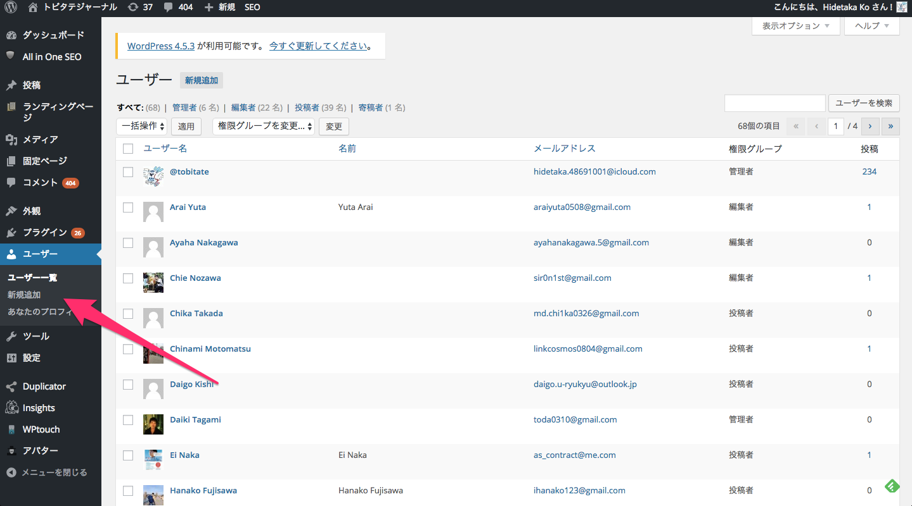
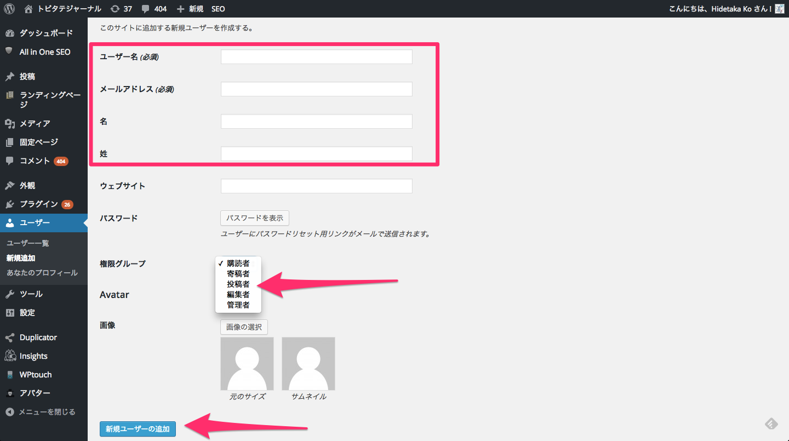
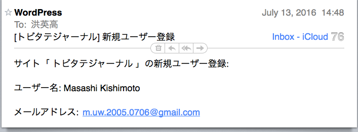
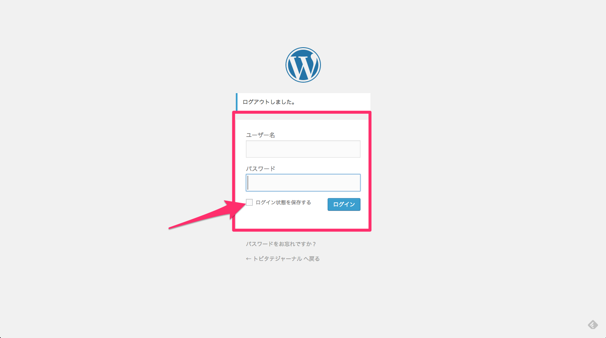
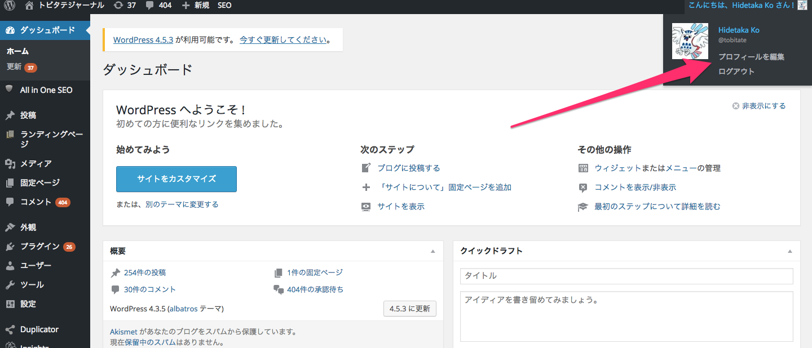
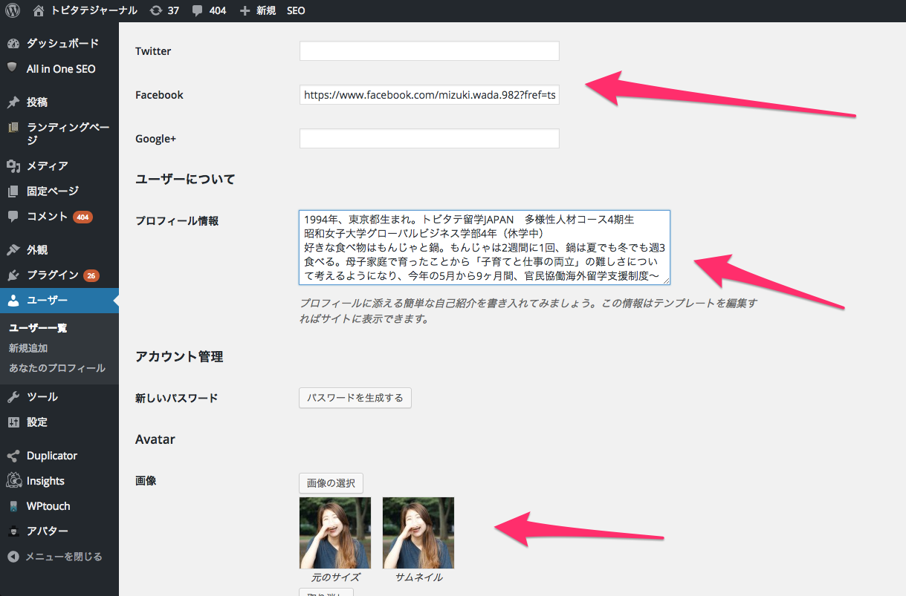
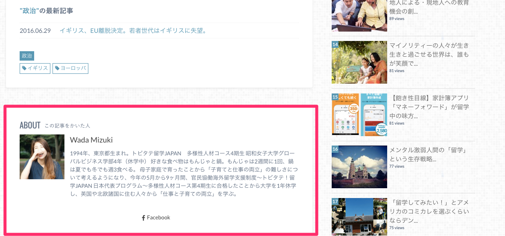

#トビタテジャーナル　ユーザー作成方法

ユーザをクリックして新規追加を選択

投稿者から聞いたユーザ名、メールアドレスを入力。そして権限グループを購読者から投稿者に変える。そして、新規ユーザの追加ボタンを押す。

すると、相手にメールが届く。（＊メールが届いていないと言われる場合がよくあるが、迷惑フォルダーに分類されていたり、相手のメールアドレスが間違っている場合がほとんど）

[こちら](http://tobitate-student.com/student/wp-admin/users.php?id=32
)からトビタテジャーナル管理者ページにログインする。

ユーザー名とパスワードを入力する。

注意点

- ユーザー名は、名前、苗字の順
- 名前は頭文字のみ大文字
- 苗字はすべて大文字
- 名前と苗字の間は半角スペース e.g. Taro YAMADA
- パスワード: 初期はtbttstdnt その後変更可能です 変更することをお勧めします！

自分のアカウントページを確認する。

プロフィールを入力してもらう。

完成！

