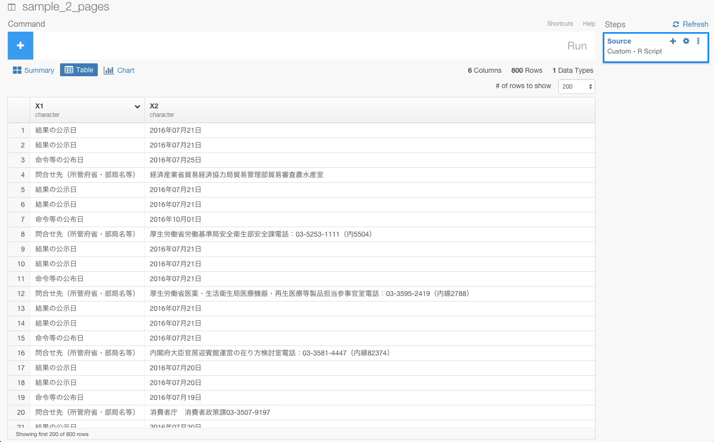
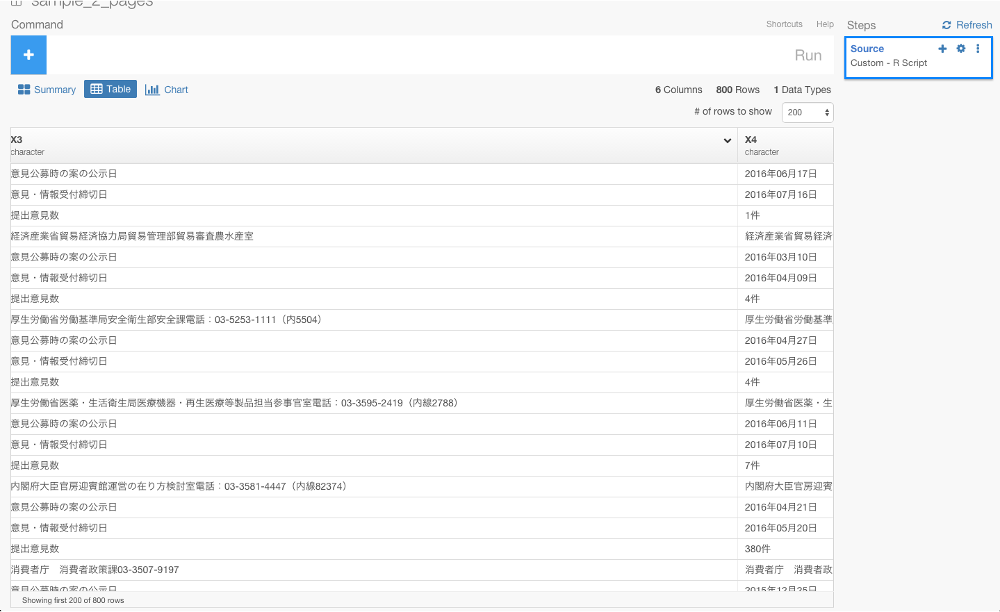
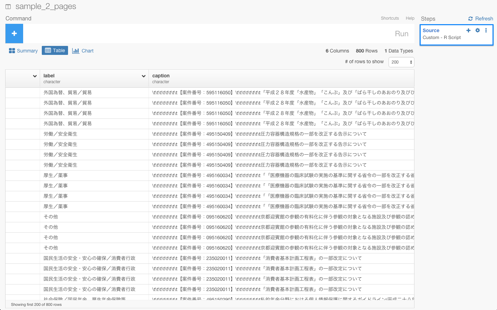

#お役所のデータで消耗するのはもうごめん。データ分析ツールExploratoryを使って、お役所の汚いデータをスクレイピングからビジュアライズまでしてみた

##はじめに

データ分析ツールExploratoryのユーザ様から、以下のような質問メールが届いたのが事の発端です。

ーーー

Quittaなど、どれも興味深い記事で楽しく拝見させていただいております。

Exploratoryを使っているのですが、スクレイプしたいデータの一つ一つがタイトルごとに分かれてしまいます。
スクレイプしたい段階で、一つのデータにまとめる方法はありますか。
ご回答いたただけると幸いです。

ーーー

####問題点

ユーザーが抱えてる問題をもっと理解するために、スクリーンショットとタイトルごとに分かれてしまうデータのリンクを送って頂き、自分の環境でも試してみました。

こんな感じのページで、リンクは[こちら](http://search.e-gov.go.jp/servlet/Public?CLASSNAME=PCMMSTLIST&Mode=2
)です。

このページをExploratoryのScrape Web Pageからデータをインポートしてみます。

すると、このような形でデータをスクレイピングしてしまいます。

見ていただけると、おわかりかもしれませんがこのままだと問題が3つあります。

- テーブルがタイトルごとにわかれてしまっている
- 結果の公示日を表す7月21日が行ではなく、列になっている
- 「外国為替、貿易／貿易」　や　「【案件番号：595116050】  「平成２８年度「水産物」「こんぶ」及び「ばら干しのあおのり及びひとえぐさ」の輸入割当てについて（案）」に対する意見募集の結果について」　などの情報がスクレイピングできていない

Exploratoryだと、データ分析だけでなく、Import by Writing R scriptという機能を使えば、こういった複雑で汚いウェブ・ページからデータを思い通りにスクレイピングしてくることができたり、さらにはその後のデータの加工もデータ分析しながら簡単に出来るといことなので、早速やってみました。スクレイピングして、クリーン・アップした最後にはデータを簡単にビジュアライズしてみたいと思います。

##〜でスクレイピングする

Exploratoryでは、Import by Writing R scriptというところから、自分でRのプログラムを書いていくことができます。この機能を使うと、先ほどの、titleごとに分かれてしまい思うようにスクレイピングできなかったデータも、titleごとにテーブルをわけないでデータを分けない状態で、スクレイピングしていくことができます。

今回、ここに書いたコードは以下です。このスクレイピングのために書いた詳しい解説は、また別の記事に書きたいと思います。

 '# Custom R function as Data.
sample_2_pages.func <- function(){
loadNamespace("httr")
loadNamespace("rvest")
loadNamespace("dplyr")

res_list <- lapply(seq(4), function(i){
  httr::GET("http://search.e-gov.go.jp/servlet/Public", query=list(CLASSNAME="PCMMSTLIST", Mode=2, Page=i-1))
})

tables <- lapply(res_list, function(res){
  main <- rvest::html_node(httr::content(res, encoding = "Shift_JIS"), "#main")
  children <- rvest::html_children(main)
  result_list <- list()
  current_tag <- ""
  for(child in children){
    tag <- rvest::html_tag(child)
    if(tag == "h2"){
      current_tag <- rvest::html_text(child)
    } else if (tag=="table"){
      caption <- rvest::html_text(rvest::html_node(child, "caption"))
      table <- rvest::html_table(child, fill = TRUE)
      result_list[[length(result_list)+1]] <- dplyr::mutate(table, label=current_tag, caption=caption)
    }
  }
  do.call(rbind, result_list)
})

do.call(rbind, tables)

}'

すると、このように以下の問題点を解決した状態で、データをスクレイピングしてくることができました。

- テーブルがタイトルごとにわかれてしまっている
- 結果の公示日を表す7月21日が行ではなく、列になっている
- 「外国為替、貿易／貿易」　や　「【案件番号：595116050】  「平成２８年度「水産物」「こんぶ」及び「ばら干しのあおのり及びひとえぐさ」の輸入割当てについて（案）」に対する意見募集の結果について」　などの情報がスクレイピングできていない

##データを整形する

###不要なデータを取り除く

####問合せ先（所管府省・部局名等）というデータを取り除く

まず、問合せ先（所管府省・部局名等）というデータがいくつかありますね。このデータは使わないとのことなので、フィルタリング関数を使って、取り除きましょう。もし、フィルタリング関数について明るくない方は、[こちら](http://qiita.com/21-Hidetaka-Ko/items/117caea621562f05ffe1
)の方で、dplyrの文法であるフィルタリングについて詳しく解説しているので、よかったらご覧ください。

問合せ先（所管府省・部局名等）は、X1列にあるので、X1列のヘッダーをクリックしてFilterコマンドを選び、!=を選びます。

すると、自動的にfilter(X1 != )が入力されると同時に、フィルタリングしたい行がレコメンドされます。

そして、その中から"問合せ先（所管府省・部局名等）"を選び、Runボタンを押します。

問合せ先（所管府省・部局名等）というデータという行を取り除くことができましたね。

####文頭の\t\t\t\t\t\t\t\tのような余計な文字を取り除く

caption列を見てみると、文頭に余計な文字が混じってしまっているのを確認できますね。

これから、これを取り除いていきましょう。そのために、caption列のヘッダーをクリックしてWork with Text functionを選び、Clean Textを選びます。

すると、自動的にmutate(caption = str_clean(caption))が入力されます。そして、Runボタンを押します。

これで。\t\t\t\t\t\t\t\tのような余計な文字を取り除くことができましたね。

####重複している値を取り除き、ユニークな値にする

distinct(label, caption, date, date_label)

###gatherとspreadを駆使して、列と行を入れ替える

###日付のデータタイプをcharacterからDateに変更する

mutate(`意見・情報受付締切日` = ymd(`意見・情報受付締切日`))

###提出意見数から数字だけを取り出す

mutate(提出意見数 = extract_numeric(提出意見数))

##簡単にビジュアライズする

##興味を持っていただいた方、実際に触ってみたい方へ

Exploratoryは[こちら](https://exploratory.io/
)からβ版の登録ができます。こちらがinviteを完了すると、ダウンロードできるようになります。

Exploratoryの日本ユーザー向けの[Facebookグループ](https://www.facebook.com/groups/1087437647994959/members/
)を作ったのでよろしかったらどうぞ

ExploratoryのTwitterアカウントは、[こちら](https://twitter.com/ExploratoryData
)です。

分析してほしいデータがある方や、データ分析のご依頼はhidetaka.koh@gmail.comまでどうぞ
