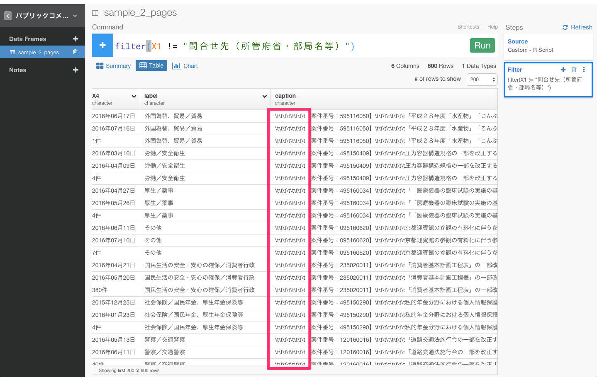
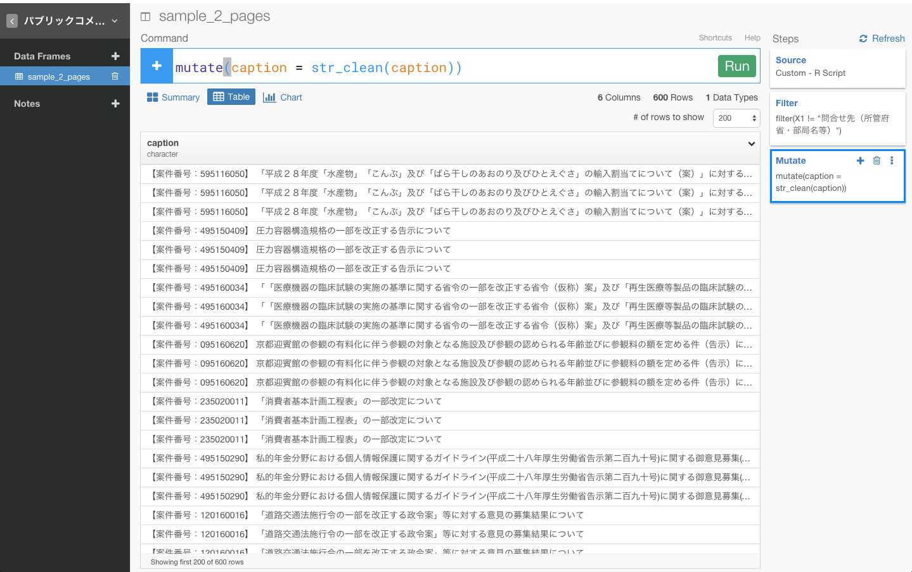
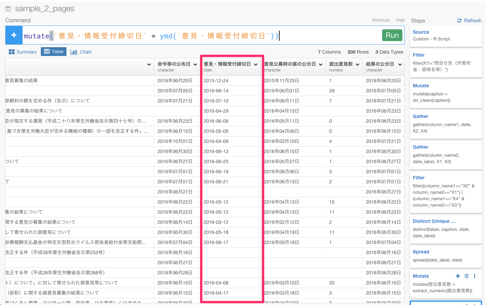

#お役所のデータで消耗するのはもうごめん。データ分析ツールExploratoryを使って、お役所の汚いデータをスクレイピングからビジュアライズまでしてみた

##はじめに

データ分析ツールExploratoryのユーザ様から、以下のような質問メールが届いたのが事の発端です。

ーーー

Quittaなど、どれも興味深い記事で楽しく拝見させていただいております。

Exploratoryを使っているのですが、スクレイプしたいデータの一つ一つがタイトルごとに分かれてしまいます。
スクレイプしたい段階で、一つのデータにまとめる方法はありますか。
ご回答いたただけると幸いです。

ーーー

####問題点

ユーザーが抱えてる問題をもっと理解するために、スクリーンショットとタイトルごとに分かれてしまうデータのリンクを送って頂き、自分の環境でも試してみました。

こんな感じのページで、リンクは[こちら](http://search.e-gov.go.jp/servlet/Public?CLASSNAME=PCMMSTLIST&Mode=2
)です。

このページをExploratoryのScrape Web Pageからデータをインポートしてみます。

すると、このような形でデータをスクレイピングしてしまいます。

見ていただけると、おわかりかもしれませんがこのままだと問題が3つあります。

- テーブルがタイトルごとにわかれてしまっている
- 結果の公示日を表す7月21日が行ではなく、列になっている
- 「外国為替、貿易／貿易」　や　「【案件番号：595116050】  「平成２８年度「水産物」「こんぶ」及び「ばら干しのあおのり及びひとえぐさ」の輸入割当てについて（案）」に対する意見募集の結果について」　などの情報がスクレイピングできていない

Exploratoryだと、データ分析だけでなく、Import by Writing R scriptという機能を使えば、こういった複雑で汚いウェブ・ページからデータを思い通りにスクレイピングしてくることができたり、さらにはその後のデータの加工もデータ分析しながら簡単に出来るといことなので、早速やってみました。スクレイピングして、整形した最後にはデータを簡単にビジュアライズしてみたいと思います。

##自分の欲しいフォーマットでデータをスクレイピングする

Exploratoryでは、Import by Writing R scriptというところから、自分でRのプログラムを書いていくことができます。この機能を使うと、先ほどの、titleごとに分かれてしまい思うようにスクレイピングできなかったデータも、titleごとにテーブルをわけないで、スクレイピングしていくことができます。

今回、ここに書いたコードは以下です。このスクレイピングのために書いた詳しい解説は、また別の記事に書きたいと思います。

># Custom R function as Data.
>sample_2_pages.func <- function(){
>loadNamespace("httr")
>loadNamespace("rvest")
>loadNamespace("dplyr")

>res_list <- lapply(seq(4), function(i){
  httr::GET("http://search.e-gov.go.jp/servlet/Public", query=list(CLASSNAME="PCMMSTLIST", Mode=2, Page=i-1))
})

>tables <- lapply(res_list, function(res){
  >main <- rvest::html_node(httr::content(res, encoding = "Shift_JIS"), "#main")
  >children <- rvest::html_children(main)
  >result_list <- list()
  >current_tag <- ""
  >for(child in children){
    >tag <- rvest::html_tag(child)
    >if(tag == "h2"){
      >current_tag <- rvest::html_text(child)
    >} else if (tag=="table"){
      >caption <- rvest::html_text(rvest::html_node(child, "caption"))
      >table <- rvest::html_table(child, fill = TRUE)
      >result_list[[length(result_list)+1]] <- dplyr::mutate(table, label=current_tag, caption=caption)
    >}
  >}
  >do.call(rbind, result_list)
>})

>do.call(rbind, tables)

>}'

データがうまくスクレイピングされていることが確認できたので、Saveボタンを押します。

サマリー画面でデータを確認することができます。

これで、以下の問題点を解決した状態で、データをスクレイピングしてくることができました。

- テーブルがタイトルごとにわかれてしまっている
- 結果の公示日を表す7月21日が行ではなく、列になっている
- 「外国為替、貿易／貿易」　や　「【案件番号：595116050】  「平成２８年度「水産物」「こんぶ」及び「ばら干しのあおのり及びひとえぐさ」の輸入割当てについて（案）」に対する意見募集の結果について」　などの情報がスクレイピングできていない

##データを整形する

とはいっても、このままでは列も行も整備されていないので、何のデータなのかよくわからないですし、分析やビジュアライズもしていくことができません。これから、いくつかの関数を使って、データを整形していきましょう。

###不要なデータを取り除く

####問合せ先（所管府省・部局名等）というデータを取り除く

filter(X1!="問合せ先（所管府省・部局名等）")

まず、問合せ先（所管府省・部局名等）というデータがいくつかありますね。このデータは使わないとのことなので、フィルタリング関数を使って、取り除きましょう。もし、フィルタリング関数について詳しくない方は、[こちら](http://qiita.com/21-Hidetaka-Ko/items/117caea621562f05ffe1
)の方で、dplyrの文法であるフィルタリングについて詳しく解説しているので、よかったらご覧ください。

問合せ先（所管府省・部局名等）は、X1列にあるので、X1列のヘッダーをクリックしてFilterコマンドを選び、!=を選びます。

すると、自動的にfilter(X1 != )が入力されると同時に、フィルタリングしたい行がレコメンドされます。

そして、その中から"問合せ先（所管府省・部局名等）"を選び、Runボタンを押します。

問合せ先（所管府省・部局名等）というデータという行を取り除くことができましたね。

####文頭の\t\t\t\t\t\t\t\tのような余計な文字を取り除く

caption列を見てみると、文頭に余計な文字が混じってしまっているのを確認できますね。

これから、これを取り除いていきましょう。そのために、caption列のヘッダーをクリックしてWork with Text functionを選び、Clean Textを選びます。

すると、自動的にmutate(caption = str_clean(caption))が入力されます。そして、Runボタンを押します。

これで。\t\t\t\t\t\t\t\tのような余計な文字を取り除くことができましたね。

###gatherとspreadを駆使して、列と行を入れ替える

X2とX4列を見てみると、日付を表す行が別々になっていますね。

なので、これを同じ列に揃える必要があります。そういうときは、gather、spread関数が便利です。これらの関数を簡単に説明すると、

- gather：複数の列を、１つの列にする。
- spread：１つの列をカラム名、１つの列をセルの値にする。

説明だけだと、ピンとこないかもしれませんね。データを整形しながら、具体的に説明していくので、見ていってください。

まず、gather(column_name1, date, X2, X4)と入力します。これは、X2とX4の列の値をcolumn_name1という１つの列に、X2とX4の列の値をdateという1つの列にすることを意味します。。

次に、同じように、gather(column_name2, date_label, X1, X3)と入力します。

これで、バラバラに列や行が分かれていた「結果の公示日」などの日付のタイトルと日付を同じ列と行にまとめることができました。

あれ、でも同じ日付のタイトルや案件番号やデータの概要なのに違う日付のデータがありますね。

どちらが正しい日付なのでしょうか？　もう一度ページと照らし合わせてみます。

2016年07月21日のほうだということがわかりました。これと同じような例がいくつもあります。しかし、正しい日付を示しているときに共通していることは、column_name1が"X2"且つcolumn_name2が"X1"、もしくは、column_name1が"X4"且つcolumn_name2が"X3"の時なのです。なので、フィルタリング関数を使って、正しい条件でフィルタリングしましょう。

filter((column_name1=="X2" & column_name2=="X1") | (column_name1=="X4" & column_name2=="X3"))と入力します。

これで、正しい日付だけのデータを取り出すことができました。

次に、date_label列にまとめて入っている、結果の公示日、命令等の公布日、意見公募時の案の公示日、意見・情報受付締切日、提出意見数を列にばらけさせて、それぞれに対応する日付を行に入れる必要があります。そういうときは、spread関数が使えます。spread関数を使うと、指定した行を列にばらけさせることができます。

あれ？　エラーになりましたね。エラー文を見てみると、全く同じ行の名前があるからのようです。なので、distinctコマンドを使って、重複してる値を取り除き、ユニークな値だけを残しましょう。

label列のヘッダーをクリックしてdistinctコマンドを選びます。

すると、自動的にdistinct(label)が入力されます。caption, date, date_labelも加えて、Runボタンを押しましょう。

そして、もう一度spread(date_label, date)を入力してRunボタンを押してみます。

これで、データをうまく整形することができました。

##簡単にビジュアライズする

データがある程度整形できたので、今度は、データを簡単にビジュアライズしてみましょう。

###提出意見数から数字だけを取り出す

チャート画面に行って、X軸をlabel,Y軸を提出意見数に設定してみます。

あれ？　提出意見数の合計や平均などを計算できませんね。これは、提出意見数が、数字だけではなく、「件」という余計な文字がはいっているからなんです。extract_numericという関数を使って、余計な文字を取り除きましょう。

提出意見数列のヘッダーをクリックしてConvert to Numberを選びます。

すると、自動的にmutate(提出意見数 = extract_numeric(提出意見数))が入力されます。そして、Runボタンを押しましょう。

これで、件を取り除くことができたので、ビジュアライズで合計などを出すことがきるようになりましたね。

###日付のデータタイプをcharacterからDateに変更する

次に、命令等の公布日をX軸に、Y軸を提出意見数に設定してビジュアライズしてみましょう。

あれ？　今度は、同じ月がいくつもあったり、月ではなく年だけで区切ったりということができませんね。これは、日付に漢字などが入っているため、データタイプがcharacterになっているからなんです。Date関数を使って、データタイプをcharacterからDateに変えましょう。

意見・情報受付締切日のヘッダーをクリックしてCovert to Date/Timeから2015年12月24日の順番通りになるように、Year,Month,Dayを選びます。

すると、自動的にmutate(`意見・情報受付締切日` = ymd(`意見・情報受付締切日`))が入力されます。そして、Runボタンを押しましょう。

命令等の公布日、意見公募時の案の公示日、意見公募時の案の公示日、結果の公示日も同じようにします。

これで、件を取り除くことができたので、ビジュアライズで合計などを出すことがきるようになりましたね。

Date関数について詳しくない方は、[こちら](http://qiita.com/21-Hidetaka-Ko/items/1645d89683e312f4d65c
)の方で、dplyrの文法であるDate関数について詳しく解説しているので、よかったらご覧ください。

##最後に

最初は、途方も無く思えたお役所の汚いデータも、Exploratoryを使って、簡単にうまく整形し、ビジュアライズまで対話的に実現することができましたね。

Exploratoryでは、こうやって分析していったデータを使ったステップ、チャート、R scriptといっしょにシェアすることができます。

チャートといっしょにシェアするときは、チャートのShareボタンを押します。

パラメータをそれぞれ入力し、Shareボタンを押します。

これで、シェアすることができました。

[こちら](https://exploratory.io/viz/Hidetaka-Ko/92fb96d0b8e7?cb=1469082547910
)から、実際に、上記のようなぼくのデータ分析のステップを見ることができます。

データの再現性がとても高いです。この機能を使えば、共同で誰かと分析していくとき役に立つこと間違いないでしょう。

Exploratoryには、Writing R scriptというところから、Rのプログラムを書いていけるので、柔軟性が高いです。
なので、質問やご要望などがあれば、Exploratoryの日本ユーザー向けの[Facebookグループ](https://www.facebook.com/groups/1087437647994959/members/
)を作っているので、遠慮無くこのグループから投稿してください。今回のように対応致します。

##興味を持っていただいた方、実際に触ってみたい方へ

Exploratoryは[こちら](https://exploratory.io/
)からβ版の登録ができます。こちらがinviteを完了すると、ダウンロードできるようになります。

ExploratoryのTwitterアカウントは、[こちら](https://twitter.com/ExploratoryData
)です。

分析してほしいデータがある方や、データ分析のご依頼はhidetaka.koh@gmail.comまでどうぞ
