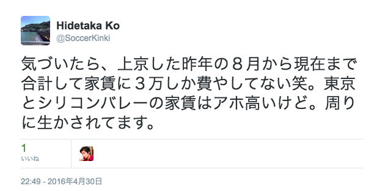
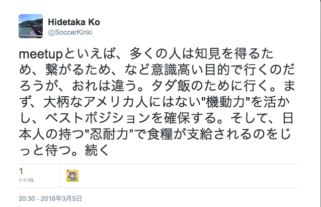
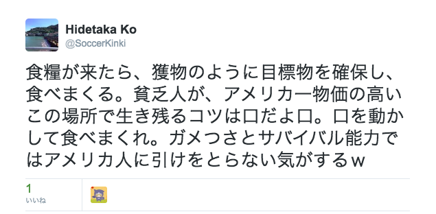
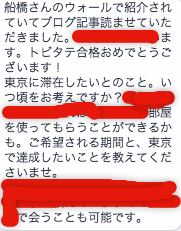
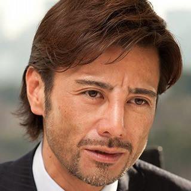

家賃３万
meetup.com

ソイレント

##旅行より拠点

旅をしながら暮らすこと

##お金より信頼

文章

##真面目より交渉力

先生に言われたこと

##最後に

生意気さより謙虚

文字で表現するのが難しいのだが、「生意気さとビッグマウスだけがとりえの自分だったら」と仮定して過去を振り返ってみると、「みんなは助けてくれたか？」に対する答えは、Noの確率がMaybeの確率より高くなる気がするのだ。「ゲームオーバーしていたか？」に対する答えは、Yesの確率がMaybeの確率より高くなる気がするのだ。

ただ、それだけではない気もする。なんでみんな助けてくれるんだろう？　謎は未だ解けぬままである。

やっぱり、ぼくが、Hidetaka Kだからだろうか？笑

だとすると、いつか化けの皮が剥がれないように、剥がれても困らないように、助けてくれた人達をいつか助けれるように、今、アメリカで、必死に勉強しよう。