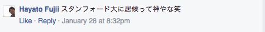

#「問題は必ず解決できる」貧乏大学生が、東京とシリコンバレーでの10ヶ月を合計家賃3万円で暮らすまで気づかなかった「お金・真面目・旅行」より大事なこと

 

##東京は、日本一物価が高い街、シリコンバレーはアメリカ一物価が高い街

ぼくは、2015年の8月〜2月まで京都から東京に、2016年の2月〜現在に至るまで東京からシリコンバレーに留学しに来ています。

さて、ここで問題です。ぼくの留学先であるシリコンバレーの平均家賃はいくらでしょうか？

正解は、1500ドル（約16万円）です。なぜ、そんなに家賃が高騰しているかについては詳しくは[こちら](https://speakerdeck.com/chibicode/shang-shan-zhou-zuo)から見ることができます。

ぼくの家の近くに、最近、日本でお馴染みの庶民向けレストラン「やよい軒」ができました。

<!-- <blockquote class="instagram-media" data-instgrm-captioned data-instgrm-version="7" style=" background:#FFF; border:0; border-radius:3px; box-shadow:0 0 1px 0 rgba(0,0,0,0.5),0 1px 10px 0 rgba(0,0,0,0.15); margin: 1px; max-width:658px; padding:0; width:99.375%; width:-webkit-calc(100% - 2px); width:calc(100% - 2px);">
 
 

 
 <a href="https://www.instagram.com/p/BEb6iGTylvZ/" style=" color:#000; font-family:Arial,sans-serif; font-size:14px; font-style:normal; font-weight:normal; line-height:17px; text-decoration:none; word-wrap:break-word;" target="_blank">ついにパロアルトのやよい軒に来た！ おいしかったけど、高すぎる笑 日本では、庶民向けだけど、こっちでは完全にパロアルトの金持ち向けだ</a>
 
Hidetaka Koさん(@hidetakadesu)が投稿した写真 - <time style=" font-family:Arial,sans-serif; font-size:14px; line-height:17px;" datetime="2016-04-20T20:52:47+00:00">2016 4月 20 1:52午後 PDT</time>

</blockquote> 
 -->

さて、ここで問題です。値段はいくらするでしょうか？

正解は、日本の3倍(平均約20ドル)で、おかわり有料です。
もうね、おかしい。物価が高すぎる。アホです。お金がない学生がやっていける場所じゃないです。

でも、結果的に、東京でもシリコンバレーでも、全くの0から始まった後、ぼくは自分の家を見つけ、毎日まともな食事を食べるお金を手に入れることができ、今なんとかなっています。

##あなたが試したことがない、マネをしてはいけない3つの節約術

せっかくなので、この期間に、ぼくが実践していた「あなたが試したことがないであろう具体的な節約術」をいくつか紹介しましょう。

前提として、ぼくの経済状況は以下の感じでした。

- 上京時、現金1万円。後々に、Progateでのアルバイトでの給料やサポーターズによって月にいくらか入ってくるようになりました。
- 渡米時、キャッシュ100ドル。
- 親からの仕送りは0円。

①若者は、Meetupを出会いや知見目的で使うべきではない。タダ飯のために使うべき。 

Meetup.comとは、勉強会やイベント交流イベントのプラットフォームサイトのことです。このサイトでは、IT系の勉強会を探すことができます。IT系の勉強会のなにがいいかというと、タダ飯とタダ酒が支給されるのです。

②若者は、パンダエクスプレスで消耗するべきではない。Soylentで満たすべき。

シリコンバレーで活躍するエンジニア兼炎上系ブロガーさんに相談する機会があったので、聞いてみました。彼なら、きっと目から鱗の解決策を提示してくれるに違いない。ぼくは、起死回生の美しい策を授けてくれるであろう彼のアドバイスに胸を踊らせていました。彼は、毎日パンダエクスプレス（アメリカの超安いレストラン）でご飯を食べていたぼくにこう言い放ちました。

>若者は、パンダエクスプレスで消耗するべきではない。Soylentで満たすべき。（圧倒的意訳）

ソイレントって何だ？

>ソイレント（英: soylent）とは、Rosa Labs, LLC. が販売している栄養機能食品の飲み物。生存に必要な栄養素がすべて含まれ、従来の食事が不要となるという[1][2]。味はほんのり甘く、この粉末を水などに溶かして飲む[1][2]。

ソイレントのレビューに関しては、@yokichiさんの連続ツイートが面白いです。

<blockquote class="twitter-tweet" data-lang="ja">
まず、この不思議な粉が入った袋を用意します。 <a href="http://t.co/hwzCoRpOMS">pic.twitter.com/hwzCoRpOMS</a>
&mdash; 古賀 洋吉 / Yo Koga (@yokichi) <a href="https://twitter.com/yokichi/status/596089635542970368">2015年5月6日</a></blockquote>

<blockquote class="twitter-tweet" data-lang="ja">
水と混ぜたら、良く振ります。ドロドロした不思議な液体ができます。 <a href="http://t.co/oZ0V5jU0RY">pic.twitter.com/oZ0V5jU0RY</a>
&mdash; 古賀 洋吉 / Yo Koga (@yokichi) <a href="https://twitter.com/yokichi/status/596089866183512065">2015年5月6日</a></blockquote>

<blockquote class="twitter-tweet" data-lang="ja">
コップにいれたら料理完了！これで一日に必要な栄養素をすべて含む、【完全食品】ができあがりました。まあ、なんておいしそうな写真でしょう！ <a href="http://t.co/Y3GbXBPL8N">pic.twitter.com/Y3GbXBPL8N</a>
&mdash; 古賀 洋吉 / Yo Koga (@yokichi) <a href="https://twitter.com/yokichi/status/596090342102814721">2015年5月6日</a></blockquote>

<blockquote class="twitter-tweet" data-lang="ja">
なんと数秒で、気軽に外で食事をすることもできます。 <a href="http://t.co/KalMqaGx9L">pic.twitter.com/KalMqaGx9L</a>
&mdash; 古賀 洋吉 / Yo Koga (@yokichi) <a href="https://twitter.com/yokichi/status/596090563838906369">2015年5月6日</a></blockquote>

<blockquote class="twitter-tweet" data-lang="ja">
とってもドロドロしておいしそうです。何かよくわからないものが浮いています。たぶん「食物繊維」ではないでしょうか。 <a href="http://t.co/qrCn1um3bb">pic.twitter.com/qrCn1um3bb</a>
&mdash; 古賀 洋吉 / Yo Koga (@yokichi) <a href="https://twitter.com/yokichi/status/596090764951564288">2015年5月6日</a></blockquote>

<blockquote class="twitter-tweet" data-lang="ja">
これを飲むだけで、生き続けることが出来ます。点滴みたいなものです。時間もお金もかかりません。失うのは人間としての尊厳だけではないでしょうか。 <a href="http://t.co/TPFOEixDlC">pic.twitter.com/TPFOEixDlC</a>
&mdash; 古賀 洋吉 / Yo Koga (@yokichi) <a href="https://twitter.com/yokichi/status/596091446823813120">2015年5月6日</a></blockquote>

<blockquote class="twitter-tweet" data-lang="ja">
飲んだ・・・。いや、食事をした・・・のか？ <a href="http://t.co/uPxKKZcQIL">pic.twitter.com/uPxKKZcQIL</a>
&mdash; 古賀 洋吉 / Yo Koga (@yokichi) <a href="https://twitter.com/yokichi/status/596091747739930624">2015年5月6日</a></blockquote>

<blockquote class="twitter-tweet" data-lang="ja">
飲み干した。なんか不思議なカスが残ってます。きっと栄養です。でも本当におなかいっぱいです。500キロカロリーあるので、これだけで夜までおなかが持ちますね。 <a href="http://t.co/xLOr0e9yfK">pic.twitter.com/xLOr0e9yfK</a>
&mdash; 古賀 洋吉 / Yo Koga (@yokichi) <a href="https://twitter.com/yokichi/status/596092456724115456">2015年5月6日</a></blockquote>

どうやら、シリコンバレーで活躍するエンジニア兼炎上系ブロガーさんは、ぼくに人間としての尊厳を捨てることを教えてくれたようです。

イケダハヤト（@IHayato)氏の「まだ東京で消耗してるの？」に習って、ぼくも言わせてください。「え、まだ食事で消耗してるの？」

③スタンフォード大学に3ヶ月間居候生活

ぼくの母校である同志社大学には、毎年スタンフォード大学から40人ほど留学しに来ます。ぼくは、彼らの日本での生活をサポートするサークル（団体）に入っていました。また、積極的に彼らと同志社大学で、交流していました。だから、スタンフォード大学に友人が多くいます。すると、ぼくが彼らにアメリカに行く旨を伝えると、「俺の部屋に泊まりにこいよ」と何人も言ってくれます。ぼくには、現実的に居候しか手段がなかったので、その言葉にぼくは甘えて、彼らの部屋に居候していました。

あなたが試したことがない、マネをしてはいけない3つの節約術について、いかがでしたか？ 楽しくないので、マネをしてはいけませんよ笑。
みんなはまっとうな留学を歩んでほしいです。留学前は、しっかり準備しましょう。親に借りれるならお金は借りましょう。

志が高くないぼくは、文章は、この辺で終わりたかったのですが、これだけだと、「お前いったい何をやってたんだ」と帰国したときに、各位に怒られそうで怖いです。なので、ここからは、この経験を通じて、学んだそれっぽいことを3つ書きたいと思います。

1. “お金”より“信頼”

2. “真面目”より“交渉力”

3. “旅行、ノマド”より“拠点と学生結婚”

##1. “拝金主義（お金が一番）”の時代から“信頼（レビュー）”の時代へ

日本のレストランや昔では、店員さんがどこにいても、忙しそうでも、挙手をして、自分のもとに呼び寄せることが多い気がします。客の態度も横柄であることが多いです。それは、日本では、「お客様が神様」、「金さえ払えばいい」という文化があるからです。

ところが、アメリカ西海岸に来ると少し状況が変わっていることに気がつきます。アメリカのレストランでは、基本、店員が自分の近くにくるまで、わざわざ呼び寄せることは基本的にはタブーだと教えられました。店員も、「お客様は神様」のようなスタンスではありません。

こちらには、「客が、サービス（店）を評価するだけでなく、サービス（店）が客を評価する」という文化が確実に存在します。

これは、例えば、シェアリングエコノミーの代表格であるUBER（タクシー配車サービス）やメルカリの例を考えてみるとわかりやすいです。UBERを利用し終わったあとは、客だけでなく、ドライバーも、レビューを記録しないといけません。ここで、星5つや4つの記録が増えていくと、客の信頼度が上がり、次回UBERを利用したときに、すぐタクシーが見つかり、好循環になります。逆に、横柄な態度をとり過ぎて、ここで星1つとかが記録されてしまうと、信頼度が下がり、車が来なくなり、次回の利用に悪影響がでます。

つまり、「金さえ払えば、いい」というスタンスの人は昔に比べ、生きづらくなっているのです。

ぼくには、「プログラミングを学びたい」だけに留まらない、誰にも言ってない理由があって、2015年の7月か8月には、絶対上京したかった。そこで、一番のネックになっていたのは、家賃でした。

さっきの、「金さえ払えば、いいというスタンスの人はこれから生きづらくなっていく」というのは、逆にいえば、「信頼さえあればお金の問題は何とかなる」ということの裏返しでもあります。ぼくはここに目をつけて、ある行動に出ました。

それは、力を込めた自分の文章に、「家を探しています」と書いたのです。

すると、その文章は、トビタテ留学JAPANに関することだったからか、プログラムのプロジェクトディレクターである船橋さんにTwitterとFacebookで文章を取り上げられました。

<blockquote class="twitter-tweet" data-lang="ja">
この説明、素晴らしいな。トビタテ事務局が言語化出来ていないことを整理してくれている、 <a href="https://t.co/VOi2tSDGPI">https://t.co/VOi2tSDGPI</a>
&mdash; 船橋力 (@c_funabashi) <a href="https://twitter.com/c_funabashi/status/614668751405887488">2015年6月27日</a></blockquote>

<iframe src="https://www.facebook.com/plugins/post.php?href=https%3A%2F%2Fwww.facebook.com%2Fchikara.funabashi.7%2Fposts%2F859610397451335&width=500" width="500" height="211" style="border:none;overflow:hidden" scrolling="no" frameborder="0" allowTransparency="true"></iframe>

自分で、自分のことを「信頼に足る人物」だと言う気は毛頭ありません。まだまだ未熟で、一般的な常識に欠けることも多いからです。

しかし、船橋さんは、サッカー元日本代表の中田英寿やMr.chirdrenの櫻井さんが過去に受賞したヤンググローバルリーダーにも選ばれています。つまり、社会的に信用が保証されているのです。社会的に信用が保証されている人からのレビューを得たぼくの文章がHidetaka Koという人物の信用度を飛躍させたのです。

すると、なんと本当に東京で家を無料で貸していただける方が現れました。しかも、３階立ての一軒家で、おまけに家にエレベーターもついていました。大豪邸です。本人はほとんど家にいなかったのでひとり暮らしのようなものでした。

本当に感謝していますし、お礼を何度言っても足りません。名前は伏せますが、家を貸していただいた人も船橋さんもとても謙虚で人間力が高く、ぼくが最も尊敬する人の1人です。

<blockquote class="twitter-tweet" data-lang="ja">
同志社から上京する人に、「家どうやって見つけた？」って聞かれたので返信したら、「参考になるわけないやろそんな探し方！」となぜか逆ギレされる件多数発生中。
&mdash; Hidetaka Ko (@SoccerKinki) <a href="https://twitter.com/SoccerKinki/status/724420410683482112">2016年4月25日</a></blockquote>

こんな反応をよくされますが、今日は、「“拝金主義（お金が一番）”の時代から“信頼（レビュー）”の時代になる過渡期にある」という本質から逆算して考えてみると、あながち不可能ではないとわかるはずです。

##2. “真面目”でありすぎることはいいカモだけど、“交渉力”は自分の身を助けてくれる。

####そもそもなぜお金に困っているのか？

トビタテ留学JAPANプログラムでは、留学にかかる潤沢な費用が毎月支給されるはずです。なのに、なぜぼくはそこまで金銭的に困っていたのでしょうか？

実は、このプログラムでは、留学計画が少しでも変わると変更申請というプロセスを踏まないといけないのです。

なんと、この手続き3ヶ月以上かかるのです（笑）

なんと、変更申請が認められるまで、奨学金が支給されないのです（笑）

なんと、いつ終わるか目処が連絡されないので、誰かからお金も借りにくいのです（笑）

ぼくが、トビタテの計画書を書いたのは、2015年の4月です。実際に留学が始まったのは、2016年の2月です。この変化の激しい時代で、多感な時期に、1年後の計画を1年後に全くの変更なしに実行できる人のほうが少数派で、超人だと思います。それなのに、留学計画の小さい変更の手続きでさえ、これほどのコストがかかるのは改善されるべきでしょう。誰もパブリッシュに発信していませんが、悩まされている人も多いかと思います。ぼくの友人には、トビタテからお金が支給されるまで、消費者金融から借金していた友達もいます。本末転倒の極みですよね。

シリコンバレー随一の投資家・ピーター・ティール氏もこんなことを言っています。

>シンギュラリティ（急激なテクノロジーの進歩）は、現実になったときの不安よりも、何も起こらなかったときの方が不安要素として大きいと思っています。何も起こらないということはつまり、テクノロジーにおける人類の進歩の停滞を意味するのですから。

ぜんぶ、（笑）とつけましたが、全く笑えません。早く改善されてほしいです。本当に。
　
####交渉のコツは、「ゴキブリ力」と「Disる前にContribute」

これで、なぜぼくが、お金に困っていたかわかったと思います。

#####ゴキブリ力

お金がないにもかかわらず、アメリカの大学の前期の授業料約3000ドルを4月までに支払わないといけませんでした。ご存知の通り、いくらなんでも不可能ですよね？笑　だから、ぼくは、交渉して支払いを延期させてもらうしか方法がありませんでした。

もちろん、一筋縄ではいかず、一回目はあえなく撃沈しました。しかし、諦めません。知恵を振り絞って、策を考えます。

大学に頼んで、自分は奨学金プログラムの学生であることを証明する書類を作成していただきました。これをアメリカの大学の国際課の持っていって、「ある事情があって、奨学金の振り込みが遅れているんだ。嘘だと思うなら、この書類を見てよ」と交渉します。

すると、一回目よりは話を聞いてくれるようになりました。これを次の日も、次の日も、次の日もゴキブリのように粘ります。すると、アメリカの国際課の人達からは、「また、こいつかよ」、「こいつは、こういう奴だから仕方ないか」というふうな態度に変わっていくのが見て取れます。こうなると占めたものです。

結果的に、学費の支払いを2学期が始まる9月まで延期することに成功しました。

#####Disる前にContribute

そもそも、大きく変更申請したのが4月以降の受け入れ先の部分でした。だから、留学開始の2月から受け入れ先変更の是非に関わる4月までの生活費と、航空券代だけでも先に振り込んでもらえないか交渉してみました。どこもおかしくないロジックですよね？

すると、なんと、大学が認めてくれないのです。

しかし、諦めません。相手を罵倒して、Disるのではなく、知恵を振り絞って、自分が「何か同志社大学やトビタテ留学JAPANに貢献できないか」を考えます。

ぼくは、[トビタテジャーナル]（http://tobitate-student.com/）という「多様な留学を行うトビタテ生だけに特化している外向けのWEBメディア（トビタテ生にとっては、トビタテ生のデータベースとしても機能するはず）」を開発し、運営していることを思い出しました。そして、つい最近、問題ありまくりだったサイトもリニューアルしていい感じにしました。

もちろん、ぼくは、トビタテに貢献するためにこのWEBサイトを運営しているわけでは全くないですし、自分はチームに貢献しているんだと言う気もありません。しかし、このWEBサイトの存在が、トビタテや同志社大学に少しは役立っていることは事実でしょう。

「こういうところに問題があると思ったので、それを解決するWEBサイトを実装しましたよ」と先に伝えて、「ところで、こうこうこういうロジックだと、この月までの奨学金は振り込まれて然るべきだと思います。だから、何とかなりませんかね？」と交渉します。すると、ぼくに対して悪い印象を持たなくなるので、話を聞いてくれるようになります。

結果的に、変更に関わるまでの費用、つまり、航空券代と2月と3月の生活費が6月3日に振り込んでもらうことに成功しました。

昔は、先生や監督や親の言うことにただただ従う従順で真面目なタイプで損をすることが多かったですが、アメリカで交渉力を身につけたことでいいバランスになったかと思います。いい英語のレッスンにもなりました。

##3.“旅行、ノマド”への憧れは、幻想。“拠点と学生結婚”の大切さ

インターネットの発達によって、世界各国を旅をしながら、ノマドワーカとして働くことがもてはやされています。組織や住む場所や形態に縛られなくていい。一見、自由で楽しそうです。「自分もそんな働き方ができればな〜」と考えていた時期もありました。だが、今回の経験を通して、それは自分にとっては、幻想だったと気づきました。自分が何かにチャレンジするには、安定した拠点が必要だとわかったのです。

最初にも述べたように、ぼくは、居候させてくれる友人が多くいるスタンフォード大学に3ヶ月間住んでいました。スタンフォード大学というと、GoogleやYahooなどの巨大企業を生み出した人たちの母校であったり、シリコンバレーを牽引している世界最高峰の大学であるからか、この話を友人に話すとよく羨まれます。かくいう自分も当初は、楽しくて最高だと思っていました。

しかし、実際は、3ヶ月間住んでいたといっても、同じ場所に3ヶ月間、定住していたわけではありません。スタンフォードの規則を破って友達に迷惑をかけないように、規則を守るために、5日間おきぐらいに住む場所を変えていました。東京都杉並区と同じ面積を持つ、スタンフォード大学の敷地を転々としていました。拠点なんてありません。まるでノマドです。

まず、最初に誤解されないように言っておきますが、この3ヶ月間のおかげで自分は何とかなりました。また、日曜日の夜の12時でさえ、平気で勉強するモチベーションの高い学生がたくさんいるのを目の当たりにできたりして、たくさんのことを学ぶことができました。本当に、泊めてくれた友人たちには、感謝しています。

スタンフォード大学のとある場所の日曜日の夜１２時の光景 

しかし、この3ヶ月間は思っていたより、辛かったのです。何が辛かったかというと、「定住地がないこと、寝床が確保されていないこと」があなたが思っているより精神的に堪えるのです。この期間ぼくは、ずっと床で寝袋で寝ていましたし、自分の家ではないので、気を遣うし、肩身も狭かったです。おまけに、自炊できる環境がないので、毎日外食でした。パンダエクスプレスという安くて、決しておいしいとは言えない店です。このような小さなストレスが毎日積み重なってくると大きいストレスになるのです。そうすると、ぼくの集中力が低いだけかもしれませんが、お昼の勉強している時間でも、そのようなことに頭のリソースを取られてしまい、勉強に集中できなかったりするのです。毎日が不安だったのです。

この経験を通して、ぼくは、東京時代に、友人が話していたある話を思い出しました。

>「個人的に、学生結婚はかなりしたい。なぜなら、人間は、ソリッドな安定したものが土台にあってはじめて、研究やプロジェクトに集中することができる。集中できているから結果を残すことができる。だから、研究に集中するために、早く結婚がしたい」

確かこんな感じだったはずです。

このとき、ぼくは、うなずいて、理解を示しながらも、「なに言ってるんだこの人、焦りすぎだろ（笑）」と疑心暗鬼していたんですが、今回の「定住地がない状態が3ヶ月間続いた経験」を通して、やっとこのときの言葉の意味が、腹落ちして理解することができたような気がします。本当にそのとおりだと思います。安定した土台があって初めて、持続的なチャレンジができると思います。

2の項で述べたように、3ヶ月を経て、やっと、奨学金のいくらかが振り込まれました。それによって、自分の家を借りることができました。こんな感じの家です。

####今の家の紹介

ルームメイトは、コロラド州出身のGoogleのクックや、みんな同じ大学の学生である、メキシコ出身のクリスチャンやシンガポール出身の下ネタしか言わない兄弟やギリシャ出身のイケメンたちです。

ジムやクラブハウスが付いていたり

なんと、ジャグジーとプールまで！！！

家賃は、月800ドルで8月以降にさらに安くなる可能性ありです。

余談ですが、ぼくは、決して広くはない自分の部屋によく友達を泊めています。もうすでに4人泊めました。それは、この10ヶ月間、たくさんの人の家に無料で泊めていただいたり、ご飯をごちそうしてもらったり、郵送してもらったり、本当にお世話になり助けてもらったからです。それを、恩送りという形で返していきたいと考えているからです。ぼくは、「テイク（見返り）」が前提の「ギブ」はもうやめました。「テイク」が初めから欲しいなら最初から「ギブ」しません。なので、ぼくが誰かに何か「ギブ」したからって「テイク（見返り）」は全く期待していないので安心してください。自己満足、自己完結のためにしているだけです。逆に自分が何か貰った時は必ず返すように心掛けています。その方が面倒臭くなくて楽だし、「あれ、おれあんなけ世話してやったのに、「テイク（見返り）」ないじゃん」って陰口叩くより、はるかにかっこいいと思うからです。かつて、自分がそうしてもらってきたように。

これから、この家で地に足つけて、自分のプロジェクトや大学で勉強を頑張っていくことができそうです。

##最後に

まとめると、東京時代の、2015年8月〜2016年1月は文章を見ていただいた方の家に無料で居候。1月〜2月は、シェアハウスに1ヶ月3万円で暮らしていました。
シリコンバレーの、2016年2月〜5月はスタンフォード大学に無料で居候していました。よって、タイトルにあるとおり、東京とシリコンバレーでの10ヶ月を合計家賃3万円で暮らせていたのです。

####生意気さだけより謙虚であること、そして問題は必ず解決できるということ

お金もない、家もない、技術もない、いったいそんな自分に何が残っているのだろうか？

そう叫びたくなる瞬間でした。自分にとってのセーフティネットです。

今回の経験を通して、文字で表現するのが難しいのですが、「生意気さとビッグマウスだけがとりえの自分だったら」と仮定して過去を振り返ってみると、「みんなは助けてくれたか？」に対する答えは、Noの確率がMaybeの確率より高くなり、「ゲームオーバーしていたか？」に対する答えは、Yesの確率がMaybeの確率より高くなるということがわかりました。

今回の経験を通して、日常生活で、どんな困難に直面しても、知恵とを振り絞り、根気があれば、必ず策はあり、「問題は必ず解決できる」ということを学ぶことができました。

みんなは、本当にぼくを助けてくれます。なんでみんな助けてくれるんだろう？　

やっぱり、ぼくが、Hidetaka Kだからでしょうか？笑

だとすると、いつか化けの皮が剥がれないように、剥がれても困らないように、助けてくれた人達をいつか助けれるように、今、アメリカで、必死に勉強しよう。