世界一わかりやすいと話題のプログラミング学習サイトProgateについて「だれが一番ツイートしているか」をRのフロントエンドExploratoryを使って分析してみた

Progateとは、オンラインプログラミング学習サイトです。特徴は以下の３つです。

シリコンバレーで活躍している日本人エンジニアの方も、Progateのユーザーフレンドリーさには太鼓判を押しています。少なくとも日本人初心者にとっては、現時点で最もプログラミングを効率よく楽しく学べるサイトだと思います。

<blockquote class="twitter-tweet" data-lang="ja">
みっちぇるとよーすけ君で<a href="https://twitter.com/EdSurge">@EdSurge</a> 遊びに行ってきた！自己紹介の時、周さんが、Edsurgeエンジニアに、ProgateのほうがCodeacademyよりユーザーフレンドリーて言ってくれた笑 Thanks <a href="https://twitter.com/chibicode">@chibicode</a> <a href="https://t.co/v746ZSqm9I">pic.twitter.com/v746ZSqm9I</a>
&mdash; Hidetaka Ko (@SoccerKinki) <a href="https://twitter.com/SoccerKinki/status/736379978950922240">2016年5月28日</a></blockquote>

ぼくは、Progateで５ヶ月間ほどソフトウェアエンジニアとして有給インターンしていました。詳しく知りたい方は、[文系初心者が東大理系エンジニア集団Progateで、エンジニアとしてインターンするまで気付かなかった「１人・教材・海外留学」より大切なこと](http://storys.jp/story/20856?to=story&referral=pc_story_sidebar&context=author_other
)をどうぞ。何と、１万人以上の人に読まれました。本当にたくさんのことを学ばせて頂きました。そのProgateですが、ぼくの肌感ですが、ぼくがいたときに比べて、最近知名度が急激に上がってきたように思われます。

なので、「Rのフロントエンド、RのためのUI」と話題のExploratoryを使って、Twitter上でのProgateというツイートについて分析してみました。

##1. Twitterのデータをインポート

外部のデータをインポートしてきたいので、まず、Import Remote Dataを選びます。
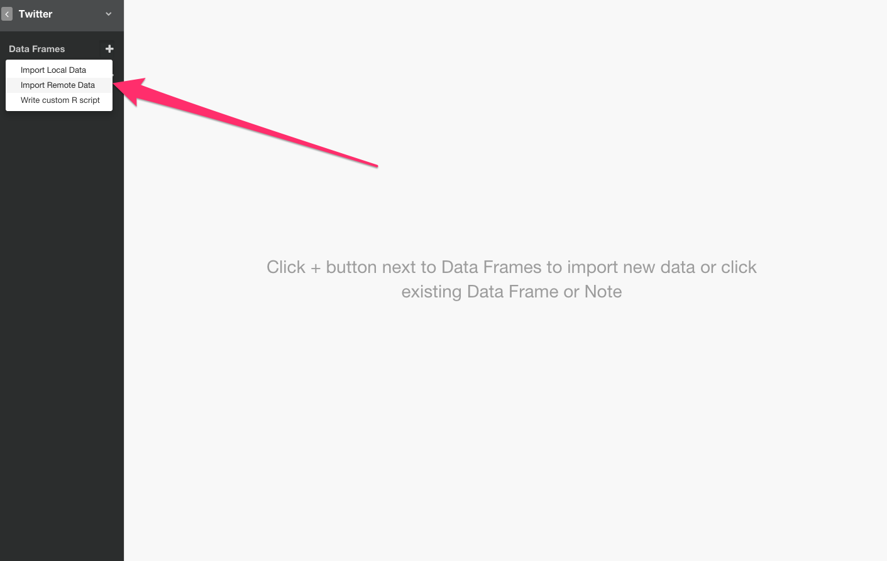

Twitterを選びます。

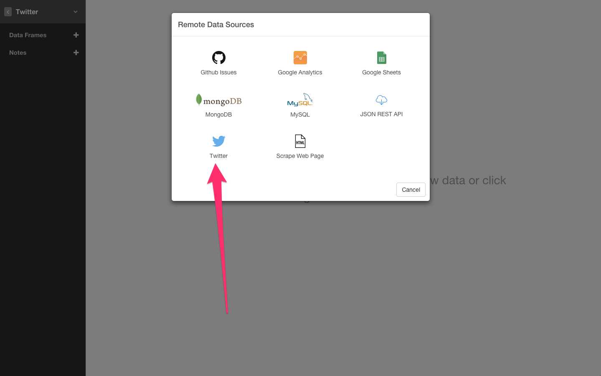

連携を許可します。

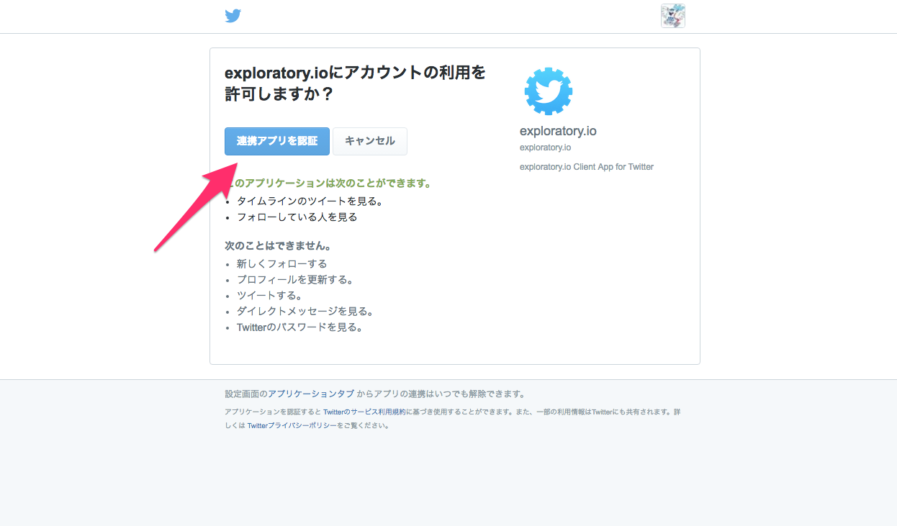

Search Textの部分にExploratoryで分析したい文字を入れます。そしてGET DATAボタンを押します。

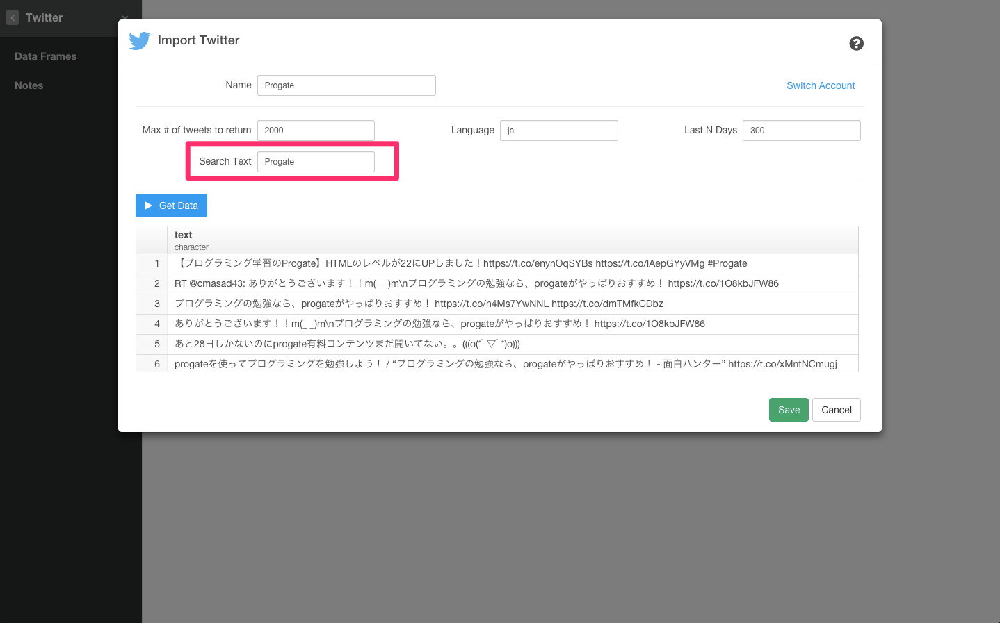

これで、データを取得することができました。

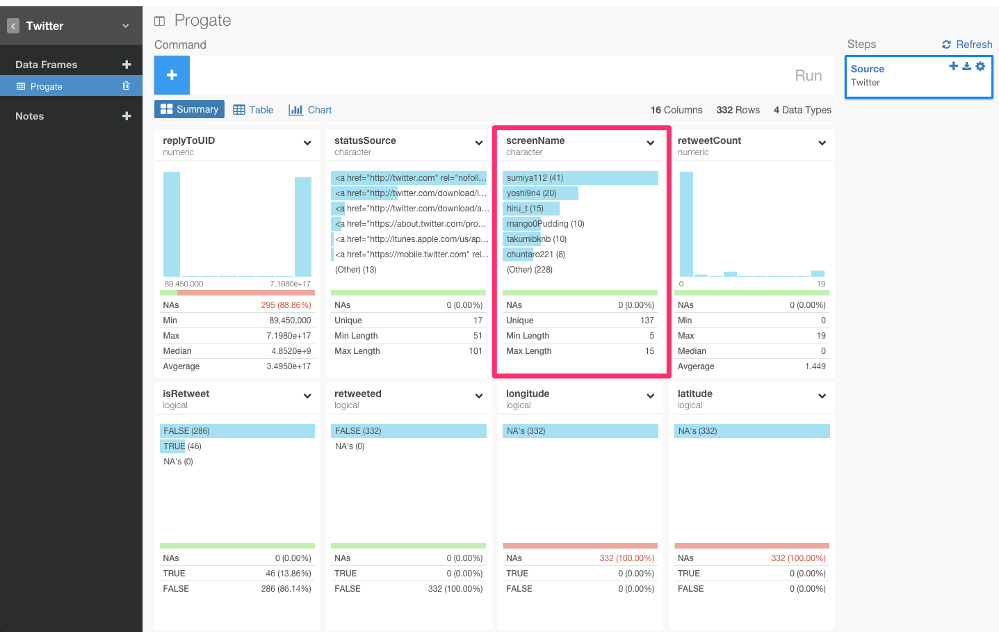

screenName列などを使うと、だれが一番ツイートしているのかを見て、ランキングを出したりしていけそうです。やっぱりProgateの開発者のアカウントはランキングに入っていたりするのでしょうか？

##2. だれが一番ツイートしているか？

これから、screenNameの数を出していくために、screenNameグルーピングします。screenName列のヘッダーからGroup_byを選択します。

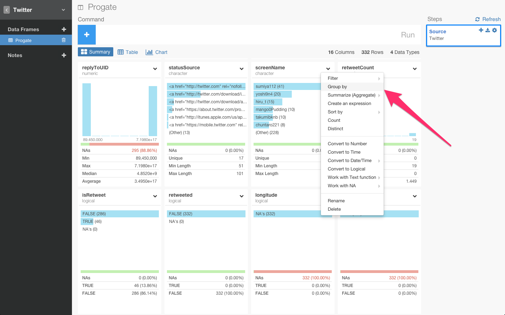

すると、自動的にグルーピングを意味する関数が入力されグルーピングされました。

次に、Summarize関数を使って、screenNameの数を計算します。screenName列のヘッダーからSummarize, Count(n)を選択します。

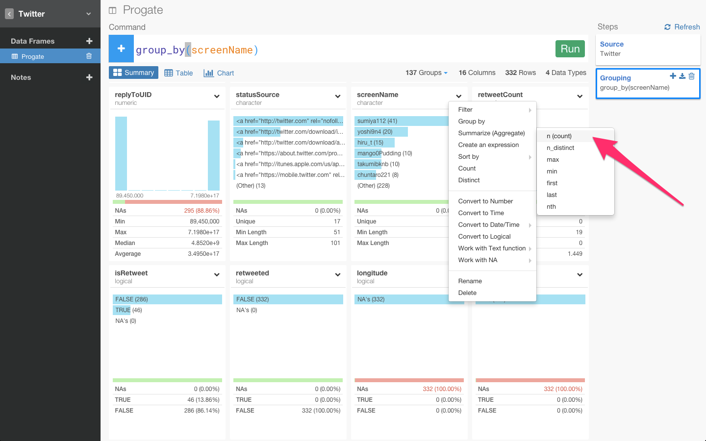

すると、自動的にSummarize関数が入力され、「アカウントが何回Progateとツイートしているか」を計算することができました。

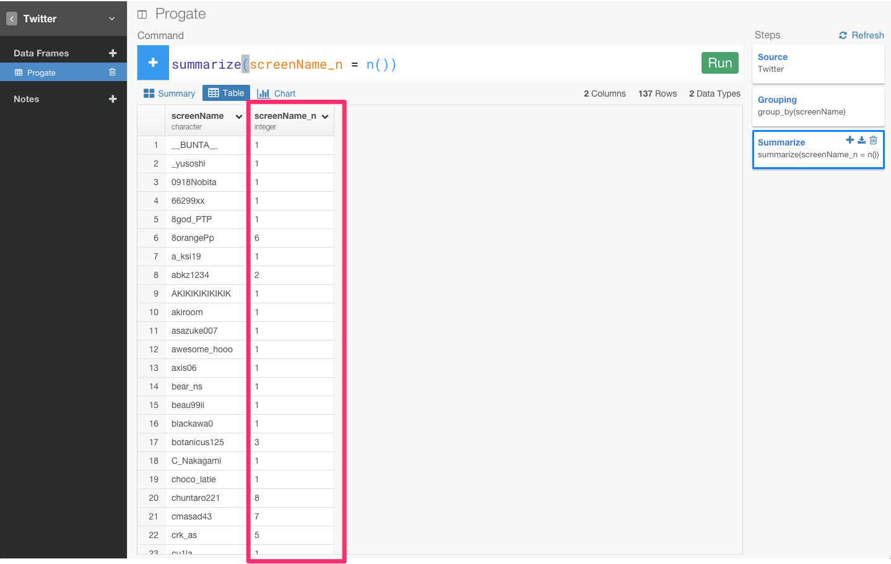

ぜんぶ見ていても、仕方ないので、Top N関数をつかって、簡単にトップ１０ランキングを出してみたいと思います。

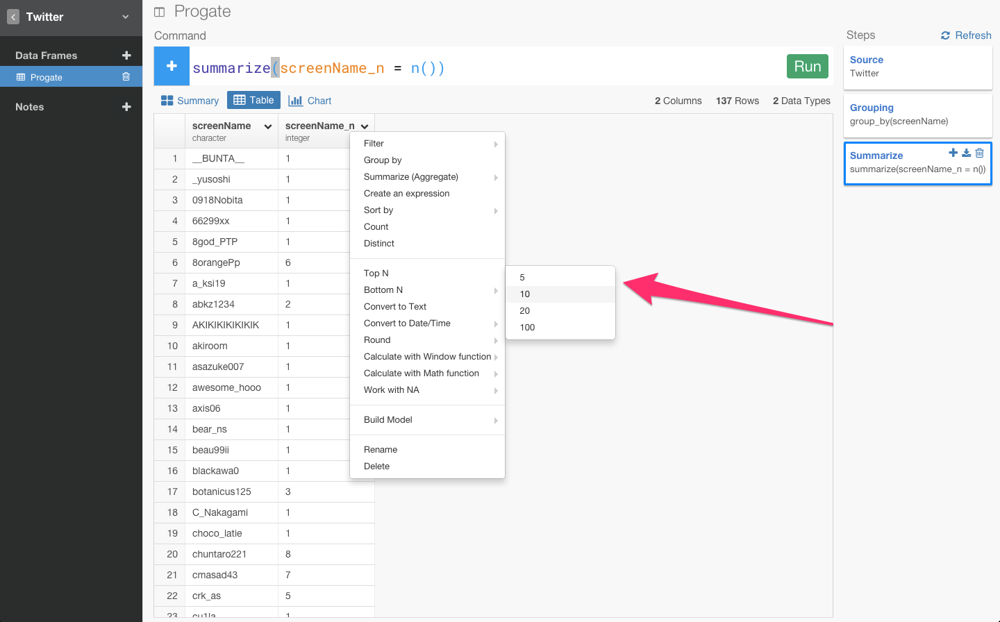

すると、自動的にTop N関数が入力され、簡単にトップ１０ランキングを出すことができました。

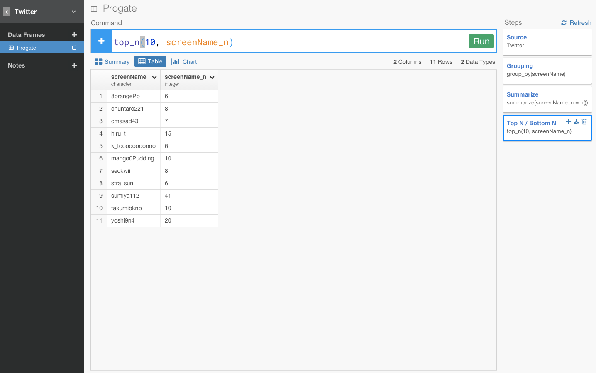

次に、順番がバラバラなので、arrange関数を使ってソートしてみます。screenName列のヘッダーからSort by, Descendingを選択します。

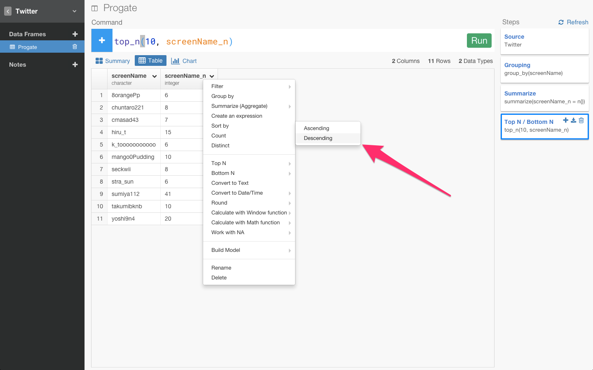

すると、自動的にarrange関数が入力され、簡単に順番にソートしてくれました。

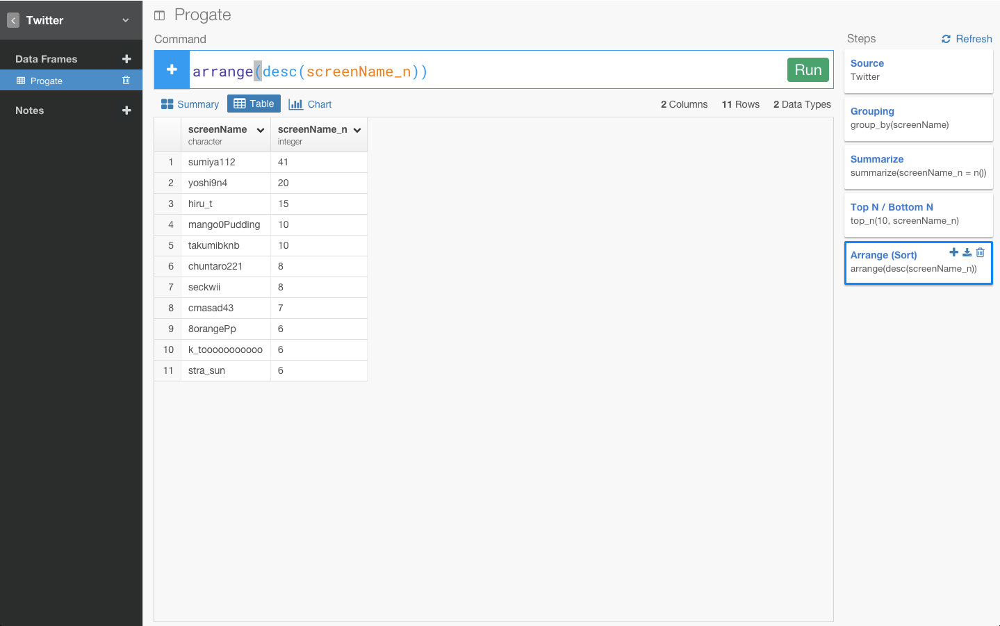

##3. 検証

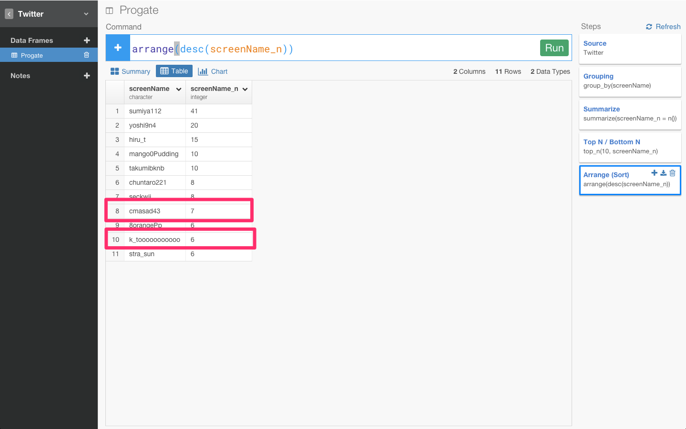

この８位と１０位のアカウントはProgateの社長とインターン生のTwitterアカウントです。

フォローしておくとなにかいいことがあるかもしれません笑

##4. なんで１週間分のツイートしか取得できないの？

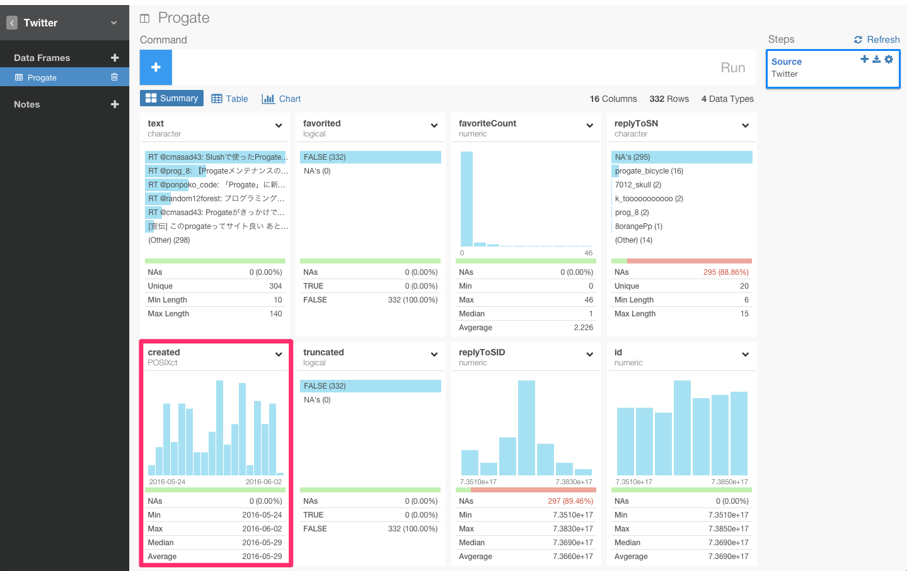

Progateとツイートされた日付を表すcreated_atカラムを見るとわかるように、1週間分のツイートしか取得できていません。
これは、Twitterの検索APIの仕様の問題でそうなっているようです。もしどうしても、すべてのツイートを読み込みたい場合は、Twitterはstreaming apiってのが提供しているはずなので、それをdbに入れておいてそれを解析するか、seleniumとか使ってすべてスクレイプするしかなさそうです。めんどくさそうですね笑。

##5. なんでTwitterのアナリティクス機能を使った分析はできないの？

画像を見てわかるように、Twitterではアナリティクス機能が実装されており、だれでも自分のツイートの分析について詳しく見ていくことができます。
Exploratoryでは、現在はまだアナリティクスデータのインポート機能は実装されていませんが、将来的にサポートする予定です。

##興味を持っていただいた方、実際に触ってみたい方へ

Exploratoryは[こちら](https://exploratory.io/
)からβ版の登録ができます。こちらがinviteを完了すると、ダウンロードできるようになります。

チュートリアルは[こちら](http://docs.exploratory.io/tutorials/intro.html
)から見ることができます。

英語が読める方は[Introducing Exploratory Desktop — UI for R](https://blog.exploratory.io/introducing-exploratory-desktop-ui-for-r-895d94ef3b7b#.4dncgv1rt
)もどうぞ

Exploratoryの日本ユーザー向けの[Facebookグループ](https://www.facebook.com/groups/1087437647994959/members/
)を作ったのでよろしかったらどうぞ

