#StackOverflowのデータを簡単にジョイン（結合）して、データをいろんな角度から見てみた

Qiita読者のみなさん！　プログラミング質疑応答サイト、Stack Overflowにお世話になったことはありませんか？


[Data Is Plural](https://tinyletter.com/data-is-plural)というサイトを登録しておくと、毎週水曜日に興味深いデータがソースと一緒に送られてきます。先週のData Is Pluralから送られてきたデータのうちのひとつにStack Overflowのデータがありました。

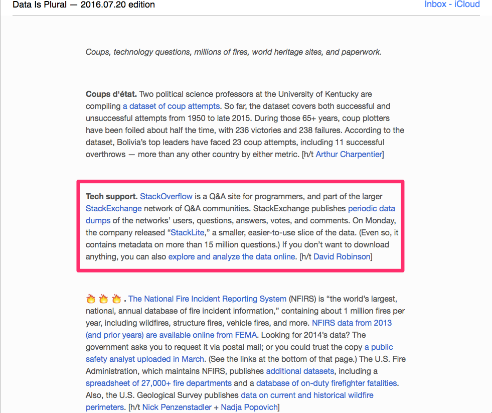


データ分析Exploratoryチームでは、データリテラシー向上の意味も兼ねて、毎週水曜日に、Data Is Pluralのデータのどれかを使って、「誰が一番興味深い分析ができるか」というData Is Pluralコンテンストなるものをしています。‪#‎DataIsPlural‬というハッシュタグをつけてよくツイートしています。ぼくは、５つの中からStack Overflowを選び、Stack Overflowのデータを様々な角度から分析してみました。今回は、そのときに使ったJoinコマンドの使い方を説明したいと思います。そして、最後には、計算してビジュアライズしたチャートを１０つほど載せたいと思います。


##Joinコマンドを使って、データを結合する

メールのStack OverflowのリンクをクリックするとStack Overflowのcsvデータが2つあるのがわかります。２つともダウンロードします。

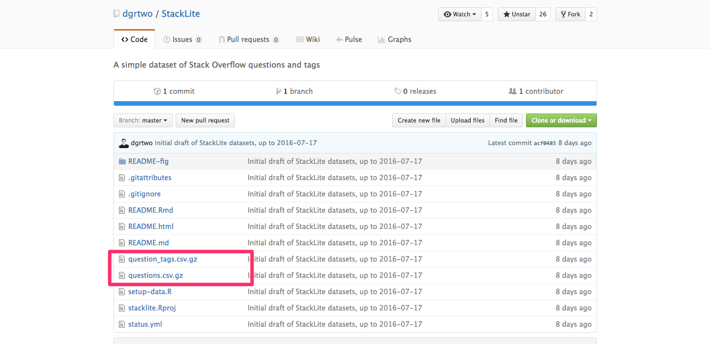

ダウンロードしたデータをインポートします。

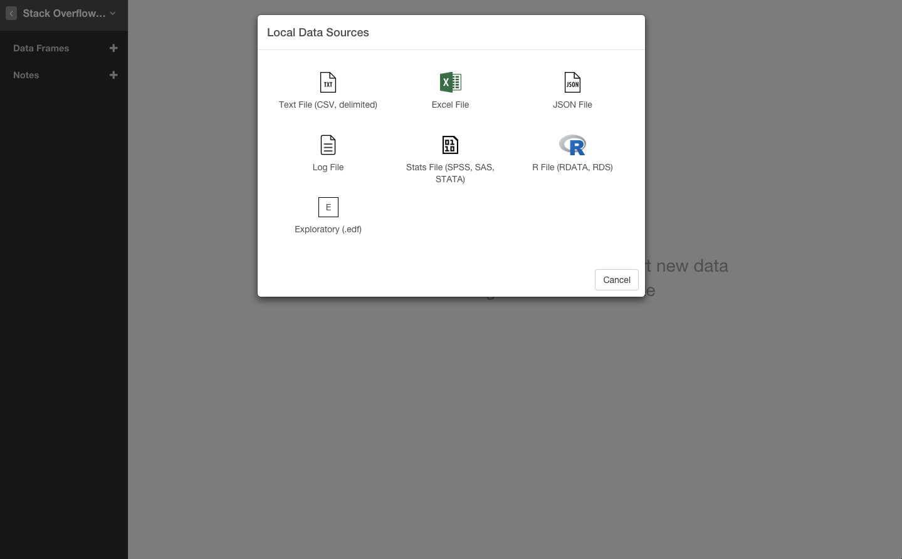

questions-tagのcsvデータ。Tag列にプログラミング言語のデータがはいっていたりしますね。

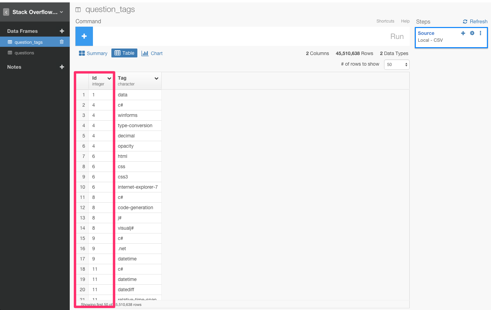

questionsのcsvデータ。CreationDate列に質問が書かれた日付であったり、Score列に質問や解答に対する得点であったり、解答の合計数を表すデータがあったりしますね。

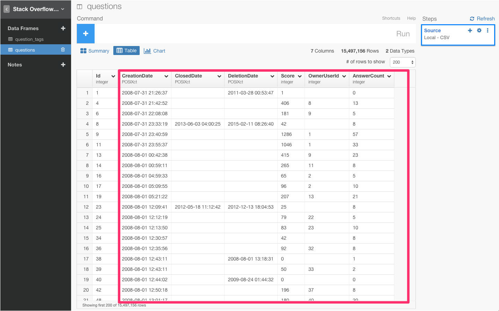

でも、この2つのデータフレームがバラバラになっていると、分析のやり方が限られてきます。でも、もしこの2つのデータフレームが一緒になっていれば、Tag列とCreationDate列を組み合わせて、人気言語ごとの累計質問合計数を出してみたりすることができますよね。つまり、この2つのデータフレームが結合されていると分析のバリエーショを増やしていくことができるのです。そういうときは、left_joinというコマンドを使うと便利です。


left_joinでは、引数に結合したいデータフレーム名とマッチしたい列名を入力すると、マッチした列以外の列を元のデータフレームに結合させることができるんです。よく上のデータを見てみると、Idという列は、questions-tagとquestionsデータフレームの両方に共通してありますね。なので、```left_join(question_tags, by=c("Id" = "Id"))```と入力してみましょう。そして、Runボタンを押します。

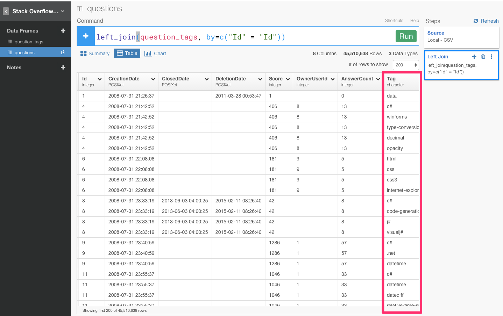

これで、question_tagsデータフレームのId列以外の部分であるTag列をquestions列にジョイン（結合）させることができましたね。


Joinをすると、Stack Overflowのたくさんの列を使うことができるようになるので、このようにデータをいろんな角度から見ていくことができます。

###人気言語ごとの質問増加率


人気言語ごとの質問増加率を計算しました。意外にも、Rが急激に増えている。これは、Rのフロントエンド、Exploratoryの成功の予感、笑

###人気言語ごとの質問がClosedになるまでの平均時間

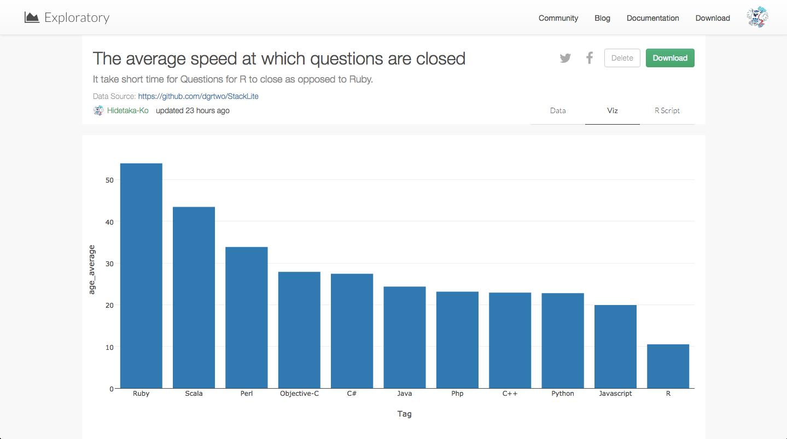

人気言語ごとの質問がClosedになるまでの平均時間を計算しました。Rubyが一番時間かかってるのに対し、Rが一番速いですね。
コミュニティを大事にしてるからか、教えたがりが多いからか、答えがはっきりしてるからとか。

###人気言語ごとのCorrelations

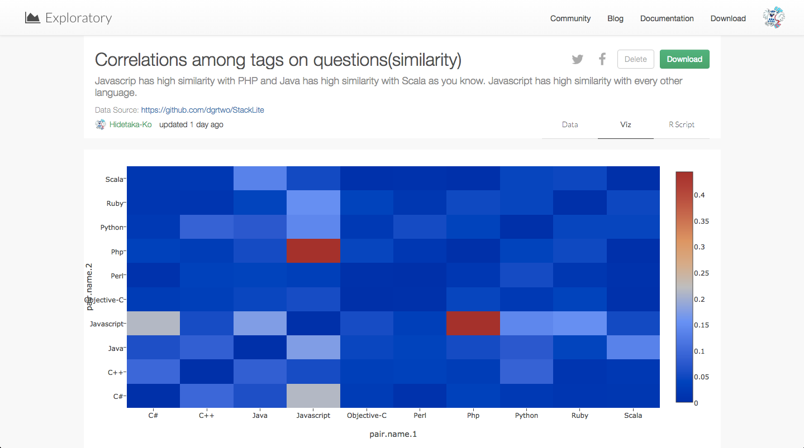

人気言語ごとのCorrelations（類似関係）計算して出しました。方法としては、Tag, owner user ID （回答者のアカウント）でsummarizeして、Tagを、どのユーザーが何回、回答したかで特徴量化しています。この言語に応える人は、この言語にも応えるよねっていうcorrelationになっているはずです。
ビジュアライズして見てみると、PHPとJSが反応してたり、ScalaとJavaが反応してたり、JSがどれとも高くなっています。

###人気言語ごとのStackOverflow内の平均得点数

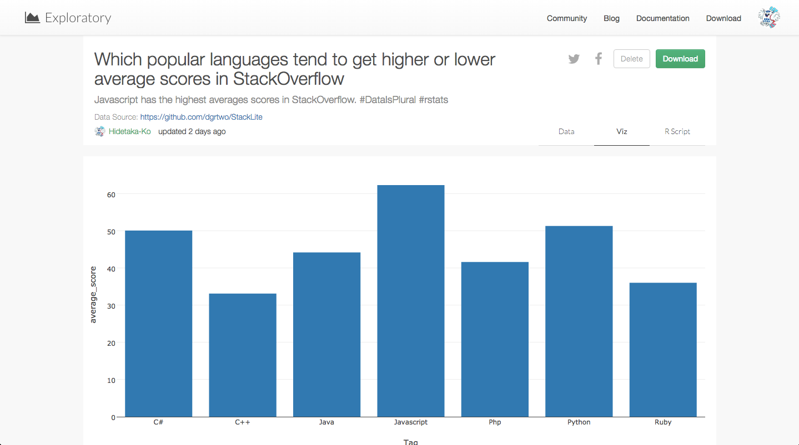

###人気言語ごとのStackOverflow内の合計得点数

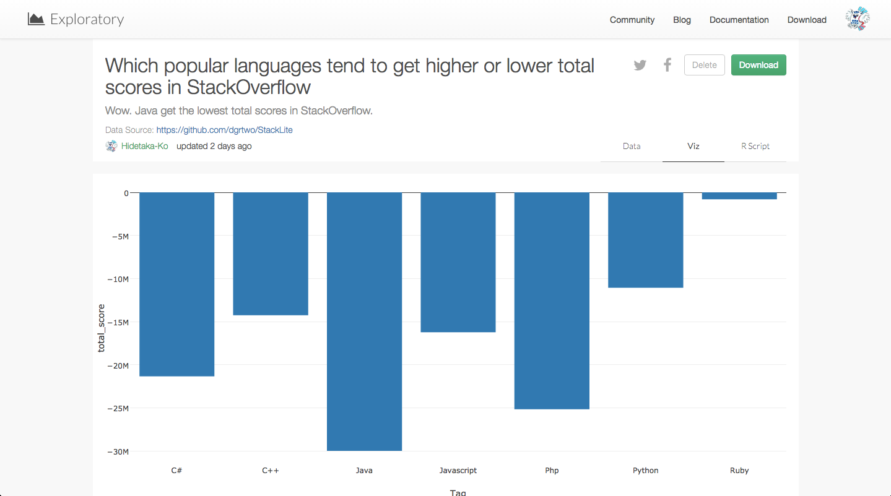

###平日と休日の人気言語ごとの質問回答数の比較

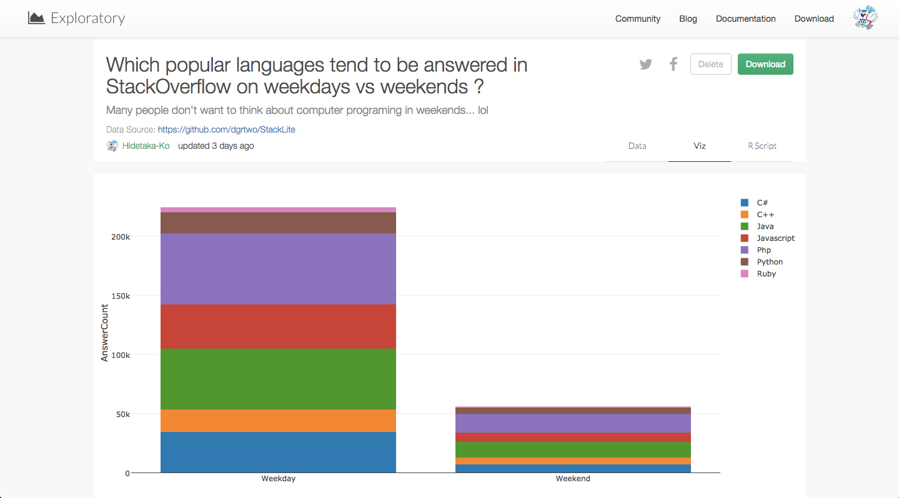

みなさん、休日は、プログラミングしたくないみたいですね笑

###人気言語ごとの累計質問合計数


昔から、PHPがやっぱり強いですね。

これらは、あくまで一例で、まだまだたくさんの分析ができるので、よかったら試してみてください。

##興味を持っていただいた方、実際に触ってみたい方へ

Exploratoryは[こちら](https://exploratory.io/
)からβ版の登録ができます。こちらがinviteを完了すると、ダウンロードできるようになります。


ExploratoryのTwitterアカウントは、[こちら](https://twitter.com/ExploratoryData
)です。

Exploratoryの日本ユーザー向けの[Facebookグループ](https://www.facebook.com/groups/1087437647994959/members/
)を作ったのでよろしかったらどうぞ

分析してほしいデータがある方や、データ分析のご依頼はhidetaka.koh@gmail.comまでどうぞ