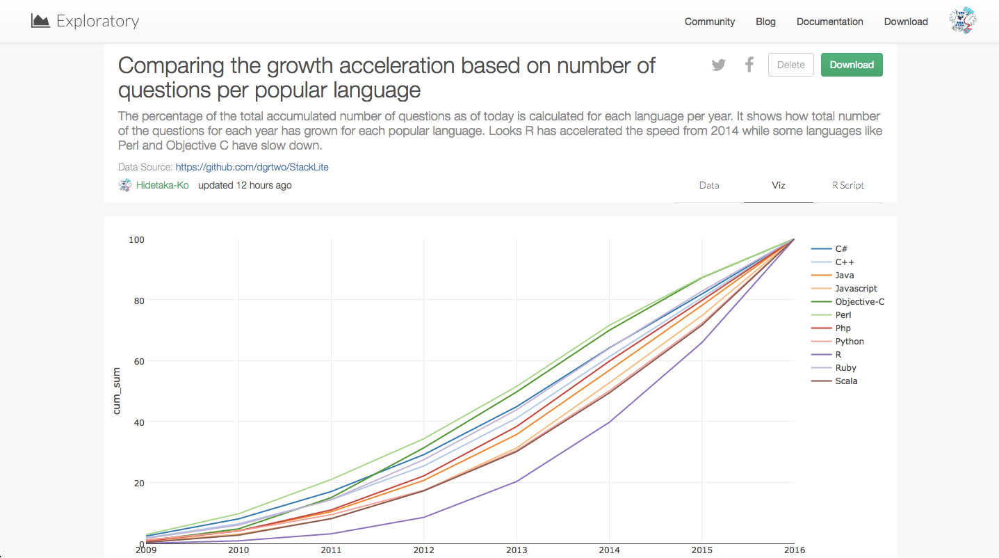
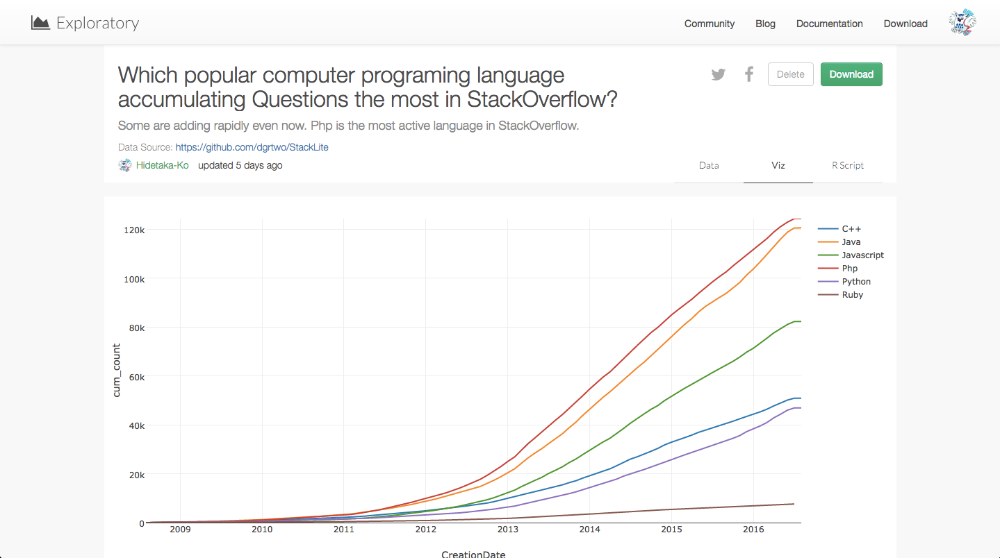

#StackOverflowのデータを簡単にジョイン（結合）して、データをいろんな角度から見てみた

Qiita読者のみなさん！　プログラミング質疑応答サイト、Stack Overflowにお世話になったことはありませんか？

[Data Is Plural](https://tinyletter.com/data-is-plural)というサイトを登録しておくと、毎週水曜日に興味深いデータがソースと一緒に送られてきます。先週のData Is Pluralから送られてきたデータのうちのひとつにStack Overflowのデータがありました。

データ分析Exploratoryチームでは、データリテラシー向上の意味も兼ねて、毎週水曜日に、Data Is Pluralのデータのどれかを使って、「誰が一番興味深い分析ができるか」というData Is Pluralコンテンストなるものをしています。‪#‎DataIsPlural‬というハッシュタグをつけてよくツイートしています。ぼくは、５つの中からStack Overflowを選び、Stack Overflowのデータを様々な角度から分析してみました。今回は、そのときに使ったJoinコマンドの使い方を説明したいと思います。そして、最後には、計算してビジュアライズしたチャートを１０つほど載せたいと思います。

##Joinコマンドを使って、データを結合する

###人気言語ごとの質問増加率

人気言語ごとの質問増加率を計算しました。意外にも、Rが急激に増えている。これは、Rのフロントエンド、Exploratoryの成功の予感、笑

###人気言語ごとの質問がClosedになるまでの平均時間

人気言語ごとの質問がClosedになるまでの平均時間を計算しました。Rubyが一番時間かかってるのに対し、Rが一番速いですね。
コミュニティを大事にしてるからか、教えたがりが多いからか、答えがはっきりしてるからとか。

###人気言語ごとのCorrelations

人気言語ごとのCorrelations（類似関係）計算して出しました。方法としては、Tag, owner user ID （回答者のアカウント）でsummarizeして、Tagを、どのユーザーが何回、回答したかで特徴量化しています。この言語に応える人は、この言語にも応えるよねっていうcorrelationになっているはずです。
ビジュアライズして見てみると、PHPとJSが反応してたり、ScalaとJavaが反応してたり、JSがどれとも高くなっています。

###人気言語ごとのStackOverflow内の平均得点数

###人気言語ごとのStackOverflow内の合計得点数

###平日と休日の人気言語ごとの質問回答数の比較

みなさん、休日は、プログラミングしたくないみたいですね笑

###人気言語ごとの累計質問合計数

昔から、PHPがやっぱり強いですね。

##興味を持っていただいた方、実際に触ってみたい方へ

Exploratoryは[こちら](https://exploratory.io/
)からβ版の登録ができます。こちらがinviteを完了すると、ダウンロードできるようになります。

ExploratoryのTwitterアカウントは、[こちら](https://twitter.com/ExploratoryData
)です。

Exploratoryの日本ユーザー向けの[Facebookグループ](https://www.facebook.com/groups/1087437647994959/members/
)を作ったのでよろしかったらどうぞ

分析してほしいデータがある方や、データ分析のご依頼はhidetaka.koh@gmail.comまでどうぞ