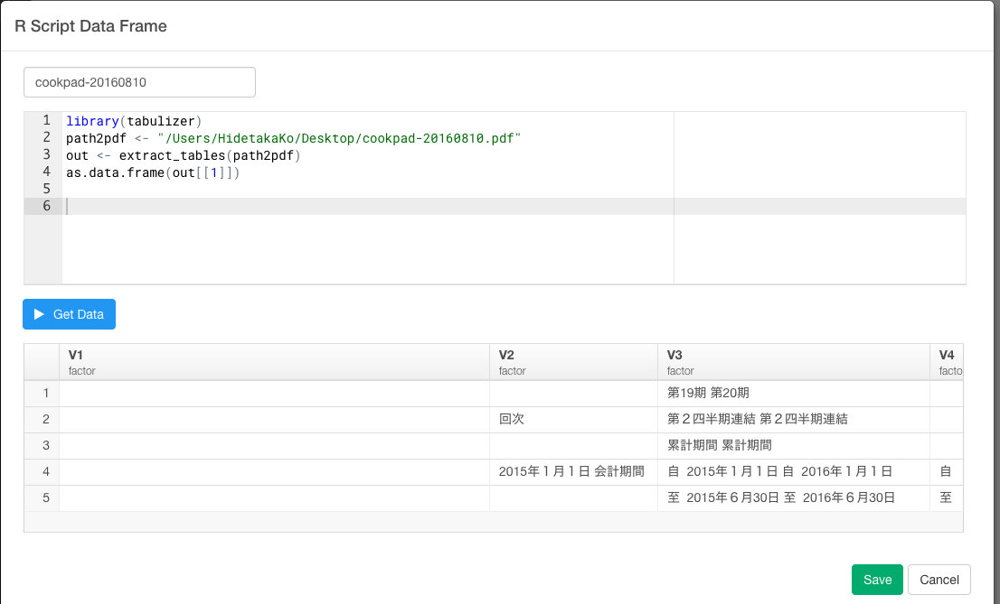

#「2016年版このRパッケージがすごい」暫定第一位、tabulizerパッケージを使って、日本で話題のCookpadのPDF表データから超簡単にデータを取得してビジュアライズまでしてみた


今年の3月ごろから何やらCookpadが騒がしいですね。IT業界に足を置いていれば、このような噂を聞いたりするのは、1度や2度ではないのではないのでしょうか？一部報道には、幹部社員が大量離脱したためサービス運営が困難、という報道もありました。Cookpadの有価証券から、実際に決算がどうなっているのかを見てみると、噂が本当なのかや事件の影響について検証できそうです。事件の前と後で業績に変化はあったのか、1株あたりの利益はどれくらい増加しているのかって質問に答えることができそうです。ところが、ほとんどの有価証券はPDFデータになっています。PDFデータに埋まっていると、そのデータをまずcsvにエクスポートすることや、その後取ってきたデータを加工して分析やビジュアライズできるようにするという過程が、結構めんどくさかったりしますよね。だから、今日は、Exploraotryを使って、そんなPDFデータの分析の方法について、簡単に見ていきたいと思います。

- 1.Cookpadの有価証券のPDF表データを保存する
- 2.PDF表データをインポートする
- 3.データを整形する
- 4.2015年の第二四半期の有価証券のデータをジョインする
- 5.有価証券のデータをビジュアライズする


##1.Cookpadの有価証券のPDF表データを保存する


##2.PDF表データをインポートする


##3.データを整形する


##4.2015年の第二四半期の有価証券のデータをジョインする


##5.有価証券のデータをビジュアライズする


##データを再現可能な状態でシェアする


クックパッドは、既にブランドが確立されているだけではなく、ネットワーク外部性が非常に強いサービスであるため、担当する社員が変わったくらいでは（短期的には）びくともしないレベルの会社ということがここからわかるかもしれませんね。

##注意：Javaのバージョンが原因で、tabulizerパッケージをインストールできないときの解決方法

Javaのバージョンが違うことが原因で、tabulizerパッケージをうまくインストールできないケースがあります。ぼくは、これが原因でしばらく詰まりました。

どうやら、tabulizerパッケージはJava 1.6.0でないとダウンロードできないのですが、OSがElcapitanやYosemite以降だと、デフォルトでJava 1.7.0になっているようです。

###Java 1.7.0を削除する

まず、ターミナルを開きます。

次のコマンドでRのライブラリが入っているディレクトリに移動します。

`cd /Library/Java/JavaVirtualMachines`

Javaのバージョンを確認します。

`ls -a`

Javaのバージョン 1.7を次のコマンドで削除します。

`sudo rm -rf jdk1.7.0_79.jdk/`


###tabulizerパッケージをインストールする

次のコマンドで、Exploratoryのcustom Rscriptからtabulizerパッケージをインストールします。

```
library(tabulizer)
path2pdf <- "/Users/HidetakaKo/Downloads/data.pdf"
out <- extract_tables(path2pdf)
as.data.frame(out[[1]])
```


これで、インストールが成功します。


##謝辞

PDFデータを簡単にインポートできるこのtabulizerというパッケージは、日本のR言語によるデータ分析の業界では有名な@u_riboさんのツイートを通して知ることができました。このパッケージを知った時は、Rの威力を思い知って、とても感動したものでした。ありがとうございました。Exploratoryがあれば、そんなRの威力をだれでも、簡単に、加速させていくことができるのを感じることができます。あなたも試してはいかがでしょうか？

<blockquote class="twitter-tweet" data-lang="ja"><p lang="ja" dir="ltr">「2016年版このRパッケージがすごい」暫定第一位かもしれない良いやつです！ &gt; tabulizerパッケージによるPDF表データからのデータ取得 <a href="https://t.co/NL5LxNnY4d">https://t.co/NL5LxNnY4d</a> <a href="https://t.co/EKfGQVRwqv">pic.twitter.com/EKfGQVRwqv</a></p>&mdash; Shinya Uryu (@u_ribo) <a href="https://twitter.com/u_ribo/status/768227002398617600">2016年8月23日</a></blockquote>
<script async src="//platform.twitter.com/widgets.js" charset="utf-8"></script>


##興味を持っていただいた方、実際に触ってみたい方へ

Exploratoryは[こちら](https://exploratory.io/
)からβ版の登録ができます。こちらがinviteを完了すると、ダウンロードできるようになります。


ExploratoryのTwitterアカウントは、[こちら](https://twitter.com/ExploratoryData
)です。

Exploratoryの日本ユーザー向けの[Facebookグループ](https://www.facebook.com/groups/1087437647994959/members/
)を作ったのでよろしかったらどうぞ

分析してほしいデータがある方や、データ分析のご依頼はhidetaka.koh@gmail.comまでどうぞ