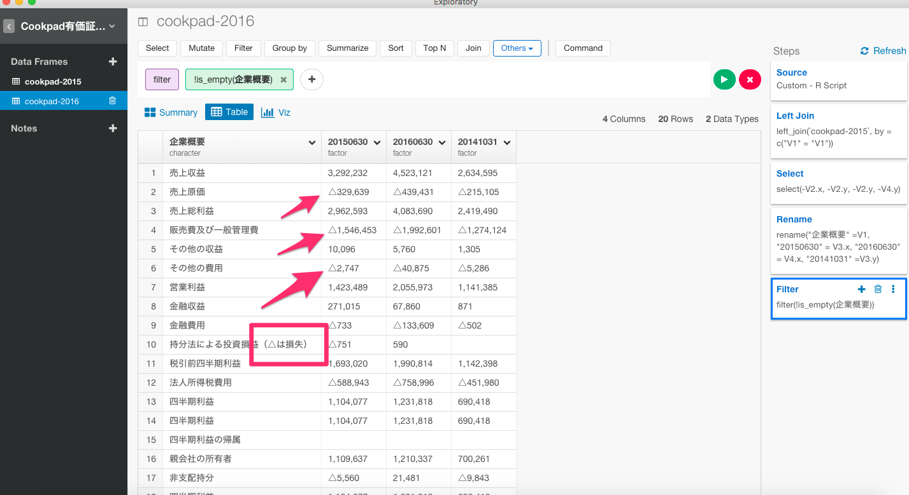
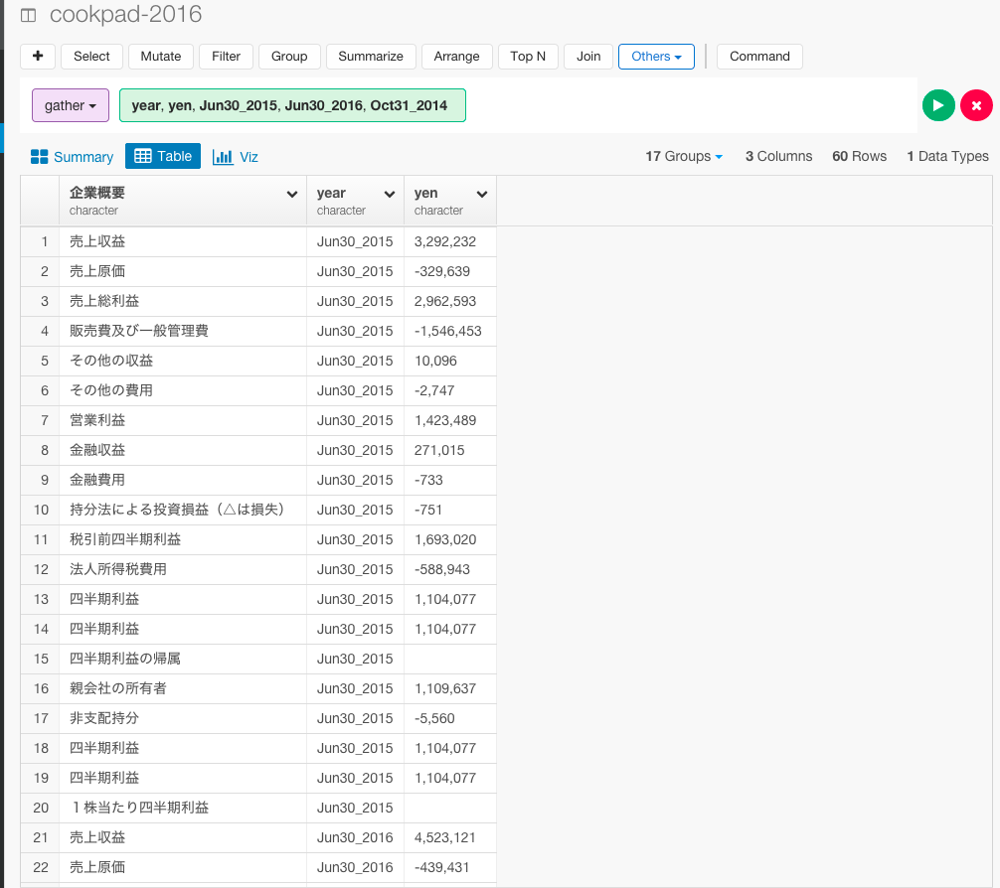
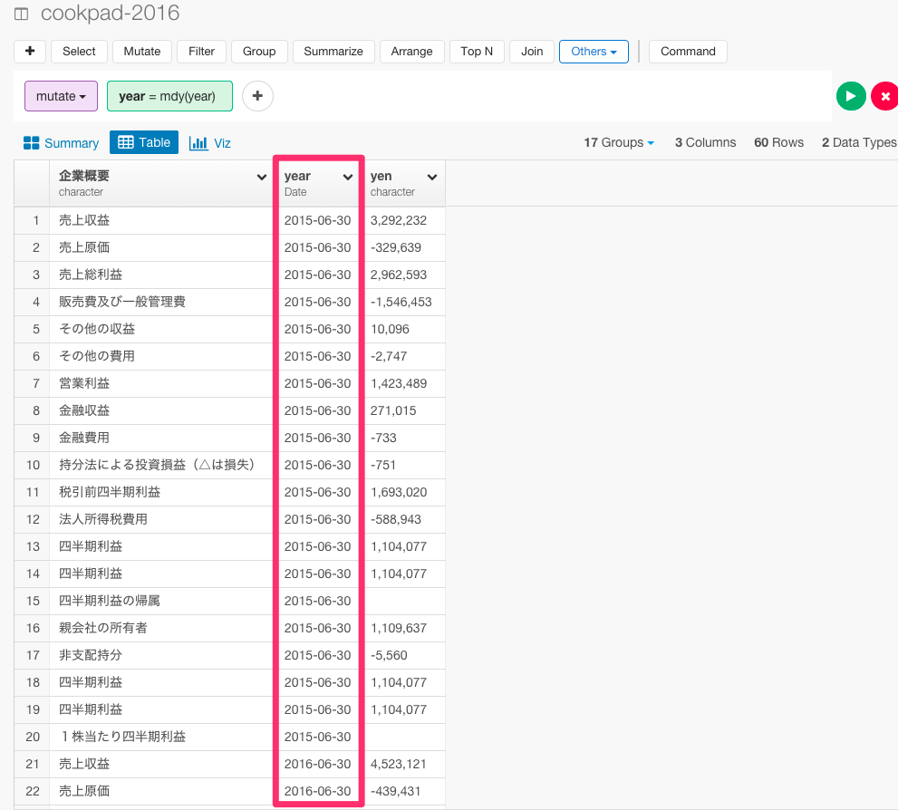
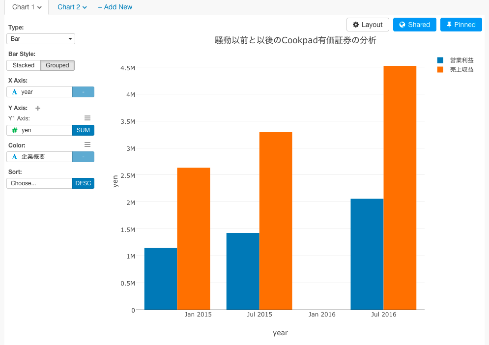
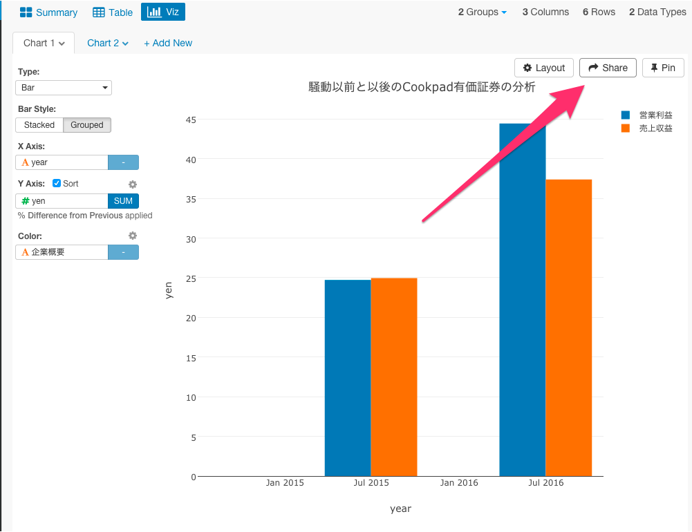
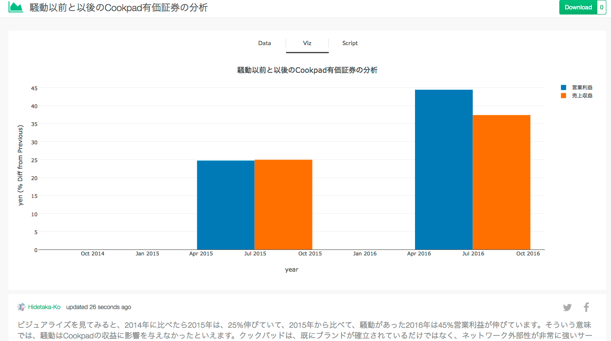
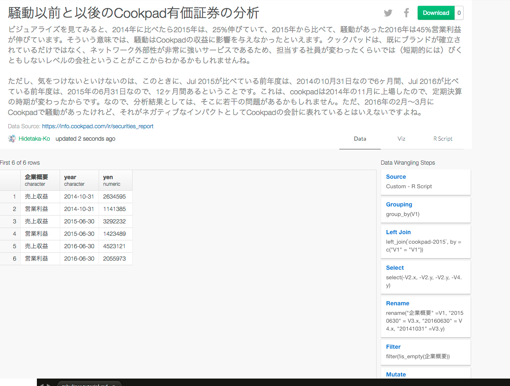

#「2016年版このRパッケージがすごい」暫定第一位、tabulizerパッケージを使って、日本で話題のCookpadの有価証券PDFから超簡単にデータを取得してビジュアライズまでしてみた


今年の3月ごろから何やらCookpadが騒がしいですね。IT業界に足を置いていれば、このような噂を聞いたりするのは、1度や2度ではないのではないのでしょうか？一部報道には、幹部社員が大量離脱したためサービス運営が困難、という報道もありました。Cookpadの有価証券から、実際に決算がどうなっているのかを見てみると、噂が本当なのかや事件の影響について検証できそうです。事件の前と後で業績に変化はあったのか、1株あたりの利益はどれくらい増加しているのかって質問に答えることができそうです。ところが、ほとんどの有価証券はPDFデータになっています。PDFデータに埋まっていると、そのデータをまずcsvにエクスポートすることや、その後取ってきたデータを加工して分析やビジュアライズできるようにするという過程が、結構めんどくさかったりしますよね。だから、今日は、Exploraotryを使って、そんなPDFデータの分析の方法について、簡単に見ていきたいと思います。

1.Cookpadの有価証券のPDF表データを保存する<br>
2.tabulizerパッケージを使って、PDF表データをインポートする<br>
3.データを整形する<br>
4.2015年の第二四半期の有価証券のデータをジョインする<br>
5.有価証券のデータをビジュアライズする<br>


##1.Cookpadの有価証券のPDF表データを保存する

まず、Cookpadの有価証券のPDF表データをデスクトップに保存しましょう。PDFデータは、Cookpadの[ホームページ](https://info.cookpad.com/ir/securities_report)に行くと取得することができます。


このページだけを保存したいので、ページ数を指定します。


ファイル名を指定して、デスクトップに保存します。


##2.tabulizerパッケージを使って、PDF表データをインポートする

まず、PDFデータをインポートするには、Rのtabulizerパッケージというのをインストールする必要があります。Rstudioからtabulizerパッケージをインストールしましょう。Rstudioを持っていない方は、[こちら](https://www.rstudio.com/)からRstudioをダウンロードしてください。

```
install.packages("devtools")
install.packages("githubinstall")
library(githubinstall)
githubinstall(c("tabulizerjars", "tabulizer"))
```


2を選んでください。これでインストール完了です。

次に、Exploratoryだと、Import by Writing R scriptという機能を使えば、柔軟にRで書いたスクリプトをもとにデータ・フレームを作ることができます。ですので、今回はここに、先ほどインストールした、tabulizer のパッケージを使ってPDFからデータを取ってくるという作業を定義したいと思います。

Import by Writing R scriptをクリックします。


ここで、先ほどインストールしたtabulizerパッケージを使って、CookpadのPDFデータを取得するスクリプトを書いていきます。

```
library(tabulizer)
path2pdf <- "/Users/HidetakaKo/Desktop/cookpad-2016.pdf"
out <- extract_tables(path2pdf)
as.data.frame(out[[1]])
```

Get Dataボタンを押すとこのようにデータがPDFより取得できました。


テーブルViewに行って、実際のデータとくらべてみましょう。


こちらが実物です。


##3.2015年の第二四半期の有価証券のデータをジョインする

騒動があった2016年以降のデータだけを見てもおもしろくないので、事件以前と事件後でCookpadに業績に影響があったのかを分析するために、2015年以前の第二四半期の有価証券のデータも取得して、ジョインをして比べたいと思います。

まず、また同じようにCookpadのページに行って、2015年のデータを保存して、PDFデータを取得するスクリプトを書きます。

```
library(tabulizer)
path2pdf <- "/Users/HidetakaKo/Desktop/cookpad-2015.pdf"
out <- extract_tables(path2pdf)
as.data.frame(out[[1]])
```


次に、データをジョインします。Joinボタンを押すと次の画面が現れます。


V1列がマッチしているので、引数にV1を指定します。Runボタンを押してください。


これで、2015年第二四半期のデータをジョインすることができました。

##4.データを整形する

###不要な列を取り除く

見ての通り、いくつか不要な列があるので、Selectコマンドを使って、取り除きましょう。矢印のSelectボタンを押します。


列を取り除きたいので、Excludeを選び、取り除きたい列を順に選びます。

`select(-V2.x, -V2.y, -V4.y)`

Runボタンを押します。


これで、不要な列を取り除くことができました。

###列の名前を変える

今のままだと列の名前が、V1やV2となっていて、何を表しているデータなのかいまいちわかりにくいので、Renameコマンドを使って列の名前を変えます。第二四半期の日付の最後が2015年6月30なので、`"20150630" = V3.x`と書きます。他も同様です。

`rename("企業概要" =V1, "20150630" = V3.x, "20160630" = V4.x, "20141031" =V3.y)`

Runボタンを押します。


これで、列の名前を変えることができました。

###空の行を取り除く

次に、企業概要が空になっている行が意味のないデータになっているので取り除きましょう。


Filterコマンドを選んで、is not emptyを選びます。


`filter(!is_empty(V1))`

Runボタンを押します。


###△を-に置換する

データを見てみいくと、ところどころに△が入っていますね。これは、-であることを示しています。



△のままだと後で計算をしていけないので、str_replaceコマンドを使って、-に置換したいと思います。

`mutate(`20160630`= str_replace(`20160630`, "△","-"),`20150630`= str_replace(`20150630`, "△","-"),`20141031`= str_replace(`20141031`, "△","-"))`


これで、△を-に置換することができましたね。

###gatherを駆使して列と行を入れ替える

今は、2014年度、2015年度、2016年度の金額がちがう列にばらばらになっていますね。目的である、事件の前と後で業績に変化はあったのかをビジュアライズするには、2014年度、2015年度、2016年度の金額をまとめる必要があります。そういう場合は、gatherコマンドが便利です。
gatherコマンドは、複数の列を、１つの列にすることができます。第一引数と第二引数に新しく作りたい列名を入力し、第三引数で、新しい列に入れる値の列を選びます。

`gather(year, yen, `20141031`, `20150630`, `20160630`)`

この場合だと、年度を表すyearとそれぞれの金額を表すyenという2つの列に`20141031`, `20150630`, `20160630`の値を入れています。



これで、2014年度、2015年度、2016年度の金額をまとめることができました。

###データタイプをdateに変更する

今度は、日付のデータタイプがcharacterになっているので、ymdコマンドを使って、Dateタイプに変えましょう。

`mutate(year = ymd(year))`



###データタイプをnumericに変更する

`mutate(yen = extract_numeric(yen))`


##5.有価証券のデータをビジュアライズする

###売上収益と営業利益だけにフィルタリングする

あまり、指標が多すぎてもわかりにくいので、Filterコマンドを使って、見る変数を利益に絞りましょう。

`filter(企業概要 == "売上収益 " | 企業概要 == "営業利益 ")`


次に、Vizタブを押して、ビジュアライズ化してみます。



これは、金額の絶対値を表したデータですが、絶対値より、前年度と比べてどうだったかをビジュアライズしたほうが、より騒動の前と後で業績に変化はあったのかを理解することができます。そういうときは、Window関数が便利です。

矢印の部分を押すと、チャートからWindow関数を簡単に扱うことができます。


ここでは、前年度と比べてどうだったかを計算したいので、%Diffrence Fromを選んで、FirstからPreviousに変えましょう。


ビジュアライズを見てみると、2014年に比べたら2015年は、25%伸びていて、2015年から比べて、騒動があった2016年は45%営業利益が伸びています。そういう意味では、騒動はCookpadの収益に影響を与えなかったといえます。クックパッドは、既にブランドが確立されているだけではなく、ネットワーク外部性が非常に強いサービスであるため、担当する社員が変わったくらいでは（短期的には）びくともしないレベルの会社ということがここからわかるかもしれませんね。

ただし、気をつけないといけないのは、このときに、Jul 2015が比べている前年度は、2014の10月31日なので6ヶ月間、Jul 2016が比べている前年度は、2015年の6月31日なので、12ヶ月間あるということです。これは、cookpadは2014年の11月に上場したので、定期決算の時期が変わったからです。なので、分析結果としては、そこに若干の問題があるかもしれません。ただ、2016年の2月〜3月にCookpadで騒動があったけれど、それがネガティブなインパクトとしてCookpadの会計に表れているとはいえないですよね。

##データを再現可能な状態でシェアする

Shareボタンを押すと、データを再現可能な状態でシェアすることができます。



タイトルなどを入力していきます。そして、矢印の場所をクリックしてShareボタンを押すと、データがどのように加工されたり計算されたかの詳細もシェアすることができます。


View Shared Chartをクリックします。



興味がありましたら、[こちら](https://exploratory.io/viz/Hidetaka-Ko/73b1146e37d3?cb=1473139869205)をクリックするとチャートがシェアされているページに飛びます。それぞれのページでは、データがどのように加工されたり計算されたかの詳細を、Dataタブ、もしくは、R Scriptタブの中で見ることができます。もしExploratory Desktopをすでにお持ちでしたら、Download ボタンを押して、チャートとデータをダウンロードしてインポートすることも簡単にできます。




##Rで再現するには

```
# Custom R function as Data.
`cookpad-2016.func` <- function(){
  library(tabulizer)
  path2pdf <- "/Users/HidetakaKo/Desktop/cookpad-2016.pdf"
  out <- extract_tables(path2pdf)
  as.data.frame(out[[1]])
}

# Set libPaths.
.libPaths("/Users/HidetakaKo/.exploratory/R/3.3")

# Load required packages.
library(rvest)
library(lubridate)
library(tidyr)
library(urltools)
library(stringr)
library(broom)
library(RcppRoll)
library(tibble)
library(dplyr)
library(exploratory)

# Data Analysis Steps
`cookpad-2016.func`() %>%
  exploratory::clean_data_frame() %>%
  left_join(`cookpad-2015`, by = c("V1" = "V1")) %>%
  select(-V2.x, -V2.y, -V4.y) %>%
  filter(!is_empty(V1)) %>%
  rename("企業概要" =V1, "20150630" = V3.x, "20160630" = V4.x, "20141031" =V3.y) %>%
  mutate(`20160630`= str_replace(`20160630`, "△","-"),`20150630`= str_replace(`20150630`, "△","-"),`20141031`= str_replace(`20141031`, "△","-")) %>%
  gather(year, yen, `20141031`, `20150630`, `20160630`) %>%
  mutate(year = ymd(year)) %>%
  mutate(yen = extract_numeric(yen)) %>%
  filter(企業概要 == "売上収益 " |  企業概要  == "営業利益 ")
```


##注意：Javaのバージョンが原因で、tabulizerパッケージをインストールできないときの解決方法

Javaのバージョンが違うことが原因で、tabulizerパッケージをうまくインストールできないケースがあります。ぼくは、これが原因でしばらく詰まりました。

どうやら、tabulizerパッケージはJava 1.6.0でないとダウンロードできないのですが、OSがElcapitanやYosemite以降だと、デフォルトでは、Java 1.7.0かJava 1.80になっているようです。Javaがインストールされていない場合は、このパッケージを使うために、Java 1.6.0をインストールしてください。

###Java 1.7.0を削除する

まず、ターミナルを開きます。

次のコマンドでRのライブラリが入っているディレクトリに移動します。

`cd /Library/Java/JavaVirtualMachines`

Javaのバージョンを確認します。

`ls -a`

Javaのバージョン 1.7を次のコマンドで削除します。

`sudo rm -rf jdk1.7.0_79.jdk/`


ぼくの場合は、Javaのバージョンが1.6.0と1.7.0の両方がインストールされていて、1.7.0がデフォルトになっていたので、1.7.0を削除するだけでよかったですが、もし、1.6.0がぼくのようにインストールされていなかった場合は、[こちら](https://support.apple.com/kb/DL1572?locale=ja_JP&viewlocale=en_US)からJava 1.6.0をインストールしてください。


##謝辞

PDFデータを簡単にインポートできるこのtabulizerというパッケージは、日本のR言語によるデータ分析の業界では有名な@u_riboさんのツイートを通して知ることができました。このパッケージを知った時は、Rの威力を思い知って、とても感動したものでした。ありがとうございました。Exploratoryがあれば、そんなRの威力をだれでも、簡単に、加速させていくことができるのを感じることができます。あなたも試してはいかがでしょうか？

<blockquote class="twitter-tweet" data-lang="ja"><p lang="ja" dir="ltr">「2016年版このRパッケージがすごい」暫定第一位かもしれない良いやつです！ &gt; パッケージによるPDF表データからのデータ取得 <a href="https://t.co/NL5LxNnY4d">https://t.co/NL5LxNnY4d</a> <a href="https://t.co/EKfGQVRwqv">pic.twitter.com/EKfGQVRwqv</a></p>&mdash; Shinya Uryu (@u_ribo) <a href="https://twitter.com/u_ribo/status/768227002398617600">2016年8月23日</a></blockquote>
<script async src="//platform.twitter.com/widgets.js" charset="utf-8"></script>


##興味を持っていただいた方、実際に触ってみたい方へ

Exploratory Desktopは[こちら](https://exploratory.io/
)から登録した後にダウンロードしてすぐに使ってもらうことができます。もちろん、無料で始めることができます！

ExploratoryのTwitterアカウントは、[こちら](https://twitter.com/ExploratoryData
)です。

Exploratoryの日本ユーザー向けの[Facebookグループ](https://www.facebook.com/groups/1087437647994959/members/
)を作ったのでよろしかったらどうぞ

分析してほしいデータがある方や、データ分析のご依頼はhidetaka.koh@gmail.comまでどうぞ